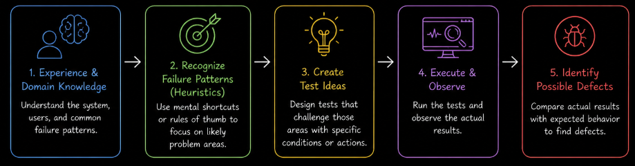
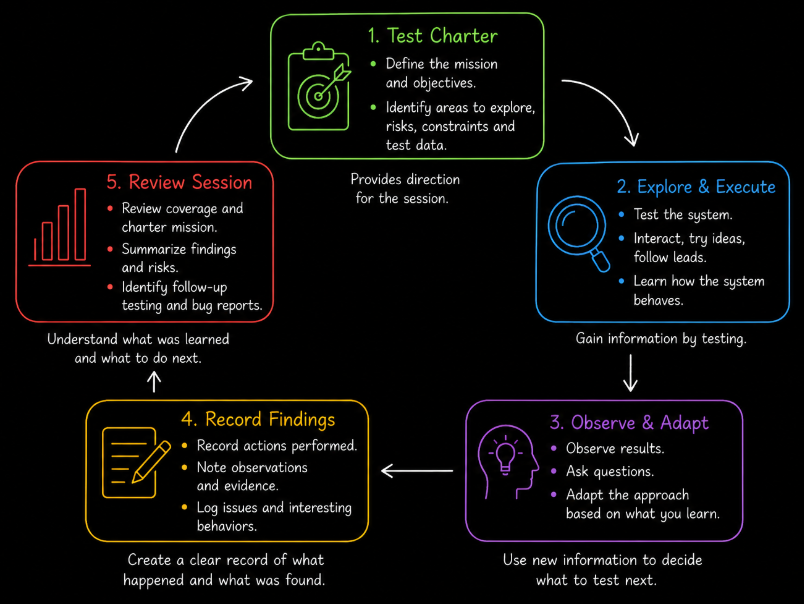
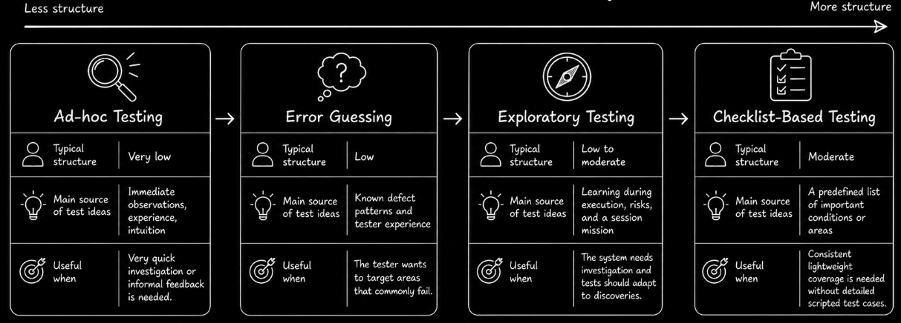

# Table of Contents: Test Case Design Level 1

- [Error Guessing](#error-guessing)
- [Exploratory Testing](#exploratory-testing)
- [Checklist-Based Testing](#checklist-based-testing)
- [Ad-Hoc Testing](#ad-hoc-testing)
- [Spectrum of Structure](#spectrum-of-structure)

Before learning more systematic test case design techniques, it is useful to understand how testers use experience, observation and judgment to find defects. At this level, testing is based mainly on the tester’s experience, intuition, domain knowledge and understanding of how systems typically fail.

These **experience-based approaches** help testers identify risks, consider what could go wrong and adapt testing based on what they observe. Rather than depending primarily on predefined rules for deriving tests from requirements or models, they rely on the tester’s ability to recognize failure patterns and generate useful test ideas.

Experience-based approaches are especially useful when requirements are incomplete, unclear or changing. They help teams begin testing early and can uncover defects that may be missed by more scripted approaches. When using these techniques under time pressure, testers should begin with areas that have high user impact, recent code changes or a history of defects. These approaches are generally most effective when used alongside systematic test design techniques rather than as a complete replacement for them.

We start with **error guessing**, which focuses on predicting where defects are most likely to occur.

## Error Guessing

Error guessing is an experience-based test technique in which testers predict where defects are likely to occur based on past experience, domain knowledge and intuition.

Instead of deriving tests from a formal procedure, the tester uses knowledge of common failure patterns to identify useful test conditions. These may involve incorrect input formats, unexpected values, missing validation, incorrect calculations, or mistakes in processing logic.

A **heuristic** is a mental shortcut or rule of thumb that helps a tester decide what to test next.

For example, suppose a registration form contains **Name**, **Email**, **Age** and **Password** fields. A tester might use the following common error-guessing heuristics to identify possible defects.

| Heuristic                              | Test idea                                                                      | Possible defect                                                                |
| -------------------------------------- | ------------------------------------------------------------------------------ | ------------------------------------------------------------------------------ |
| **Null or empty inputs**               | Submit the form with the required Name field empty.                            | The form accepts incomplete data.                                              |
| **Boundary values**                    | Enter `0`, `-1`, or an unusually large value for Age.                          | Invalid age values are accepted or cause an error.                             |
| **Special characters**                 | Enter symbols, emojis, or markup-like text in the Name field.                  | The input is displayed incorrectly or causes unexpected behavior.              |
| **Data type mismatches**               | Enter letters in the Age field.                                                | Non-numeric data is accepted or causes an error.                               |
| **Invalid formats**                    | Enter `user@`, `user@.com`, or `user name@example.com`.                        | An invalid email address is accepted.                                          |
| **Limit violations**                   | Enter a password just below the minimum required length.                       | The password is incorrectly accepted.                                          |
| **Repeated actions**                   | Click the registration button several times quickly.                           | Multiple accounts or requests are created.                                     |
| **Timeout and interruption scenarios** | Disconnect from the network while the registration request is being processed. | The application becomes stuck or leaves registration in an inconsistent state. |

The heuristics above are starting points rather than a fixed checklist. A tester selects the ones that are relevant to the feature being tested and uses experience to identify additional failure conditions.

The goal is not to apply every heuristic to every feature. Instead, testers use likely failure patterns to generate meaningful test ideas. These tests are not random. They are chosen because experience suggests that similar conditions commonly reveal defects.

A more structured variation of error guessing is sometimes called a **fault attack**. In a fault attack, the tester deliberately targets a known fault or failure pattern using a prepared list or catalog. This makes the activity more systematic and repeatable than general error guessing.

For example, suppose an application has previously created duplicate records when users submit the same action more than once. The tester could deliberately target this failure pattern across several workflows by double-clicking submit buttons, refreshing a page during submission or retrying an operation after a timeout.

In this case, the tester is not simply relying on intuition. A known failure pattern is being deliberately applied to different parts of the system to discover similar defects.

Error guessing is useful for identifying likely problem areas, but its effectiveness depends heavily on the tester’s knowledge and experience. To explore the system more broadly and learn from its behavior while testing, testers can use exploratory testing.

## Exploratory Testing

A **test case** is a documented set of conditions, inputs, actions and expected results used to verify a particular aspect of a system. In highly scripted testing, test cases are designed before execution.

Exploratory testing is an approach in which test design, execution and learning happen together. The tester learns about the system while testing and uses new information to decide what to test next.

Instead of following only predefined test cases, the tester controls the flow of testing and adapts it based on observations and discoveries. This approach is especially useful for investigating risks, learning how a feature behaves and uncovering defects that were not anticipated before execution began.

A **test oracle** is a source of truth used to decide whether an observed result is correct. Examples include requirements, user documentation, business rules, a comparable product or reasonable user expectations.

Exploratory testing can be guided by a **test charter**. A charter gives a testing session a clear mission without prescribing every test step. It can identify what should be explored, which risks deserve attention, and any relevant constraints or test data.

The following charter shows how an exploratory testing session could be organized around the checkout process.

| Element               | Description                                                                      |
| --------------------- | -------------------------------------------------------------------------------- |
| **Mission**           | Explore the checkout process for payment failures.                               |
| **Areas to test**     | Payment form, discount code application, order confirmation.                     |
| **Risks to focus on** | Invalid card handling, duplicate submissions, timeout recovery.                  |
| **Test data needed**  | Valid card, expired card, card with insufficient funds.                          |
| **Session duration**  | 90 minutes.                                                                      |
| **Tester notes**      | Record unexpected error messages, inconsistent behavior, and relevant UI issues. |

Exploratory testing is often performed in **time-boxed sessions**. A session has a defined duration so that the tester can focus on its mission and then review what was covered and learned. The appropriate duration depends on the context, although a focused session might last around 60 to 120 minutes.

A structured approach that organizes exploratory testing into time-boxed sessions is known as **Session-Based Test Management (SBTM)**. It uses elements such as charters, session notes and debriefs to make exploratory testing easier to manage and review.

While working through the checkout charter above, the tester records important actions, observations and issues. The session notes might look like the following.

| Time  | Action performed                         | Observation                                                   | Issue? |
| ----- | ---------------------------------------- | ------------------------------------------------------------- | ------ |
| 10:00 | Entered an expired card.                 | An appropriate error message was displayed.                   | No     |
| 10:15 | Clicked **Pay** twice rapidly.           | Two charges were created.                                     | Yes    |
| 10:30 | Disconnected the network during payment. | The page remained on a loading indicator and did not recover. | Yes    |

These notes provide a record of what happened during the session. They help the tester explain what was tested, reproduce unexpected behavior, and identify issues that require further investigation.

After the session, the tester can review the notes and findings in a short **debrief** with a test lead, product owner or another relevant stakeholder. The debrief helps communicate important findings, clarify open questions and decide whether follow-up testing is needed.

Exploratory testing is flexible because the tester can react to new information as it is discovered. However, without sufficient notes or a clear mission, it can be difficult to assess coverage or reproduce findings.

Testing can stop when the session time box expires, when new test ideas are no longer revealing useful information, or when the remaining untested areas present an acceptably low level of risk.

Exploratory testing can also be performed through **pair testing**, in which two people test together. One person may interact with the system while the other observes, asks questions, suggests test ideas and records findings. They can exchange roles during the session.

When teams need more consistent coverage while keeping testing lightweight, checklist-based testing can provide additional structure.

## Checklist-Based Testing

Checklist-based testing uses a predefined list of conditions, features, risks or quality characteristics to guide testing without specifying every test step in a detailed test case.

The checklist acts as a reminder of what should be considered, helping testers verify important areas consistently. It provides more structure than free exploration while still allowing the tester to decide how each item should be tested.

When testing a responsive user interface, a checklist might include the following items.

| Description                                                                                       | Pass | Fail | Notes |
| ------------------------------------------------------------------------------------------------- | ---- |----- | ----- |
| Verify that the layout adjusts correctly at relevant screen sizes.                                |      |      |       |
| Check that elements do not overlap or become misaligned.                                          |      |      |       |
| Verify that navigation remains usable on supported screen sizes.                                  |      |      |       |
| Verify that the hamburger menu appears and works correctly where the design requires it.          |      |      |       |
| Confirm that images resize appropriately and maintain their intended aspect ratio.                |      |      |       |
| Verify that supported media elements remain usable and playable.                                  |      |      |       |

Checklist-based testing can support both functional and non-functional testing. Checklists may cover business functions, usability, compatibility, accessibility, reliability or performance-related observations.

A checklist should be specific enough to guide testing but not so detailed that it becomes a set of fully scripted test cases. Checklist items should also be reviewed and updated as the product, risks and team knowledge change.

Even when testing is not fully scripted, relevant results should be documented. Notes or summary reports can record what was checked, what was not checked, important observations and defects found.

Checklist-based testing introduces lightweight guidance. In some situations, however, a tester may intentionally work with almost no predefined structure during a very quick investigation of a small change. This leads to **ad-hoc testing**, the most informal approach covered at this level.

## Ad-Hoc Testing

Ad-hoc testing is an informal, unstructured approach in which the tester investigates the system without predefined test cases, a test charter, or a checklist.

The tester chooses actions freely based on immediate observations and ideas. For example, the tester might navigate through a checkout flow in an unusual order, refresh a confirmation page during a transaction, resize the interface repeatedly, or enter unexpected input to observe how the system behaves.

Although ad-hoc testing is unstructured, it should not be confused with meaningless random clicking. Effective ad-hoc testing still benefits from product knowledge, curiosity, and awareness of risk. The difference is that the activity is not guided by a predefined testing structure.

The main advantage is speed because little preparation is required. This allows ad-hoc testing to provide quick feedback during informal investigations or small changes.

The trade-off is limited repeatability and coverage visibility. Because the tester has no predefined structure, important areas may be overlooked, and it may be difficult to explain exactly what was tested. If a defect is found, the tester should document the steps, data, environment, and relevant system state as soon as possible so that the issue can be reproduced.

For these reasons, ad-hoc testing is usually a complementary approach rather than the primary method for testing that requires demonstrable coverage, repeatability, traceability or audit evidence. It is generally unsuitable as the sole approach for regulatory compliance testing or safety-critical validation.

## Spectrum of Structure

The four approaches in this level can be viewed as a spectrum with different degrees of structure.

These approaches can also be combined. An exploratory testing session, for example, can use error-guessing heuristics or a checklist as sources of test ideas. The appropriate amount of structure depends on the testing objective, risk, available information, time, and the need for repeatability or evidence.

At this level, the key learning objective is to understand how experience and judgment can be used to generate useful tests. Later levels build on this foundation by introducing more systematic techniques for deriving test cases from requirements, input domains, rules, states and other test bases.
