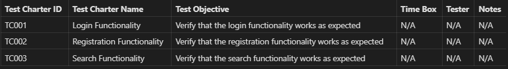

# Content of test case design level 2

- [Error Guessing](#error-guessing)
- [Exploratory Testing](#exploratory-testing)
- [Checklist-Based Testing](#checklist-based-testing)
- [Ad-Hoc Testing](#ad-hoc-testing)

Experience-based testing techniques rely on the tester’s knowledge, intuition, and prior experience to design and execute tests. These techniques are less formal than specification-based or structure-based techniques and are especially useful when requirements are incomplete or time is limited.

## Error Guessing

Error guessing is an experience-based testing technique where testers predict where defects are likely to occur based on past **experience**, **domain knowledge**.

- **Input Errors:** Wrong data types, invalid formats, boundary values, empty fields.
- **Output Errors:** Incorrect calculations, wrong formatting, missing results.
- **Processing Errors:** Logical mistakes, missing conditions, incorrect formulas.
- **Interface Errors:** Data mismatch between components, broken integrations

**Fault attack** is a systematic form of **error guessing** that uses known defect lists to target **common failure patterns**.

- Enter letters in numeric fields.  
- Submit empty forms.  
- Use extremely large or small values.

## Exploratory Testing

Exploratory testing is a **testing approach** where **test design** and **execution** happen at the same time. Testers learn about the system while testing and use that knowledge to design better tests.

- No predefined detailed test cases  
- Tester controls test flow
- Focus on discovering unknown defects

**Charters:** A charter is a mission or goal for the exploratory testing session. It outlines the target of the testing, the objectives, the types of tests or ideas to be explored, the duration of the session, and the expected outcomes.

**Time-Boxed Sessions** Exploratory testing is usually done in sessions of **60-120** minutes.

**Documentation** Testers record **tested areas**, **steps performed**, **issues found**.

  
## Checklist-Based Testing

Checklist-based testing uses a predefined **list of items** to verify important aspects of the application without writing detailed test cases.

**Guided Testing:** The checklist acts as a guide, ensuring all necessary areas are reviewed without extensive pre-planning.

**Functional and Non-Functional Testing:** Checklists can support both functional and non-functional testing, ensuring aspects like **usability**, **performance**, and **compatibility** are verified.

**Documentation:** Even though tests are not fully scripted, documenting results (test session logs or summary reports) is essential for tracking progress and identifying improvement areas. Findings should be included in the final Test Summary Report to inform stakeholders of outcomes and any defects addressed.

| Description                                                                   | Status  |
|-------------------------------------------------------------------------------|---------|
| Verify that the layout adjusts correctly on different screen sizes.           |         |
| Check that elements are not overlapping or misaligned.                        |         |
| Ensure that the navigation menu functions on all screens.                     |         |
| Verify that the hamburger menu appears and works correctly on smaller screens.|         |
| Confirm that images resize appropriately and maintain aspect ratio.           |         |
| Ensure that media elements are responsive and playable.                       |         |

## Ad-Hoc Testing

Ad-hoc testing is an unstructured testing technique where testers freely explore the application without **documentation**, **checklist**, or **formal planning**.

- No documentation  
- No predefined steps
- Fast defect discovery

**Click** random buttons, **resize** the screen, **enter** unexpected inputs
