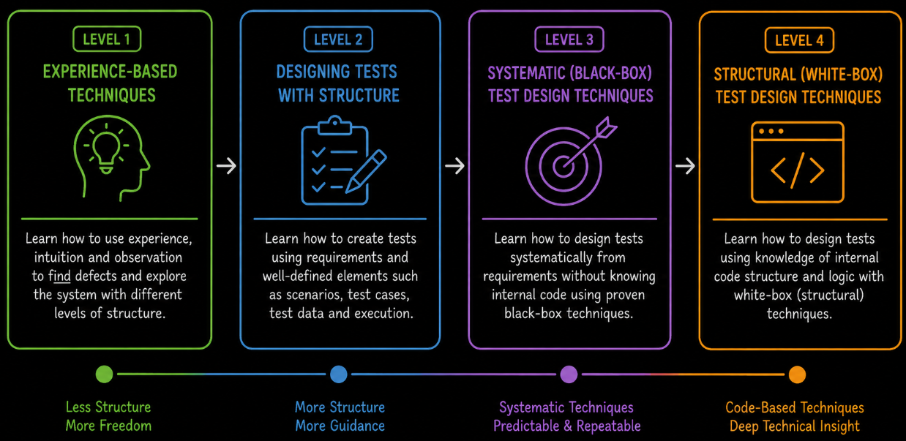

# Test Case Design Overview

Test case design is the activity of developing tests that define what should be tested and how software behavior should be verified. It turns testing objectives, requirements, risks and other available information into practical test scenarios, test cases and test data.

The **Test Case Design** module develops from experience-based testing, through building structured test cases, to applying systematic black-box and white-box test design techniques.

**Level 1** introduces **experience-based testing**. It explains how **error guessing**, **exploratory testing**, **checklist-based testing** and **ad-hoc testing** use tester experience, observation, intuition and domain knowledge to generate test ideas, and how these approaches differ in their level of structure.

**Level 2** focuses on **building structured tests**. It explains how **requirements** are used as a test basis, how **test scenarios** are identified, how **test cases** are structured, how appropriate **test data** is selected and how designed tests are prepared for **test execution**.

**Level 3** introduces **black-box test design techniques**. It covers **equivalence partitioning**, **boundary value analysis**, **decision table testing**, **state transition testing** and **use case testing**, showing how tests can be systematically derived from inputs, boundaries, rules, states and user interactions.

**Level 4** introduces **white-box test design techniques**. It covers **statement testing**, **branch testing** and **path testing** and explains the differences between these techniques when tests are derived from the internal structure and execution paths of the software.
