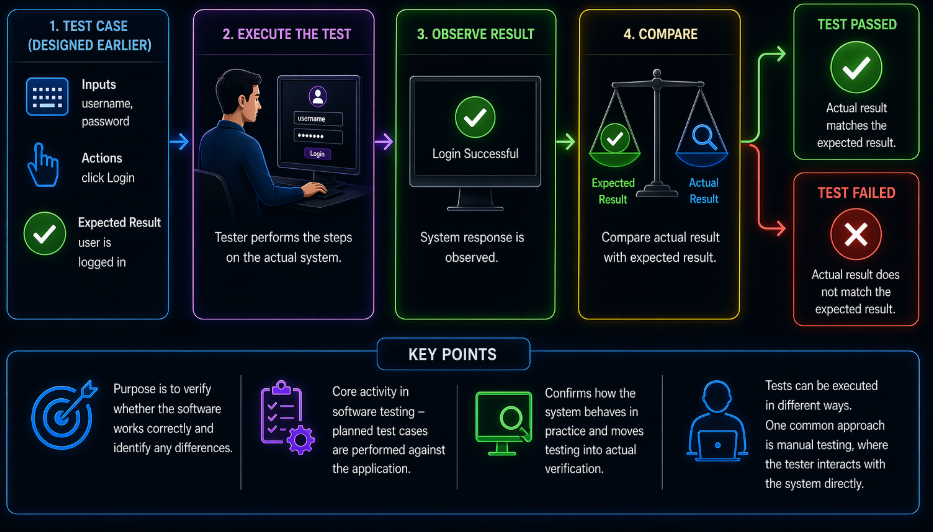
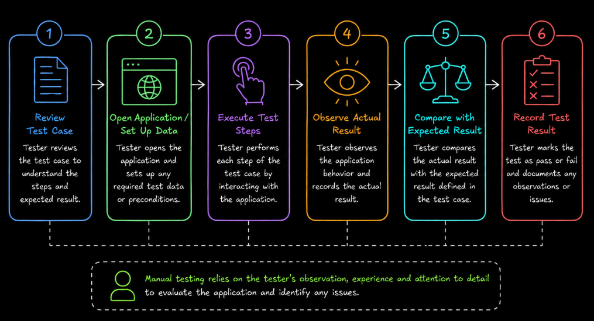
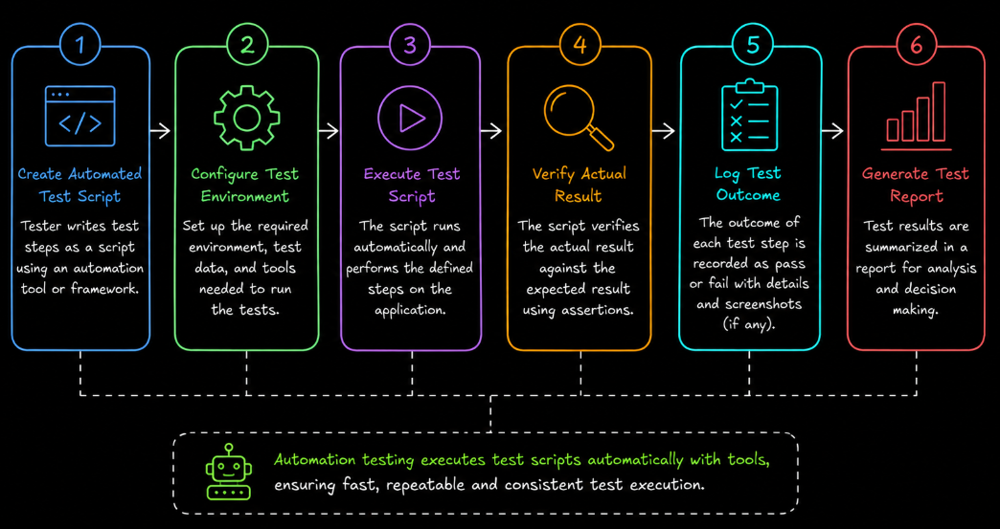
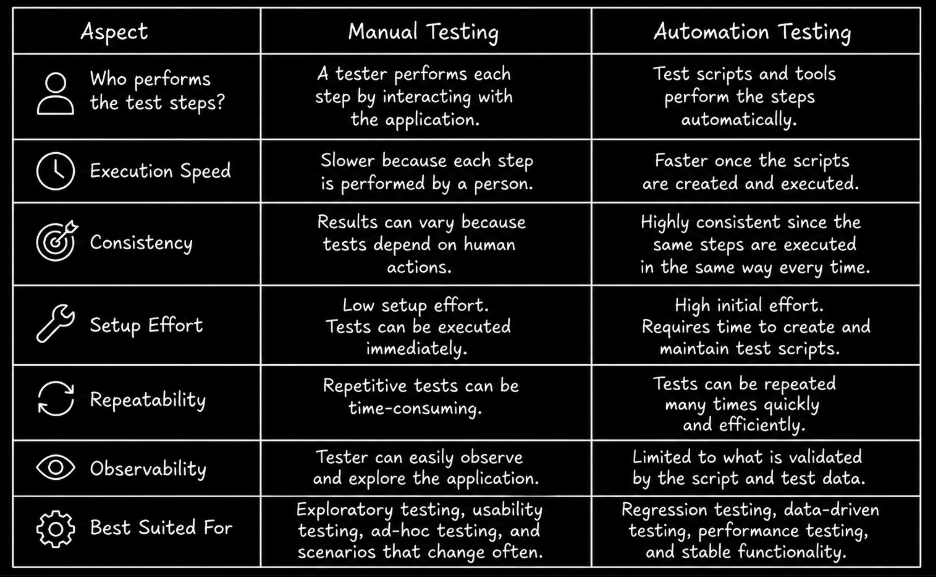

# Table of Contents: Test Execution Level 1

- [What is Test Execution](#what-is-test-execution)
- [Manual Testing](#manual-testing)
- [Automation Testing](#automation-testing)
- [Differences Between Manual and Automation Testing](#differences-between-manual-and-automation-testing)

Building on the concepts covered in previous topics, this level introduces **test execution**, which is the process of performing tests to verify how the system behaves.

Tests can be executed in different ways. A tester may perform them manually by interacting with the application, or they may be executed automatically using tools and scripts. Both approaches play an important role. Manual testing allows a tester to interact with and observe the system directly, while automation testing helps execute repeatable tests quickly and consistently.

The goal at this level is to understand what test execution is, how manual and automation testing work, and how they differ in practice. We begin by defining what test execution means.

## What is Test Execution

**Test execution** is the process of running a test to check whether a system behaves as expected. A test is usually designed earlier by defining inputs, actions, and expected results. During execution, those steps are performed on the actual system, and the observed result is compared with the expected result.

The purpose of test execution is to verify whether the software behaves as expected and to identify any differences between expected and actual behavior. For example, if a login form should allow a user to sign in with valid credentials, the tester executes the test by entering a username and password and then checking whether the system logs the user in successfully.

If the actual result matches the expected result, the test is considered **passed**. If the actual result does not match the expected result, the test is considered **failed**. Other statuses may also be used depending on execution conditions, which are covered in later levels.

Test execution is one of the core activities in software testing because it is the point where planned test cases are performed against the application. It confirms how the system behaves in practice and moves testing from planning to actual verification.

Tests can be executed in different ways depending on how the steps are performed. One of the most common approaches is **manual testing**, where the tester interacts with the system directly.

## Manual Testing

**Manual testing** is the process of executing test cases by interacting with the system directly, without using automation tools or scripts to perform the test steps. In this approach, the tester performs each step of the test case manually, observes how the system behaves, and compares the actual result with the expected result.

Manual testing allows the tester to experience the system from a user's perspective. The tester performs user actions such as clicking buttons, entering data, navigating between pages, and verifying visible results.

For example, consider a login feature. A tester executes the test by opening the application, entering a username and password, clicking the login button, and observing whether the system allows access or shows an error message.

Manual testing allows the tester to directly observe system behavior and interact with the application in real time. However, executing tests manually can become time-consuming, especially when the same tests need to be repeated multiple times.

To perform repeated test execution more efficiently, tests can also be executed using tools and scripts. This approach is known as **automation testing**.

## Automation Testing

**Automation testing** is the process of executing test cases using tools and scripts instead of performing the test steps manually. In this approach, test steps are implemented in code. The automated test interacts with the system, performs actions such as sending requests or clicking elements, and verifies whether the actual result matches the expected result.

For example, instead of manually testing a login feature every time, an automated test can be created to perform the same steps. When the automated test runs, it performs the defined steps and checks whether the actual result matches the expected result.

Automation testing allows repeatable tests to be executed quickly and consistently without requiring a tester to perform each step manually every time. However, creating automated tests requires initial time and effort to write and maintain the scripts.

The following comparison summarizes the main differences between manual and automation testing.

## Differences Between Manual and Automation Testing

Manual testing and automation testing are two approaches to executing tests. The main differences are who or what performs the test steps, execution speed, consistency, and setup effort.

Knowing what manual and automation testing are is the foundation. The next step is deciding when to use each in real projects.
