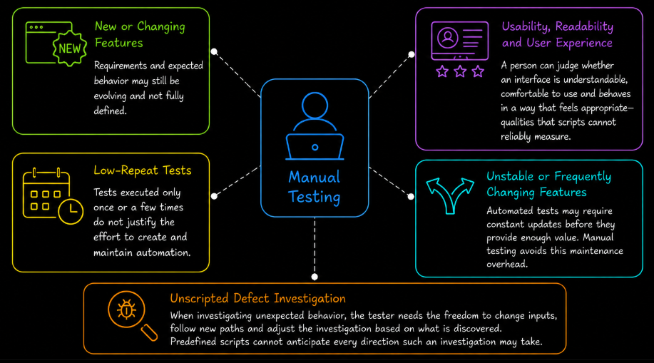
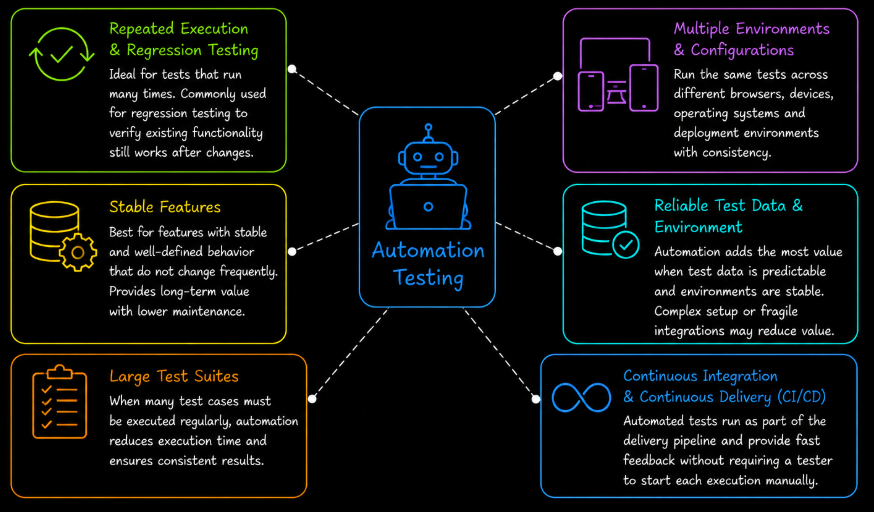

# Table of Contents: Test Execution Level 2

- [When to Use Manual Testing](#when-to-use-manual-testing)
- [When to Use Automation Testing](#when-to-use-automation-testing)
- [What Not to Automate](#what-not-to-automate)
- [Trade-offs in Test Execution](#trade-offs-in-test-execution)

In the previous level, we introduced **test execution** and the basic differences between **manual testing** and **automation testing**. At this level, the focus shifts to deciding how tests should be executed in practice.

Not all tests should be executed in the same way. Some situations require **human judgment and flexibility**, while others benefit from **speed, consistency and repeatability**. The choice depends on factors such as how often a test will be executed, how stable the feature is, and what type of behavior needs to be verified.

The goal at this level is to understand when manual testing provides more value, when automation testing is the better choice, what should generally not be automated, and how to make effective decisions based on the testing context.

We begin by examining when manual testing should be preferred.

## When to Use Manual Testing

Manual testing is a strong choice when **human observation, judgment and flexibility** are required. It is especially useful when working with **new or changing features** because requirements and expected behavior may still be evolving.

Manual testing is also appropriate when evaluating **usability, readability and the overall user experience**. These areas often require a person to judge whether an interface is understandable, comfortable to use and behaving in a way that feels appropriate to the user.

Tests that will be executed **only once or a few times** may also be better suited to manual execution. In these cases, the effort required to create and maintain automation may be greater than the time it would save.

When a feature is **unstable or changes frequently**, manual testing can provide more flexibility. Automated tests for rapidly changing functionality may require frequent updates before they provide enough value to justify their maintenance.

**Unscripted defect investigation** should also remain flexible. When investigating unexpected behavior, the tester may need to change inputs, follow new paths, and adjust the investigation based on what is discovered. A predefined script cannot anticipate every direction such an investigation may take.

In these situations, manual testing provides the flexibility and human judgment that predefined automated scripts may not provide. In the next section, we look at situations where automation testing becomes the more effective approach.

## When to Use Automation Testing

Automation testing is most appropriate when tests need to be executed **repeatedly and consistently**. A common example is **regression testing**, where automated tests can repeatedly verify that existing functionality still works after the system changes.

**Stable features** are often good candidates for automation because their expected behavior does not change frequently. Once automated tests are created for these features, they can be reused across many test executions with less maintenance than tests for rapidly changing functionality.

Automation is also useful when the same tests need to run across **multiple environments or configurations**. For example, an automated test may be executed against different browsers, devices, operating configurations or deployment environments.

The required **test data and environment dependencies** should also be considered. Automation provides more value when test data can be prepared reliably and required systems are predictable. Complex data setup, unstable environments or fragile third-party integrations can make automated tests harder to maintain and may reduce their value.

**Large test suites** can also benefit from automation. When many test cases must be executed regularly, automated execution can reduce execution time and allow the same tests to run consistently.

Automation is particularly important in **continuous integration and continuous delivery**, often referred to as **CI/CD**. Automated tests can run as part of the delivery pipeline and provide fast feedback without requiring a tester to start each execution manually.

In practice, automation is a strong choice when **repeatability, consistency, execution speed, and frequent reuse** justify the effort required to create and maintain the automated tests.

However, being able to automate a test does not necessarily mean that automating it is the best choice.

## What Not to Automate

Some tests provide little value when automated because their purpose depends on **human judgment**, they are unlikely to be repeated, or the cost of maintaining the automation is too high.

**Usability, user experience, and look and feel testing** are usually poor candidates for traditional automation. A script can verify predefined conditions, but it cannot reliably judge whether an interface feels intuitive, whether information is easy to understand, or whether an interaction provides a good user experience.

**One-time or rarely repeated tests** may also not justify automation. If a test is unlikely to run again, creating and maintaining an automated script may require more effort than executing the test manually.

Features with **unstable or frequently changing requirements** should be approached carefully. Automated tests may need to be updated whenever the feature changes, creating maintenance work before the feature becomes stable enough for the automation to provide long-term value.

Automation maintenance can include **updating element locators after a user interface changes, changing test data setup when workflows are modified, or refactoring scripts when an API changes**. If this maintenance happens frequently, the cost of keeping the automated test working may outweigh the time it saves.

Tests that depend on **human judgment** are generally better performed manually. Examples include evaluating readability, clarity, emotional response, or whether content and interactions appear appropriate to a user.

**Visual layout checks** may also require manual testing when suitable visual testing tools are not available. Traditional functional automation can confirm that an element exists or responds to an action, but it may not detect problems such as incorrect spacing, alignment, overlapping content, or other visual inconsistencies.

Some **security mechanisms** are intentionally designed to prevent automated interaction. **CAPTCHA** is a common example. Attempting to automate the CAPTCHA itself would conflict with its purpose, so test environments typically need an approved testing strategy that allows the surrounding functionality to be tested without defeating the security control.

**Unscripted defect investigation** should also remain flexible. When investigating unexpected behavior, the tester may need to change inputs, follow new paths, and adjust the investigation based on what is discovered. A predefined script cannot anticipate every direction such an investigation may take.

The decision is therefore not simply whether a test **can be automated**. The more important question is whether automation provides enough value to justify its **creation and maintenance**.

## Trade-offs in Test Execution

Choosing between manual and automation testing requires considering the **purpose of the test**, **how often it will run**, and **how much flexibility is needed**. Rather than treating one approach as better than the other, several practical questions can guide the decision.

1. **How often will the test be executed?** If a test will be executed many times, the initial effort required to automate it may be justified by faster execution later. As a rough starting point, a simple and stable test expected to run **more than 5 to 10 times** may be worth considering for automation. This is not a fixed rule because the decision also depends on automation effort, maintenance cost, execution time, and the value of faster feedback.

2. **Does the test require identical repetition or adaptive exploration?** Automation is useful when the same steps and checks must be performed consistently across repeated executions. Manual testing is more suitable when the tester needs to adapt the test, explore different paths, or respond to unexpected behavior.

3. **Is the feature stable enough to justify automation maintenance?** Automated tests require time to create and maintain. A stable feature can allow that investment to provide value over many executions, while a frequently changing feature may require regular updates to scripts, locators, test data, or integrations.

4. **Are we verifying a specific rule or looking for unexpected problems?** Automation works well when a test has clearly defined inputs and expected results that can be checked programmatically. Manual testing provides more value when broader observation is needed or when the goal is to discover problems that were not predicted in advance.

These questions help determine which execution approach provides the most value in a particular situation. In real projects, **manual and automation testing are often combined** so that each is used where its strengths are most useful.

Choosing the right approach is essential, but so is knowing **how to run the test, record the result, and handle what happens when something goes wrong**.
