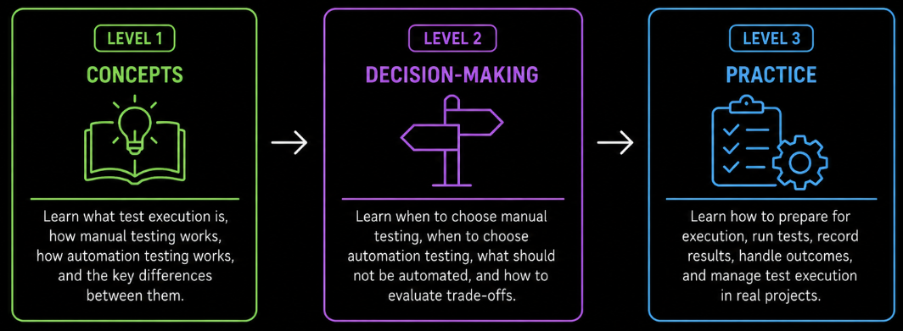

# Test Execution Overview

Test execution is the activity of running prepared tests against software to observe actual behavior and compare it with expected results. It is the point where test planning becomes practical verification.

The **Test Execution** module develops from understanding the basic concepts, through choosing an appropriate execution approach, to performing and managing test execution in practice.

**Level 1** introduces the fundamental concepts of test execution. It explains what test execution is, how **manual testing** and **automation testing** work, and the key differences between these approaches.

**Level 2** focuses on **decision-making**. It explains when manual testing provides more value, when automation testing is appropriate, what should generally not be automated, and which trade-offs should be considered when choosing an execution approach.

**Level 3** moves into **practical test execution**. It covers how tests are prepared and executed, how results are recorded, and how different outcomes are handled during real testing activities.
