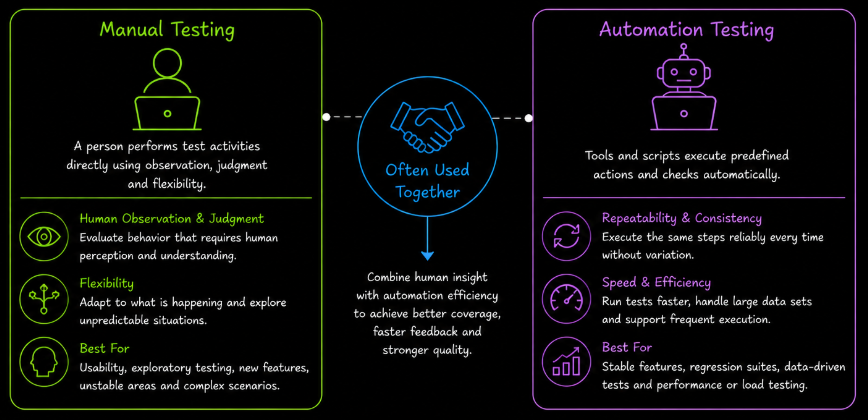
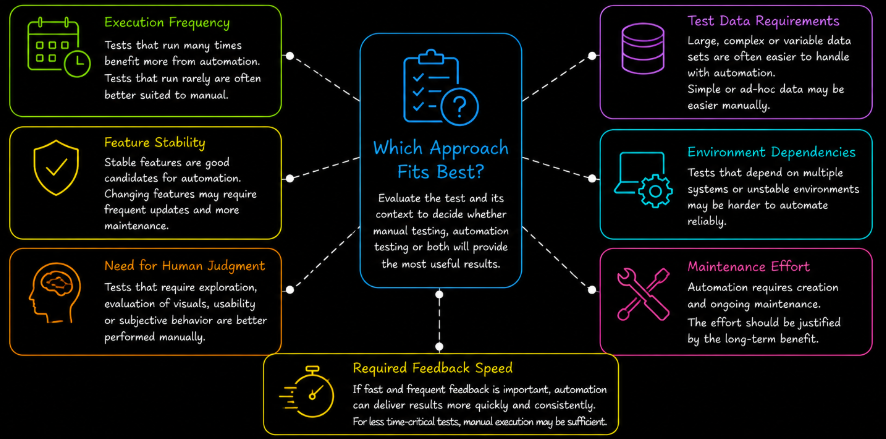
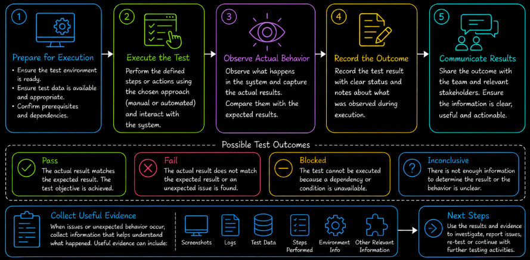

# Test Execution Overview

Test execution is where prepared tests are **performed against the software to observe what actually happens**. It connects test design with practical verification by turning defined test conditions, test cases and expected results into evidence about the behavior of the system.

Executing a test involves more than following a sequence of steps. The tester must understand **what is being checked**, **how the test should be performed**, **what result is expected** and **how the observed outcome should be handled**. The way these activities are performed can vary depending on the test and the context of the project.

Tests can be performed through **manual testing**, where a person carries out the test activities directly, or through **automation testing**, where tools and scripts perform predefined actions and checks. These approaches provide different strengths and are often used together rather than treated as replacements for one another.

Manual execution provides **human observation, judgment and flexibility**. It is useful when the tester needs to respond to what is happening during execution, evaluate behavior that requires human perception or investigate situations where the next useful action cannot always be predicted in advance.

Automated execution provides **repeatability, consistency and speed**. It is useful when the same checks need to be performed frequently, when behavior is sufficiently stable and when the effort required to create and maintain automation is justified by its continued use.

The choice between manual and automated execution depends on the testing context. A test that is technically possible to automate may still provide more value when performed manually, while a repetitive manual test may become inefficient if it must be executed frequently.

Factors such as **execution frequency**, **feature stability**, **need for human judgment**, **test data**, **environment dependencies**, **maintenance effort** and **required feedback speed** influence this decision. For this reason, selecting an execution approach requires understanding both the test itself and the conditions in which it will be performed.

For example, checking whether a calculation always produces a defined result may be well suited to automation when it needs to be repeated across many inputs. Evaluating whether a new interface is understandable and comfortable to use depends much more on human observation. The purpose of the test helps determine which execution approach provides the most useful information.

Once an execution approach has been selected, the test still needs to be carried out under the required conditions. The necessary **test environment and test data** must be available, the defined actions must be performed and the actual behavior must be compared with the expected behavior.

The outcome of execution must then be **recorded and communicated**. A test may pass when the observed result matches the expected result or fail when an important difference is found. Other execution conditions can also affect the recorded status, for example when a test cannot be completed because a required dependency is unavailable.

When unexpected behavior appears, execution may also produce information that needs further investigation. Useful evidence can include the actions performed, input data, observed results, logs, screenshots or other information that helps explain what happened and supports later analysis.

Test execution therefore forms a continuous path from **choosing how a test should be performed**, through **performing the test under the required conditions** to **observing, recording and managing the outcome**.

Understanding this process helps testers move beyond simply running test steps. It provides the foundation for selecting an appropriate execution approach, producing reliable test results and ensuring that the information discovered during testing can support further investigation and quality decisions.
