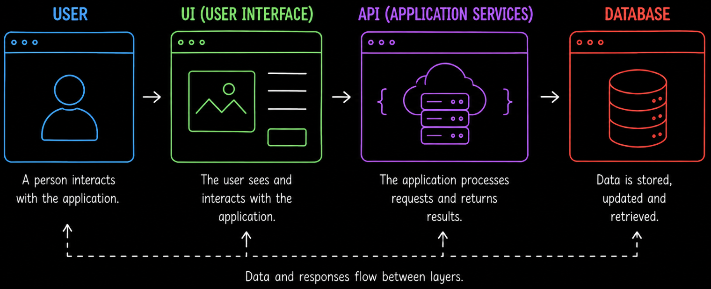
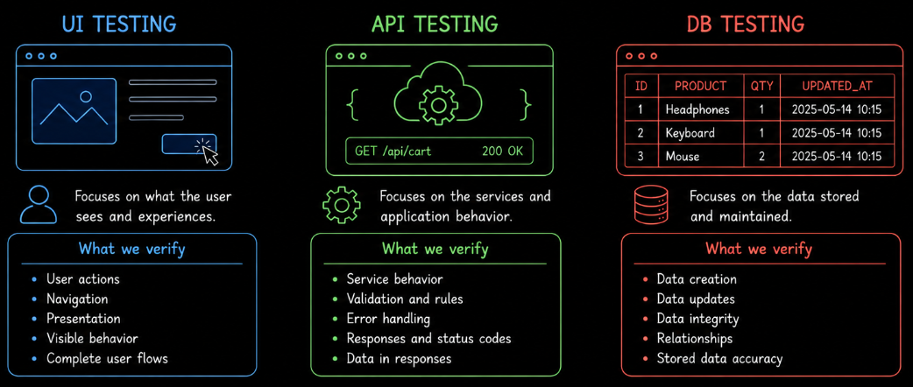
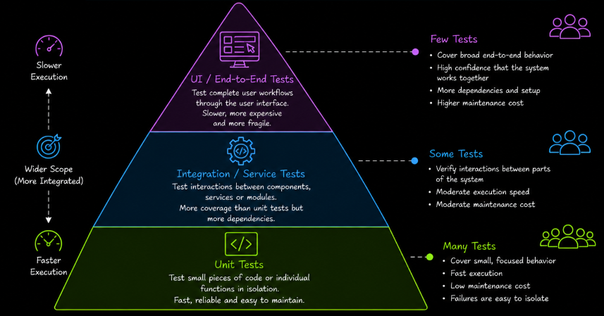

# Test Layer Overview

A software application is usually made up of multiple technical layers that work together to deliver functionality to the user. Testing can examine the system through these different layers, depending on **what behavior needs to be verified and where that behavior can be observed most effectively**.

Instead of relying on only one point of interaction, testers can evaluate the application through the **user interface (UI)**, communicate directly with the **API** or inspect information stored in the **database (DB)**. Each layer provides a different perspective on the same system.

The **UI layer** represents what the user can see and interact with. Testing through this layer focuses on user actions, visible behavior, navigation, presentation and complete user flows. It allows the tester to evaluate the application from the user's perspective without needing to interact directly with the underlying services or stored data.

The **API layer** provides access to the application's services and application operations without going through the user interface. Testing at this layer allows requests and responses to be examined directly, making it possible to verify application behavior, data validation and error handling independently of how those results are presented in the UI.

The **database layer** provides another perspective by allowing the tester to verify how information is stored, changed and maintained. Database testing can help confirm that operations performed by the application result in the expected data and that stored information remains accurate and consistent.

These layers are connected rather than independent. A user action performed through the UI may trigger an API request, which processes the operation and reads or modifies information in the database. The result can then travel back through the API and eventually appear in the interface.

For example, when a user adds a product to a shopping cart, the action begins in the UI, may be processed through an API and may result in data being created or updated in the database.

Testing can examine this behavior from different points in the system. UI testing can verify that the cart counter changes correctly. API testing can verify that the corresponding operation produces the expected response, while database testing can verify that the resulting data is stored or updated correctly when persistence is involved.

Testing through different layers provides different levels of **control and observability**. The UI shows what the user experiences, while deeper layers can expose information that may not be directly visible through the interface. A problem observed in the UI may therefore originate from the interface itself, the API, the database or the interaction between them.

Testing at different parts of an application also affects **execution speed, scope, dependencies and maintenance effort**. A useful model for understanding how automated tests can be distributed is the **Test Pyramid**.

The Test Pyramid represents a general strategy in which a test suite contains **many fast and focused lower-level tests**, fewer tests that verify interactions between parts of the system and a smaller number of broad tests that exercise complete user flows.

Tests near the **base of the pyramid** usually verify smaller pieces of behavior. Because they involve fewer parts of the application, they can generally execute quickly and make failures easier to isolate.

The **middle of the pyramid** contains tests that verify interactions between components, services or other parts of the system. These tests cover more integrated behavior but usually involve more dependencies than lower-level tests.

Tests near the **top of the pyramid** exercise broader application behavior, often through complete workflows or the user interface. These tests provide confidence that multiple parts of the system work together, but they are generally slower and more expensive to maintain.

The Test Pyramid does not define an exact number of tests that every project must have at each level. The appropriate distribution depends on the **architecture, risks, technologies and testing objectives** of the system. Its purpose is to encourage testing at the most effective level and to avoid depending unnecessarily on large numbers of slow, high-level tests.

The Test Pyramid is also related to, but different from, the UI, API and database layers described earlier. **UI, API and database testing describe points from which the system can be tested**, while the Test Pyramid describes a broader strategy for distributing automated tests according to their scope and level of integration.

The purpose of learning these layers is not to treat them as separate forms of testing that compete with one another. Instead, each layer provides a different testing perspective and can be selected according to the behavior being investigated.

The progression begins with **Test Layer UI**, where testing is performed through direct interaction with the application and focuses on observable user behavior. It then moves to **Test Layer API**, where application behavior can be examined more directly through requests and responses, and later to **Test Layer DB**, where testing focuses on the data maintained by the system.

Together, these layers build an understanding of testing from the **visible user experience** toward the **underlying application behavior and data**. The Test Pyramid adds another perspective by showing why an effective automated test suite usually combines tests at different scopes instead of relying mainly on high-level tests.
