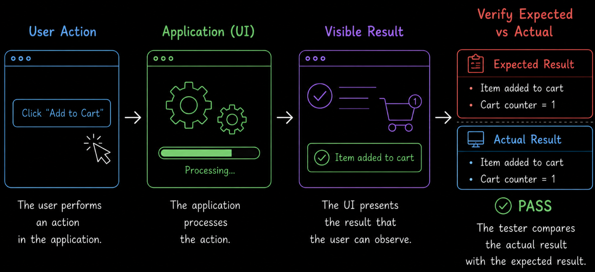
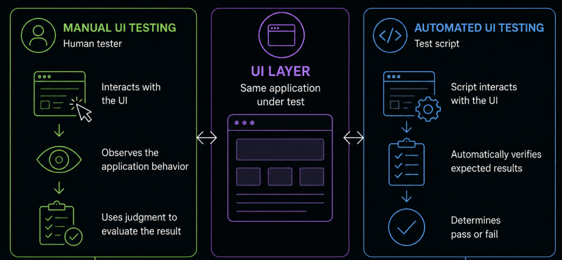
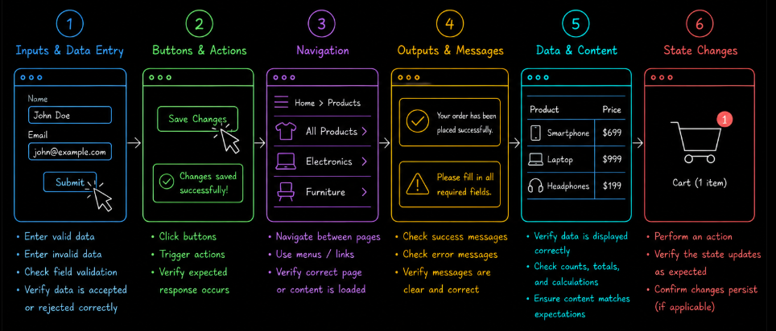
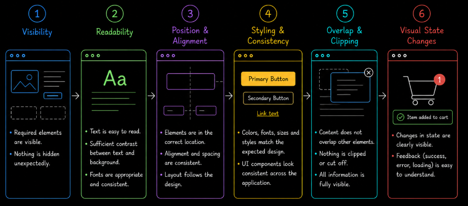

# Table of Contents: Test Layer Summary

- [Test Layer UI](#test-layer-ui)

This summary brings together the key concepts from the **Test Layer** module. It is designed as a quick reference for reviewing how testing can be performed at different technical layers of an application and what can be observed from each layer.

A software application may expose behavior through different layers, including the **user interface (UI)**, **API** and **database (DB)**. These layers provide different points of interaction, observation and control. They are not a required testing sequence; the appropriate layer depends on the testing objective, the application and the information that needs to be verified.

The course begins with **Test Layer UI** because the interface provides a direct and accessible way to learn the basic testing process through observable application behavior. Later parts of the module extend this foundation to other application layers.

## Test Layer UI

**Test Layer UI** focuses on testing application behavior through the user interface. The tester interacts with what a user can see and operate, performs actions and verifies whether the resulting behavior matches the expected behavior defined by the test basis.

Before testing begins, the tester should understand the expected behavior, prepare suitable test data and establish the required starting state. Important user flows should be identified so that testing begins with functionality that matters most to users and the application.

UI tests can be executed **manually or through automation**. Manual execution relies on direct human interaction, observation and judgment, while automated execution uses scripts to perform predefined actions and verify expected results. These are different execution approaches rather than different test layers.

Basic UI checks include **functional testing**, where the tester verifies what the application does in response to user actions. These checks are performed from a **black-box perspective**, comparing observable results with expected behavior without requiring knowledge of the underlying implementation.

**Visual verification** complements functional testing by checking how results and interface elements are presented to the user. This includes observing whether required elements are visible, readable, positioned correctly and updated appropriately. Visual observation may also reveal obvious concerns related to **usability, accessibility and compatibility**, although complete testing of these quality characteristics requires additional scope and techniques.

The module primarily uses **happy path testing** to introduce complete user flows. Valid inputs and intended actions are followed through a successful scenario, with important **checkpoints** used to verify intermediate results rather than checking only the final outcome. Negative UI testing is possible, but it is outside the teaching scope of this module.

Manual UI testing should be deliberate rather than based on random interaction. The tester should compare actual behavior with the expected result and avoid **confirmation bias**, where an expectation that the application works can cause unexpected behavior to be overlooked. Browser developer tools can provide additional information when investigation is needed, while direct validation of API requests and responses belongs to **Test Layer API**.

Testing results should be recorded so that it is clear what was checked and what was observed. Ambiguous behavior should be clarified rather than automatically classified as passing or failing. Detailed test design, checklist-based testing and defect management are covered separately in their respective modules.

UI testing is complete for the planned scope when the selected user flows have been executed and their important functional and visual results have been checked. Completion does not mean that every possible UI condition has been tested; it means that the testing objectives and selected scope have been covered.

The key point is that **Test Layer UI verifies application behavior from the user-facing interface and provides an accessible foundation for learning how to observe, compare and evaluate software behavior through testing**.
