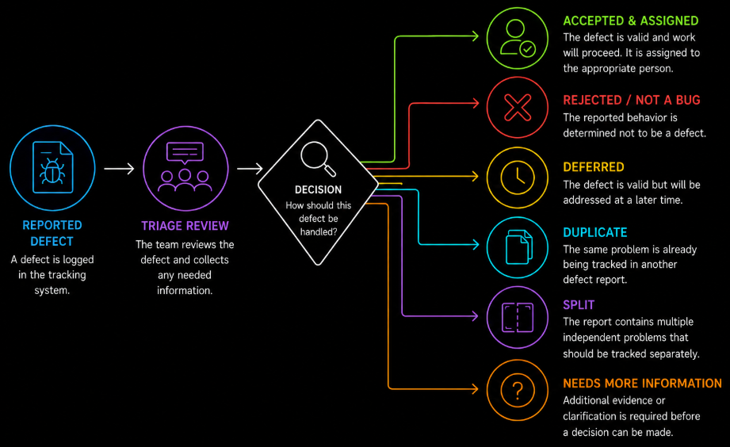

# Table of Contents: Test Management Level 1

- [Defect Management](#defect-management)
- [Defect Life Cycle](#defect-life-cycle)
- [Severity and Priority](#severity-and-priority)
- [Writing a Good Defect Report](#writing-a-good-defect-report)
- [Defect Triage](#defect-triage)
- [Basic Defect Metrics](#basic-defect-metrics)

**Test Management Level 1** focuses on the fundamentals of defect management. It introduces how defects are documented and tracked, how they move through their life cycle, how severity and priority are used, how effective defect reports are written, how defects are reviewed during triage, and how basic defect information can support test management decisions.

## Defect Management

Defect management is the systematic process of identifying, documenting, reviewing, prioritizing, tracking, and resolving defects found during testing. Its purpose is to ensure that problems discovered in the software are recorded and managed until an agreed resolution is reached.

A **defect**, often called a **bug**, is a flaw in a software product that can cause it to behave differently from what is required or expected. An **anomaly** is any observed condition that differs from expectations and may require investigation. After investigation, an anomaly may be confirmed as a defect.

Defects can result from incorrect or incomplete requirements, design problems, coding mistakes, configuration issues, or integration problems. Teams may use **defect categories** or **root cause tags** to group defects according to where the underlying problem originated. Common categories include **Requirements**, **Design**, **Code**, **Environment**, and **Data**. These categories help teams identify recurring problem areas and support future quality improvement.

Defect management applies to both functional and non-functional problems. For example, a defect may prevent a user from completing a payment, cause a page to respond too slowly, expose information to an unauthorized user, or make an interface difficult to use with assistive technology.

Defect management helps prevent reported problems from being forgotten, misunderstood, or ignored. It also provides **traceability**, meaning that the team can follow a defect from its discovery through investigation, resolution, verification, and closure.

## Defect Life Cycle

A defect life cycle describes the stages a defect passes through from the moment it is discovered until an agreed outcome is reached. It helps the team understand the current state of a defect, who is responsible for the next action, and what must happen before the defect can be considered complete.

A typical defect begins when unexpected behavior is **identified** and **logged** in a defect-tracking system. The defect is then **reviewed and triaged** to determine its importance and how it should be handled. After it is **assigned** and **resolved**, the resolution is **verified** through testing. If the problem has been successfully resolved and the agreed closure criteria are satisfied, the defect can be **closed**.

If verification fails because the problem still exists, the defect is commonly **reopened** and returned to development for further investigation. Depending on the team's workflow, it may then move back to **In Progress** while additional work is performed. If a previously closed problem appears again, the defect may also be reopened.

Defect-tracking tools commonly use status values such as **New**, **In Progress**, **Resolved**, **Closed**, and **Reopened**. Teams may also use **Rejected** or **Not a Bug** when the reported behavior is not accepted as a defect, **Deferred** when a valid defect will be addressed later, and **Cannot Reproduce** when the reported behavior cannot be reproduced with the available information. In this case, the defect may be returned to the tester or reporter for additional evidence or clarification. Exact status names and workflows vary between organizations.

Responsibilities also vary by team. A tester commonly identifies and reports a defect and later verifies the resolution. A test lead, product representative, development lead, or triage team may help assess severity and priority. A developer is typically responsible for investigating assigned defects and implementing fixes when required. Who closes a defect depends on the team's agreed workflow and closure criteria.

When a fix is verified, the tester should also consider whether **regression testing** is needed. Regression testing checks whether the change has unintentionally affected existing functionality, especially functionality related to the corrected area.

If verification fails, the tester should update the defect with useful evidence before reopening it. This may include the build or version tested, updated reproduction steps, actual results, screenshots, videos, or logs. The report should describe the observed behavior objectively and avoid accusatory language. The goal is to give the team enough information to investigate the remaining problem efficiently.

When a high-severity defect remains blocked or unresolved beyond an agreed timeframe, or when a triage decision cannot be resolved within the team, the issue should be escalated through the project's agreed escalation path, such as to the test lead, product representative, development lead, or triage team. The escalation should clearly communicate the defect's impact, current status, blocking issue, and the decision or action required.

## Severity and Priority

**Severity** describes how strongly a defect affects the system or its users. It focuses on the technical and functional impact of the defect.

| Severity     | Meaning                                                                                   | Example                                       |
| ------------ | ----------------------------------------------------------------------------------------- | --------------------------------------------- |
| **Critical** | Causes a severe impact, such as a system outage, data loss or serious security exposure   | Unauthorized access to sensitive user data    |
| **High**     | Breaks major or important functionality                                                   | Users cannot complete a payment               |
| **Medium**   | Affects functionality, but the impact is limited or a reasonable workaround exists        | A filter works only after it is applied twice |
| **Low**      | Has minor impact and often affects appearance or usability rather than core functionality | Button text is slightly misaligned            |

**Priority** describes how urgently a defect should be fixed. It focuses on the application and delivery importance of resolving the defect.

| Priority     | Meaning                                                                                                | Example                                                            |
| ------------ | ------------------------------------------------------------------------------------------------------ | ------------------------------------------------------------------ |
| **Critical** | Must be addressed immediately because it blocks essential application operations, testing or release   | A defect prevents the production system from starting              |
| **High**     | Should be fixed as soon as possible because it significantly affects the product or planned release    | A defect blocks an important feature required for the next release |
| **Medium**   | Should be fixed, but does not require immediate action                                                 | A commonly used feature has an acceptable temporary workaround     |
| **Low**      | Can be addressed later because it has little effect on current application or release goals            | A minor visual issue in a rarely used part of the application      |

The responsibility for assigning severity and priority depends on the organization's defect management process. **Severity** is commonly proposed by the tester or QA team based on the technical and functional impact of the defect. It may then be reviewed with developers, technical leads, or other participants during defect triage.

**Priority** is primarily based on application and delivery needs. It is commonly assigned or confirmed by a **product owner**, **product manager**, **business representative**, **business analyst**, or the **triage team**, depending on the organization. Customer impact, release goals, application risk, deadlines, and regulatory requirements can all influence priority.

Developers and technical leads can provide information about technical impact, dependencies, complexity, and the effort required to resolve a defect. This information supports severity and priority decisions, but the final responsibility follows the team's agreed defect management process.

Severity and priority are related, but they are not the same. A defect with **low severity** can have **high priority** when it has an important application impact or affects release readiness. For example, an incorrect company name on the application's home page may not affect functionality, but it may need to be corrected before release.

A defect with **high severity** can have a **lower priority** when it affects a feature that is rarely used, disabled, or not included in the upcoming release.

Priority can also increase when a defect blocks testing or other development work, affects an important customer, or must be resolved before a regulatory or release deadline.

Understanding the difference between severity and priority, including who contributes to these decisions, helps testers, developers, product representatives, and managers make consistent decisions about which defects should be addressed first.

## Writing a Good Defect Report

A good defect report provides enough information for another team member to understand, investigate, and reproduce the problem without unnecessary clarification.

Before creating a new report, search the defect-tracking system for similar reports using relevant keywords, error messages, or feature names. If the same problem has already been reported, follow the team's duplicate-handling process rather than creating an unnecessary duplicate record.

| Field                    | Purpose                                                                                                                    |
| ------------------------ | -------------------------------------------------------------------------------------------------------------------------- |
| **Unique Identifier**    | Uniquely identifies the defect and is usually generated by the tracking system                                             |
| **Title**                | Provides a short and specific summary of the problem                                                                       |
| **Description**          | Clearly explains the observed problem                                                                                      |
| **Steps to Reproduce**   | Provides precise steps for reproducing the defect                                                                          |
| **Expected Result**      | Describes what should happen                                                                                               |
| **Actual Result**        | Describes what actually happens                                                                                            |
| **Severity**             | Indicates the technical or functional impact of the defect                                                                 |
| **Priority**             | Indicates how urgently the defect should be addressed                                                                      |
| **Environment Details**  | Records relevant information such as the operating system, browser, device, application version, build, or configuration   |
| **Evidence**             | Provides supporting information such as screenshots, videos, logs, or error messages                                       |
| **Reporter and Assignee**| Identifies who reported the defect and who is responsible for handling it                                                  |
| **Status**               | Shows the defect's current state in its life cycle                                                                         |
| **Important Dates**      | Records relevant dates, such as when the defect was reported, updated, resolved, or closed                                 |

The exact fields used in a defect report may vary between organizations and defect-tracking tools.

Reproduction steps should be specific enough for another person to follow them and observe the same problem when it is reproducible. The **expected result** should describe the intended behavior, while the **actual result** should clearly describe what was observed instead.

Common problems in defect reports include vague titles, missing reproduction steps, incomplete environment information, insufficient evidence, and incorrectly selected severity or priority. Poor-quality reports increase investigation time and can lead to misunderstandings between team members.

## Defect Triage

**Defect triage** is the process of reviewing reported defects and deciding how they should be handled. During triage, the team evaluates the defect, considers its impact and urgency, and determines the appropriate next action.

A triage decision does not always result in a defect being assigned for an immediate fix. Depending on the review, a defect may be accepted, rejected, deferred, identified as a duplicate, split into separate issues, returned for additional information, or marked as **Cannot Reproduce** when the reported behavior cannot be reproduced.

Triage participants depend on the organization and project. They may include a test lead, development lead, product manager or product owner, and other relevant specialists. Their different perspectives help the team consider technical impact, business importance, release needs, and available resources when deciding how a defect should be handled.

Triage may happen in scheduled meetings or as part of the team's normal workflow. During periods of high release activity, defects may be reviewed more frequently.

Effective defect triage supports consistent decisions, clear ownership, and visible status. It helps the team determine what must be addressed before testing can be considered complete or a release can proceed.

## Basic Defect Metrics

Defect information is also useful for understanding testing progress and identifying areas that may need attention. At **Test Management Level 1**, the focus is on recognizing a few basic defect metrics rather than performing advanced defect analysis.

Teams may track the number of **open defects** and **closed defects** to understand how many reported problems still require attention. They may also monitor **defect age**, which is the amount of time a defect has remained unresolved. An older unresolved defect may require additional attention, especially when it has high severity or priority.

These metrics do not determine product quality by themselves. They provide information that should be considered together with test results, product risks, defect severity and priority, and the team's agreed completion or release criteria.
