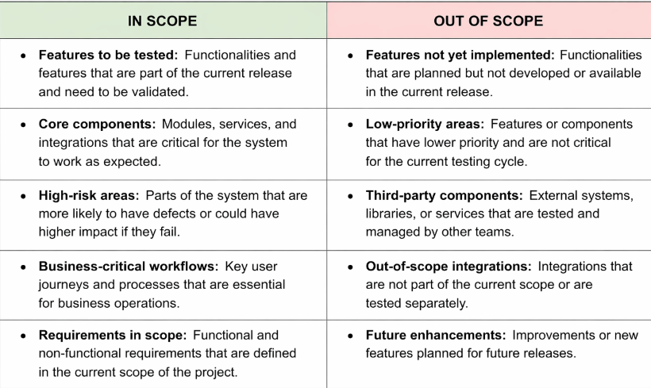
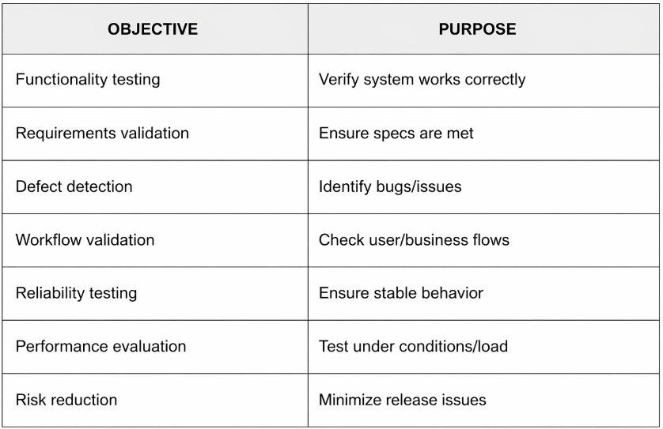
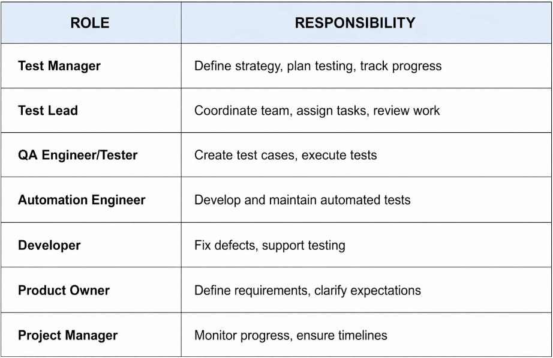
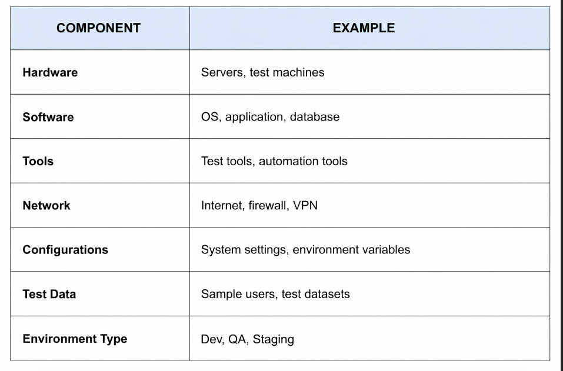

# Content of test management level 2

- [Purpose of Test Planning](#purpose-of-test-planning)
- [What is a Test Plan](#what-is-a-test-plan)
- [Scope of Testing](#scope-of-testing)
- [In Scope and Out of Scope](#in-scope-and-out-of-scope)
- [Test Objectives](#test-objectives)
- [Roles and Responsibilities](#roles-and-responsibilities)
- [Test Environment](#test-environment)

In **Test Management Level 1**, the focus was on understanding responsibility in testing and how defects are tracked and managed. Defect management showed how problems are identified, documented, prioritized and resolved, ensuring that issues are not ignored and that software quality is visible to the team.

This established that testing is not a random activity. It requires structure, clear ownership and communication so that defects can be properly understood and resolved.

However, defect management happens **after testing has already started**. It focuses on handling problems once they are discovered.

Before that point, it is necessary to define how testing will be performed in the first place.

Testing cannot rely only on reacting to defects. It requires preparation that defines what should be tested, what should not be tested and what the testing process is expected to achieve.

At **Test Management Level 2**, the focus shifts from managing defects during testing to organizing testing before it begins.

This introduces **test planning** as the activity that provides structure and direction to the entire testing process.

We start by understanding the **purpose of test planning**.

## Purpose of Test Planning

Defect management showed how problems are handled during testing, but it does not define how testing itself should be organized. Before testing begins, it is necessary to establish a clear direction for what will be tested and how testing will be performed.

The purpose of test planning is to provide this direction.

Test planning ensures that testing is performed in a structured and controlled way. It defines the boundaries of testing, the goals that need to be achieved and the conditions required to carry out testing activities.

Through test planning, teams gain a shared understanding of what parts of the system are relevant for testing and what areas are not part of the current effort. This prevents unnecessary work and helps focus testing on the most important functionality.

Test planning also ensures that testing is aligned with business expectations and quality requirements. It clarifies what testing is expected to verify and what level of confidence is needed before the software can be released.

Another important purpose of test planning is to establish responsibility. It defines who is involved in testing, what each role is responsible for and how testing activities are coordinated.

In addition, test planning prepares the environment in which testing will take place. Without the correct setup, tools and data, testing cannot be performed effectively.

A test plan is typically created before test execution begins and is used throughout the testing process. It may apply to an entire project or to a specific feature, release or iteration, depending on how the work is organized. As the system evolves, the test plan can be updated to reflect changes in scope, priorities or requirements.

Without proper planning, testing may become inconsistent, important areas may be missed and results may not provide a clear picture of software quality.

Test planning transforms testing from a reactive activity into a defined process that supports reliable and meaningful quality evaluation.

## What is a Test Plan

Once the purpose of test planning is understood, the next step is to define the output of this process.

A **test plan** is a structured document that describes how testing will be performed for a software system. It serves as a reference that guides all testing activities and ensures that everyone involved has a shared understanding of the testing approach.

The test plan defines what will be tested, what will not be tested and what the testing process is expected to achieve. It also describes the conditions under which testing will take place and how testing activities are organized.

The purpose of a test plan is not only to document decisions, but to make testing consistent and repeatable. By having a clear plan, teams can avoid misunderstandings, reduce confusion and ensure that testing is aligned with project goals.

A test plan provides visibility into the testing process. It allows stakeholders to understand the scope of testing, the objectives that need to be achieved and the resources involved. This makes it easier to track progress and evaluate the quality of the software.

The test plan is typically created before test execution begins and may be updated as the project evolves. As requirements change or new risks are identified, the test plan can be adjusted to reflect those changes.

A well-defined test plan acts as a foundation for all testing activities. It ensures that testing is not performed randomly, but follows a clear and structured approach.

Once a test plan is established, one of the first elements that must be clearly defined is the scope of testing. Without a defined scope, it becomes unclear what parts of the system should be tested and what areas are not relevant for the current testing effort.

## Scope of Testing

Once a test plan is defined, it is necessary to determine the boundaries of testing. Testing cannot cover every possible scenario or part of a system, especially when time and resources are limited.

The scope of testing defines what parts of the system will be included in testing and what parts will not be considered. It establishes clear boundaries so that testing efforts remain focused and manageable.

Scope is not about how testing is performed, but about what is relevant for the current testing effort. It helps teams understand which features, components or behaviors need to be validated.

Defining the scope ensures that testing is aligned with project goals and priorities. Critical functionality and high-risk areas are typically included, while less important or unrelated areas may be excluded.

Without a clearly defined scope, testing may become unfocused. Teams may spend time testing low-priority features while missing important functionality. It can also lead to misunderstandings between stakeholders about what has been tested and what has not.

A well-defined scope provides clarity and direction. It ensures that testing efforts are concentrated on the most important parts of the system and that expectations are clearly understood.

To make these boundaries explicit, the scope is divided into what is included in testing and what is excluded from it.

## In Scope and Out of Scope

The defined scope becomes practical when it is clearly separated into what is included and what is not.

**In scope** refers to the parts of the system that will be tested. These are the features, components, or behaviors that are considered important for the current testing effort. They are selected based on project goals, requirements and risk. By defining what is in scope, the team ensures that critical functionality is properly validated.

**Out of scope** refers to the parts of the system that will not be tested in the current testing cycle. These may include features that are not yet implemented, areas with low priority, or aspects that are handled by other types of testing or different teams. Defining what is out of scope prevents unnecessary effort and avoids confusion about responsibilities.

The purpose of distinguishing between in scope and out of scope is to create clear expectations. It helps stakeholders understand what has been tested and what has not, reducing misunderstandings and unrealistic assumptions about software quality.

Without this separation, testing may expand beyond its intended boundaries, leading to wasted effort or missed priorities. A clear definition of in scope and out of scope ensures that testing remains focused, efficient and aligned with project objectives.

## Test Objectives

After defining what will be tested and what is outside the scope, it is necessary to understand what testing is expected to achieve.

Test objectives describe the goals of the testing process. They define what aspects of the system need to be verified and what level of confidence is required before the software can be considered ready.

Testing is not performed without purpose. Each testing activity should contribute to confirming that the system behaves as expected and meets its requirements. Test objectives provide this direction by clearly stating what needs to be validated.

Common objectives include verifying that the system functions correctly, ensuring that requirements are met and identifying defects that could impact users or business operations. In addition, testing may aim to evaluate how the system performs under different conditions and whether it behaves reliably in real-world scenarios.

Test objectives also help align testing with business expectations. They ensure that testing focuses on what is important for the product, rather than testing everything without priority.

Without clearly defined objectives, testing may become unfocused and it may be difficult to determine whether testing has been successful. There would be no clear criteria to evaluate the results.

By defining test objectives, teams establish a clear purpose for testing activities and ensure that testing efforts contribute to meaningful quality evaluation.

Once the purpose of testing is clearly defined, it is necessary to understand who is responsible for achieving these objectives and how testing activities are coordinated across the team.

## Roles and Responsibilities

Once the objectives of testing are defined, it is necessary to understand who is responsible for carrying out the testing activities.

Testing is not performed by a single person. It involves multiple roles that work together to ensure that testing is properly planned, executed and monitored. Each role has a specific responsibility that contributes to the overall testing process.

Roles and responsibilities define who is involved in testing and what each person is expected to do. This includes activities such as preparing test cases, executing tests, reporting defects, reviewing results and making decisions about software quality.

Clear responsibilities ensure that testing activities are coordinated and that there is ownership for each task. When roles are well defined, communication becomes more effective and tasks are less likely to be missed or duplicated.

Testing also involves collaboration with other stakeholders, such as developers, product owners and managers. Developers may fix defects, product owners may clarify requirements and managers may review testing progress and quality status.

Without clearly defined roles and responsibilities, testing can become disorganized. Tasks may be unclear, accountability may be missing and important activities may be overlooked.

By defining roles and responsibilities, the testing process becomes structured and coordinated, ensuring that all activities are performed effectively and that quality can be properly evaluated.

However, even with clear responsibilities, testing cannot be performed without the proper setup. It is necessary to define the environment in which testing will take place.

## Test Environment

Even when testing objectives and responsibilities are clearly defined, testing cannot be performed without the proper conditions. The system must be available in a controlled setup where its behavior can be observed and evaluated.

The test environment represents the setup in which testing takes place. It includes the hardware, software, tools, configurations and data required to execute tests.

The purpose of the test environment is to provide conditions that are suitable for testing and as close as possible to real usage scenarios. This allows the system to be evaluated in a way that reflects how it will behave in actual use.

A test environment may include operating systems, browsers, databases, servers and network configurations. It may also include testing tools and prepared test data that support the execution of tests.

The environment must be stable and properly configured. If the environment is incorrect or unstable, test results may not be reliable and it may be difficult to determine whether failures are caused by defects in the system or issues in the setup.

In many cases, multiple environments are used, such as development, testing and staging environments. Each environment serves a different purpose and supports different stages of the testing process.

Without a properly defined test environment, testing may be delayed, inconsistent, or inaccurate. A well-prepared environment ensures that tests can be executed effectively and that results provide a clear and reliable evaluation of software quality.
