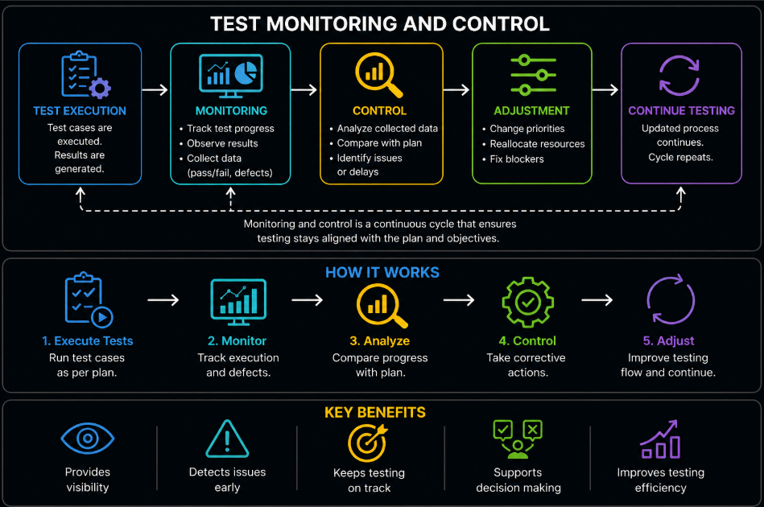
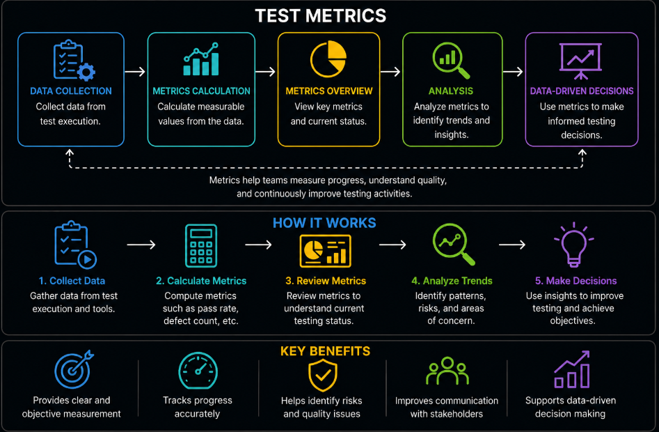
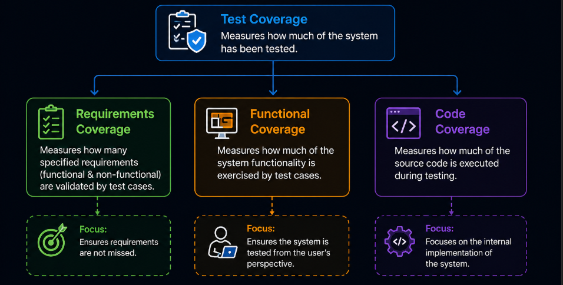
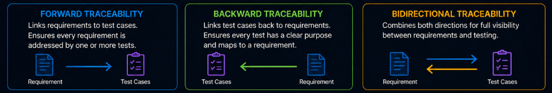
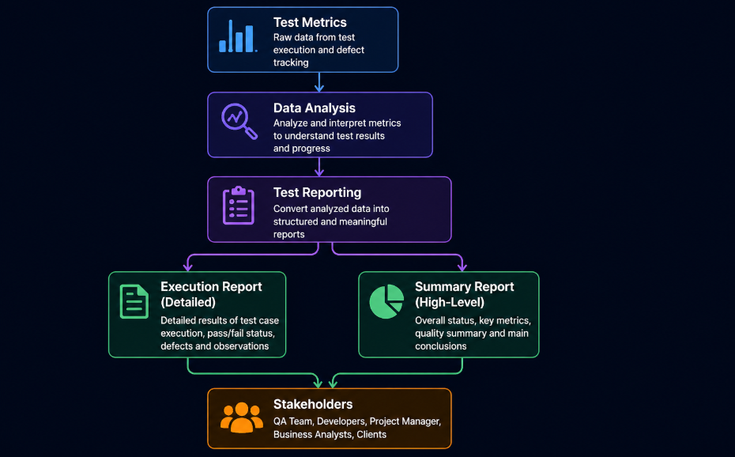
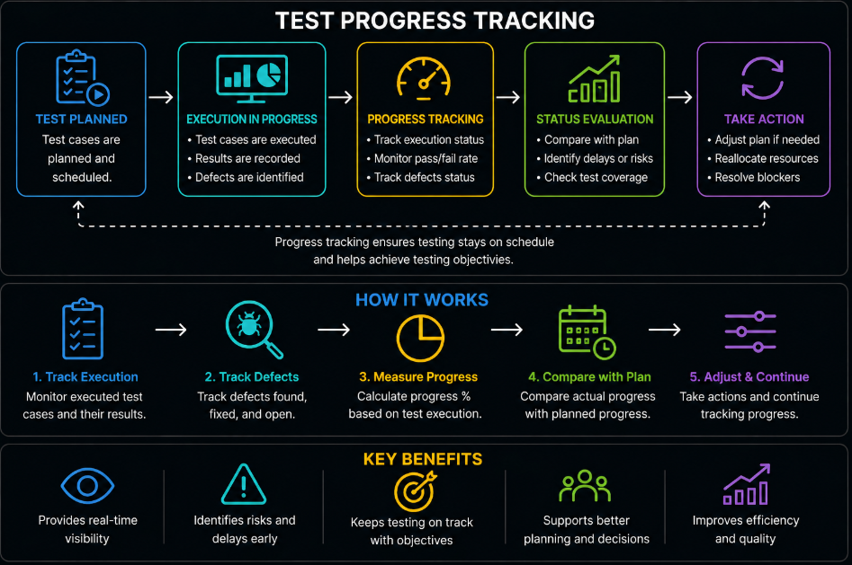
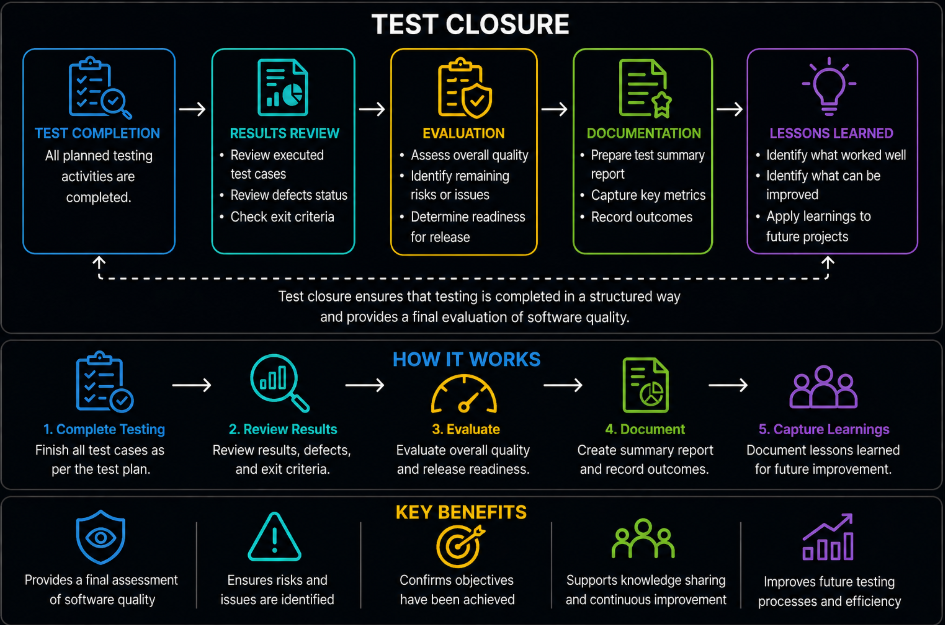

# Content of test management level 3

- [Test Monitoring and Control](#test-monitoring-and-control)
- [Test Metrics](#test-metrics)
- [Test Coverage](#test-coverage)
- [Traceability Matrix](#traceability-matrix)
- [Test Reporting](#test-reporting)
- [Test Progress Tracking](#test-progress-tracking)
- [Test Closure](#test-closure)

In **Test Management Level 2**, the focus was on planning testing activities and defining how testing should be organized. This included understanding the purpose of test planning, defining scope, setting objectives, assigning responsibilities and preparing the test environment.

At that stage, testing was structured and prepared, but there was no focus on how testing is managed while it is actually taking place.

At **Test Management Level 3**, the focus shifts from planning to managing testing during execution. Testing activities are no longer only defined in advance, but are continuously observed, measured and adjusted as they progress.

This level introduces how teams track testing progress, evaluate results, ensure coverage and communicate the current state of quality.

To manage testing effectively during execution, it is necessary to monitor what is happening and take actions based on that information.

## Test Monitoring and Control

Once test execution has started, it is necessary to ensure that testing activities are progressing as expected. Simply executing tests is not enough. The testing process must be observed, evaluated and adjusted when needed.

Test monitoring and control focus on tracking the progress of testing and making decisions based on the current state of testing activities.



Monitoring involves collecting information about what is happening during test execution. This includes tracking which test cases have been executed, what results have been observed and how many defects have been identified.

Control involves taking actions based on this information. If testing is not progressing as planned, adjustments may be required. This may include changing priorities, reallocating resources or addressing blocking issues that prevent testing from continuing.

Through monitoring and control, teams can understand whether testing is on track and whether objectives are being achieved. It provides visibility into the current state of testing and helps identify potential risks or delays.

Without monitoring, it is difficult to know what has been completed and what remains. Without control, problems identified during testing may not be addressed in time.

Test monitoring and control ensure that testing remains aligned with the plan while still allowing flexibility to respond to changes and issues that arise during execution.

In practice, monitoring and control are supported by tools and artifacts such as **execution dashboards**, **defect tracking systems**, and **status trackers**. These provide real-time visibility into testing activities and help teams quickly respond to issues during execution.

To understand the state of testing more precisely, it is necessary to measure testing activities using defined values.

## Test Metrics

While monitoring provides visibility into testing activities, it is often based on observations and general status. To understand testing in a more precise and objective way, it is necessary to use measurable values.

Test metrics are quantitative measures used to evaluate the progress, quality and effectiveness of testing activities. They provide numerical data that helps teams understand how testing is performing and whether objectives are being achieved.



Metrics can represent different aspects of testing. They may show how many test cases have been executed, how many have passed or failed and how many defects have been identified. They can also reflect the rate at which defects are found and resolved.

By using metrics, teams can move from subjective opinions to data-driven decisions. Instead of estimating progress, they can measure it. This allows more accurate tracking of testing activities and helps identify trends over time.

Test metrics also support communication with stakeholders. Clear and measurable data makes it easier to report the status of testing and to explain the current quality of the software.

However, metrics must be used carefully. Collecting too many metrics or focusing on the wrong values can create confusion instead of clarity. Metrics should be relevant to the goals of testing and provide meaningful insight.

Without metrics, it is difficult to evaluate testing progress and quality objectively. Test metrics ensure that testing activities can be measured, understood and improved based on reliable data.

To communicate these measured results effectively, it is necessary to present them in a structured and understandable way.

In practice, test metrics are usually presented as part of **test reports**, **progress dashboards**, or **status trackers** rather than as separate documents. They provide the numerical foundation that supports reporting and decision making.

However, before results can be clearly communicated, it is important to understand what has actually been covered by testing.

## Test Coverage

Test metrics help measure testing activities, but metrics alone do not show whether all important areas of the system have been tested. A team may execute many test cases, but still miss important requirements or critical functionality.

Test coverage is the measure of how much of the system has been tested. It helps determine whether testing has covered the required functionality, requirements or code.



Coverage can be evaluated using different criteria. **Requirements coverage** measures how many specified requirements, including functional and non-functional requirements are validated by test cases. This helps ensure that requirements are not missed.

**Functional coverage** measures how much of the system functionality is exercised by test cases. This includes user interactions, workflows and business scenarios, ensuring the system is tested from the user’s perspective.

**Code coverage** measures how much of the source code is executed during testing. This type of coverage is primarily used by developers because it focuses on the internal implementation of the system.

To measure coverage, the team first identifies what type of coverage is being evaluated. Requirements, functions or code areas are then mapped to corresponding test cases. When tests are executed, results are recorded and coverage can be calculated.

```text
coverage = (tested_requirements / total_requirements) * 100
```

Coverage is measured based on whether an area has been tested, not only whether the test passed or failed. This means coverage shows the extent of testing performed, but it does not guarantee correctness.

For example, a requirement may be covered by a test case, but the test may fail because the system does not behave as expected. In this case, the requirement is covered, but the result shows a defect.

Because of this, high coverage does not mean the software is defect-free. It only means that more areas have been tested. Coverage must be interpreted together with test results and defects.

In practice, achieving 100% coverage is rarely possible due to time, resources and system complexity. The goal is to achieve sufficient coverage based on project needs and constraints. More advanced approaches to prioritizing testing based on risk and importance are covered in **Test Management Level 4**.

Coverage can be improved by adding test cases for untested areas and by analyzing gaps in testing. More advanced techniques for improving coverage, including white-box testing techniques are introduced in **Test Case Design Level 4**.

To manage and visualize coverage more clearly, teams often use a traceability matrix to map requirements to test cases and identify gaps.

To ensure that all requirements are properly linked to test cases and fully covered, it is necessary to use a structured mapping approach.

## Traceability Matrix

Test coverage shows how much of the system has been tested, but it does not clearly show the relationship between **requirements** and **test cases**. A system may appear to have good coverage, but it may still be unclear which specific requirements have been validated.

To make this relationship explicit, a structured mapping approach is used.

A **traceability matrix** links **requirements** to **test cases** and provides a clear view of how testing aligns with defined requirements.

Each requirement is identified using a **unique identifier** and is connected to one or more **test cases**. This mapping makes it possible to see which requirements are **covered** and which are not.

The matrix typically includes information such as **requirement identifiers**, **requirement descriptions**, related **test scenarios**, **test case identifiers** and the **status** of coverage or execution.

By organizing this information in a structured way, the traceability matrix helps ensure that testing is **complete** and aligned with what needs to be validated.

Traceability can be viewed in different directions, depending on how requirements and test cases are connected.



**Forward traceability** focuses on moving from requirements to test cases. It ensures that every requirement is linked to at least one test case, so nothing defined in the requirements is left untested.

**Backward traceability** works in the opposite direction. It connects test cases back to their original requirements, ensuring that every test has a clear purpose and is not created without a reason.

When both directions are used together, it forms **bidirectional traceability**. This provides full visibility between requirements and testing, making it possible to see both what is tested and why it is tested.

The traceability matrix also helps identify **gaps**. If a requirement has no linked test cases, it means it has not been tested. If a test case is not linked to any requirement, it may be unnecessary or incorrectly designed.

In addition, traceability supports **change management**. When requirements change, the matrix helps identify which test cases are affected and need to be updated.

Without traceability, it becomes difficult to confirm whether all requirements have been properly tested. Testing may appear complete, but important functionality could still be missing.

The traceability matrix ensures that testing is connected to requirements in a clear and structured way, improving **coverage visibility** and supporting more reliable **quality evaluation**.

To communicate this information effectively to stakeholders, it is necessary to present testing results in a clear and structured form.

## Test Reporting

Once testing activities are measured using metrics, the results must be communicated in a clear and structured way. Raw data alone is not enough. Stakeholders need to understand what the data means and how it reflects the current state of the system.

Test reporting is the process of presenting testing results, progress and quality status to stakeholders. It transforms collected data and metrics into meaningful information that supports decision making.



Test reports provide visibility into what has been tested, what defects have been identified and what risks remain. They help teams and stakeholders understand whether the system is ready for release or if further testing is required.

Reporting is not only about listing numbers. It includes interpreting results and highlighting important information, such as critical defects, delays or areas of concern. This ensures that attention is focused on the most important issues.

Test reporting also supports communication between different roles. Developers, testers, managers and product owners rely on reports to stay aligned and to make informed decisions about the project.

Without clear reporting, testing results may be misunderstood or ignored. Important issues may not be communicated effectively, leading to incorrect assumptions about software quality.

Test reporting ensures that testing outcomes are visible, understandable and useful for decision making throughout the project.

Reports can be presented in different forms depending on the level of detail required. During testing, teams often use **detailed test reports** (also called **test execution reports**) that include a **test execution table** showing test case results, along with defect information and current progress. These reports help the team understand what is happening during testing and support day-to-day decisions.

At a higher level, **test summary reports** provide an overall view of testing results. They typically include total test cases, pass and fail rates, identified defects and the overall quality status of the system. These reports are used by stakeholders to understand whether the system is ready for release.

By using both detailed and summary reports, teams can ensure that information is available for both operational decisions and high-level evaluation.

To understand how testing is progressing over time and whether activities are on track, it is necessary to continuously follow the state of testing execution.

## Test Progress Tracking

While test reporting provides a summary of testing results, it is also necessary to continuously follow how testing is progressing over time. Testing is not a single event, but an ongoing process that evolves as execution continues.

Test progress tracking focuses on observing the state of testing activities and understanding how much work has been completed and what remains.



Progress tracking includes monitoring the execution of test cases, identifying how many have been completed and evaluating the rate at which testing is moving forward. It also involves tracking defects, including how many have been found, fixed, and remain unresolved.

By tracking progress, teams can determine whether testing is on schedule and whether objectives are likely to be achieved within the planned timeframe. It helps identify delays, bottlenecks or areas where additional attention is required.

Progress tracking also supports better planning during execution. If testing is slower than expected or if defect resolution is delayed, adjustments can be made to keep testing aligned with project goals.

Without progress tracking, it is difficult to understand the current state of testing or to predict whether testing will be completed on time. Teams may lose visibility into what has been done and what still needs to be addressed.

Test progress tracking ensures that testing activities remain transparent and measurable throughout execution, allowing teams to make informed decisions as testing continues.

In practice, progress tracking is often supported by artifacts such as **test progress reports**, **execution dashboards**, or **status trackers**. These provide a structured view of completed work, remaining tasks and defect status, helping teams quickly understand the current state of testing.

Once testing activities are completed and progress has been fully evaluated, it is necessary to formally conclude the testing process.

## Test Closure

Once testing activities are completed and progress has been evaluated, it is necessary to formally conclude the testing process. Testing does not end simply when execution stops. It must be reviewed and finalized in a structured way.

Test closure is the process of completing all testing activities and evaluating the overall results of testing. It ensures that testing has been carried out according to the plan and that all objectives have been addressed.



During test closure, the results of testing are analyzed to understand what has been achieved. This includes reviewing executed test cases, identified defects and the current state of the system. It also involves confirming whether exit criteria have been met.

Test closure provides an opportunity to assess the quality of the software and determine whether it is ready for release. Any remaining risks or unresolved issues are identified and communicated to stakeholders.

In addition, test closure includes documenting the outcomes of testing. This may involve creating summary reports, capturing key metrics and recording lessons learned during the testing process.

Lessons learned are an important part of test closure. They help teams understand what worked well and what can be improved in future testing activities.

In practice, test closure results in formal artifacts such as a **test summary report**, **test closure report**, and documented **lessons learned**. These provide a final record of testing activities, overall quality status, and key insights for future projects.

Without proper closure, valuable information may be lost and it may be unclear whether testing was sufficient. There would be no clear conclusion about the quality of the system.

Test closure ensures that testing is completed in a controlled and structured way, providing a final evaluation of software quality and supporting continuous improvement in future projects.
