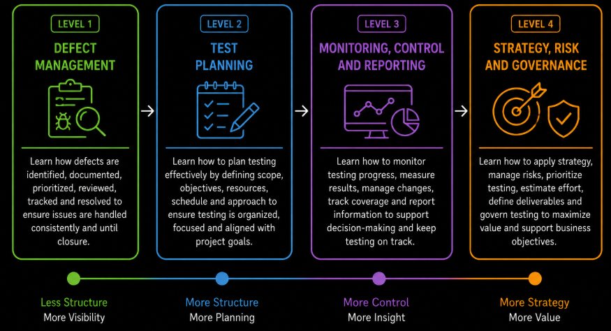

# Test Management Overview

Test management is the discipline of planning, organizing, monitoring, controlling, and completing testing activities so that testing is performed in a structured and coordinated way. It helps teams use available time and resources effectively, manage product risks, track testing progress, handle defects, and communicate information about product quality to stakeholders.

The **Test Management** module develops from managing defects found during testing, through planning testing activities and monitoring their progress, to making broader strategic, risk-based, estimation, governance and communication decisions.

**Level 1** focuses on the fundamentals of **defect management**. It explains how defects are documented and tracked, how they move through the **defect life cycle**, how **severity and priority** are used, how to write an effective **defect report**, how **defect triage** supports decisions, and how basic **defect metrics** provide visibility into unresolved and completed defects.

**Level 2** focuses on **test planning**. It explains the purpose of test planning and the role of a **test plan**, how the **scope of testing** is defined, how **in-scope and out-of-scope** items are identified, how **test objectives** are established, and how **roles and responsibilities**, the **test environment** and the **test schedule** are planned.

**Level 3** focuses on **test monitoring, control, and reporting**. It explains how testing progress is monitored and adjusted using **test metrics**, how **test coverage** and a **traceability matrix** provide visibility into what has been tested, how testing status is communicated through **test reporting** and **progress tracking**, and how testing activities are formally completed through **test closure**.

**Level 4** focuses on advanced test management decisions. It introduces **test strategy**, **risk management and risk-based testing**, **test prioritization and scheduling**, **test estimation**, **test deliverables and reporting strategy**, and **test governance and communication**. These topics show how testing can be aligned with product risks, project constraints, stakeholder needs and broader organizational objectives.

Together, these levels develop test management from the day-to-day handling of defects and test planning to the monitoring, control and strategic coordination of testing. They provide a structured foundation for making informed testing decisions, communicating quality information, and managing testing throughout the software development lifecycle.
