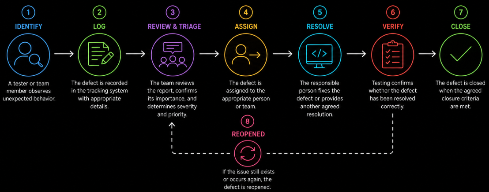

# Table of Contents: Test Managment Summary

- [Test Managment Level 1](#test-managment-level-1)

This summary brings together the most important concepts from **Test Management Level 1**. It is designed as a quick reference for revision and preparation for questions where defect management concepts, responsibilities, decisions, and relationships need to be explained clearly.

## Test Managment Level 1

Level 1 focuses on the fundamentals of **defect management**. It explains how defects are identified, documented, tracked, reviewed, prioritized, resolved, verified, and communicated throughout testing.

**Defect management** is the systematic process of managing defects from discovery until an agreed outcome is reached. It helps prevent reported problems from being forgotten, misunderstood, or ignored and provides **traceability** throughout investigation, resolution, verification, and closure.

A **defect**, often called a **bug**, is a flaw in a software product that can cause it to behave differently from what is required or expected. An **anomaly** is an observed condition that differs from expectations and may require investigation. After investigation, an anomaly may be confirmed as a defect.

Defects can originate from areas such as **Requirements**, **Design**, **Code**, **Environment**, and **Data**. Categorizing defects or using root cause tags can help teams identify recurring problem areas and support future quality improvement. Defect management applies to both **functional and non-functional defects**, including security, performance, usability, and accessibility problems.

A **defect life cycle** describes the stages a defect passes through from discovery until an agreed outcome is reached. A typical flow includes **identification**, **logging**, **review and triage**, **assignment**, **resolution**, **verification**, and **closure**.

Common defect statuses include **New**, **In Progress**, **Resolved**, **Closed**, and **Reopened**. Depending on the organization's workflow, additional statuses may include **Rejected**, **Not a Bug**, **Deferred**, and **Cannot Reproduce**. Exact status names and transitions vary between organizations.

If verification fails because the reported problem still exists, the defect is commonly **reopened** and returned for further investigation. The tester should provide useful evidence such as the tested build or version, updated reproduction steps, actual results, screenshots, videos, or logs. Communication should remain objective and focus on the observed behavior rather than assigning blame.

After verifying a fix, the tester should consider whether **regression testing** is needed. Regression testing checks whether the change has unintentionally affected existing functionality, especially areas related to the corrected defect.

Responsibilities in the defect life cycle vary between teams. A tester commonly identifies and reports defects and later verifies their resolution. Developers investigate assigned defects and implement fixes when required. Test leads, product representatives, development leads, and triage teams may contribute to assessment and decision-making. Closure responsibility follows the team's agreed workflow and closure criteria.

When a high-severity defect remains blocked or unresolved beyond an agreed timeframe, or when a triage decision cannot be resolved within the team, the issue should follow the project's agreed **escalation path**. The escalation should clearly communicate the defect's impact, current status, blocking issue, and the decision or action required.

**Severity** describes how strongly a defect affects the system or its users. It focuses on the **technical and functional impact** of the defect. Common severity levels include **Critical**, **High**, **Medium**, and **Low**.

**Priority** describes how urgently a defect should be addressed. It focuses on **application and delivery importance** and may be influenced by customer impact, release goals, application risk, dependencies, deadlines, and regulatory requirements.

Severity and priority are related but are not the same. A **low-severity** defect can have **high priority** when it has significant application or release impact. A **high-severity** defect can have a lower immediate priority when it affects a rarely used, disabled, or out-of-scope feature.

Severity is commonly proposed by the tester or QA team based on technical and functional impact and may be reviewed during triage. Priority is generally determined or confirmed from a business and delivery perspective by roles such as a **product owner**, **product manager**, **business representative**, **business analyst**, or **triage team**. Developers and technical leads can provide technical information that supports these decisions. Exact responsibilities depend on the organization's agreed defect management process.

A **good defect report** provides enough information for another team member to understand, investigate, and reproduce the problem without unnecessary clarification. Before creating a new report, the tester should search for similar existing reports and follow the team's duplicate-handling process when the same problem has already been reported.

Important defect report information includes a **unique identifier**, **title**, **description**, **steps to reproduce**, **expected result**, **actual result**, **severity**, **priority**, **environment details**, supporting **evidence**, **reporter and assignee information**, **status**, and important **dates**. Exact fields vary between organizations and defect-tracking tools.

Reproduction steps should be specific enough for another person to follow them and observe the same problem when it is reproducible. The **expected result** describes the intended behavior, while the **actual result** describes what was observed instead. Common reporting problems include vague titles, missing reproduction steps, incomplete environment information, insufficient evidence, and incorrectly selected severity or priority.

**Defect triage** is the process of reviewing reported defects and deciding how they should be handled. The team evaluates the defect, considers its impact and urgency, and determines the appropriate next action.

A triage decision does not always result in an immediate fix. A defect may be **accepted and assigned**, **rejected**, marked as **Not a Bug**, **deferred**, identified as a **duplicate**, **split** into separate issues, returned for **more information**, or marked as **Cannot Reproduce** when the reported behavior cannot be reproduced.

Triage participants depend on the organization and project. They may include a test lead, development lead, product manager or product owner, and other relevant specialists. Their different perspectives help the team consider technical impact, business importance, release needs, and available resources.

Basic **defect metrics** provide visibility into testing progress and unresolved problems. Teams may track **open defects**, **closed defects**, and **defect age**, which indicates how long a defect has remained unresolved. These metrics can help identify areas that require attention, but they do not determine product quality by themselves. They should be interpreted together with test results, risks, severity, priority, and agreed completion or release criteria.

After reviewing Level 1, you should be able to explain **what defect management is and why it is needed**, describe the **defect life cycle and common statuses**, distinguish **severity from priority**, explain the responsibilities involved in severity and priority decisions, describe the contents of a **good defect report**, explain the purpose and possible outcomes of **defect triage**, describe appropriate actions when **verification fails or escalation is required**, explain why **regression testing** may follow defect verification, and describe how basic **defect metrics** support visibility and decision-making.
