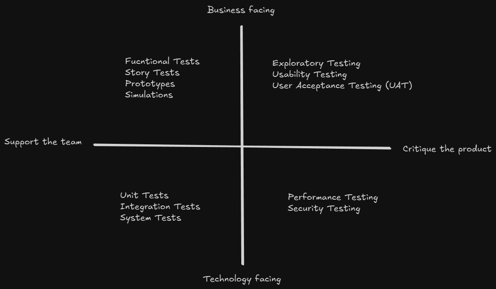

<!-- markdownlint-disable MD033 -->
# Content of Table Managing the Test Managment

- [Test Planning](#test-planning)
- [Test Monitoring, Control and Completion](#test-monitoring-control-and-completion)
- [Configuration Management](#configuration-management)
- [Defect Management](#defect-management)

**Explanation:**

Managing test activities is a aspect of the software development lifecycle that ensures the quality and reliability of the software product. It involves a series of coordinated tasks and processes that guide the planning, execution, monitoring, and control of testing efforts.

## Test Planning

**Explanation:**

Test Planning It involves creating a detailed document that outlines the strategy and approach for testing a software product. This document serves as a blueprint for the entire testing process, ensuring that all aspects of testing are well-organized and systematically executed.

<details>
    <summary>Overview:</summary>

1. **Introduction:**

    - **Purpose of the Test Plan:** Explain why the test plan exists (to ensure the software meets its requirements and functions correctly before release).

    - **Scope of Testing:** Define what will be tested and what won't.
        - **In Scope:** Functional testing of the user interface, integration testing of backend services, and performance testing under load.
        - **Out of scope:** Security and usability testing.

    - **Objectives:** List the main testing goals:
        - Identify and resolve defects.
        - Verify that the software meets requirements.
        - Ensure proper performance under expected conditions.

    - **Constraints:** Note any limitations.
        - Testing must be completed within a four-week timeframe.
        - Limited access to the production environment may impact the ability to perform end-to-end testing.

    - **Assumptions:** List any assumptions made during the planning process.
        - Stable builds will be provided every two weeks.
        - Test environments will be available and properly set up.

2. **Test Items:**

    - **List of Items to be Tested:** List the main components, modules, or subsystems that will be tested.

    - **Features to be Tested:** Describe the specific functionalities or features within those components that will be included in testing.

    - **Features Not to be Tested:** Specify any features or functionalities that are out of scope for testing.

3. **Risk Management:**

    - **Risk Register:** Maintain a register of identified risks that could impact testing.

        <details>
           <summary>Overview:</summary>

        1. **Risk Identification:** Identify potential risks that could impact the software testing process.

            <details>
              <summary>Overview:</summary>

            - **Technical Risks:** software bugs, unstable integrations.

            - **Process Risks:** Delays, resource shortages.

            - **External Risks:** Changes in market conditions or regulatory requirements.

            </details>

        2. **Risk Assessment:** Once risks have been identified, they need to be assessed in terms of their likelihood of occurrence and their potential impact.

            - **Risk Likelihood:** How likely is it to happen? It can be assessed based on past experience, statistical analysis.

                <details>
                   <summary>Examples:</summary>

                1. **Example 1:**

                    ```text
                    If similar projects had many bugs, the likelihood of technical risks might be high.
                    ```

                </details>

            - **Risk Impact:** What problems could occur if it happens? It can be assessed in terms of the potential damage to the project's objectives.

                <details>
                   <summary>Examples:</summary>

                1. **Example 1:**

                    ```text
                    A key component failing might delay the project significantly.
                    ```

                </details>

    - **Mitigation Strategies:** Decide how to handle each risk.

        <details>
           <summary>Overview:</summary>

        1. **Risk Acceptance:** For low-impact risks, choose to accept them.

        2. **Risk Mitigation:** Take actions to reduce the chance or impact.

            <details>
               <summary>Examples:</summary>

            1. **Example 1:**

                ```text
                Extra code reviews can lower the risk of bugs.
                ```

            </details>

        3. **Risk Transfer:** Shift the risk to another party (outsourcing, insurance)

        4. **Contingency Plan:** This is a backup plan that tells you what to do if something goes wrong.

            <details>
               <summary>Examples:</summary>

            1. **Example 1:**

                ```text
                Set up an alternative test environment if the primary one fails.
                ```

            </details>

        </details>

    - **Tools and Techniques:** Use simple tools (like Excel or online project management tools) to document and track risks. A basic risk-based testing approach can help focus testing on high-risk areas.

        <details>
           <summary>Overview:</summary>

        1. **Risk-Based Testing:** Prioritize testing efforts based on the risk associated with features or functions.

            <details>
               <summary>Examples:</summary>

            - **Identify Risks:**
                - Determine potential risks for a new feature. For example, a feature might be prone to performance issues or security vulnerabilities.

            - **Assess Risks:**
                - Evaluate each identified risk by estimating its likelihood and potential impact. For instance, if a feature is complex with many dependencies, it might have a high risk of introducing bugs.

            - **Prioritize Testing:**
                - Focus testing efforts on areas with the highest risk. If the new feature is likely to suffer performance issues, extensive performance testing should be prioritized.

            - **Executing Tests:**
                - Run tests in order of risk priority, ensuring that high-risk areas are thoroughly tested first.

            - **Manage Risks:**
                - Continuously monitor risk factors throughout testing. Adjust test priorities if new risks emerge.

            </details>

        2. **Product Risk Management:** Concentrates on risks related to the software product's functionality or performance.

            <details>
               <summary>Examples:</summary>

            - **Data Breaches:**
                - **Risk:** Unauthorized access to sensitive patient data.
                - **Management:** Conduct code reviews to identify vulnerabilities; implement strong encryption and access controls.

            - **System Downtime:**
                - **Risk:** Unplanned system outages affecting operations.
                - **Management:** Employ automated performance testing and monitoring to ensure system availability.

            - **Calculation Errors:**
                - **Risk:** Errors in dosage calculations could lead to serious health issues.
                - **Management:** Add robust validation checks and thorough unit testing to verify calculation accuracy.

            </details>

        3. **Project Risk Management:** Focuses on risks that can impact the overall project timeline, cost, or resource allocation.

            <details>
               <summary>Examples:</summary>

            - **Delays Due to Technical Challenges:**
                - **Risk:** Unexpected technical problems causing project delays.
                - **Management:** Use project management tools (such as Jira) to track progress and allocate additional time or resources if needed.

            - **Cost Overruns Due to Changes in Requirements:**
                - **Risk:** Changes in requirements leading to increased project costs.
                - **Management:** Regularly review project scope and budget, and adjust plans or negotiate additional resources.

            </details>

        </details>

4. **Test Approach(Test Strategy):**

    - **Test Pyramid:** Emphasizes many low-level unit tests, fewer integration tests, and only a handful of end-to-end tests.

    - **Test Levels:** Define testing at various layers: **unit testing**, **integration testing**, **system testing**, **acceptance testing**.

    - **Test Types:** Specify the types of testing to be performed (functional testing, non-functional testing).

    - **Test Techniques:** Describe the techniques and methodologies that will be used:

        - **White-box Testing:** Uses knowledge of internal structures (unit tests).

        - **Black-box Testing:** Derives tests from external requirements (user acceptance tests).

    - **Entry and Exit Criteria:** Define what conditions must be met before testing begins (stable build, prepared test environment) and what conditions mark testing completion (all critical defects fixed, sufficient test coverage achieved).

    - **Testing Quadrants:** This is a model that helps teams identify what type of testing is needed, when it should be done, and who should do it. It divides testing into four quadrants    based on whether the tests are business or technology-facing and whether they support the team or critique the product.

        - **Quadrant Q1: Technology-Facing Tests that Support the Team**
            - **Purpose:** Ensure code quality and correctness.
            - **Types of Tests:** Unit Tests, Integration Tests, System Tests.
            - **Characteristics:** Automated, run frequently.
            - **Example:** Writing unit tests for individual functions.

        - **Quadrant Q2: Business-Facing Tests that Support the Team**
            - **Purpose:** Validate business requirements and user scenarios.
            - **Types of Tests:** Functional Tests, Story Tests, Prototypes, Simulations.
                - **Functional tests** are designed to verify that the software performs its intended functions correctly. These tests focus on the functionality of the software and ensure that it meets the specified requirements.
                - **Story tests** are acceptance tests that are derived from user stories. They are used to validate that the software meets the acceptance criteria defined for each user story.
                - **Prototypes** are early models or versions of a product used to visualize and test design concepts. They help in understanding how the final product will look and function.
                - **Simulations** are tools or software that mimic the behavior of real systems or environments. They are used to create a virtual environment for testing purposes.
            - **Characteristics:** Can be automated or manual.
            - **Example:** Creating functional tests for user purchase flows.

        - **Quadrant Q3: Business-Facing Tests that Critique the Product**
            - **Purpose:** Find defects and improve user experience.
            - **Types of Tests:** Exploratory Testing, Usability Testing, User Acceptance Testing (UAT), Alpha/Beta Testing.
            - **Characteristics:** Often manual.
            - **Example:** Conducting usability testing for mobile app navigation.

        - **Quadrant Q4: Technology-Facing Tests that Critique the Product**
            - **Purpose:** Assess non-functional aspects like performance and security.
            - **Types of Tests:** Performance Testing, Load Testing, Security Testing.
            - **Characteristics:** Can be automated or manual.
            - **Example:** Performing testing for web application scalability.

            

    - **Test Prioritization:**  To determine the sequence of test case execution based on various factors such as risk, complexity, dependencies, and requirements.

        <details>
           <summary>Overview:</summary>

        - **Risk-Based Prioritization:** Test cases are prioritized based on the results of risk analysis. High-risk areas are tested first.

            - **Identify Risks:** Evaluate risk factors like impact (High, Medium, Low) and likelihood (High, Medium, Low).

            - **Score & Rank:** Multiply these scores to get a risk score and prioritize tests based on higher scores first.

            <details>
               <summary>Examples:</summary>

            1. **Prioritize Test Cases:**

                | Test Case ID | Description                        | Impact | Likelihood | Risk Score |
                |--------------|------------------------------------|--------|------------|------------|
                | T1           | Login with valid credentials       | High   | High       |     9      |
                | T2           | Login with invalid credentials     | Medium | Medium     |     4      |
                | T3           | Password reset functionality       | High   | Medium     |     2      |
                | T4           | View user profile                  | Low    | Low        |     1      |
                | T5           | Update user profile                | Medium | High       |     3      |

            2. **Steps to Execute Test Cases:**

                - **Step 1:** Execute T1 (Risk Score: 9)
                - **Step 2:** Execute T3 (Risk Score: 6)
                - **Step 3:** Execute T5 (Risk Score: 6)
                - **Step 4:** Execute T2 (Risk Score: 4)
                - **Step 5:** Execute T4 (Risk Score: 1)

            </details>

        - **Coverage-Based Prioritization:** Test cases are prioritized based on the coverage they provide, such as statement coverage or branch coverage.

            - **Identify Coverage Metrics:**
                - **Statement Coverage:** The percentage of executable statements in the code that are executed by the test case.
                - **Branch Coverage:** The percentage of branches (if-else conditions) that are executed by the test case.

            - **Score & Rank:** Assign scores based on how much code the test covers, then execute the highest-scoring tests first.

            <details>
               <summary>Examples:</summary>

            1. **Prioritize Test Cases:**

                | Test Case ID | Description                        | Statement Coverage  | Branch Coverage | Coverage Score |
                |--------------|------------------------------------|---------------------|-----------------|----------------|
                | T1           | Login with valid credentials       | (90-100%)           | (90-100%)       |       6        |
                | T2           | Login with invalid credentials     | (50-79%)            | (50-79%)        |       4        |

            2. **Steps to Execute Test Cases:**

                1. **Step 1:** Execute T1 (Coverage Score: 6)
                2. **Step 2:** Execute T3 (Coverage Score: 5)

            </details>

        - **Requirement-Based Prioritization:** Test cases are prioritized based on the priorities of the requirements they cover. High-priority requirements are tested first.

            - **Identify Requirement Priorities:**
                - **High Priority:** Critical requirements that are essential for the system's functionality.
                - **Medium Priority:** Important requirements that are necessary but not critical.
                - **Low Priority:** Requirements that are nice-to-have but not essential.

            - **Score & Rank:** Prioritize test cases related to high-priority requirements.

            <details>
               <summary>Examples:</summary>

            1. **Prioritize Test Cases:**

                | Test Case ID | Description                        | Requirement Priority |       Score       |
                |--------------|------------------------------------|----------------------|-------------------|
                | T1           | User Login functionality           | High                 | 3                 |
                | T2           | Password recovery                  | Medium               | 2                 |

            2. **Steps to Execute Test Cases:**

                - **Step 1:** Execute T1 (Requirement Score: 3)
                - **Step 2:** Execute T2 (Requirement Score: 2)

            </details>

        - **Test Execution Schedule:**This schedule defines the order in which test cases are executed so that high-priority tests run first while all dependencies are respected.

            - **Dependencies:**

                - **Technical Dependencies:** Some test cases must run before others to properly set up the test environment or state. For example, if Test A configures a user session that Test B relies on, Test A must execute before Test B.

                - **Logical Dependencies:** Some test cases depend on the results or outcomes of previous tests to validate a complete scenario. Even if one test is high priority, it cannot run until its prerequisite test (with lower numerical priority) has completed successfully.

            - **Priority Levels:** Test cases are assigned priorities (High, Medium, Low) based on factors such as risk, coverage, and criticality of the requirements.

                - **High Priority:** Run first, as they address the most critical risks or functionalities.
                - **Medium and Low Priority:** Execute later unless required as dependencies for higher priority tests.

            - **Combined Approach:**

                1. Identifies both technical and logical dependencies for each test case.

                2. Assigns a priority level to each test case based on risk, coverage, and requirement importance.

                3. Adjusts the overall execution order so that, even if a test is high priority, any test it depends on will run first.

            <details>
               <summary>Examples:</summary>

            1. **Example: Test Case Prioritization:**

                | Test Case ID | Description                        | Priority | Technical Dependency | Logical Dependency |
                |--------------|------------------------------------|----------|----------------------|--------------------|
                | T1           | Login with valid credentials       | High     | T2                   | None               |
                | T2           | Login with invalid credentials     | Medium   | None                 | None               |
                | T3           | Password reset functionality       | High     | T2                   | None               |
                | T4           | View user profile                  | Low      | None                 | None               |
                | T5           | Update user profile                | Medium   | T3                   | None               |

                - **Step 1:** Execute T2 (Medium priority, no dependencies)
                - **Step 2:** Execute T1 (High priority, dependent on T2)
                - **Step 3:** Execute T3 (High priority, dependent on T2)
                - **Step 4:** Execute T5 (Medium priority, dependent on T3)
                - **Step 5:** Execute T4 (Low priority, no dependencies)

            2. **Example: Hierarchical Bullet List:**

                - **Step 1:** Run Test T2 (acts as a setup; no dependencies).
                - **Step 2:** Run Test T1 (high priority; depends on T2).
                - **Step 3:** Run Test T3 (high priority; also depends on T2).
                - **Step 4:** Run Test T5 (medium priority; depends on T3).
                - **Step 5:** Run Test T4 (low priority; no dependencies).

            3. **Example: Narrative Statment**

                Based on our risk analysis, tests covering the most critical risks will be executed first. Coverage data and requirement priorities are also factored in. Even if a test is high priority, if it depends on another test (technical or logical dependency), that dependency will be scheduled to run before it.

            </details>

       </details>

5. **Resources:**

    - **Roles and Responsibilities:** Clearly define who is involved and what they.

        - Identify key testing roles (Test Lead, Test Analyst, Automation Engineer).

        - Outline responsibilities for each role.

        - Include stakeholder involvement (developers, product owners) as needed.

    - **Test Environment:**
        - **Environment Setup:** List the required hardware and software requirements, and configure the environment.

        - **Test Data Management:** Determine what kinds of data are needed for your tests. This involves reviewing requirements and design documents.

            - **Define Data Requirements:**

                - The types of data (numbers, text, dates)

                - Valid and invalid input values

                - Edge cases (like minimum and maximum values)

            - **Create or Extract Test Data:** Produce or obtain the necessary data.

                - Generate data manually or automatically if needed.

                - Extract data from existing sources if it fits the testing scenarios.

            - **Data Privacy and Security:** Protect sensitive information

                - Anonymize or mask personal data.

                - Follow data privacy regulations while using or sharing test data.

        - **Environment Maintenance:** Monitor and maintain the test environment to ensure stability and reliability.

        - **Tools:** List the tools that will be used for testing, including test management tools, automation tools, and defect tracking tools.

6. **Schedule:**

    - **Testing Timeline:** Provide a detailed timeline for testing activities. Specify the start and end dates for major phases such as test planning, test design, environment setup, test execution, and test closure.

    - **Milestones:** Identify key milestones and deliverables throughout the testing process.

        - Completion of the Test Plan

        - Test Environment setup and validation

        - Execution of the initial round of test cases

        - Intermediate status reports or Test Progress Reports

        - Final Test Execution and Regression Testing

        - Test Closure and Stakeholder Acceptance

    - **Deliverables:** Clearly list the outputs that you will provide at various stages.

        - **Test Plan Document:** Outlines the testing strategy, scope, approach, resources, schedule, and risk management.

        - **Test Cases and Test Scripts:** Detailed procedures and automation scripts used during testing.

        - **Test Progress Reports:** Intermediate updates that track testing progress against the plan.

        - **Test Execution Reports:** Detailed logs that document the outcomes of test runs, including defects logged.

        - **Test Summary and Test Closure Report:** A final report summarizing test results, defect metrics, coverage, lessons learned, and any outstanding issues.

        - **Metrics and Traceability Matrices:** Documentation that maps test cases to requirements and tracks test coverage.

7. **Test Estimation:**

    **Explanation:**

    Test Estimation is the process of forecasting the time, effort, and cost needed to complete testing activities. Since every estimate is based on assumptions and historical data, small tasks tend to be estimated more accurately than large ones. For larger tasks, it is advisable to break them down into smaller, manageable components and estimate each part individually.

    <details>
       <summary>Overview:</summary>

    1. **Metrics-Based Estimation:**

        - **Estimation Based on Ratios:** Use historical data from previous projects to determine standard ratios (such as development-to-test effort ratios) and apply them to the current project.

            <details>
               <summary>Examples:</summary>

            If a previous project used a 3:2 ratio (3 person-days of development for every 2 person-days of testing) and the current project estimates 600 person-days of development, the testing effort is estimated around 400 person-days.

            </details>

        - **Extrapolation:** Gather data early from the current project and project future effort based on observed trends.

            <details>
               <summary>Examples:</summary>

            If a team completed 80 story points in the first sprint, they might estimate a similar effort in upcoming sprints by averaging past performance.

            </details>

    2. **Expert-Based Estimation:**

        - **Wide Band Delphi:** Experts provide individual estimates in isolation. Their estimates are then discussed as a group, and adjustments are made iteratively until consensus is reached.

        - **Three Point Estimation:** This technique uses three estimates to define an approximate range for an activity's cost: Most Likely (M), Optimistic (O), and Pessimistic (P). The expected cost E.

            <details>
               <summary>Syntax:</summary>

            - `E` is the expected duration
            - `O` is the optimistic duration (the shortest time in which the task can be completed)
            - `M` is the most likely duration (the completion time having the highest probability)
            - `P` is the pessimistic duration (the longest time the task might take, assuming everything goes wrong)

            - `E = (O + 4M + P) / 6`

            </details>

            <details>
               <summary>Examples:</summary>

            - Optimistic duration `O` = 6 hours (if everything goes perfectly)

            - Most likely duration `M` = 9 hours (the most probable duration considering normal problems and delays)

            - Pessimistic duration `P` = 18 hours (if many issues are found during testing)

            - **Answer:** `E = (6 + 4×9 + 18) / 6 = 10 hours`, with a standard deviation `SD = (O – P)/6` of 2 hours. This means you can expect the task to take between 8 and 12 hours.

            </details>

    </details>

8. **Communication Plan:** Describe the forms (emails, meetings, dashboards) and frequency (daily stand-ups, weekly status updates) of communication. Also mention any documentation templates used for reporting.

</details>

## Test Monitoring, Control and Completion

**Explanation:**

Test Monitoring and Control are essential for ensuring that testing stays on track. Monitoring gathers data about testing progress, while control uses that data to make necessary adjustments. Test Completion then gathers all learnings and data for final reporting.

<details>
    <summary>Overview:</summary>

1. **Test Monitoring:** Continuously gather information on testing activities to confirm that everything remains on track.

    - **Track Progress:** Verify that test execution, effort, and resource usage remain on schedule.

    - **Verify Quality Targets:** Ensure quality targets (test coverage, defect rates) are being meet predefined objectives.

    - **Collect Simple Metrics:** Use simple metrics such as the number of executed test cases and defect counts.

2. **Test Control:** Respond to the monitoring data with corrective or enhancement actions.

    - **Identify Deviations:** Identify deviations from the plan (delays or unexpected defects).

    - **Issue Control Directives:** Reprioritize tests, adjust schedules, or reallocate resources as needed to bring testing back in line.

    - Reallocate resources when necessary.

3. **Test Completion (and Reporting):** Compile and analyze data once a test phase or project is finished. This phase is where Test Reporting comes into play.

    - **Gather Data and Learnings:** Collect all test results, issues, and lessons learned during the testing process.

    - **Prepare Final Reporting:** Create a comprehensive Test Completion Report that summarizes outcomes, deviations, quality evaluations, and metrics. This report acts as your final Test Report, providing transparency to stakeholders and serving as a reference for continuous improvement.

    - **Ensure Transparency:** Distribute the final report to stakeholders, ensuring they receive a clear and accountable record of the testing process.

</details>

## Configuration Management

**Explanation:**

Configuration Management (CM) is the systematic process for maintaining consistency and control over test artifacts and related items. It ensures that everything from test plans to test scripts is uniquely identified, controlled, and traceable.

<details>
    <summary>Overview:</summary>

1. **Unique Identification:** Every test artifact (test cases, scripts, data, environments) gets a unique identifier to support effective tracking.

2. **Version Control:** Manage and record changes to test artifacts. This keeps a history of revisions so that previous versions can be retrieved if needed.

3. **Change Management:** Control changes via a formal process. Any modifications must be reviewed, approved, and documented.

4. **Traceability:** Link all test artifacts to related requirements and design documents, ensuring that every requirement is covered and relationships are clear.

5. **Baseline and Revisions:** Once approved for testing, a configuration item becomes a baseline. Changes are tracked so you can revert to previous configurations if necessary.

</details>

## Defect Management

**Explanation:**

Defect management is the systematic process of identifying, documenting, prioritizing, and resolving anomalies (defects) found during testing. It ensures that every detected issue is tracked from discovery through resolution and closure.

<details>
    <summary>Overview:</summary>

1. **What is a Defect?** A defect (or anomaly) is any deviation from the expected result or requirement.

2. **Defect Management Process:**

    - **Defect Identification:** Discover defects during testing.
    - **Defect Logging:** Record all essential details in a defect tracking tool.
    - **Defect Triage:** Review, categorize, and prioritize defects.
    - **Defect Assignment:** Assign defects to the appropriate team members for resolution.
    - **Defect Resolution and Verification:** Fix the defect and verify that the fix resolves the issue.
    - **Defect Closure:** Once verified, close the defect and record the resolution details.

3. **Bug Severity Levels:**
    - **Critical:** System crash, data loss, security issues.
    - **High:** Major feature broken but no system-wide failure.
    - **Medium:** Functionality issue, but workaround available.
    - **Low:** Minor issues such as cosmetic defects.

4. **Bug Priority Levels:**
    - **P1 (Urgent):** Must be fixed immediately.
    - **P2 (High):** Should be fixed soon but not blocking.
    - **P3 (Medium):** Fix when possible, minor impact.
    - **P4 (Low):** Cosmetic or minor improvements.

5. **Bug Report Structure:**
    - **Bug ID:** Unique identifier for the bug (BUG-001).
    - **Title:** A brief and descriptive title summarizing the bug ("Login button not responsive on mobile devices").
    - **Description:** A detailed description of the bug, including what the bug is, where it occurs, and its impact on the application.
    - **Steps to Reproduce:**
        1. Step-by-step instructions to reproduce the bug.
        2. Include any specific conditions or data required to reproduce the issue.
    - **Expected Result:** A clear description of what should happen if the bug were not present.
    - **Actual Result:** A clear description of what actually happens when the bug occurs.
    - **Severity:** The severity level of the bug (impact on the system).
    - **Priority:** The priority level of the bug (urgency for fixing).
    - **Environment:** Environment details (browser, OS, app version)
    - **Attachments:** Any relevant screenshots, videos, logs, or error messages that help illustrate the bug.
    - **Additional Information:** Any other information that might be relevant, such as related bugs, recent changes, or possible causes.
    - **Reporter:** Name and contact information of the person who reported the bug.
    - **Status:** Current status of the bug (New, In Progress, Resolved, Closed).
    - **Assigned To:** Name of the person or team responsible for fixing the bug.
    - **Date Reported:** The date when the bug was reported.
    - **Date Resolved:** The date when the bug was resolved (if applicable).

6. **Common Mistakes to Identify:**
    - Missing steps to reproduce.
    - Vague or generic summaries.
    - Lack of environment details (browser, OS, app version).
    - No logs, error messages, or screenshots.
    - Incorrect severity or priority labels.

7. **Good Practices for Defect Management:**
    - Use clear, consistent, and detailed reports.
    - Conduct regular defect triage meetings to prioritize and categorize defects effectively.
    - Maintain open and effective communication between testers, developers, and other stakeholders to ensure that defects are resolved efficiently.
    - Continuously monitor defect trends and metrics to identify areas for improvement and prevent recurring issues.
    - Keep detailed records of all defects, their status, and resolution steps to maintain a comprehensive defect management history.

</details>
