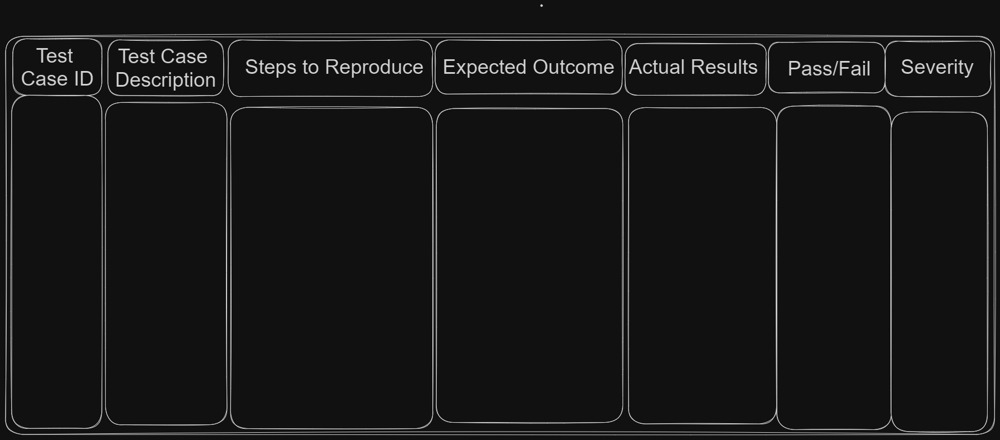
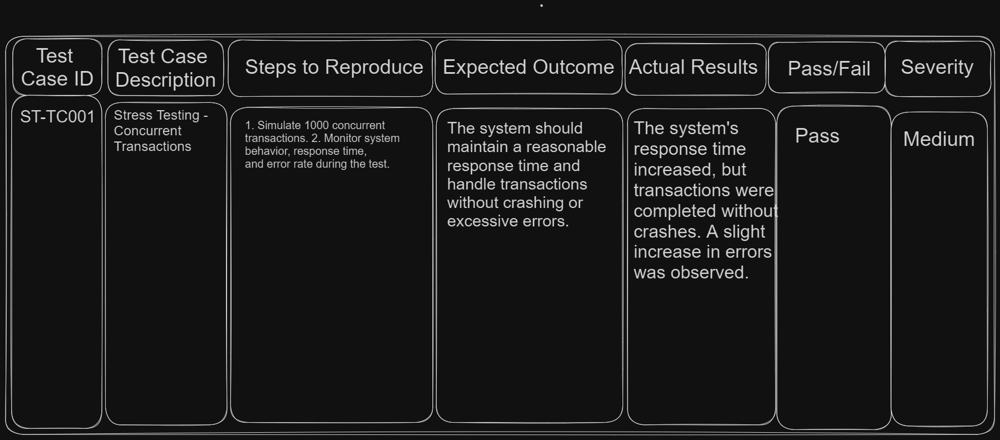
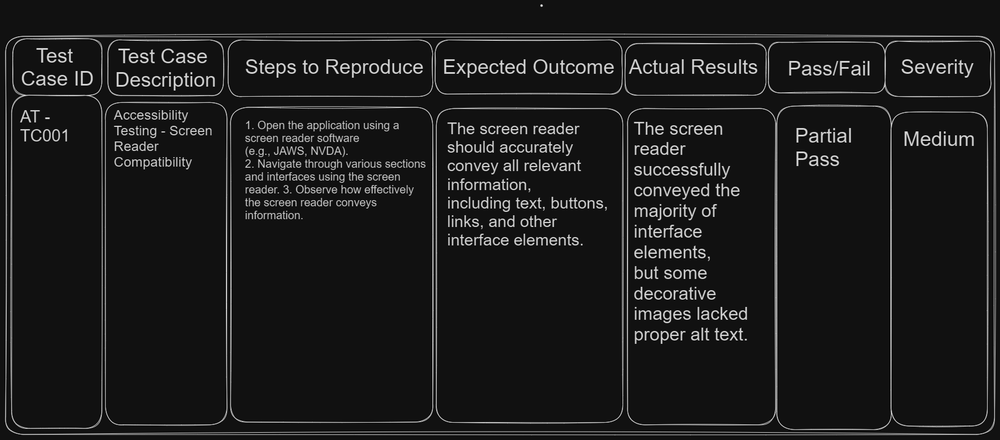
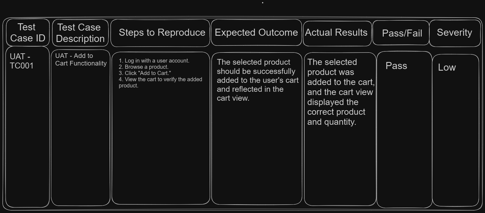
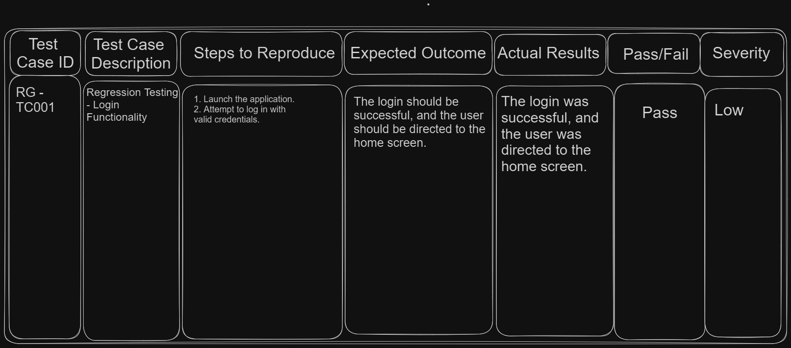

# Table of Contents

- [QA Basics](#qa-Basics)
  - [What is Quality Assurance?](#what-is-quality-assurance)
    - [What is Quality?](#what-is-quality)
    - [What is Assurance?](#what-is-assurance)
    - [Quality Assurance in Software Testing](#quality-assurance-in-software-testing)
  - [Tester Mindset](#tester-mindset)
    - [Explanation of Tester Mindset](#explanation-of-tester-mindset)
  - [Test Oracles](#test-oracles)
    - [Explanation of Test Oracles](#explanation-of-test-oracles)
    - [Types of Test Oracles](#types-of-test-oracles)
  - [Test Prioritization](#test-prioritization)
    - [Explanation of Test Prioritization](#explanation-of-test-prioritization)
    - [Test Prioritization Techniques](#test-prioritization-techniques)
  - [Black Box vs Gray Box vs White Box Testing](#black-box-vs-gray-box-vs-white-box-testing)
    - [Differences and similarities](#differences-and-similarities)
    - [When to apply each approach](#when-to-apply-each-approach)
  - [Test Case Design](#test-case-design)
    - [Writing effective test cases](#writing-effective-test-cases)
    - [Test case structure and format](#test-case-structure-and-format)
    - [Test case prioritization](#test-case-prioritization)
- [Software Development Life Cycle (SDLC) Software Development Process](#sdlc)
  - [Software Development Approaches Comparison](#software-development-approaches-comparison)
    - [Waterfall Model](#waterfall-model)
    - [V Model](#v-model)
    - [Agile Methodologies](#agile-methodologies)
      - [Scrum Framework](#scrum-framework)
- [Manual Testing](#manual-testing)
    - [Test Planning](#test-planning)
    - [TDD - Test Driven Development](#tdd)
    - [Test Cases and Scenarios](#test-cases-and-scenarios)
    - [Reporting](#reporting)
      - [Test Summary Report](#test-summary-report)
      - [Test Case Report](#test-case-report)
        - [Test Case vs Test Case Report](#test-case-vs-test-case-report)
      - [Defect Report (Bug Report)](#defect-report)
      - [Regression Test Report](#regression-test-report)
      - [Test Execution Log](#test-execution-log)
    - [Compatibility](#compatibility)
    - [Verification and Validation](#verification-and-validation)
- [Non Functional Testing](#non-functional-testing)
  - [Accessibility testing](#accessibility-testing)
  - [Load and Performance Testing](#load-and-performance-testing)
    - [JMeter](#jmeter)
      - [Introduction](#introduction)
      - [Prerequisites](#prerequisites)
      - [Installation](#installation)
      - [Getting Started](#getting-started)
        - [Creating Your First Test Plan](#creating-your-first-test-plan)
        - [Configuring Test Elements](#configuring-test-elements)
        - [Running a Test](#running-a-test)
      - [Analyzing Test Results](#analyzing-test-results)
    - [Lighthouse](#lighthouse)
  - [Security Testing](#security-testing)
    - [Authentication authorization](#authentication-authorization)
    - [Vulnerability Scanning](#vulnerability-scanning)
    - [OWASP](#owasp)
    - [Attack vectors](#attack-vectors)
    - [Secrets Management](#secrets-management)
- [Testing Techniques](#testing-techniques)
    - [Non-Functional Testing](#non-functional-testing)
      - [Load Testing](#load-testing)
      - [Performance Testing](#performance-testing)
      - [Stress Testing](#stress-testing)
      - [Security Testing](#security-testing)
      - [Accessibility Testing](#accessibility-testing)
    - [Functional Testing](#functional-testing)
      - [User Acceptance Testing (UAT)](#uat)
      - [Exploratory Testing](#exploratory-testing)
      - [Smoke and Sanity Testing](#smoke-and-sanity-testing)
      - [Regression Testing](#regression-testing)
      - [Unit Testing](#unit-testing)
      - [E2E testing](#e2e-testing)
      - [Integration Testing](#integration-testing)
- [Automated Testing](#automated-testing)
  - [Frontend automation](#frontend-automation)
    - [Basic Introduction](#basic-introduction)
      - [HTML/CSS/JavaScript Basics](#html-css-javascript-basics)
      - [Browser DevTools](#browser-devtools)
      - [Caching](#caching)
      - [SSR vs CSR vs SSG](#ssr-csr-ssg)
      - [SWAs, PWAs and Jamstack](#swas-pwas-jamstack)
      - [Responsive vs adaptive](#responsive-vs-adaptive)
  - [Backend Automation](#backend-automation)
    - [Postman](#postman)
  - [Jest](#jest)
    - [Introduction to Jest](#introduction-to-jest)
      - [What is Jest?](#what-is-jest)
      - [Why Unit Testing is Important and why is not so important?](#why-unit-testing-is-important-and-why-not-important)
      - [Pros and Cons using jest](#pros-and-cons-of-using-jest)
    - [Setting up Jest](#setting-up-jest)
      - [Installation](#installation)
      - [Configuration](#configuration)
      - [First Jest Test](#first-jets-test)
    - [Writing Your First Test](#writing-your-first-test)
      - [Creating Test Files](#creating-test-files)
      - [Writing Test Suites and Test Cases](#writing-test-suites-and-test-cases)
      - [Assertions in Jest](#assertions-in-jest)
    - [Running Tests](#running-tests)
      - [Using the Jest CLI](#using-the-jest-cli)
      - [Running Specific Tests](#running-specific-tests)
      - [Watching for Changes](#watching-for-changes)
    - [Matchers in Jest](#matchers-in-jest)
      - [Introduction to Matchers](#introduction-to-matchers)
      - [Common Matchers](#common-matchers)
      - [Custom Matchers](#custom-matchers)
    - [Mocking and Spies](#mocking-and-spies)
      - [Mock Functions](#mock-functions)
      - [Spying on Functions](#spying-on-functions)
      - [Mocking Modules](#mocking-modules)
    - [Testing Asynchronous Code](#testing-asynchronous-code)


# QA Basics

## What is Quality Assurance?

### What is Quality?

**Explanation:**

Quality refers to the degree of excellence or superiority of a product or service. In software, quality encompasses factors such as reliability, performance, security, usability, and meeting customer expectations.

**Key Concepts:**

- **Fitness for Purpose**: A product meets its intended purpose effectively.
- **Conformance to Requirements**: The product adheres to specified requirements.
- **Customer Satisfaction**: The product satisfies customer needs and expectations.
- **Continuous Improvement**: Ongoing efforts to enhance quality.

### What is Assurance?

**Explanation:**

Assurance involves building confidence that a product will meet its quality objectives. It involves proactive activities that help prevent defects and issues.

**Key Concepts:**

- **Preventive Activities**: Measures taken to avoid defects in the first place.
- **Process Adherence**: Ensuring that processes are followed consistently.
- **Standardization**: Implementing best practices and standards.
- **Early Detection**: Identifying and addressing issues early in the development lifecycle.

### Quality Assurance in Software Testing

**Explanation:**

Quality Assurance (QA) in software testing involves processes and practices that ensure software products meet specified quality standards.

**Key Concepts:**

- **Process Improvement**: Identifying areas for process enhancement.
- **Standardization**: Establishing testing standards and guidelines.
- **Test Planning**: Developing comprehensive test plans.
- **Metrics and Measurement**: Using metrics to assess and improve quality.


**Resources:**

- [Article: What is Quality Assurance(QA)?](https://www.guru99.com/all-about-quality-assurance.html)
- [Video: What Does a QA Engineer Actually Do?](https://www.youtube.com/watch?v=jVv3A3t2DBI)

**Tasks**

- [1 Task](../tasks/testing/manualTesting/README.md)

## Tester Mindset

### Explanation of Tester Mindset

**Explanation:**
The "Tester Mindset" refers to the collection of qualities, attitudes, and approaches that make a software tester effective in their role. It involves a combination of critical thinking, attention to detail, empathy, curiosity, and a commitment to delivering high-quality software.

**Key Qualities and Attitudes:**

- **Critical Thinking**: Testers analyze requirements, design, and code critically to identify potential defects.
- **Attention to Detail**: Testers meticulously scrutinize each component to catch even minor issues.
- **Empathy**: Testers put themselves in users' shoes to understand their needs and expectations.
- **Curiosity**: Testers are naturally curious, always exploring the application to uncover defects.
- **Open-Mindedness**: Testers approach testing with an open mind, avoiding assumptions.
- **Communication Skills**: Testers effectively communicate issues to developers and stakeholders.
- **Problem-Solving**: Testers have a knack for finding solutions to complex issues.
- **Continuous Learning**: Testers stay updated with technology trends and testing methodologies.

**Resources:**

- [Video: Explanation of Tester Mindset](https://www.youtube.com/watch?v=BCuZfdbWnl8)

## Test Oracles

### Explanation of Test Oracles

**Explanation:**

A **test oracle** is a mechanism or principle used to determine the expected outcome of a test case. It's a benchmark against which the actual output of a software component or system is compared to determine if the behavior is correct or not.

**Key Concepts:**

- **Expected Behavior**: Test oracles establish what the system's behavior should be under specific conditions.
- **Validation**: Test oracles are used to validate the correctness of outputs.
- **Manual and Automated**: Oracles can be manual (human judgment) or automated (defined by rules).
- **Dynamic and Static**: Dynamic oracles evaluate runtime behavior, while static oracles analyze code or documentation.
- **Challenges**: Creating accurate and reliable test oracles can be challenging.

**Resources:**

[Video: Explanation of Test Oracles](https://www.youtube.com/watch?v=DR22zNNetp0)

### Types of Test Oracles

**Explanation:**

There are different types of test oracles used to determine expected outcomes based on different criteria.

**Types:**
- **Explicit Oracles**: Clearly defined expected results based on specifications.
- **Derived Oracles**: Derived from the same system or similar systems.
- **Comparative Oracles**: Compare the system under test to another system or model.
- **Stochastic Oracles**: Use statistical data to determine expected behavior.

## Test Prioritization

**Resources:**

- [Article: Test Prioritization](https://www.professionalqa.com/test-prioritization)

### Explanation of Test Prioritization

**Explanation:**

Test prioritization is the process of ordering or ranking test cases based on their importance, risks, and potential impact on the system under test. It ensures that the most critical tests are executed first, optimizing testing efforts in scenarios where time and resources are limited.

**Key Concepts:**

- **Risk Assessment**: Test prioritization considers factors like critical functionalities, user impact, and potential defects.
- **Resource Optimization**: It ensures that high-priority tests are executed within constrained resources.
- **Early Detection**: Prioritizing critical tests increases the chances of detecting showstopper issues early.
- **Test Dependencies**: Dependencies among test cases influence their order of execution.

### Test Prioritization Techniques

**Explanation:**

There are various techniques to prioritize test cases based on different criteria.

**Techniques:**

- **Risk-Based Prioritization**: Prioritize based on potential risks and their impact.
- **Requirements-Based Prioritization**: Prioritize based on critical functionalities or requirements.
- **Customer Impact Prioritization**: Prioritize based on user impact and customer needs.
- **Automated Test Impact Analysis**: Prioritize tests affected by code changes.
- **Dependency-Based Prioritization**: Prioritize tests with dependencies on other tests.

**Resources:**

- [Video: Test Prioritization Techniques](https://www.youtube.com/watch?v=drUfHG6tav8)

## Black Box vs Gray Box vs White Box Testing

**Resources:**

- [Video: Black Box vs Gray Box vs White Box Testing](https://www.youtube.com/watch?v=CPVMbZYeiF4)

### Differences and Similarities

**Explanation:**

Black box testing, gray box testing, and white box testing are three distinct testing approaches that involve different levels of access to the internal components of the software.

**Black Box Testing:**

- **Access to Code**: Testers have no knowledge of the internal code or logic.
- **Focus**: Testing is based on external behavior and functional requirements.
- **Testers Role**: Testers focus on inputs and expected outputs without knowledge of the internal implementation.
- **Similarities**: It is similar to how end-users interact with the system.

- [Article: Black Box Testin](https://www.guru99.com/black-box-testing.html)

**Gray Box Testing:**

- **Access to Code**: Testers have partial knowledge of the internal code and logic.
- **Focus**: Testing combines aspects of both black box and white box testing.
- **Testers Role**: Testers can design tests based on the understanding of internal logic to target specific areas.
- **Similarities**: It bridges the gap between black box and white box testing.

- [Article: Gray Box Testing](https://www.guru99.com/grey-box-testing.html)

**White Box Testing:**

- **Access to Code**: Testers have complete knowledge of the internal code and logic.
- **Focus**: Testing is based on code structure, paths, and logic flow.
- **Testers Role**: Testers can design tests to cover specific code paths and conditions.
- **Similarities**: It is akin to how developers analyze the code.

**Resources:**

- [Article: White Box Testing](https://www.guru99.com/white-box-testing.html)

### When to Apply Each Approach

**Explanation:**

The choice between black box, gray box, and white box testing depends on the goals of testing, the knowledge available, and the desired coverage.

**Black Box Testing:**

- Suitable for testing user interface, functional requirements, and overall system behavior.
- Used during acceptance testing, regression testing, and user-focused testing.

**Gray Box Testing:**

- Suitable for scenarios where partial knowledge of the internal logic can enhance testing.
- Used when a combination of black box and white box testing is needed.

**White Box Testing:**

- Suitable for in-depth testing of code logic, paths, and boundary conditions.
- Used during unit testing, code review, security testing, and code optimization.

## Test Case Design

### Writing Effective Test Cases

Writing effective test cases is crucial for thorough testing and accurate defect detection. Effective test cases should be clear, concise, and detailed. They need to cover various scenarios, conditions, and user interactions to ensure comprehensive testing.

**Key Points:**

- **Clear Steps**: Each test case should have a clear set of steps to execute.
- **Expected Results**: Clearly define the expected outcomes and results.
- **Coverage**: Ensure that each test case covers a specific functionality or scenario.
- **Variety**: Include positive and negative scenarios, boundary conditions, and edge cases.
- **Reusability**: Design test cases that can be reused in different test cycles.

### Test Case Structure and Format

A standardized test case structure and format make test cases consistent and easy to understand for the entire testing team. A well-structured test case includes sections such as the test case ID, description, preconditions, steps, expected results, actual results, and status.

**Key Points:**

- **Test Case ID**: A unique identifier for each test case.
- **Description**: Briefly describe the purpose of the test case.
- **Preconditions**: List any conditions that must be met before executing the test case.
- **Steps**: Outline the steps needed to execute the test case.
- **Expected Results**: Clearly state the expected outcomes after each step.
- **Actual Results**: Record the actual outcomes during test execution.
- **Status**: Indicate whether the test case passed, failed, or needs further investigation.

- 

**Resources:**

- [Article: Writing Effective Test Cases and Test Case Structure and Format](https://www.guru99.com/test-case.html)
- [Article: Test Case Design](https://www.guru99.com/software-testing-techniques.html)

### Test Case Prioritization

Test case prioritization involves determining the order in which test cases should be executed based on factors such as business impact, risk, and critical functionality. Prioritization helps ensure that the most important areas are tested first, especially when time or resources are limited.

**Key Points:**

- **Business Impact**: Identify test cases that directly impact core business processes.
- **Risk Analysis**: Assess potential risks and prioritize test cases in high-risk areas.
- **Critical Functionality**: Prioritize test cases for critical features or functionalities.
- **Dependencies**: Consider dependencies between test cases and prioritize accordingly.
- **Regression Testing**: Prioritize test cases that cover areas prone to regression.

**Resources:**

- [Video: Test Case Design](https://www.youtube.com/watch?v=NKrFLbTiBQc)

**Tasks:**

- [2 Task](../tasks/testing/manualTesting/README.md)

 
# Software Development Life Cycle (SDLC) Software Development Process

**Explanation:**

**Software Development Life Cycle (SDLC)** is a systematic and structured approach to software development that defines a set of processes or phases to guide the creation, maintenance, and management of software applications or systems. It serves as a roadmap for developers, project managers, and stakeholders to ensure that software is developed efficiently, with high quality, and according to specified requirements.


**Key Concepts:**

1. **Planning:** In this initial phase, project objectives, scope, and requirements are defined. The team outlines the project's goals, timeline, budget, and resources.
  - **Project Objectives**
  - **Scope Definition**
  - **Requirements Gathering**
  - **Project Goals and KPIs**
  - **Timeline**
  - **Budget**
  - **Resource Allocation**
  - **Risk Assessment**
  - **Stakeholder Alignment**

2. **Requirements Gathering:** The process of collecting and documenting detailed requirements from stakeholders, including users, clients, and business analysts. This phase helps in understanding what the software should do.
  - **Identifying Stakeholders**
  - **User Interviews and Surveys**
  - **Use Cases and User Stories**
  - **Business Requirements**
  - **Technical Requirements**
  - **Regulatory and Compliance Requirements**
  - **Prototyping and Mockups**
  - **Validation with Stakeholders**
  - **Requirements Documentation**
  - **Prioritization**

3. **Design:** During this phase, the software's architecture, data structures, user interface, and system components are planned and designed. It lays the foundation for actual development.
  - **System Architecture**
  - **Database Design**
  - **User Interface (UI) Design**
  - **Prototyping**
  - **Component Design**
  - **Security Design**
  - **Scalability and Performance Planning**
  - **Technical Documentation**
  - **Review and Validation**
  - **Design Sign-off**

4. **Implementation (Coding):** Developers write the actual code based on the design specifications. This phase involves coding, unit testing, and integration of software modules.
  - **Coding**
  - **Coding Standards**
  - **Version Control**
  - **Unit Testing**
  - **Integration**
  - **Code Refactoring**
  - **Error Handling and Logging**
  - **Security Measures**
  - **Performance Optimization**
  - **Documentation**
  - **Collaboration**
  - **Continuous Testing**
  - **Progress Tracking**

5. **Testing:** Comprehensive testing is performed to identify and fix defects or bugs. It includes various types of testing such as functional, integration, performance, and user acceptance testing.
  - **Test Planning**
  - **Functional Testing**
  - **Integration Testing**
  - **Performance Testing**
  - **User Acceptance Testing (UAT)**
  - **Regression Testing**
  - **Security Testing**
  - **Compatibility Testing**
  - **Usability Testing**
  - **Accessibility Testing**
  - **Defect Tracking**
  - **Test Automation**
  - **Documentation and Reporting**
  - **User Feedback**
  - **Test Completion**

6. **Deployment (Release):** Once the software passes testing and quality checks, it is deployed to production or made available to users. Deployment may involve data migration and system setup.
  - **Environment Setup**
  - **Data Migration**
  - **Release Planning**
  - **Deployment Testing**
  - **Rollout Strategy**
  - **Deployment Automation**
  - **Monitoring and Alerts**
  - **Backup and Recovery**
  - **Documentation and Release Notes**
  - **User Communication**
  - **Deployment Verification**
  - **Rollback Plan**
  - **Post-Deployment Monitoring**
  - **User Support**
  - **Feedback Collection**

7. **Maintenance and Support:** After deployment, the software requires ongoing maintenance, updates, and support to address issues, adapt to changing requirements, and ensure its continued functionality.
Monitoring and Performance Optimization: After the app's deployment, "X Company" continues to monitor its performance, availability, and user experience. This includes tracking key performance indicators (KPIs), server health, and user feedback.
  - **Issue Identification**
  - **Bug Fixing**
  - **Security Updates**
  - **Performance Tuning**
  - **Regular Updates**
  - **Compatibility Updates**
  - **User Support**
  - **Data Backup and Recovery**
  - **Documentation Updates**
  - **User Training**
  - **User Feedback Integration**
  - **Regulatory Compliance**
  - **Scalability**

**Resources:**

- [Software Development Life Cycle (SDLC) Software Development Process](https://www.guru99.com/software-development-life-cycle-tutorial.html)

## Software Development Approaches Comparison


| Aspect                        | Agile Methodologies       | Waterfall Model           | V-Model                    |
| ------------------------------| ------------------------- | ------------------------- | ---------------------------|
| **Development Process**       | Iterative and incremental | Sequential and linear     | Sequential and phased      |
| **Flexibility**               | Highly flexible           | Less flexible             | Moderate flexibility       |
| **Requirements**              | Welcomes changing requirements | Requires well-defined, stable requirements | Requires well-defined, stable requirements |
| **Customer Involvement**      | High customer involvement | Limited customer involvement until the end | Limited customer involvement until the end |
| **Phases**                    | Divided into short iterations (e.g., sprints in Scrum) | Sequential phases (requirements, design, implementation, testing, deployment) | Phases mirror development phases |
| **Adaptability**              | Easily adapts to changes  | Changes are challenging to accommodate | Can accommodate changes, but later phases may be affected |
| **Documentation**             | Minimal upfront documentation, focuses on working software | Comprehensive upfront documentation | Comprehensive upfront documentation |
| **Delivery Frequency**        | Frequent delivery of incremental value | Final product delivered at the end | Incremental delivery, integration testing throughout |
| **Risk Management**           | Identifies and mitigates risks throughout the project | Risks often discovered late in the project | Risk identification and mitigation at each stage |
| **Project Size**              | Suitable for various project sizes | Better suited for smaller, well-defined projects | Suitable for medium to large projects |
| **Popularity**                | Widely used in dynamic environments | Historically used in more traditional environments | Common in certain regulated industries |

### Waterfall Model

**Explanation:**

The Waterfall Model is a traditional and linear approach to software development that is characterized by a sequential flow of phases. Each phase must be completed before the next one begins, and there is typically little room for revisiting earlier phases once they are completed. The Waterfall Model is often used for projects with well-defined and stable requirements.

*Here are the key phases in the Waterfall Model:*

- **Requirements:** The project starts with a comprehensive analysis of requirements gathered from stakeholders. These requirements are documented in detail, specifying what the software must do.

- **Design:** In this phase, the software's architecture and design are planned. This includes defining system components, data structures, user interfaces, and the overall system structure.

- **Implementation (Coding):** Developers write the actual code based on the design specifications. This phase involves coding, unit testing, and the integration of software modules.

- **Testing:** Comprehensive testing is performed to identify and fix defects or bugs. It includes various types of testing such as functional, integration, performance, and user acceptance testing.

- **Deployment (Release):** Once the software passes testing and quality checks, it is deployed to production or made available to users. Deployment may involve data migration and system setup.

- **Maintenance and Support:** After deployment, the software requires ongoing maintenance, updates, and support to address issues, adapt to changing requirements, and ensure its continued functionality.

**Key Concepts:**

- **Sequential Phases:** The Waterfall Model follows a strict sequence of phases, and each phase must be completed before the next one begins. This sequential approach provides structure but can be less adaptable to changes.

- **Documentation:** The Waterfall Model emphasizes comprehensive documentation at each phase. Detailed documentation helps ensure that requirements are met and that the software functions as intended.

- **Limited Customer Involvement:** Customer involvement is often limited until the end of the project when the software is deployed. Changes to requirements late in the process can be costly and challenging to accommodate.

- **Phased Deliverables:** The Waterfall Model typically results in large, phased deliverables. Users may not see a working version of the software until late in the project.

- **Risk Management:** Risks and issues are often discovered later in the project lifecycle, which can lead to challenges in addressing them. Risk management is less continuous compared to Agile approaches.

**Resources:**

- [Article: Waterfall Model](https://www.guru99.com/what-is-sdlc-or-waterfall-model.html)

### V Model

**Explanation:**

The V Model, also known as the Validation and Verification Model, is a software development and testing framework that is an extension of the Waterfall Model. It emphasizes the importance of verification and validation activities throughout the entire software development lifecycle.

The V Model is called so because its diagrammatic representation resembles the letter "V," with two parallel branches of development and testing activities that converge at the bottom, representing validation and verification.

**Here are the key aspects of the V Model:**

- **Requirements Phase:** The project begins with the gathering and analysis of requirements, similar to the Waterfall Model.

- **Design Phase:** Once requirements are defined, the design phase plans how the software will fulfill those requirements. System architecture, component design, and detailed design are specified.

- **Coding Phase:** Developers write the actual code based on the design specifications. This phase involves coding, unit testing, and integration of software modules, similar to the Waterfall Model.

- **Verification (Left Side of the "V"):** After each development phase (requirements, design, and coding), corresponding verification activities are performed. Verification ensures that each phase meets its objectives and adheres to the defined standards. This includes activities like reviews, inspections, and walkthroughs.

- **Validation (Right Side of the "V"):** Once the software is fully coded and integrated, the validation phase begins. Validation verifies that the software, as a whole, meets the customer's requirements and functions correctly. This includes various types of testing, such as system testing, integration testing, and user acceptance testing.

- **Parallel Development and Testing:** Development and testing activities are conducted in parallel, with verification activities on one side of the "V" and validation activities on the other. This dual-track approach helps catch defects and issues early in the development process.

**Key Concepts:**

- **Early Defect Detection: **The V Model places a strong emphasis on early defect detection and prevention through verification activities. This reduces the cost and effort required to fix issues later in the project.

- **Phased Testing:** Different levels of testing (unit testing, integration testing, system testing, and user acceptance testing) are planned and executed in parallel with corresponding development phases.

- **Traceability:** The V Model promotes traceability, ensuring that each requirement is traced to a corresponding design and testing activity. This helps maintain alignment with customer requirements.

- **Iterative Feedback:** Feedback from validation activities can lead to adjustments in the development process, allowing for iterative improvements.

- **Structured and Documented:** Like the Waterfall Model, the V Model places importance on documentation and thorough planning.

**Resources:**

- [V Model](https://www.guru99.com/v-model-software-testing.html)

### Agile Methodologies

**Explanation:**

Agile Methodologies are a set of principles and practices for software development that prioritize flexibility, collaboration, and customer-centricity. Unlike traditional approaches that follow a rigid, linear path (such as the Waterfall model), Agile Methodologies embrace change and allow teams to adapt to evolving requirements throughout the development process.

Methodologies provide a guiding philosophy and principles for how development teams should approach their work, while models define the specific steps and sequence of activities within a project. Agile is a methodology that embraces flexibility and collaboration, while Waterfall is a model that follows a sequential, phased approach to development.

*Agile Methodologies value:*

- **Customer Collaboration:** Agile encourages continuous collaboration with customers and stakeholders. Their feedback is actively sought and incorporated into the development process.

- **Iterative Development:** Projects are divided into small, manageable iterations or sprints. Teams work on a subset of features during each iteration, allowing for frequent releases and feedback loops.

- **Self-Organizing Teams:** Agile teams are typically cross-functional and self-organizing. Team members have the autonomy to make decisions and adapt to changing priorities.

- **Continuous Improvement:** Agile promotes a culture of continuous improvement. Teams reflect on their processes and outcomes and make adjustments to enhance efficiency and quality.

- **Adaptability:** Agile teams embrace change and are responsive to shifting priorities or customer needs. This adaptability is a core principle of Agile development.

**Key Concepts:**

- **Scrum:** Scrum is one of the most popular Agile frameworks. It prescribes roles (e.g., Scrum Master, Product Owner, Development Team), events (e.g., Daily Standup, Sprint Planning, Sprint Review), and artifacts (e.g., Product Backlog, Sprint Backlog) to structure the development process.

- **Kanban:** Kanban is another Agile framework that focuses on visualizing work, limiting work in progress, and optimizing workflow. It uses boards with columns to represent stages of work and emphasizes the pull principle.

- **User Stories:** Agile teams often use user stories to capture user requirements in a simple, user-focused format. User stories consist of a short narrative, acceptance criteria, and a priority.

- **Backlog:** The backlog is a prioritized list of features, user stories, or tasks to be completed. It serves as a dynamic document that guides development.

- **Sprint:** In Scrum and some other Agile approaches, a sprint is a time-boxed development iteration, usually lasting two to four weeks. Sprints result in potentially shippable increments of the product.

**Resources:**

- [Agile Methodologies](https://www.guru99.com/agile-scrum-extreme-testing.html#:~:text=The%20Agile%20software%20development%20methodology%20is%20one%20of,improvement%2C%20team%20collaboration%2C%20evolutionary%20development%2C%20and%20early%20delivery.)

#### Scrum Framework

**Explanation:**

Scrum is one of the most widely adopted Agile frameworks for software development. It provides a structured approach to managing complex projects while emphasizing adaptability, collaboration, and customer-centricity.

**Key Concepts:**

1. **Roles:**

- **Scrum Master:** The Scrum Master is a servant-leader who facilitates the Scrum process. They ensure that the Scrum team understands and follows Scrum principles, remove impediments, and facilitate collaboration.

- **Product Owner:** The Product Owner represents the customer or stakeholder and is responsible for defining and prioritizing the product backlog. They make decisions about what features to build and the order in which they should be developed.

- **Development Team:** The Development Team consists of cross-functional members who are responsible for delivering the increments of the product during each sprint. They self-organize and determine how to complete the work.

2. **Artifacts:**

- **Product Backlog:** The Product Backlog is a prioritized list of features, user stories, or tasks that represent the work to be done on the project. It is dynamic and evolves as new requirements and feedback emerge.

- **Sprint Backlog:** The Sprint Backlog is a subset of items from the Product Backlog that the Development Team commits to completing during a sprint. It represents the work to be done in the current iteration.

- **Increment:** The Increment is the product's potentially shippable product increment at the end of each sprint. It should be in a usable state and demonstrate tangible progress.

3. **Events:**

- **Sprint:** A Sprint is a time-boxed development iteration, typically lasting two to four weeks. During a sprint, the Development Team works on a set of items from the Sprint Backlog with the goal of delivering a potentially shippable increment.

- **Sprint Planning:** At the beginning of each sprint, the Scrum Team holds a Sprint Planning meeting. During this meeting, they determine what work to take from the Product Backlog and create a detailed Sprint Backlog.

- **Daily Scrum (Daily Standup):** The Daily Scrum is a short daily meeting where team members discuss their progress, challenges, and plans for the day. It helps ensure alignment and quick issue resolution.

- **Sprint Review:** At the end of each sprint, the Scrum Team holds a Sprint Review meeting to demonstrate the work completed during the sprint. Stakeholders provide feedback, and the Product Owner reviews the Product Backlog.

- **Sprint Retrospective:** After the Sprint Review, the team conducts a Sprint Retrospective to reflect on the sprint's performance. They discuss what went well, what could be improved, and identify action items for the next sprint.

**Resources:**

- [Article: Scrum Framework](https://www.guru99.com/scrum-testing-beginner-guide.html)
- [Jira](https://www.atlassian.com/software/jira)

**Tasks:**

- [5 Task](../tasks/testing/manualTesting/README.md)

# Manual Testing

## Test Planning

**Explanation:**

Test planning involves defining the overall testing strategy for a project, outlining objectives, scope, resources, schedules, and risks.

**Key Concepts:**

- **Objectives**: Define testing goals and expectations.
- **Scope**: Specify what will be tested and what won't.
- **Test Strategy**: Decide on test levels, types, techniques, and environments.
- **Test Schedule**: Allocate timeframes for testing activities.
- **Risk Assessment**: Identify potential risks and mitigation strategies.

**Resources:**

- [Article: Test Planning](https://www.guru99.com/what-everybody-ought-to-know-about-test-planing.html)

**Example**

- [Test Planning](../tasks/testing/manualTesting/README.md)

## Test-Driven Development (TDD)

**Explanation:**

Test-Driven Development (TDD) is a software development practice where tests are written before the actual code, promoting improved code quality and test coverage.

**Key Concepts:**

- **Red-Green-Refactor Cycle**: Write failing test (red), make it pass (green), and refactor.
- **Unit Testing**: Write unit tests for small code units.
- **Continuous Integration**: Frequent integration and automated testing.
- **Benefits**: Reduces defects, enhances design, and supports refactoring.

**Resources:**

- [Article: Test-Driven Development (TDD)](https://www.guru99.com/test-driven-development.html)

## Test Cases and Scenarios

**Explanation:**

Test cases and scenarios define the steps, conditions, and expected outcomes for testing different aspects of a software application.

| Feature           | Test Cases                                 | Test Scenarios                              |
|-------------------|-------------------------------------------|--------------------------------------------|
| Definition        | Specific, detailed steps to validate a single functionality or condition. | A sequence or collection of related test cases to validate a specific user workflow or area of the application. |
| Scope             | Focused on testing individual features or aspects of the application. | Broader in scope, encompassing multiple test cases to validate end-to-end workflows or use cases. |
| Granularity       | Highly detailed and specific, often with step-by-step instructions. | Higher-level view, focusing on user interactions and flow. |
| Independence      | Can be executed independently of each other. | Often dependent on the execution order, as they represent user journeys or workflows. |
| Objective         | Verify specific functionalities, inputs, and conditions. | Validate the overall behavior, usability, and reliability of a specific part of the application. |
| Example           | Test case for login: Entering valid username and password. | Test scenario for checkout: Adding items to cart, entering shipping info, selecting payment, and confirming the order. |
| Coverage          | Used to ensure thorough testing of individual features. | Used to ensure comprehensive testing of a specific area or user journey within the application. |
| Traceability     | Typically linked to specific test conditions or acceptance criteria. | Often linked to high-level user requirements or use cases. |
| Purpose          | Identify and validate specific defects or issues within a feature. | Validate end-to-end functionality and user experience for a particular part of the application. |

**Key Concepts:**

- **Test Case**: A set of inputs, actions, and expected results.
- **Test Scenario**: A sequence of related test cases.
- **Coverage**: Ensure comprehensive coverage of functionalities.
- **Traceability**: Link test cases to requirements for validation.

**Resources:**

- [Article: Test Cases and Scenarios](https://www.guru99.com/test-case-vs-test-scenario.html)
- [Video: Crash Course Test Cases and Scenarios](https://www.youtube.com/watch?v=St9Ep9gnvRw)

**Example**

- [Test Cases and Scenarios](../tasks/testing/manualTesting/README.md)

## Reporting

**Explanation:**

Reporting involves documenting and communicating testing activities, results, and defects to stakeholders.

**Key Concepts:**

- **Test Execution Reports**: Summarize test runs and outcomes.
- **Defect Reports**: Document defects found during testing.
- **Status Updates**: Keep stakeholders informed about progress.
- **Metrics and KPIs**: Measure testing effectiveness.

**Resources:**

- [Article: Reporting](https://www.guru99.com/defect-management-process.html)

### Test Summary Report

**Explanation**

You don't typically include a complete Test Summary Report within individual test cases. The Test Summary Report is a separate document that provides an overall summary of the testing activities, results, and findings across multiple test cases or an entire testing phase or project. It serves as a high-level summary and evaluation of the testing effort and its outcomes.

|-----------------------------------------------------------------|
|                       Test Summary Report                       |
|-----------------------------------------------------------------|
| Project Name:           | [Project Name]                         |
|-----------------------------------------------------------------|
| Test Phase:             | [e.g., System Testing]                 |
|-----------------------------------------------------------------|
| Test Start Date:        | [Start Date]                           |
|-----------------------------------------------------------------|
| Test End Date:          | [End Date]                             |
|-----------------------------------------------------------------|
| Total Test Cases:       | [Total Test Cases Executed]            |
|-----------------------------------------------------------------|
| Passed Test Cases:      | [Number of Test Cases Passed]          |
|-----------------------------------------------------------------|
| Failed Test Cases:      | [Number of Test Cases Failed]          |
|-----------------------------------------------------------------|
| Test Execution Environment:                                        |
| - Operating System:     | [Operating System]                     |
| - Browsers:             | [List of Browsers]                     |
| - Other Relevant Info:  | [Additional Environment Info]           |
|-----------------------------------------------------------------|
| Summary of Findings:                                             |
| - Total Defects Found: | [Total Number of Defects Found]         |
| - Severity Levels:                                                |
|   - High:               | [Number of High Severity Defects]       |
|   - Medium:             | [Number of Medium Severity Defects]     |
|   - Low:                | [Number of Low Severity Defects]        |
|-----------------------------------------------------------------|
| Test Summary:                                                     |
| - Overall Status:       | [Overall Test Status (Pass/Fail)] |
| - Comments/Notes:      | [General Comments or Notes]            |
|-----------------------------------------------------------------|
| Test Lead/Manager:      | [Name of Test Lead/Manager]            |
|-----------------------------------------------------------------|
| Date of Report:         | [Date of Report]                       |
|-----------------------------------------------------------------|

### Test Case Report

A Test Case Report, also known as a Test Execution Report, provides an overview of the status and results of executed test cases.

|-------------------------------------------------------------------|
|                      Test Case Execution Report                    |
|-------------------------------------------------------------------|
| Project Name:          | [Project Name]                              |
|-------------------------------------------------------------------|
| Test Phase:            | [System Testing]                      |
|-------------------------------------------------------------------|
| Test Start Date:       | [Start Date]                                |
|-------------------------------------------------------------------|
| Test End Date:         | [End Date]                                  |
|-------------------------------------------------------------------|
| Total Test Cases:      | [Total Test Cases Executed]                 |
|-------------------------------------------------------------------|
| Passed Test Cases:     | [Number of Test Cases Passed]               |
|-------------------------------------------------------------------|
| Failed Test Cases:     | [Number of Test Cases Failed]               |
|-------------------------------------------------------------------|
| Test Environment:                                                   |
| - Operating System:    | [Operating System]                          |
| - Browsers:            | [List of Browsers]                          |
| - Other Relevant Info: | [Additional Environment Info]                |
|-------------------------------------------------------------------|
| Test Summary:                                                      |
| - Overall Status:      | [Overall Test Status (Pass/Fail)]    |
| - Comments/Notes:     | [General Comments or Notes]                 |
|-------------------------------------------------------------------|
| Test Case Details:                                                 |
|-------------------------------------------------------------------|
| Test Case ID | Test Description            | Status  | Comments/Notes |
|--------------|-----------------------------|---------|-----------------|
| TC-001       | Verify User Login           | PASS    | No issues found |
| TC-002       | Verify Product Search       | PASS    | No issues found |
| TC-003       | Submit Order Form           | FAIL    | Issue with form |
| TC-004       | Update User Profile         | PASS    | No issues found |
| ...          | ...                         | ...     | ...             |
|-------------------------------------------------------------------|

#### Test Case vs Test Case Report

1. **Test Case**:

   - **Purpose**: A test case is a detailed document that outlines the specific steps to be followed, the conditions to be met, and the expected outcomes to verify a particular aspect of a software application.
   
   - **Content**: Test cases include information such as test case ID, test steps, input data, expected results, preconditions, and postconditions. They are used by testers to execute tests systematically.

   - **Focus**: Test cases are focused on the specific actions to be taken during testing and the expected results, helping testers ensure that the software functions correctly.

2. **Test Case Report** (or Test Execution Report):

   - **Purpose**: A Test Case Report, often referred to as a Test Execution Report, provides an overview of the status and results of executed test cases for a specific testing phase or cycle.

   - **Content**: Test Case Reports typically include project details, test phase information, test execution dates, the total number of test cases executed, the number of test cases passed and failed, details about the test environment, an overall summary of the testing effort (example overall status, comments), and a list of individual test cases with their execution statuses and any specific comments.

   - **Focus**: Test Case Reports focus on summarizing the outcomes of testing efforts and providing stakeholders with a high-level view of the testing progress and results. They help project managers, stakeholders, and team members assess the quality and readiness of the software.

### Defect Report (Bug Report)

Defect Reports are separate documents used to document and track issues or defects identified during testing. You do not typically write Defect Reports (Bug Reports) within individual test cases.

- Defect Reports document issues found during testing, which may result from executing test cases. These reports are used to communicate the problems to developers or the relevant team responsible for fixing the defects.

|----------------------------------------------------------------|
|                        Defect Report                            |
|----------------------------------------------------------------|
| Defect ID:             | BUG-001                                 |
|----------------------------------------------------------------|
| Date Reported:         | 2023-09-16                             |
|----------------------------------------------------------------|
| Project:               | [Project Name]                         |
|----------------------------------------------------------------|
| Module/Component:      | [Module or Component Affected]         |
|----------------------------------------------------------------|
| Severity:              | [e.g., High, Medium, Low]              |
|----------------------------------------------------------------|
| Priority:              | [e.g., High, Medium, Low]              |
|----------------------------------------------------------------|
| Reported By:           | [Name of Tester]                       |
|----------------------------------------------------------------|
| Summary:               | [Brief Description of the Defect]      |
|----------------------------------------------------------------|
| Description:           | [Detailed Description of the Defect]   |
|----------------------------------------------------------------|
| Steps to Reproduce:    | [List of Steps to Reproduce the Issue] |
|----------------------------------------------------------------|
| Expected Behavior:     | [What Was Expected]                    |
|----------------------------------------------------------------|
| Actual Behavior:       | [What Actually Happened]               |
|----------------------------------------------------------------|
| Attachments:           | [Screenshots, Log Files, etc.]         |
|----------------------------------------------------------------|
| Environment:           | [Testing Environment Details]           |
|----------------------------------------------------------------|
| Status:                | [Open, In Progress, Closed, Reopened]   |
|----------------------------------------------------------------|
| Assigned To:           | [Developer's Name or ID]               |
|----------------------------------------------------------------|
| Date Fixed:            | [Date when Fixed, if applicable]       |
|----------------------------------------------------------------|
| Comments/Notes:        | [Additional Information or Notes]       |
|----------------------------------------------------------------|


### Regression Test Report

Regression testing is performed to ensure that new code changes, updates, or enhancements to a software application do not introduce new defects or negatively impact existing functionality. 

- **Regression Test Report:** Once you have executed the regression tests, you compile the results into a Regression Test Report. This report summarizes the status of all the regression test cases, indicating which ones passed, which ones failed, and any other relevant information about the testing process.

- Managing and executing regression tests can be challenging, and there may be a need to modernize testing practices. Here are some mitigation strategies:

1. **Continuous Integration/Continuous Deployment (CI/CD):** Implement CI/CD pipelines to automate the build, testing, and deployment process. This ensures that regression tests are run automatically with each code change, reducing the risk of regression issues going unnoticed.

2. **Version Control and Code Reviews: Implement robust version control practices and code review processes to catch issues early in the development cycle, reducing the likelihood of introducing regressions.**

| Test Case ID | Test Case Description             | Test Steps                              | Expected Result  | Actual Result    | Status  |
|--------------|----------------------------------|-----------------------------------------|------------------|------------------|---------|
| TC001        | User Login                        | 1. Navigate to the login page.          | User should be   | User logged in   | Passed  |
|              |                                  | 2. Enter valid credentials.             | logged in        | successfully     |         |
|              |                                  | 3. Click the "Login" button.           |                  |                  |         |
|--------------|----------------------------------|-----------------------------------------|------------------|------------------|---------|
| TC002        | User Registration                 | 1. Navigate to the registration page.   | User should be   | User registered   | Passed  |
|              |                                  | 2. Fill in valid user details.          | registered       | successfully     |         |
|              |                                  | 3. Click the "Register" button.        |                  |                  |         |
|--------------|----------------------------------|-----------------------------------------|------------------|------------------|---------|
| TC003        | Product Search                    | 1. Enter a product name in the search   | Product details  | Product details  | Passed  |
|              |                                  |    bar.                                | should be        | displayed        |         |
|              |                                  | 2. Click the "Search" button.           | displayed        | as expected      |         |
|--------------|----------------------------------|-----------------------------------------|------------------|------------------|---------|
| TC004        | Add to Cart                       | 1. Select a product.                    | Product should be| Product added to  | Passed  |
|              |                                  | 2. Click "Add to Cart" button.          | added to cart    | cart             |         |
|              |                                  | 3. Verify the cart contents.            |                  |                  |         |
|--------------|----------------------------------|-----------------------------------------|------------------|------------------|---------|
| TC005        | Checkout                          | 1. Go to the shopping cart.             | Checkout process | Checkout process | Passed  |
|              |                                  | 2. Click "Checkout" button.             | should be        | completed        |         |
|              |                                  | 3. Provide shipping and payment info.    | completed        | as expected      |         |
|              |                                  | 4. Confirm the order.                   |                  |                  |         |
|--------------|----------------------------------|-----------------------------------------|------------------|------------------|---------|

### Test Execution Log

Test logs provide a detailed record of the test execution process, including what was tested, how it was tested, and the results of the tests.

|----------------------------------------------------------------|
|                           Test Log                              |
|----------------------------------------------------------------|
| Test Case ID:            | TC-001                                 |
|----------------------------------------------------------------|
| Test Execution Date:     | 2023-09-16                             |
|----------------------------------------------------------------|
| Test Environment:        | Windows 10                             |
|                         | Chrome v100.0.0                        |
|----------------------------------------------------------------|
| Test Data:               | Input: Username - "testuser"           |
|                         |        Password - "password123"        |
|----------------------------------------------------------------|
| Steps                   | Expected Result       | Actual Result  |
|-------------------------|-----------------------|-----------------|
| 1. Open application     | Home page displayed   | Home page displayed |
|----------------------------------------------------------------|
| 2. Enter credentials   | Login successful      | Login successful    |
|----------------------------------------------------------------|
| 3. Navigate to profile  | Profile page loaded   | Profile page loaded |
|----------------------------------------------------------------|
| 4. Update profile info  | Profile updated       | Profile updated    |
|----------------------------------------------------------------|
| 5. Log out              | Logged out            | Logged out         |
|----------------------------------------------------------------|
| Overall Result:         | PASS                                  |
|----------------------------------------------------------------|
| Comments/Notes:         | No issues encountered during testing.   |
|----------------------------------------------------------------|

### Compatibility

**Explanation:**

Compatibility testing ensures that software works across various environments, browsers, devices, and operating systems.

| Environment         | Browsers        | Devices                 | Operating Systems  |
|---------------------|-----------------|-------------------------|--------------------|
| Windows         | Chrome, Firefox, Edge | Desktop, Laptop         | Windows            |
| macOS               | Safari, Chrome  | MacBook, iMac           | macOS              |
| Android             | Chrome, Firefox, Edge | Smartphone, Tablet      | Android            |
| iOS                 | Safari, Chrome  | iPhone, iPad            | iOS                |
| Linux               | Firefox, Chrome | Desktop, Server        | Linux distributions|

**Key Concepts:**

- **Browser Compatibility**: Test across different web browsers.
- **Device Compatibility**: Test on various devices (desktop, mobile, tablet).
- **Operating System Compatibility**: Test on different OS versions.
- **Challenges**: Address differences in rendering, functionality, and performance.

**Resources:**

- [Article: Compatibility Testing](https://www.guru99.com/compatibility-testing.html)

## Verification and Validation

**Explanation:**

Verification ensures that a software product meets specified requirements, while validation ensures it meets user expectations.

**Key Concepts:**

- **Verification**: Confirm software meets design specifications.
- **Validation**: Ensure software meets user needs and intended use.
- **Quality Assurance and Testing**: Part of V&V process.
- **Validation Testing**: Focus on user acceptance and satisfaction.

**Resources:**

- [Article: Verification and Validation](https://www.guru99.com/verification-v-s-validation-in-a-software-testing.html)

# Non Functional Testing

## Accessibility Testing

**Explanation:**

Accessibility testing ensures that a software application is usable by individuals with disabilities, making it inclusive for all users. It involves evaluating the application's design, content, and functionality to ensure compliance with accessibility standards and guidelines.

**Key Concepts:**

- **WCAG Guidelines**: Web Content Accessibility Guidelines provide criteria for accessible design.
- **Types of Disabilities**: Visual, auditory, cognitive, and motor impairments.
- **Tools**: Automated accessibility testing tools and manual assessments.
- **Benefits**: Ensures equal access, avoids legal issues, and improves user satisfaction.

**Resources:**

- [Article: Accessibility Testing](https://www.geeksforgeeks.org/software-testing-accessibility-testing/)

## Load and Performance Testing

**Explanation:**

Load and Performance Testing assess the responsiveness, stability, and scalability of a software application under different levels of load and stress. It helps identify bottlenecks, analyze response times, and ensure optimal performance.

**Key Concepts:**

- **Load Testing**: Evaluates application behavior under expected load.
- **Stress Testing**: Tests application behavior under extreme load conditions.
- **Performance Testing**: Ensures application meets response time requirements.
- **Metrics**: Response time, throughput, resource utilization, and error rates.
- **Purpose**: Identify performance issues before application launch.

**Resources:**

### JMeter

#### Introduction

Apache JMeter is a powerful tool for testing the performance and load of web applications, databases, and more. It simulates multiple users sending requests to a target server, allowing you to measure how well your system handles the load.

#### Prerequisites

Before you get started, make sure you have the following prerequisites:

- **Java**: JMeter is a Java application, so you need to have Java installed on your system. You can download it from [Oracle's website](https://www.oracle.com/java/technologies/javase-downloads.html).

- **JMeter**: Download the latest version of JMeter from the [official website](https://jmeter.apache.org/download_jmeter.cgi).

#### Installation

## Installation

1. **Install Java**: Follow the installation instructions for Java on your operating system.

2. **Install JMeter**:
   - Download the JMeter zip or tar.gz file from the JMeter website.
   - Extract the downloaded file to a directory of your choice.

3. **Verify Installation**:
   - Open a terminal or command prompt and navigate to the JMeter directory.
   - Run `./bin/jmeter.sh` (Linux/macOS) or `.\bin\jmeter.bat` (Windows).
   - If JMeter opens without errors, the installation is successful.

#### Getting Started

##### Creating Your First Test Plan

1. Open JMeter by running the `jmeter.sh` (Linux/macOS) or `jmeter.bat` (Windows) script in the JMeter bin directory.

2. In JMeter, create a new test plan:
   - Go to **File > New** to create a new test plan.
   - Right-click on the test plan and select **Add > Threads (Users) > Thread Group** to add a Thread Group.
   
3. Configure the Thread Group:
   - Set the number of threads (virtual users) and the loop count.
   - Add test elements like HTTP requests, samplers, and listeners to your test plan.

##### Configuring Test Elements

JMeter test plans consist of various test elements. Some commonly used elements are:

- **HTTP Request**: To send HTTP requests to a web server.
- **Listeners**: To view and analyze test results.
- **Assertions**: To define pass/fail criteria for responses.
- **Timers**: To introduce delays between requests.

##### Running a Test

1. Save your test plan: **File > Save Test Plan As**.

2. Start the test:
   - Click the green "Play" button in the toolbar.
   - JMeter will start running your test plan.

#### Analyzing Test Results

1. JMeter provides various listeners (e.g., View Results Tree, Summary Report) to view and analyze test results.
   
2. After the test run, you can generate and save test reports for further analysis.

**Resources:**

- [Site: JMeter Documentation](https://jmeter.apache.org/usermanual/index.html)

### Lighthouse

**Explanation:**

Lighthouse is an open-source tool from Google that assesses the quality and performance of web pages. It generates reports and scores based on various performance and accessibility metrics.

**Key Features:**

- **Performance Metrics**: Measures loading times, resource usage, and more.
- **Accessibility Checks**: Identifies issues that impact users with disabilities.
- **Progressive Web App Audit**: Evaluates adherence to PWA principles.
- **Best Practices Audit**: Assesses adherence to web development best practices.

**Resources:**

- [Site: Lighthouse](https://github.com/GoogleChrome/lighthouse/)

## Security Testing

**Explanation:**

Security Testing ensures that a software application is resilient to security threats and vulnerabilities. It aims to identify and mitigate potential security risks to protect data and systems.

**Key Concepts:**

- **Authentication:** Verifying user identity.
- **Authorization:** Controlling user access to resources.
- **Vulnerability Scanning:** Automated detection of security weaknesses.
- **OWASP:** Common web application security risks.
- **Attack Vectors:** Paths for exploiting vulnerabilities.
- **Secrets Management:** Secure handling of sensitive information.

**Resources:**

- [Article: What is Security Testing?](https://www.guru99.com/what-is-security-testing.html)

### Authentication authorization

**Explanation:**

Authentication verifies the identity of users or systems, while authorization controls access to specific resources or functionalities based on user roles and permissions.

**Key Concepts:**

- **Authentication Factors:** Knowledge-based (passwords), possession-based (tokens), and biometrics.
- **Authorization Models:** Role-based, attribute-based, and policy-based.
- **Single Sign-On (SSO):** Allows access to multiple systems with a single login.
- **Least Privilege Principle:** Users get the minimum access necessary.
- **Authentication vs. Authorization:** Distinct but interconnected security aspects.

**Resources:**

- [Article: Authentication vs. Authorization](https://auth0.com/docs/get-started/identity-fundamentals/authentication-and-authorization)

### Vulnerability Scanning

**Explanation:**

Vulnerability Scanning involves automated tools that scan an application or network for known security vulnerabilities, misconfigurations, and weaknesses.

**Key Concepts:**

- **Automated Scanning:** Tools like Nessus, OpenVAS, and Qualys.
- **CVE Database:** Common Vulnerabilities and Exposures for tracking known vulnerabilities.
- **Continuous Scanning:** Regular scans to identify new vulnerabilities.
- **Penetration Testing:** Manual testing to validate findings and identify unknown issues.

**Resources:**

### OWASP

**Explanation:**

The OWASP is a list of the most critical web application security risks. It serves as a guide for developers, testers, and security professionals to prioritize security measures.

**Key Risks:**

- Injection Attacks
- Broken Authentication
- Sensitive Data Exposure
- XML External Entities (XXE)
- Broken Access Control
- Security Misconfigurations
- Cross-Site Scripting (XSS)
- Insecure Deserialization
- Using Components with Known Vulnerabilities
- Insufficient Logging & Monitoring

**Resources:**

- [10 Most Common Web Security Vulnerabilities](https://www.guru99.com/web-security-vulnerabilities.html)

### Attack vectors

**Explanation:**

Attack Vectors are specific paths or techniques used by malicious actors to exploit vulnerabilities and compromise a system's security.

**Key Concepts:**

- **SQL Injection:** Manipulating SQL queries to access or modify data.
- **Cross-Site Request Forgery (CSRF):** Forcing users to perform actions without their consent.
- **Cross-Site Scripting (XSS):** Injecting malicious scripts into web pages viewed by other users.
- **Phishing:** Deceptive techniques to trick users into revealing sensitive information.
- **Zero-Day Exploits:** Attacks targeting newly discovered vulnerabilities.

**Resources:**

- [What is an attack vector?](https://www.cloudflare.com/en-gb/learning/security/glossary/attack-vector/)

### Secrets Management

**Explanation:**

Secrets Management involves securely storing, accessing, and distributing sensitive information such as passwords, API keys, and cryptographic keys.

**Key Concepts:**

- **Key Management:** Safeguarding encryption keys used to protect data.
- **Vaults and Key Stores:** Secure storage solutions for secrets.
- **Rotation and Expiry:** Regularly changing secrets to minimize exposure.
- **Access Control:** Restricting who can access and modify secrets.
- **Audit Trails:** Monitoring and recording access to secrets.

**Resources:**

- [Secrets Management: Tools & Best Practice](https://snyk.io/learn/secrets-management/)

# Testing Techniques

**Resources:**

- [Article: Testing Techniques](https://www.guru99.com/non-functional-testing.html)

### Non-Functional Testing

#### Load Testing

**Explanation:**

Load testing involves assessing a system's performance under specific load conditions to determine its capacity and capability to handle a certain volume of users or transactions.

**Key Concepts:**

- **Load**: The amount of work a system is subjected to during testing.
- **Objective**: Identify performance bottlenecks, measure response times, and assess system scalability.
- **Types**: Concurrent users, transactions, or data volume are typically tested.
- **Tools**: Load testing tools like JMeter, Gatling, or locust can automate load simulations.


**Resources:**

- [Article: Load Testing](https://loadninja.com/load-testing/)

**Tasks**

- [3 Task](../tasks/testing/manualTesting/README.md)

**Tools**

- [Link to try Load Testing](https://loadfocus.com/)

#### Performance Testing

**Explanation:**

Performance testing evaluates a system's responsiveness, stability, and overall performance under varying conditions, ensuring it meets user expectations.

**Key Concepts:**

- **Types**: Includes load testing, stress testing, and endurance testing.
- **Metrics**: Key performance indicators (KPIs) such as response time, throughput, and resource utilization.
- **Benefits**: Identifies performance bottlenecks, enables capacity planning, and ensures user satisfaction.


**Resources:**

- [Article: Performance Testing](https://www.guru99.com/performance-testing.html)

**Tasks**

- [4 Task](../tasks/testing/manualTesting/README.md)

**Tools**

- [Link to try Performance Testing](https://loader.io/)
- [Link to GTmetrix](https://gtmetrix.com/)

#### Stress Testing

**Explanation:**

Stress testing evaluates a system's behavior under extreme conditions that exceed its normal operational capacity. It helps identify breaking points and potential failures.

**Key Concepts:**

- **Types**: Overloading system resources, such as memory, CPU, or network.
- **Purpose**: Determine system stability and reliability under high stress.
- **Challenges**: Requires careful planning to avoid damaging the system during testing.



**Resources:**

- [Article: Stress Testing](https://www.guru99.com/stress-testing-tutorial.html)
- [Article: What is a DoS Attack and How to DoS Someone [Ping of Death]](https://www.guru99.com/ultimate-guide-to-dos-attacks.html)

**Tasks**

- [5 Task](../tasks/testing/manualTesting/README.md)

#### Security Testing

**Explanation:**

Security testing assesses a system's vulnerabilities and weaknesses to identify potential security risks and protect against unauthorized access, data breaches, and other threats.

**Key Concepts:**

- **Types**: Includes penetration testing, vulnerability scanning, and security code reviews.
- **Objectives**: Identify vulnerabilities, assess risk levels, and ensure compliance with security standards.
- **Criticality**: Security testing is crucial to protect sensitive data and user privacy.


**Resources:**

- [Article: Security Testing](https://www.guru99.com/what-is-security-testing.html)
- [Article: SQL Injection Tutorial](https://www.guru99.com/learn-sql-injection-with-practical-example.html)

**Tasks**

- [6 Task](../tasks/testing/manualTesting/README.md)

#### Accessibility Testing

**Explanation:**

Accessibility testing ensures that a software application is usable by people with disabilities, conforming to accessibility standards and guidelines.

**Key Concepts:**

- **Types**: Involves testing for visual, auditory, cognitive, and motor impairments.
- **Guidelines**: Compliance with standards like WCAG (Web Content Accessibility Guidelines).
- **Importance**: Accessibility testing promotes inclusivity and ensures software is usable by all users.



**Resources:**

- [Article: Accessibility Testing](https://www.guru99.com/accessibility-testing.html)

**Tasks**

- [7 Task](../tasks/testing/manualTesting/README.md)

### Functional Testing

#### User Acceptance Testing (UAT)

**Explanation:**

User Acceptance Testing (UAT) involves testing a software application from the user's perspective to ensure it meets business requirements and is ready for release.

**Key Concepts:**

- **Users**: Performed by end-users or stakeholders.
- **Test Cases**: Based on real-world scenarios and workflows.
- **Validation**: Verifies if the application meets business objectives.
- **Sign-off**: Successful UAT signifies readiness for production.



**Resources:**

- [Article: User Acceptance Testing](https://www.guru99.com/user-acceptance-testing.html)
- [Video: User Acceptance Testing (UAT)](https://www.youtube.com/watch?v=F5xaiKyJDNQ)

**Tasks**

- [8 Task](../tasks/testing/manualTesting/README.md)

#### Exploratory Testing

**Explanation:**

Exploratory Testing involves simultaneous test design and execution, where testers explore the software dynamically without predefined test cases.

**Key Concepts:**

- **Approach**: Relies on tester's creativity, intuition, and domain knowledge.
- **Flexibility**: Adaptation to evolving requirements.
- **Bug Hunting**: Efficient for finding defects in an unscripted manner.
- **Documentation**: Testers document actions, observations, and defects found.


**Resources:**

- [Article: Exploratory Testing](https://www.guru99.com/exploratory-testing.html)
- [Video: Exploratory Testing](https://www.youtube.com/watch?v=aX42Qr0eeuI&t=658s)

**Tasks**

- [9 Task](../tasks/testing/manualTesting/README.md)

#### Smoke and Sanity Testing

**Explanation:**

Smoke Testing and Sanity Testing are quick checks performed to determine whether a build is stable and if further testing can proceed.

**Smoke Testing:**

- **Objective**: Checks basic functionalities to validate if the build is stable.
- **Timing**: Performed after each new build.
- **Coverage**: Focuses on essential functionalities.

**Sanity Testing:**

- **Objective**: Ensures recent changes didn't adversely affect the system.
- **Timing**: After specific changes, fixes, or patches.
- **Coverage**: Focuses on recent modifications.

*Sanity Testing:*


*Smoke Testing:*


**Resources:**

- [Article: Sanity Testing Vs. Smoke Testing – Difference Between Them](https://www.guru99.com/smoke-sanity-testing.html)
- [Video: Sanity Testing Vs. Smoke Testing](https://www.youtube.com/watch?v=u5gC4bD9cCQ)

**Tasks**

- [10 Task](../tasks/testing/manualTesting/README.md)

#### Regression Testing

**Explanation:**

Regression Testing verifies that new code changes do not negatively impact existing functionalities.

**Key Concepts:**

- **Purpose**: Prevent introduction of new defects while modifying code.
- **Scope**: Re-tests affected areas and related functionalities.
- **Automated Regression**: Automated tests for efficient testing.

- 

**Resources:**

- [Article: Regression Testing](https://www.guru99.com/regression-testing.html)
- [Video: Regression Testing](https://www.youtube.com/watch?v=AWX6WvYktwk&t=71s)

**Tasks**

[11 Task](../tasks/testing/manualTesting/README.md)

#### Unit Testing

**Explanation:**
Unit Testing involves testing individual units or components of a software application in isolation to ensure their correctness.

**Key Concepts:**
- **Focus**: Tests small code units like functions, methods, or classes.
- **Isolation**: Isolates units from the rest of the application.
- **Automation**: Often automated for efficient execution.
- **White Box Testing**: Requires knowledge of code internals.


**Resources:**

- [Unit Testing](https://www.guru99.com/unit-testing-guide.html)

#### End-to-End (E2E) Testing

**Explanation:**
End-to-End (E2E) Testing validates the complete flow of an application, simulating real user scenarios.

**Key Concepts:**
- **Scope**: Verifies interactions between different system components.
- **User Journeys**: Tests complete user workflows.
- **Real-World Scenarios**: Simulates how users interact with the application.
- **Challenges**: Requires testing across various layers and technologies.


**Resources:**

- [End-to-End (E2E) Testing](https://www.guru99.com/end-to-end-testing.html)

#### Integration Testing

**Explanation:**

Integration Testing ensures that different components or modules of a software application work together seamlessly.

**Key Concepts:**

- **Interaction**: Validates interactions between integrated components.
- **Functionalities**: Tests combined functionalities of integrated parts.
- **Top-Down and Bottom-Up**: Different integration strategies.
- **Dependencies**: Identifies defects at the component interface level.


**Resources:**

- [Integration Testing](https://www.guru99.com/integration-testing.html)

# Automated Testing

Automated testing is a crucial practice in software development that involves using tools and scripts to automatically test software applications. This ensures that the software functions correctly, performs well, and meets its intended requirements. Automated testing helps identify bugs, regressions, and performance issues early in the development process.

## Frontend automation

Frontend automation focuses on automating tasks related to the user interface (UI) and the frontend of web applications. It streamlines development processes, enhances code quality, and improves the overall user experience.

### Basic Introduction

#### HTML/CSS/JavaScript Basics

**Resources:**

*html*
- [HTML](../frontend/html/README.md)

*css*
- [CSS](../frontend/css/README.md)

*JavaScript*
- [JavaScript](../languages/javaScript/README.md)

#### Browser DevTools

**Explanation:**

Browser DevTools are integrated developer tools available in web browsers. They provide a set of features that aid in web development and debugging.

**Key Concepts:**

- **Inspecting and Debugging:** DevTools allow developers to inspect HTML, CSS, and JavaScript, making it easier to identify and fix issues in the frontend code.
- **Network Monitoring:** You can monitor network requests and responses to optimize performance and troubleshoot issues.
- **Performance Profiling:** DevTools offer performance profiling tools to identify bottlenecks and improve website speed.

**Resources:**

- [Article: What are browser developer tools?](https://developer.mozilla.org/en-US/docs/Learn/Common_questions/Tools_and_setup/What_are_browser_developer_tools)

#### Caching

**Explanation:**

Caching ensures that the resources downloaded once are reused instead of doing a fresh fetch again. It is useful for increasing subsequent page load speed by reusing cached images, fonts, and other static assets. Caching should not be typically done on dynamic content. For example list of posts or comments. As part of the testing strategy, both caching and cache invalidation (not getting stale dynamic content) needs to be tested.

**Key Concepts:**

- **Browser Cache:** Browsers can cache static assets like images and stylesheets, improving page load times.
- **Content Delivery Networks (CDNs):** CDNs use caching to distribute content globally, reducing server load and improving content delivery.
- **Cache Control Headers:** Developers can control caching behavior using HTTP headers to set expiration times for cached resources.

**Resources:**

- [Video: Caching - Simply Explained](https://www.youtube.com/watch?v=6FyXURRVmR0)

#### SSR vs CSR vs SSG

**Explanation:**

These are different approaches to rendering web content that impact how web applications are built and perform.

**Key Concepts:**

- **Server-Side Rendering (SSR):** In SSR, web pages are rendered on the server and sent to the client as fully formed HTML. This can improve initial page load times and SEO.


- **Advantages of Server-Side Rendering (SSR):**

1. **Improved SEO:** One of the primary advantages of SSR is its positive impact on search engine optimization (SEO). Search engines can easily crawl and index content that is rendered on the server side. This can lead to better search engine rankings and increased discoverability of your web pages.

2. **Faster Initial Page Load:** SSR can result in faster initial page loads compared to Client-Side Rendering (CSR) or Single-Page Applications (SPAs). When the server sends a fully rendered HTML page to the client, users can see and interact with the content sooner.

3. **Accessibility:** SSR can improve accessibility by ensuring that the HTML content is available to assistive technologies and can be easily parsed by screen readers. This can help make your web application more inclusive.

4. **Security:** SSR can enhance security by keeping sensitive logic and data on the server, reducing the risk of exposing critical information to the client-side code.

**Disadvantages of Server-Side Rendering (SSR):**

1. **Increased server load:** Since the server is responsible for rendering HTML, it can put a strain on the server’s resources, resulting in slower response times and increased server costs.

2. **Increased complexity:** Since the server is responsible for rendering HTML, it requires more server-side code, which can be more challenging to maintain and debug. 

- **Client-Side Rendering (CSR):** CSR relies on rendering content in the user's browser using JavaScript, enabling dynamic updates without full page reloads.


**Advantages of Client-Side Rendering (CSR):**

1. **Faster Subsequent Page Loads:** Once the initial page is loaded, subsequent interactions within the application can be very fast because only data needs to be fetched from the server, and the client can 
handle rendering and updates. This can provide a more responsive user experience.

2. **Reduced Server Load:** CSR offloads a significant portion of the rendering work to the client, which can lead to reduced server load and lower hosting costs, especially when dealing with a large number of users.

**Disadvantages of Client-Side Rendering (CSR):**

1. **SEO:** One of the primary limitations of CSR is its impact on search engine optimization (SEO). Search engines primarily crawl HTML content, and CSR applications rely heavily on JavaScript to render content. This can lead to indexing issues, resulting in lower search rankings.

2. **Performance on slower devices or connections:** CSR can be more resource-intensive, which can lead to slower load times and poorer performance on slower devices or connections. This can result in a less optimal user experience, particularly for users on mobile devices or in areas with poor internet connectivity.

3. **Accessibility:** CSR can pose challenges for web accessibility. Since much of the content is rendered dynamically on the client-side, it can be difficult for screen readers and other assistive technologies to navigate and interpret the content.

4. **Initial load times:** While CSR can offer a more dynamic user experience once the page has loaded, the initial load time can be slower. This can result in a poor user experience, particularly for users who are not on high-speed connections.


- **Static Site Generation (SSG):** SSG pre-generates web pages at build time, offering the benefits of both SSR and CSR for performance and security.


**Advantages of Static Site Generation (SSG):**

1. **Performance:** SSG generates pre-rendered HTML files, which can be served quickly to users. This results in fast page load times, benefiting both user experience and search engine rankings. There is no need for server-side processing or database queries during runtime.

2. **Scalability:** Static sites are highly scalable because they can be served from a Content Delivery Network (CDN) with minimal server resources. Handling high traffic loads becomes more manageable and cost-effective.

3. **SEO Benefits:** SSG is SEO-friendly by default. Search engines can easily crawl and index static HTML pages, leading to better search engine rankings.

4. **Reliability:** With no server-side code execution, static sites are more reliable and less prone to server crashes or downtime.

**Disadvantages of Static Site Generation (SSG):**

1. **Limited Interactivity:** Static sites are less suitable for highly interactive web applications that require real-time data updates or user-generated content. Complex client-side functionality often requires additional JavaScript.

2. **Content Updates:** Making real-time content updates can be challenging with SSG. When content changes frequently, regenerating and redeploying the entire site can become cumbersome.

3. **Dynamic Data:** SSG is not well-suited for sites that heavily rely on dynamic data, such as e-commerce websites with real-time inventory tracking or forums with user-generated content.

4. **Build Time:** Generating static sites can take longer, especially for large websites with a lot of content. This can impact development speed and time-to-market.

5. **Complexity for Large Sites:** For very large websites with thousands of pages, managing content and build processes can become complex.

**Resources:**

- [Article: Comparison of CSR, SSR, SSG](https://dev.to/pahanperera/visual-explanation-and-comparison-of-csr-ssr-ssg-and-isr-34ea)

#### SPAs(SWAs), PWAs and Jamstack

**Explanation:**

These are modern architectural patterns and approaches in web development.

**Key Concepts:**

**Single-Page Applications (SPAs):** SPAs load a single HTML page and dynamically update content, providing a smooth user experience.
**Progressive Web Apps (PWAs):** PWAs offer app-like experiences on the web, including offline access and push notifications.
**Jamstack:** Jamstack is an architectural pattern that decouples the frontend and backend, using APIs and pre-rendering for performance and security.

**Resources:**

- [Article: SPAs(SWAs)](https://www.staticapps.org/)
- [Article: PWAs and Jamstack](https://bejamas.io/blog/jamstack-pwa/)

#### Responsive vs adaptive

**Explanation:**

These design approaches ensure optimal user experiences on various devices.

**Key Concepts:**

**Responsive Design:** Responsive web design adapts to different screen sizes and orientations using flexible layouts and media queries, providing a consistent user experience.
**Adaptive Design:** Adaptive design involves creating multiple versions of a website tailored to specific device categories, ensuring specialized user experiences.

**Resources:**

- [Article: Responsive web design vs. adaptive](https://www.wix.com/blog/responsive-vs-adaptive-design)

## Jest

### Introduction to Jest

#### What is Jest?

Jest is a JavaScript testing framework that makes it easy to write and run unit tests for your code. It was developed by Facebook and is widely used in the JavaScript community.

#### Why Unit Testing is Important and why is not so important?

Unit testing is essential in software development as it helps ensure the correctness of individual components or units of code. However, it's also important to recognize that not all code requires unit testing. Understanding when to write unit tests and when not to is crucial for efficient development.

#### Pros and Cons using jest

**Pros of Using Jest**

- **Easy Setup**: Jest provides a straightforward setup process, making it accessible for beginners.
- **Powerful Matchers**: It offers a wide range of built-in matchers for making assertions in your tests.
- **Snapshot Testing**: Jest supports snapshot testing, which simplifies testing of UI components.
- **Mocking and Spying**: Jest provides robust mocking and spying capabilities for functions and modules.
- **Great Documentation**: Jest's documentation is comprehensive and user-friendly, making it easier to get started.

**Cons of Using Jest**

- **Large Bundle Size**: Jest can add some size to your bundle, which may be a concern in certain scenarios.
- **Learning Curve**: While Jest is beginner-friendly, mastering all its features may take some time.
- **Limited to JavaScript/TypeScript**: Jest is primarily designed for JavaScript and TypeScript, which may not be suitable for projects in other languages.
- **Integration Tests**: For complex integration tests, Jest may not be the best choice, and other tools like Cypress may be more appropriate.

### Setting up Jest

Before setting up Jest, ensure that you have the following prerequisites in place:

- **Node.js**: Jest requires Node.js to run. You can download and install Node.js from the [official website](https://nodejs.org/).

- **npm or pnpm**: npm (Node Package Manager) or pnpm (Fast, disk space efficient package manager) is needed to manage dependencies and install Jest. npm comes bundled with Node.js, while you can install pnpm separately if you prefer:

To install pnpm globally:
```bash
 npm install -g pnpm
```

### Installation

Once you have Node.js and npm (or pnpm) set up, you can proceed with installing Jest as a development dependency in your project. Here's how to do it with npm:

```bash
npm install --save-dev jest
```

Here's how to do it with npm:

```bash
pnpm add --save-dev jest
```

### Configuration

Jest allows you to configure various aspects of your testing environment through a `jest.config.js` file or by using command-line options. Configuration can include specifying test file patterns, setting up reporters, and defining custom setup and teardown scripts. Creating a Jest configuration tailored to your project's needs is essential for efficient testing.

*jest.config.js example*
```js
export default {
  // Indicates which files should be considered for testing.
  testMatch: ["**/__tests__/**/*.js?(x)", "**/?(*.)+(spec|test).js?(x)"],

  // A list of directories to search for custom matchers.
  setupFilesAfterEnv: ["<rootDir>/jest.setup.js"],

  // An array of file extensions your modules use.
  moduleFileExtensions: ["js", "json", "jsx", "node"],

  // The test environment that will be used for testing.
  testEnvironment: "jsdom",

  // Transform files with Babel to enable ES6+ support.
  transform: {
    "^.+\\.js?$": "babel-jest",
  },
};
```

- `testMatch`: Specifies the file patterns that Jest will consider for testing. In this example, it includes files in the `__tests__` directory and files with `.spec.js` or `.test.js` extensions.
- `setupFilesAfterEnv`: An array of setup files that will be executed before running the tests. You can use this to set up custom matchers or other test-related configurations.
- `moduleFileExtensions`: Defines the file extensions that Jest should look for when resolving modules. This configuration ensures that Jest can handle files with these extensions.
- `testEnvironment`: Specifies the environment in which your tests will run. In this example, it's set to jsdom, which simulates a browser-like environment for testing JavaScript code.
- `transform`: Configures how Jest should transform files before running tests. In this case, it uses `babel-jest` to transform JavaScript files, enabling ES6+ support.

*Example package.json for Jest Scripts*
```json
{
  "name": "your-project",
  "version": "1.0.0",
  "description": "Your project description",
  "scripts": {
    "test": "jest"
  },
  "devDependencies": {
    "jest": "29.6"
  }
}
```

*flags to customize how Jest runs your tests*

1. **Test Files:** You can specify one or more patterns to match test files. 

```bash
jest -- my-test-file.test.js
```

2. **Test Suites:** You can run specific test suites by providing their names using the `--testNamePattern`.

```bash
jest -- --testNamePattern="my specific test suite"
```

3. **Running Tests in Parallel:** You can enable parallel test execution using the `--runInBand`.

```bash
jest -- --runInBand
```

4. **Watch Mode:** To run Jest in watch mode, where it watches for file changes and re-runs tests automatically, you can use the `--watch`.

```bash
jest -- --watch
```

5. **Coverage Reporting:** You can generate and view code coverage reports using the `--coverage`.

```bash
jest -- --coverage
```

6. **Filter by Tags:** If you use test tags or labels, you can filter tests by tags using the `--testPathPattern`.

```bash
jest -- --testPathPattern="tags"
```

7. Verbose Output: For more detailed output during testing, you can use the `--verbose`.

```bash
jest -- --verbose
```

### First Jest Test

After installing Jest and configuring it, you're ready to write your first test. Jest test files typically have a `.test.js` or `.spec.js` extension and are placed in a folder called `__tests__`. In your test file, you'll define test suites using `describe` and individual test cases using `it` or `test`.

```js
// myFunction.js
/**
 * Adds two numbers together.
 *
 * @param {number} a - The first number to be added.
 * @param {number} b - The second number to be added.
 * @returns {number} The result of adding `a` and `b`.
 * @throws {Error} If either `a` or `b` is not a number.
 */
export function add(a, b) {
  if (typeof a !== 'number' || typeof b !== 'number') {
    throw new Error('Both arguments must be numbers');
  }
  return a + b;
}
```
```js
/**
 * @jest-environment jsdom
 */

// __tests__/myFunction.test.js
import { add } from '../myFunction';

describe('add function', () => {
  it('should add two numbers correctly', () => {
    expect(add(1, 2)).toBe(3);
  });

  it('should handle negative numbers', () => {
    expect(add(-1, 2)).toBe(1);
  });

  it('should return NaN for non-numeric input', () => {
    expect(add('hello', 2)).toBeNaN();
  });
});
```

### Writing Your First Test

#### Creating Test Files

Before you can start testing your code, you need a dedicated place for your test code. Learn how to create test files and organize your test suite in a way that makes it easy to maintain and run your tests.

#### Writing Test Suites and Test Cases

Tests in Jest are organized into test suites and test cases. Discover how to structure your tests effectively using `describe` and `it` (or `test`) blocks. We'll show you how to group related tests and write clear and concise test case descriptions.

#### Assertions in Jest

Assertions are at the core of testing. You'll learn how to use Jest's built-in assertion functions to make statements about your code's behavior. We'll cover common assertions like `expect`, `toBe`, `toEqual`, and more, helping you validate your code's correctness.

### Running Tests

###

###

###

###