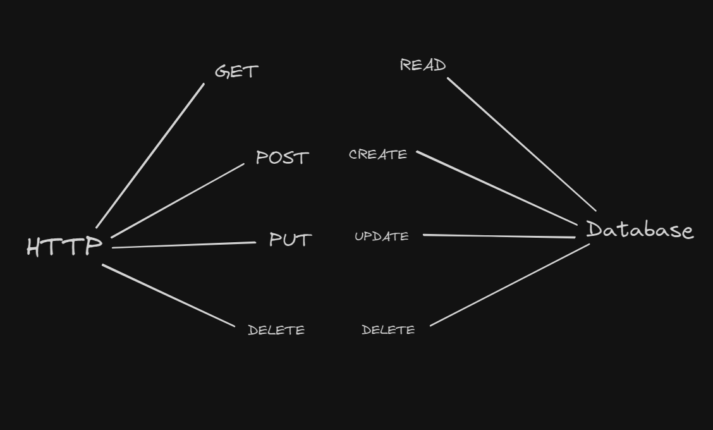
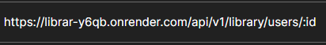
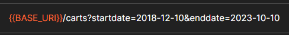
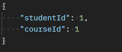
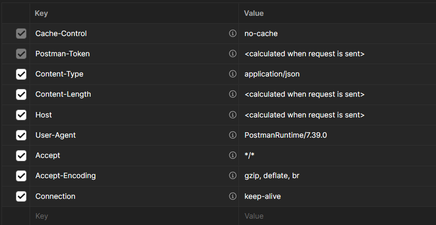

<!-- markdownlint-disable MD033 -->
# Content of Table

- [Postman](#postman)
- [Types of Requests](#types-of-requests)
- [Collections](#collections)
- [Environments](#environments)
- [Data Manipulation and Dynamic Generation](#data-manipulation-and-dynamic-generation)
- [Scripts](#scripts)

## Postman

**Explanation:**

Tool that developers and testers use to send requests to and receive responses from an API. It's used to test, document APIs.

## Types of Requests

<details>
    <summary>Overview:</summary>

1. **HTTP Requests:** Postman can send various types of HTTP requests like `GET`, `POST`, `DELETE`, `PUT`, `PATCH`, `HEAD`, `OPTIONS`. Each request can have multiple `parameters`, `headers`, `body` content.

    <details>
       <summary>Syntax:</summary>

    - *Example of URL:*

    ```text
    {protocol}://{domain/IP}:{port}/{resource}/{subresource}/{path_variable}?{query_key}={value}&{another_key}={value}
    ```

    - *Example of Request:*

    ```js
    POST /users HTTP/1.1
    Host: jsonplaceholder.typicode.com
    Content-Type: application/json

    {
    "name": "Vardenis",
    "username": "Pavardenis",
    "email": "Vardenis.Pavardenis@example.com"
    }
    ```

    - *Example of Response:*

    ```json
    {
        "id": 11,
        "name": "Vardenis",
        "username": "Pavardenis",
        "email": "Vardenis.Pavardenis@example.com"
    }
    ```

    </details>

    <details>
       <summary>Examples:</summary>

    **HTTP requests vs DB requests:**

    

    **Example of request responses creation:**

    1. Create New Request (`GET`, `POST`, `PUT`, `PATCH`, `DELETE`)
    2. Set Up the Request:
        - Type: `GET`
        - URL: `https://jsonplaceholder.typicode.com/users/1`
    3. Send the Request:
        - Click "Send".
    4. Save the Response Example:
        - Click "Save Response".
        - Nameing can be "Get User Response" or 200 OK or other status code.

    **Path Variables:**

    

    **Query Params:**

    

    **Body:**

    

    **Header:**

    

    </details>

2. **WebSocket Requests:** Establish a persistent, **full-duplex - No polling is required server and client can send information with minimum overhead(delay)** communication channel between the client and server. Useful for real-time applications like chat, live updates, and gaming.

3. **Socket.IO Requests:** A library that enables real-time, bidirectional, and event-based communication between web clients and servers. It abstracts WebSocket and provides additional features like automatic reconnection and broadcasting.

4. **GraphQL Requests:** A query language for APIs that allows clients to request exactly the data they need.

</details>

## Collections

<details>
    <summary>Overview:</summary>

1. **Collections:** A collection allows you to group individual requests together. These collections can be run together as a series of requests, in a specified sequence.
    - **Folders:** Folders within a collection allow you to organize your requests.

</details>

## Environments

<details>
    <summary>Overview:</summary>

1. **Environments:** Environments in Postman are key-value pairs of variables. These variables can be used in request URLs, headers, body data, and test scripts. Environments can be `Global`, `Local`, or specific to a `Collection`.

2. **Types of Environments:**
    - **Global Environment:** Variables that are accessible across all collections and requests.
    - **Local Environment:** Variables that are specific to a single request or collection.
    - **Collection-Specific Environment:** Variables that are specific to a particular collection.

</details>

## Data Manipulation and Dynamic Generation

<details>
    <summary>Overview:</summary>

1. **Generating Data Dynamically:**

    **Explanation:**

    You can also use pre-request scripts to generate built-in dynamic variables to generate random data for your requests.

    <details>
       <summary>Syntax:</summary>

    ```json
    {
        "random": "{{$randomSomething}}"
    }
    ```

    </details>

    <details>
       <summary>Examples:</summary>

    ```json
    {
      "id": "{{$randomInt}}",
      "name": "{{$randomFullName}}",
      "email": "{{$randomEmail}}",
      "address": "{{$randomStreetAddress}}",
      "city": "{{$randomCity}}",
      "country": "{{$randomCountry}}"
    }
    ```

    </details>

2. **set(), get(), unset() methods:**

    **Explanation:**

    These are specific methods provided by Postman that allow you to manipulate scope variables. They are often used within pre-request scripts and tests, and can be used in conjunction with dynamically generated data.

    <details>
       <summary>Syntax:</summary>

    ```js
    // Set a variable in the Environment, Global, Collection scopes in Pre-request Script and sometimes in Post-response 
    pm.[SCOPE].set("variable_key", variable_value);

    // Get the variable from the Environment, Global, Collection scopes in Test Script (Post-response)
    let value = pm.[SCOPE].get("variable_key");

    // Delete variable from Environment, Global, Collection scopes in Test Script (Post-response)
    pm.[SCOPE].unset("variable_key");
    ```

    </details>

    <details>
       <summary>Examples:</summary>

    ```js
        // Parse the response body
        let response = pm.response.json();

        // Extract the id from the response
        let id = response.id;

        // Set a variable in the environment scope
        pm.environment.set("userId", id);

        // Get the variable from the environment scope
        let userId = pm.environment.get("userId");

        // Unset the variable from the environment scope 
        pm.environment.unset("userId");
    ```

    </details>

</details>

## Scripts

**Explanation:**

Scripts in Postman allow you to automate tasks and add dynamic behavior to your requests. There are two main types of scripts in Postman: Pre-request Scripts and Post-request Scripts. Additionally, Postman can be used for Unit and Integration Testing, and there are various strategies for integrating Postman with other tools.

- Scripts in Postman are written in JavaScript.
- They can manipulate data, set environment variables, and control the flow of requests.
- Enhance the functionality of your API testing and automation workflows.

<details>
  <summary>Overview:</summary>

1. **Pre-request Scripts:**

    **Explanation:**

    <details>
       <summary>Overview:</summary>

    - Pre-request scripts are executed before the request is sent.

    - They can be used to set or modify environment variables.

    - Useful for generating dynamic data or performing setup tasks.

    - Methods used: `pm.environment.set()`, `pm.environment.get()`, `pm.environment.unset()`

    </details>

    <details>
       <summary>Syntax:</summary>

    ```js
    // Set a variable in the Environment, Global, Collection scopes in Pre-request Script and sometimes in Post-response 
    pm.[SCOPE].set("variable_key", variable_value);

    // Get the variable from the Environment, Global, Collection scopes in Test Script (Post-response)
    let value = pm.[SCOPE].get("variable_key");

    // Delete variable from Environment, Global, Collection scopes in Test Script (Post-response)
    pm.[SCOPE].unset("variable_key");
    ```

    </details>

    <details>
       <summary>Examples:</summary>

    ```js
    // Set a default password
    pm.environment.set("password", "P@ssw0rd");

    let username = 'User' + Math.random().toString(36).substring(2, 15);
    pm.environment.set("username", username);

    let email = username + '@example.com';
    pm.environment.set("email", email);

    let phoneNumber = '555' + Math.floor(Math.random() * 1000000).toString().padStart(6, '0');
    pm.environment.set("phoneNumber", phoneNumber);

    let start = new Date(1970, 0, 1);
    let end = new Date(2000, 0, 1);
    let dateOfBirth = new Date(start.getTime() + Math.random() * (end.getTime() - start.getTime()));
    pm.environment.set("dateOfBirth", dateOfBirth.toISOString().split('T')[0]); // format as YYYY-MM-DD

    let cities = ['Alytus', 'Klaipėda', 'Trakai', 'Mažeikiai', 'Prienai'];
    let city = cities[Math.floor(Math.random() * cities.length)];
    pm.environment.set("city", city);
    ```

    </details>

2. **Post-request Scripts:**

    **Explanation:**

    <details>
       <summary>Overview:</summary>

    - Post-request scripts are executed after the request is sent and a response is received.

    - They can be used to validate the response and extract data.

    - Useful for performing cleanup or follow-up actions.

    </details>

    <details>
       <summary>Syntax:</summary>

    ```js
    pm.test("Description of The Test", function () {
        // function body
        // What kind of functionallity will do this function
    
        // Set a variable in the environment
        pm.environment.set("variable_key", "variable_value");

        // Get the variable from the environment
        var value = pm.environment.get("variable_key");

        // Unset (delete) the variable from the environment
        pm.environment.unset("variable_key");

        // Extracting a value from the response
        var jsonData = pm.response.json();
        pm.environment.set("responseValue", jsonData.key);

    })
    ```

    </details>

3. **Chainable methods**

    **Explanation:**

    Chainable methods in Postman allow you to perform multiple actions in a single statement, making your tests more readable and expressive.

    <details>
       <summary>Overview:</summary>

    - Chainable methods allow you to link multiple actions together.

    - They improve the readability and maintainability of your scripts.

    - Commonly used in assertions and request modifications.

    </details>

    <details>
       <summary>Syntax:</summary>

    1. **Postman's chaining methods**

        ```js

        pm.test("Response is valid", function () {
            pm.response.to.have.status(200)
                .and.to.be.json
                .and.to.have.header("Content-Type", "application/json");
        });

        pm.test("Status code is OK", function () {
            pm.response.to.have.status("OK");
        });

        pm.test("Status is Success", function () {
            pm.response.to.have.jsonBody("status", "Success");
        });

        pm.test("Result message appears", function () {
            pm.response.to.have.jsonBody("result", "User authorized successfully.");
        });

        ```

    </details>

    <details>
       <summary>Examples:</summary>

    ```js
    pm.test("Response contains expected properties", function () {
        pm.response.to.have.jsonBody("status", "Success")
            .and.to.have.jsonBody("result", "User authorized successfully.")
            .and.to.have.jsonBody("user.id");
    });

    ```

    </details>

4. **Assertion methods**

    **Explanation:**

    Assertion methods in Postman are used to validate the response of an API request. They help ensure that the API behaves as expected. You can use both expect syntax from the Chai assertion library and Postman's chaining methods for assertions.

    <details>
       <summary>Overview:</summary>

    - Assertion methods are used to validate API responses.

    - They help ensure that the API behaves as expected.

    - Common assertions include checking status codes, response times, and response bodies.

    </details>

    <details>
       <summary>Syntax:</summary>

    ```js
    // Asserts that the target is equal to value.
    expect(foo).to.equal('bar');

    // Asserts that the target is deeply equal to value.
    expect(foo).to.eql({ bar: 'baz' });

    // Asserts that the target is neither null nor undefined.
    expect(foo).to.exist;

    // Asserts that the target is strictly (===) equal to true.
    expect(foo).to.be.true;

    // Asserts that the target is strictly (===) equal to false.
    expect(foo).to.be.false;

    // Asserts that the target is greater than value.
    expect(foo).to.be.above(10);

    // Asserts that the target is less than value.
    expect(foo).to.be.below(20);

    // Asserts that the target has a property 'bar'
    expect(foo).to.have.property('bar');

    // Asserts that the target's length is 3
    expect(foo).to.have.lengthOf(3);

    // Asserts that the target is not equal to value
    expect(foo).to.not.equal('bar');

    // Asserts that the target is not deeply equal to value
    expect(foo).to.not.eql({ bar: 'baz' });
    ```

    </details>

    <details>
       <summary>Examples:</summary>

    ```js
    pm.test("Status code is OK", function () {
        pm.expect(pm.response.status).to.eql("OK");
    });

    pm.test("Status is Success", function () {
        pm.expect(pm.response.json().status).to.eql("Success");
    });

    pm.test("Result message appears", function () {
        pm.expect(pm.response.json().result).to.eql("User authorized successfully.");
    });
    ```

    </details>

5. **Unit and Integration Testing**

    **Explanation:**

    Unit tests focus on individual endpoints, while integration tests verify the interactions between multiple endpoints.

    <details>
       <summary>Overview:</summary>

    - Unit tests validate the functionality of a single endpoint.

    - Integration tests validate the interactions between multiple endpoints.

    - Ensures endpoints behave as expected and work together correctly.

    </details>

    <details>
       <summary>Examples:</summary>

    1. **Unit test:**

        ```js

        pm.test("Unit Test - Response contains user ID", function () {
            var jsonData = pm.response.json();
            pm.expect(jsonData).to.have.property("id");
        });

        ```

    2. **Integration test**

        ```js

       pm.test("Integration Test - Check user creation and retrieval", function () {
           var jsonData = pm.response.json();
           pm.environment.set("userId", jsonData.id);

           pm.sendRequest({
               url: pm.environment.get("baseUrl") + "/users/" + pm.environment.get("userId"),
               method: 'GET'
           }, function (err, res) {
               pm.test("User retrieval status code is 200", function () {
                   pm.expect(res.status).to.eql(200);
               });
           });
       });

        ```

    </details>
