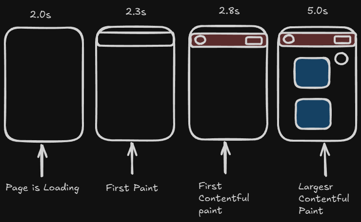
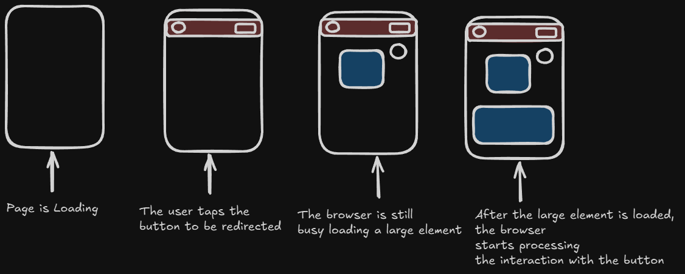
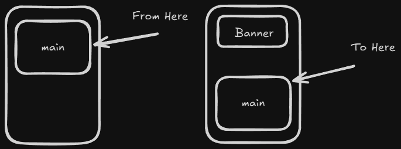

<!-- markdownlint-disable MD033 -->
# Table of Content: DevTools

- [Device toggler](#device-toggler)
- [Network Panel](#network-panel)
- [Application Panel](#application-panel)
- [Manual Web Performance Testing](#manual-web-performance-testing)

## Device toggler

**Explanation:**

Allows you to simulate different devices and screen resolutions. This is useful for testing responsive design and ensuring your application behaves correctly on various screen sizes and device orientations.

<details>
    <summary>Overview:</summary>

- **Responsive Testing:** Emulate mobile, tablet, and desktop devices to see how your layout adapts.

- **Adaptive Testing:** Set custom or adaptive screen dimensions to mimic lesser-known devices, edge cases, or adaptive layouts that adjust to various display conditions.

</details>

## Network Panel

**Explanation:**

Network requests made by your web application. It helps both developers and testers monitor resource loads, diagnose performance issues, and troubleshoot error responses.

<details>
    <summary>Overview:</summary>

- **Request Details:** Review all HTTP/HTTPS requests made by the application, including methods, URLs, status codes, and response times.

- **Waterfall View:** Visualize the sequence and timing of each network request.

  - **Queued & Stalled Times:**
    - **Queued:** The time your request waits in the browser’s internal queue before it begins processing.
    - **Stalled:** The time spent waiting for an available connection slot before the network connection starts.

  - **DNS Lookup:** Time taken to resolve the domain name. A long DNS lookup may indicate issues with your DNS provider or caching, delaying the request start.

  - **Initial Connection & SSL Handshake:**
    - **Initial Connection:** The time required to establish a TCP connection to the server.
    - **SSL Handshake:** The additional time necessary to establish a secure connection (for HTTPS).

  - **Request/Response:**
    - The time it takes to send the request once the connection is established.
    - The "Waiting for server response" time, also known as Time to First Byte (TTFB), which measures how long the server takes to begin responding.

  - **Content Download Time:**

- **Resource Content:** Inspect the headers, payload, and response body of each request to verify that the correct data is being sent and received.

- **Error Analysis:** Automatically flag failed requests or server errors (404, 500) to help pinpoint issues early.

- **Throttling Capabilities:** Simulate various network speeds to test how your application behaves under different connectivity conditions.

</details>

## Application Panel

**Explanation:**

Various assets, storage, and resources used by your web application.

<details>
    <summary>Overview:</summary>

- **Storage Inspection:** View and manage data stored in Local Storage, Session Storage, Cookies. This helps verify how and where your application persists its data.

- **Cache Management:** Inspect the Cache Storage to ensure that service workers are correctly caching resources, which is crucial for offline capability and performance.

</details>

## Manual Web Performance Testing

- **Tools:**
  - **PageSpeed Insights:**
    - **Use When:** You want real-world field data based on actual Chrome user experiences.
    - **Purpose:** Offers performance metrics and actionable recommendations drawn from aggregated user data (CrUX).
    - **When to Use:** Ideal for monitoring performance after deployment or on staging sites accessible over the internet.

  - **Lighthouse:**
    - **Use When:** You require a reproducible lab audit of your site under controlled conditions.
    - **Purpose:** Provides comprehensive audits covering performance, accessibility, best practices, and SEO either directly in your browser or via CLI.
    - **When to Use:** During development and staging to test changes, as Lighthouse can be run on localhost as well as deployed sites.

  - **Networking (DevTools Network Panel):**
    - **Use When:** You need granular, real-time details about resource loading, request timing, and HTTP responses.
    - **Purpose:** Allows inspection of individual network requests, simulation of throttling conditions, and troubleshooting of specific resource issues.
    - **When to Use:** Best for debugging and detailed analysis during development, helping you pinpoint specific issues prior to production deployment.

- **Core Web Vitals Monitoring:** Involves tracking and analyzing key metrics that measure real-world user experience during page load and interaction.

    1. **Largest Contentful Paint (LCP):** Measures the time from when the page starts loading to when the largest visible element (often an image or block-level text) is rendered.

        

        1. **Page is Loading:** This is the overall process where the browser starts fetching, parsing, and rendering the HTML, CSS, JavaScript, and other assets. It’s the period during which the entire page is in transition from a blank screen to a fully rendered page.

        2. **First Paint (FP):** Marks the moment when the browser first renders any pixels on the screen, even if it's just a background color. It indicates that the browser is working on rendering content.

        3. **First Contentful Paint (FCP):** Occurs when the browser renders the first piece of DOM content (text, an image, or other elements) visible to the user. It's a showing that useful content has appeared on the screen.

        4. **Largest Contentful Paint (LCP):** Captures the moment when the largest content element in the viewport (usually a significant image or text block) is fully rendered.

        <details>
           <summary>Overview:</summary>

        - **Criteria:**
            - **Good:** **Below 2.5 seconds** on a typical mobile device connection.
            - **Needs Improvement:** **Between 2.5 and 4.0 seconds**.
            - **Poor:** **Above 4.0 seconds**.

        - **Common Causes:**
            - **Unoptimized Images:** Large, uncompressed images or media files that take longer to download.
            - **Slow Server Response:** High Time to First Byte (TTFB) due to server-side delay or inefficient back-end processing.
            - **Render-Blocking Resources:** CSS and JavaScript files that delay the parsing and rendering of the LCP element.
            - **Resource Load Competition:** Non-critical resources in the load chain competing with the LCP element, delaying its discovery.
            - **Inefficient Client-Side Rendering:** Heavy JavaScript execution that delays the rendering process.
            - **Improper Lazy Loading:** Delaying the LCP element’s load by applying lazy loading where it should be prioritized.

        - **Optimization:**
            - **Optimize Images and Media:**
                - Use image formats (WebP).
                - Compress images without losing quality.
                - Serve appropriately sized images for each device.

                    <details>
                       <summary>Examples:</summary>

                    1. **Example 1:**

                    ```html

                    

                    ```

                    </details>

            - **Prioritize Critical Images:**
                - Use preload tags with a high fetch priority for the LCP image.

                    <details>
                       <summary>Examples:</summary>

                    1. **Example 1:**

                    ```html

                    <head>
                        <!-- Critical image: High priority -->
                        <link rel="preload" href="images/critical-image.WebP" as="image" fetchpriority="high">

                        <!-- Non-critical image: Low priority -->
                        <link rel="preload" href="images/noncritical-image.WebP" as="image" fetchpriority="low">
                    </head>

                    ```

                    </details>

                - Disable lazy loading for the LCP element.

                    <details>
                       <summary>Examples:</summary>

                    1. **Example 1:**

                    ```html

                    <body>
                        
                    </body>

                    ```

                    </details>
            - **Minimize Render-Blocking Resources:**
                - Minify CSS and JavaScript to reduce file sizes.
                    - **Minify CSS:** Use build tools or task runners (esbuild, Webpack, or Parcel) with plugins (such as cssnano) to remove extra spaces, comments, and unnecessary characters from your CSS files.
                    - **Minify JavaScript:** Utilize modern bundlers (esbuild, Webpack, or Parcel) to compress JavaScript files. This helps reduce the size of your scripts and speeds up their execution.
                    - **Use HTTP/2:** When possible, upgrade your server configuration to support HTTP/2, which can reduce the overhead of multiple resource requests.
        </details>

    2. **First Input Delay (FID):** Captures the delay between a user's first interaction (such as clicking a link or tapping a button) and the browser's response. It only measures the delay of the very first interaction.

        

        <details>
           <summary>Overview:</summary>

        - **Criteria:**
            - **Good:** **Below 100 milliseconds**.
            - **Needs Improvement:** **Between 100 and 300 milliseconds**.
            - **Poor:** **Above 300 milliseconds**.

        - **Common Causes:**
            - **Large Media Files:** Unoptimized images or videos can delay interactivity.
            - **Main Thread Blocking:** Heavy JavaScript or third-party scripts can prevent prompt response to user input.
            - **Slow Server Response:** Delays in server response (measured by TTFB) may also contribute to a higher FID.

        - **Optimization:**
            - **Code Splitting and Lazy Loading:** Configure your bundler (like Webpack, Rollup, or tools provided in frameworks like React via `React.lazy` and `Suspense`) to split non-critical parts of your application into separate bundles. These bundles are loaded only when needed, reducing initial load time.

            - **External Scripts:** If you need to include an external, non-critical script, place its `<script>` tag with `defer` or `async` in your `public/index.html` (or equivalent HTML template). Alternatively, use a library like `react-helmet` to inject script tags into the document head at runtime.

        - **Note:** FID measures just the first input delay and does not capture the responsiveness of subsequent interactions.

        </details>

    3. **Cumulative Layout Shift (CLS):** Quantifies visual stability by tracking unexpected layout shifts during the lifespan of the page.

        

        - CLS measures the cumulative amount of unexpected layout shifts on a page.

        - A layout shift occurs when a visible element moves from one rendered frame to the next.

        - The score is calculated by multiplying the impact fraction (the proportion of the viewport affected) by the distance fraction (how far the element moves relative to the viewport).

        - Shifts that occur within 500 milliseconds of a user interaction (considered intentional or expected) are not counted.

        <details>
           <summary>Overview:</summary>

        - **Criteria:**
            - **Good:** Score is **below 0.1**.
            - **Needs Improvement:**  score is **between 0.1 and 0.25**.
            - **Poor:**  Score is **above 0.25**.

        - **Common Causes:**
            - Asynchronous loading of elements (images, ads, banners) that push content down.
            - Dynamically inserted or removed elements without reserved space.
            - Web font loading that changes text dimensions.
            - JavaScript loading delays affecting element rendering.

        - **Optimization:**
            - Reserve space for dynamic content to prevent content from shifting when elements load.

                <details>
                   <summary>Examples:</summary>

                1. **Example 1:**

                ```html

                <div class="reserved-space">
                    
                </div>

                ```

                ```css

                .reserved-space {
                    width: 100%;       /* Full width of the parent */
                    height: 300px;     /* Fixed height reserves space */
                }

                .reserved-space img {
                    width: 100%;
                    height: 100%;
                    object-fit: cover;
                    display: block;
                }

                ```

                </details>

            - Define explicit width and height (or use aspect ratio boxes) for images, videos, and other media using `aspect-ratio: 3 / 2;`.

        </details>

    4. **Time to First Byte (TTFB):** Measures the time from the initial request until the first byte is received. It offers insight into back-end performance and server responsiveness.

        

        - Amount of time it takes for a browser to receive the first byte of data from a web server after a request is made. It indicates how quickly the server starts responding to a request.

        <details>
           <summary>Overview:</summary>

        - **Criteria:**
            - **Good:** **Below 200 milliseconds**.
            - **Needs Improvement:** **Between 200 and 500 milliseconds**.
            - **Poor:** **Above 500 milliseconds**.

        - **Common Causes:**
            - **Network Latency:** Time delays caused by data traveling through multiple networks, routers, or VPNs.
            - **Slow Server Processing:** Bottlenecks in server-side code or dynamically generated content (complex database queries, unoptimized backend code).
            - **Resource Contention:** High server load or an excessive number of simultaneous requests.

        - **Optimization:**
            - **Optimize Back-End Code:** Analyze and refine your server-side logic and database queries to reduce processing time.
                - **Use Indexes:** Ensure that columns used in `WHERE` clauses or `JOIN` conditions are indexed. For example, indexing `user_id` in the orders table can speed up lookup times.
                - **Reduce Data Transfer:** Instead of selecting all columns (`SELECT *`), only request the fields you need.
            - **Caching:** Implement server-side, browser, or proxy caching to serve content faster and reduce server hits.
                - **Server-Side Caching:**
                    - Use in-memory data stores like Redis or Memcached to temporarily store the results of expensive or frequently requested operations.
                    - Cache full page outputs or API responses for content that doesn't change frequently.
                    - Configure expiration policies so cached content stays relevant and doesn't serve stale data.
                - **Browser Caching:**
                    - Set proper HTTP cache headers (such as `Cache-Control` and `Expires`,  `ETag` (entity tag)) to instruct users browsers to store static assets locally.
                    - This means repeat visits will load faster as the browser can serve cached resources without needing to re-fetch them from the server.

        </details>

    5. **Interaction to Next Paint (INP):** Evaluates the overall responsiveness for user interactions throughout the page’s lifecycle. Unlike FID, INP measures the time elapsed from when a user interacts (such as clicking, tapping, or pressing a key) to when the next frame is visually painted. This metric includes not only the input delay, but also the time spent processing the event (JavaScript execution) and the presentation delay (layout, rendering).

        - **Input Delay:** The waiting time due to background tasks that prevent immediate handling of the interaction.

        - **Processing Time:** The duration spent running event handler code.

        - **Presentation Delay:** The time taken to update layout and paint the page with the new visuals.

        <details>
           <summary>Overview:</summary>

        - **Criteria:**
            - **Good:** **Below 200 milliseconds**.
            - **Needs Improvement:** **Between 200 and 500 milliseconds**.
            - **Poor:** **Above 500 milliseconds**.

        - **Common Causes:**
            - **Inefficient Event Handling:** Event listeners running expensive operations or unnecessary computations can impact performance, regardless of whether they’re implemented using native APIs or via a framework's abstraction.

        - **Optimization:**
            - **Optimize Event Listeners:** Use strategies like debouncing or throttling for high-frequency events (window resize, scroll, or input events) to ensure that only essential tasks are run immediately.

        </details>
