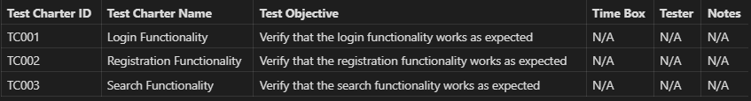
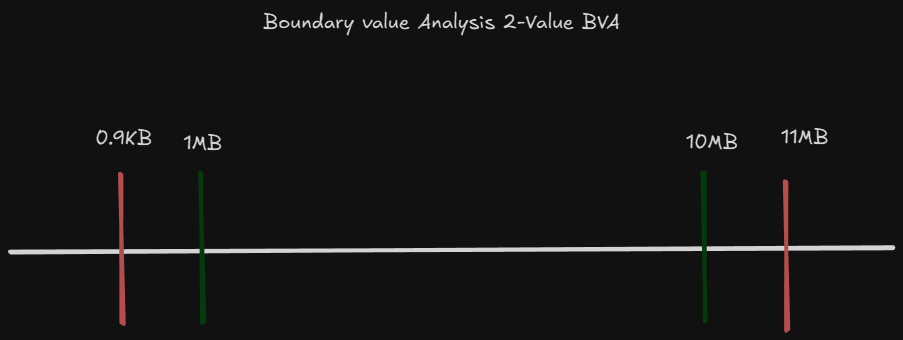
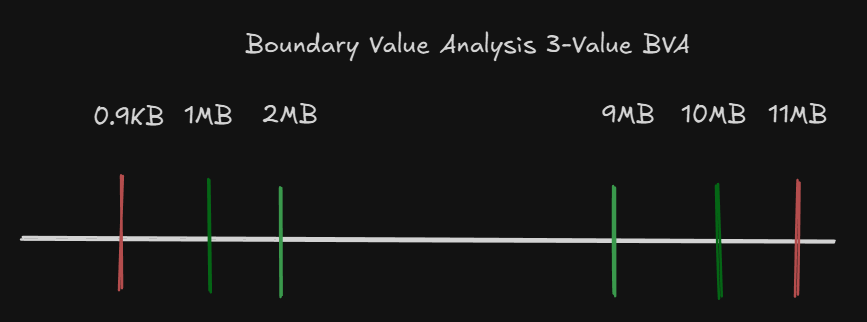

<!-- markdownlint-disable MD033 -->

# Content of Table Dynamic Functional Testing Techniques

- [Collaboration-based Test Approaches](#collaboration-based-test-approaches)
- [Experience-based Techniques](#experience-based-techniques)
- [Confirmation Testing and Regression Testing](#confirmation-testing-and-regression-testing)
- [Black-box Testing Techniques](#black-box-testing-techniques)
- [White-box Testing Techniques](#white-box-testing-techniques)

## Collaboration-based Test Approaches

**Explanation:**

Collaboration-based test approaches involve the collective participation of various stakeholders in the testing process.

<details>
  <summary>Overview:</summary>

1. **Collaborative User Story Writing:** Collaborative User Story Writing involves the team working together to write user stories, which are descriptions of a software feature from an end-user perspective.

    <details>
       <summary>Overview:</summary>

    - **Collaboration:** The process involves all relevant business representatives, product owner (PO), including developers, testers, and users.

    - **User Stories:** A User Story is written from the perspective of a user who wants to derive value from the product. It should focus on the user's desired outcomes and be embedded in the context where the user seeks value from the product.

    - **3 C Concept:**
      - **Card:** Represents the user story, can be physical (sticky note) or digital.
      - **Conversation:** Details how the software will be used and the expectations from the business.
      - **Confirmation:** Clear acceptance criteria that define when the story is complete.

    - **End-user Perspective:** User stories are written from the perspective of the end user, focusing on their needs and experiences.

    - **Acceptance Criteria:** Each user story includes acceptance criteria, which define the boundaries of a user story and are used to confirm when a story is completed and working as intended.

    - **Iteration Planning:** User stories are often used in agile development methodologies during iteration planning or sprint planning meetings.

    </details>

    <details>
       <summary>Syntax:</summary>

    A user story is typically written in the format: **"As a [type of user], I want [an action] so that [benefit/a value]"**.

    ```text
    WHO: As a [user type]
    WHAT: I want [action to perform]
    WHY: So that [the desired outcome]
    ```

    </details>

    <details>
       <summary>Examples:</summary>

    *User Story 1:*

    ```text
    User Story:

    "As a Online Shopper, I want to read reviews of a product before making the decision so that I  can reduce the uncertainty."
    ```

    *User Story 2:*

    ```text
    User Story:

    As a User,

    I want to drag and drop tasks within a list

    So that I can reorder them quicly and easily
    ```

    </details>

2. **User Acceptance Testing (UAT):** User Acceptance Testing (UAT) is the final phase in the testing process before the software is released for use. The aim of UAT is to validate the software against business requirements. It is typically conducted by the end-users or clients of the software.

    <details>
       <summary>Overview:</summary>

    - **End-user Involvement:** The testing is typically conducted by the end-users or clients, not by the developers or testers.

    - **Business Requirements:** The focus of UAT is to validate that the software meets the business requirements and not just the technical specifications.

    - **Final Phase:** UAT is usually the last phase of testing, conducted after unit, integration, and system testing.

    - **Acceptance Criteria:** The software is tested against predefined acceptance criteria to determine if it is ready for delivery. These criteria are essential for ensuring the software meets the end users' needs and requirements. There are two common formats for writing acceptance criteria: the Given-When-Then (Behavior-Driven Development - BDD) format and the Checklist format.

    </details>

    <details>
       <summary>Examples:</summary>

    - **Scenario-Oriented: Given-When-Then (BDD) Format Example:**

      1. Given some initial context (the state of the system),
      2. When an event occurs (an action is carried out),
      3. Then ensure some outcomes.

      ```text
      Acceptance Criteria:

      - Given I have a product in my shopping cart,
        When I click on 'Checkout' and complete the payment process,
        Then I should receive an order confirmation.
      ```

    - **Rule-Oriented: Checklist Format Example:**

      ```text
      Acceptance Criteria:

      -  Navigate from the homepage to the registration page.
      -  View a form on the registration page requesting name, email address, and password.
      ```

    </details>

3. **Alpha and Beta Testing:** Alpha and Beta Testing are stages of software testing that are conducted to ensure the quality of the product before it is released to the end-users. Alpha testing is performed internally within the organization by a specialized testing team. Beta testing, on the other hand, is performed by a limited number of end-users who are not part of the organization.
  
</details>

## Experience-based Techniques

**Explanation:**

Experience-based techniques in software testing are those that leverage the tester's knowledge, skills, and background to design and execute tests. They are less formal and structured than specification-based or structure-based techniques.

<details>
  <summary>Overview:</summary>

1. **Error Guessing:** Error Guessing is a software testing technique where the tester applies their experience and intuition to guess the problematic areas of the application. This technique is based on the tester's ability to find bugs or defects based on their past experiences and knowledge.

    <details>
       <summary>Overview:</summary>

    - **Experience-Based Testing:** Relies on the tester's past experience with similar products, domain knowledge, and understanding of typical defects.

    - **Intuition and Skills:** No formal approaches; it is completely dependent on the tester's judgment.

    - **Fault Attack:** The systematic approach of conducting error guessing is called fault attack. The tester knows what type of defect they are looking for and targets those specific areas.

    - **Win-Win Situation:** Whether defects are found or not, error guessing adds value by increasing confidence in the system.

    </details>

2. **Exploratory Testing:** Is a type of software testing where test design and test execution happen simultaneously without explicitly planning the detailed test cases in advance. The tester actively controls the design of the tests as they are performed and uses information gained while testing to design new and better tests.

    <details>
       <summary>Overview:</summary>

    - **Simultaneous Design and Execution:** The tester explores the requirements and system behavior to gain a better understanding and identify potential defects.

    - **Charters:** A charter is a mission or goal for the exploratory testing session. It provides direction and scope for the testing activities, including the target of the test, the duration of the test session, the type of testing or the test ideas to be explored, and the expected outcome or output.

      

    - **Time-boxed Sessions:** Exploratory testing is often conducted in time-boxed sessions, typically ranging from 60 to 120 minutes.

    - **High-Level Documentation:** Test charters are used to document the steps followed, the discoveries made, and the overall findings of each test session.

    </details>
  
3. **Checklist-Based Testing:**

    <details>
       <summary>Overview:</summary>

    - **Checklist Creation:** The checklist is created based on the requirements and specifications of the application. It includes all the important features and functionalities that need to be tested.

      

    - **Guided Testing:** The checklist serves as a guide for the tester during the testing process. It helps to ensure that all necessary areas of the application are covered.

    - **Functional and Non-Functional Testing:** Checklists can support various test types, including functional and non-functional testing.

    </details>

4. **Smoke and Sanity Testing:** Smoke testing is done to make sure software functionalities are working for a new build, while Sanity testing is done during the release phase to check for the main functionalities of the application without going deeper.

</details>

## Confirmation Testing and Regression Testing

**Explanation:**

Confirmation Testing(**Retesting**) and Regression Testing are types of testing performed to ensure that changes made to the software do not introduce new defects and that previously identified defects have been fixed. These are collectively known as change-related testing.

<details>
  <summary>Overview:</summary>

1. **Confirmation Testing (Retesting):**
    - Confirmation testing is conducted to verify that a previously reported defect has been fixed.
    - The tester reruns the same test cases that initially identified the defect to confirm that the issue has been resolved.

2. **Regression Testing:**
    - Regression testing ensures that recent changes, such as defect fixes or new features, have not adversely affected the existing functionality of the software.
    - It involves re-running previously executed test cases to verify that the software still performs as expected.
    - Regression testing is applicable not only when defects are fixed but also when updates, upgrades, or migrations occur.

</details>

## Black-box Testing Techniques

**Explanation:**

Black-box testing techniques focus on the functionality of the software without considering its internal structure. The tester is unaware of the internal workings of the system and tests the software based on the input and the output.

<details>
  <summary>Overview:</summary>

1. **Equivalence Partitioning:** Equivalence Partitioning is a software testing technique that divides the input data of a software unit into partitions of equivalent data from which test cases can be derived.

    <details>
       <summary>Scenarios:</summary>

    - **Input Validation:**
        - **Scenario:** Validating user input in registration forms, login forms, or any data entry forms.
        - **Example:** Ensuring that a username is between 5 to 10 characters, a password meets complexity requirements, and an age is within a valid range.
  
    </details>

    <details>
       <summary>Overview:</summary>

    - **Partitioning:** Dividing input data into different **Equivalence Classes**. Each equivalence class represents a set of input values that are treated the same by the software, meaning that one test case can be used to test the entire class.
    - **Equivalence Classes:** Each class represents a set of inputs that are expected to be treated the same by the system.
    - **Representative Values:** Selecting representative values from each partition for testing.
    - **Reduction of Test Cases:** Minimize the number of test cases by selecting representative values from each equivalence partition, ensuring comprehensive coverage with fewer tests. This approach eliminates the need for detailed step-by-step scenarios, as each equivalence class effectively acts as a scenario. Additionally, it removes the necessity for detailed steps to reproduce.
    - **Objective:** The objective is to achieve 100% equivalence partition coverage by testing each input condition at least once.
    - **Application:** This technique is applied when detailed requirements are available. If detailed requirements are not available, experience-based test techniques may be used instead.
    - **Multiple Inputs:** When dealing with multiple inputs, we need to combine them in a way that ensures all conditions are covered with the minimum number of test cases.
    - **In some scenarios:** Traditional test case tables might still be necessary, especially when preparing for automation testing that involves navigating through multiple pages or completing specific actions. While Equivalence Partitioning can handle input-based scenarios efficiently, when automating workflows that require multiple steps, such as navigating through pages, clicking buttons, or following a sequence of actions, detailed steps to reproduce are necessary.

    </details>

    <details>
       <summary>Examples:</summary>

    **Example 1 Equivalence Class, Test Input, Expected Outcome, PASS/FAIL:**

    | Test Case ID    | Equivalence Class      | Test Input  | Expected Outcome                       | PASS/FAIL |
    |-----------------|------------------------|-------------|----------------------------------------|-----------|
    | TCID-001        | Age less than 13       | 10          | Registration rejected, error message   |           |
    | TCID-002        | Age between 13 and 100 | 30          | Registration accepted                  |           |
    | TCID-003        | Age greater than 100   | 110         | Registration rejected, error message   |           |

    **Example 2 Equivalence Class Description, Valid/Invalid, Expected Outcome:**

    | Test Case ID    | Equivalence Class Description            | Valid/Invalid | Expected Outcome                       |PASS/FAIL  |
    |-----------------|------------------------------------------|---------------|----------------------------------------|-----------|
    | TCID-001        | String length between 5 to 10 characters | Valid         | Username accepted                      |           |
    | TCID-002        | String length less than 5 characters     | Invalid       | Username rejected, error message       |           |
    | TCID-003        | String length more than 10 characters    | Invalid       | Username rejected, error message       |           |  
    | TCID-004        | Starts with a letter                     | Valid         | Username accepted                      |           |
    | TCID-005        | Does not start with a letter             | Invalid       | Username rejected, error message       |           |
    | TCID-006        | Non-string input                         | Invalid       | Username rejected, error message       |           |

    **Example 3 Multiple Input Parameters, Equivalence Class Description, Valid/Invalid, Expected Outcome:**

    | Test Case ID    | Username Input | Age Input | Password Input | Equivalence Class Description            | Valid/Invalid | Expected Outcome                       |PASS/FAIL  |
    |-----------------|----------------|-----------|----------------|------------------------------------------|---------------|----------------------------------------|-----------|
    | TCID-010        | user123        | 25        | Passw0rd       | Valid username, valid age, valid password| Valid         | Login successful                       |           |

    </details>

2. **Boundary Value Analysis:** Boundary Value Analysis (BVA) is a software testing technique focused on identifying errors that occur at the boundaries of input domains rather than those in the middle. Since many defects often manifest at the edges of input ranges, BVA emphasizes testing values at and around these boundaries to ensure robust system behavior.

    <details>
       <summary>Scenarios:</summary>

    - **Input Range Validation:**

      - **Scenario:** Validating numerical input ranges in forms, configuration settings, or any system that requires numerical limits.
      - **Example:** Ensuring that an age is between 18 and 60, a temperature setting is between 15°C and 30°C, and a file upload size is between 1MB and 10MB.

    - **Date Range Validation:**

      - **Scenario:** Validating date ranges in booking systems, scheduling applications, or any system that requires date inputs.
      - **Example:** Ensuring that a booking date is within the allowed range, a subscription start and end date are valid, and a project deadline is within the acceptable timeframe.

    - **Financial Transactions:**

      - **Scenario:** Validating system that handles financial transactions.
      - **Example:** Ensuring that a transaction amount is within the allowed limits, a discount percentage is within the valid range, and a loan amount is between the minimum and maximum allowed values.

    </details>

    <details>
       <summary>Overview:</summary>

    - **Boundary Values:** Many errors tend to occur at the edges of input ranges.

    - **Edge Values:** Edge values refer to inputs just inside and just outside the boundary values.

    - **Valid and Invalid Partitions:** The input domain is divided into partitions of valid and invalid inputs. Testing is performed on both.
      - **Valid Partition:** Contains input values that are within the acceptable range of the system.
      - **Invalid Partition:** Contains input values that fall outside the acceptable range.

    - **Objective**: The main objective is to test the boundaries to ensure that the system handles boundary values correctly.

    - **Application**: This technique is applied when detailed requirements specify the boundaries of input ranges.

    - **2-Value BVA (Two-Point Boundary Value Analysis):** In 2-value BVA, testing focuses on the exact boundary points. Each boundary is tested with two values: one at the lower boundary and one at the upper boundary. This approach provides basic coverage by verifying that the system correctly handles the minimum and maximum allowable inputs. Specifically, it tests two values on each boundary: one inside the boundary and one outside the boundary.

        

    - **3-Value BVA (Three-Point Boundary Value Analysis):** In 3-value BVA, testing extends to include values just below, exactly at, and just above each boundary. Each boundary is tested with three values, ensuring that edge cases are handled properly and off-by-one errors are caught. Specifically, it tests three values on each boundary: one inside the boundary, one on the boundary, and one outside the boundary.

        

    - **Reduced Number of Test Cases:** By focusing on boundary values, the number of test cases is reduced compared to traditional methods, making it easier to maintain.

    - **Scenario Column:** While a "Scenario" column can provide additional context and make the test cases more understandable, it is not strictly necessary for BVA. The primary focus of BVA is on testing the boundaries of input ranges. Including a "Scenario" column can help testers and stakeholders understand the purpose of each test case more clearly, but it can be omitted if the table is already clear and understandable.

    </details>

    <details>
       <summary>Examples:</summary>

    **Example 1 Age Validation:**

    | Test Case ID  | Boundary Type             | Value | Valid/Invalid | PASS/FAIL |
    |---------------|---------------------------|-------|---------------|-----------|
    | TC001         | Lower Boundary            | 18    | Valid         |           |
    | TC002         | Upper Boundary            | 60    | Valid         |           |
    | TC003         | Just Below Lower Boundary | 17    | Invalid       |           |
    | TC004         | Just Above Lower Boundary | 19    | Valid         |           |
    | TC005         | Just Below Upper Boundary | 59    | Valid         |           |
    | TC006         | Just Above Upper Boundary | 61    | Invalid       |           |

    </details>

3. **Decision Table Testing:** Decision Table Testing is a software testing technique used to test system behavior based on different combinations of inputs and their corresponding outputs.

    <details>
       <summary>Scenarios:</summary>

    - **Multiple criteria:**

      - **Scenario:** Validating system behavior based on various input conditions and their combinations.
      - **Example:** Ensuring that a system correctly processes user input based on different combinations of conditions such as user role, authentication status, and resource access level.

    </details>

    <details>
       <summary>Overview:</summary>

    - **Decision Table:** A tabular representation that maps conditions to actions, showing all possible combinations of inputs and their corresponding outputs.
    - **Notation:** refers to the symbols and conventions used to represent conditions and actions
      - **domain-specific notation:** refers to the use of terms and symbols that are specific to a particular domain or industry.
      - **Boolean Notation:** Boolean notation uses binary values (True/False or T/F) to represent conditions and actions. This type of notation is straightforward and commonly used in decision tables and logical expressions.
    - **Conditions:** The different input variables or conditions that affect the system's behavior.
      - **T:** True, the condition is satisfied.
      - **F:** False, the condition is not satisfied.
      - **–:** Value of the condition is irrelevant for the action outcome. This means that regardless of whether the condition is true or false, it does not affect the resulting action. This can be used to show that certain combinations of conditions are not possible or not needed during testing.
    - **N/A:**  Means that the condition or action is not relevant or cannot be applied in a specific context.
    - **Actions:** The possible outcomes or actions that result from the combinations of conditions.
      - **X:** The action should occur.
      - **Blank:** The action should not occur.

    - **Steps to Apply Decision Table Testing:**

      - **Identify Conditions and Actions:** Determine the conditions and actions based on the requirements.
      - **Create the Table:** List all possible combinations of conditions and their corresponding actions.
      - **Derive Test Cases:** Use the table to derive test cases that cover all combinations.

    | Test Case ID | Condition 1 | Condition 2 | Condition 3 | Action 1 | Action 2 |
    |--------------|-------------|-------------|-------------|----------|----------|
    | TC001        | T           | F           | T           | X        |          |
    | TC002        | F           | T           | F           |          | X        |
    | TC003        | –           | T           | F           | X        |          |
    | TC004        | T           | –           | T           |          | X        |
    | TC005        | N/A         | F           | T           |          |          |
    | TC006        | T           | T           | F           | X        |          |

    - **Benefits:**

      - **Comprehensive Coverage:** Ensures that all possible combinations of conditions are tested.
      - **Clear Documentation:** Provides a clear and concise representation of business rules and decision logic.

    - **Challenges:**

      - **Complexity:** Creating decision tables for systems with many conditions can be complex and time-consuming.
      - **Detailed Requirements:** Requires detailed and precise requirements to create accurate decision tables.

    </details>

    <details>
       <summary>Examples:</summary>

    **Example 1 Loan Approval System:**

    | Test Case ID | Credit Score | Income Level | Employment Status | Loan Amount | Expected Result |
    |--------------|--------------|--------------|-------------------|-------------|-----------------|
    | TC001        | High         | High         | Employed          | Low         | Loan Approved   |
    | TC002        | Low          | High         | Employed          | Low         | Loan Denied     |
    | TC003        | High         | Low          | Employed          | High        | Loan Denied     |
    | TC004        | High         | High         | Unemployed        | Low         | Loan Denied     |
    | TC005        | High         | High         | Employed          | High        | Loan Approved   |
    | TC006        | Low          | Low          | Unemployed        | High        | Loan Denied     |

    **Example 2 N/A:**

    | Test Case ID | Condition 1 (User Authenticated) | Condition 2 (Admin Privileges) | Condition 3 (Resource Available) | Action 1 (Grant Access) | Action 2 (Deny Access) |
    |--------------|----------------------------------|--------------------------------|----------------------------------|-------------------------|------------------------|
    | TC001        | T                                | F                              | T                                | X                       |                        |
    | TC002        | F                                | T                              | F                                |                         | X                      |
    | TC003        | –                                | T                              | F                                | X                       |                        |
    | TC004        | T                                | –                              | T                                |                         | X                      |
    | TC005        | N/A                              | F                              | T                                |                         |                        |
    | TC006        | T                                | T                              | F                                | X                       |                        |

    - In **TC005**, "N/A" for Condition 1 means that the user's authentication status does not matter for this particular test case. This could be used to test scenarios where the system's behavior is independent of whether the user is authenticated or not.

    **Example 4 Payment Processing System:**

    | Test Case ID | Condition 1 (Card Valid) | Condition 2 (Sufficient Funds) | Condition 3 (Payment Gateway Available) | Action 1 (Process Payment) | Action 2 (Show Error) |
    |--------------|--------------------------|--------------------------------|-----------------------------------------|----------------------------|-----------------------|
    | TC001        | T                        | T                              | T                                       | X                          |                       |
    | TC002        | F                        | T                              | T                                       |                            | X                     |
    | TC003        | T                        | F                              | T                                       |                            | X                     |
    | TC004        | T                        | T                              | F                                       |                            | X                     |
    | TC005        | F                        | F                              | T                                       |                            | X                     |
    | TC006        | T                        | F                              | F                                       |                            | X                     |

    </details>

4. **State Transition Testing:** State Transition Testing is a software testing technique used to test the behavior of an application under test (AUT) for different input conditions in a sequence. It is particularly useful for systems where the system's current state is dependent on a sequence of past events or inputs.

    <details>
      <summary>Scenarios:</summary>

    - **Different input conditions in a sequence**

      - **Scenario:** Testing an online booking system for flight reservations.
      - **Example:** System correctly processes a sequence of inputs such as selecting a departure city, selecting a destination city, choosing travel dates, selecting a flight, and entering passenger details.

    - **Interactive Applications:**

      - **Scenario:** Testing a role-playing game (RPG) where the player's state changes based on actions such as moving, attacking, or using items.
      - **Example:** Move command transitions the player from "Idle" to "Moving."

    - **Interacting with External Applications in Web Workflows:**

      - **Scenario:** Testing an integrated workflow in a stateful web application that requires interaction with multiple external programs.
      - **Example:** Project management web application correctly handles a sequence of user actions that involve opening and interacting with external programs.

    - **Protocol Testing:**

      - **Scenario:** Testing a network communication protocol for a client-server application.
      - **Example:** Client and server correctly handle a sequence of messages such as connection requests, data transfers, file download requests, and disconnections.

    - **Embedded Systems:**

      - **Scenario:** Testing the state transitions of thermostat system.
      - **Example:** Ensuring that the smart thermostat correctly handles a sequence of inputs such as setting the desired temperature, detecting the current temperature, turning the heating or cooling system on or off, and entering energy-saving mode.

    </details>

    <details>
       <summary>Overview:</summary>

    - **State:** Describe what the system is doing or what condition of the system under different inputs."

      - **Initial and Final State:** The state in which the system starts is known as the initial state, and the state where it ends is known as the final state.
          - **Initial Idle:** The thermostat starts in the "Idle" state, where it is not actively heating or cooling.
          - **Final Idle:** The thermostat returns to the "Idle" state after completing its heating or cooling cycle, or after resolving an error.

        <details>
           <summary>Snippet:</summary>

        ```text
        States:

        Idle: The thermostat is not actively heating or cooling.

        Heating: The thermostat is actively heating to reach the desired temperature.

        Cooling: The thermostat is actively cooling to reach the desired temperature.

        Energy-Saving: The thermostat is in an energy-saving mode, maintaining a less aggressive temperature range.

        Error: The thermostat has encountered an error, such as a sensor failure.
        ```

        </details>

    - **Events:** An event is an occurrence that may trigger a state condition.

      - **Event Dependencies:** Events are often dependent on the current state of the system and can include user actions, system conditions, or external inputs.

        <details>
           <summary>Snippet:</summary>

        ```text
        Events:

        Set Heating: The user sets the thermostat to heating mode.

        Set Cooling: The user sets the thermostat to cooling mode.

        Set Energy-Saving: The user sets the thermostat to energy-saving mode.

        Temperature Reached: The desired temperature is reached.

        Error Detected: An error is detected in the system.

        Reset: The system is reset after an error.
        ```

        </details>

      - **Actions:** Operations that occur as a result of a state transition. They define what the system does when it moves from one state to another based on an event.

        <details>
           <summary>Snippet:</summary>

        ```text
        Actions:

        Start Heating: Begin heating to reach the desired temperature.

        Start Cooling: Begin cooling to reach the desired temperature.

        Enter Energy-Saving Mode: Adjust settings to maintain an energy-efficient temperature range.

        Stop Heating/Cooling: Stop the heating or cooling process.

        Display Error: Show an error message or indicator.

        Clear Error: Clear the error state and return to idle.
        ```

        </details>

      - **Transition:** The change from one state to another state of the system.

        - **Triggering Events:** triggered by events and often involve actions that the system performs as it moves from one state to another.

        - **Scenario:** Each transition can be considered a scenario that describes how the system moves from one state to another based on specific events and actions.

      - **State Diagram:** A graphical representation of all possible states, transitions, and events of the system.

        - **Non-Sequential Transitions:** State transitions do not necessarily follow a linear or sequential path. Instead, they represent how a system moves from one state to another based on specific events.

          <details>
             <summary>Snippet:</summary>

          ```text
          [Idle] --(Set Heating)--> [Heating]
          [Idle] --(Set Cooling)--> [Cooling]
          [Idle] --(Set Energy-Saving)--> [Energy-Saving]

          [Heating] --(Temperature Reached)--> [Idle]
          [Heating] --(Error Detected)--> [Error]

          [Cooling] --(Temperature Reached)--> [Idle]
          [Cooling] --(Error Detected)--> [Error]

          [Energy-Saving] --(Set Heating)--> [Heating]
          [Energy-Saving] --(Set Cooling)--> [Cooling]
          [Energy-Saving] --(Error Detected)--> [Error]

          [Error] --(Reset)--> [Idle]
          ```

          </details>

        - **Sequential Transitions:** In some cases, it is important to represent sequential transitions, where the system must follow a specific order of states. Sequential transitions are needed when the system's behavior depends on a strict sequence of events.

          <details>
             <summary>Snippet:</summary>

          ```text
          [Idle] --(Set Heating)--> [Heating]
          [Heating] --(Temperature Reached)--> [Idle]
          [Idle] --(Set Cooling)--> [Cooling]
          [Cooling] --(Temperature Reached)--> [Idle]
          ```

          </details>

      - **State Table:** A tabular representation of all possible states, transitions, and events, similar to the state diagram but in a tabular form.

      <details>
         <summary>Snippet:</summary>

      | Test Case ID | Current State   | Event              | Next State      | Action                  |
      |--------------|-----------------|--------------------|-----------------|-------------------------|
      | TC001        | Idle            | Set Heating        | Heating         | Start Heating           |
      | TC002        | Idle            | Set Cooling        | Cooling         | Start Cooling           |
      | TC003        | Idle            | Set Energy-Saving  | Energy-Saving   | Enter Energy-Saving Mode|
      | TC004        | Heating         | Temperature Reached| Idle            | Stop Heating            |
      | TC005        | Cooling         | Temperature Reached| Idle            | Stop Cooling            |
      | TC006        | Energy-Saving   | Set Heating        | Heating         | Start Heating           |
      | TC007        | Energy-Saving   | Set Cooling        | Cooling         | Start Cooling           |
      | TC008        | Heating         | Error Detected     | Error           | Display Error           |
      | TC009        | Cooling         | Error Detected     | Error           | Display Error           |
      | TC010        | Energy-Saving   | Error Detected     | Error           | Display Error           |
      | TC011        | Error           | Reset              | Idle            | Clear Error             |
      | TC012        | Idle            | Set Heating        | Heating         | Start Heating           |
      | TC013        | Heating         | Temperature Reached| Idle            | Stop Heating            |
      | TC014        | Idle            | Set Cooling        | Cooling         | Start Cooling           |
      | TC015        | Cooling         | Temperature Reached| Idle            | Stop Cooling            |

      - **Coverage:**

        - **All states coverage:** Ensuring that every state in the system is tested at least once.
        - **Valid transitions coverage:** Ensuring that all valid transitions between states are tested.
        - **All transitions coverage:** Ensuring that every possible transition, including invalid ones, is tested to verify the system's behavior.

      </details>

      - **Handling Invalid Transitions:**
        - **Explanation:** Invalid transitions are those that are not allowed as per the requirements and should be identified to ensure full coverage.
        - **Example:** In the thermostat example, transitioning directly from "Idle" to "Error" without an intermediate event would be considered an invalid transition.
        - **Testing Invalid Transitions:** Ensure that the system correctly handles invalid transitions by not allowing them and providing appropriate error messages or handling.

</details>

## White-box Testing Techniques

**Explanation:**

White box testing is a testing technique that involves testing the internal structures or workings of an application. The tester has knowledge of the internal code, architecture, and workflows.

<details>
  <summary>Overview:</summary>

1. **Structure-Based Testing:** Derives tests from the system's implementation, including code, architecture, workflows, and data flows. The main objective is to cover the underlying structure by the tests to an acceptable level. Common techniques include: **Statement Testing**, **Branch Testing**, **Path Testing**.

2. **Early Defect Detection:** Allows for early identification and fixing of bugs, reducing the cost and effort of fixing defects later in the development cycle.

3. **Statement Testing:** Technique to derive the minimum number of test cases needed to cover all the statements in a fragment of code. For example imagine you’re a teacher checking a student’s homework. Statement coverage would be like ensuring the student has answered every question on the assignment.

    <details>
       <summary>Overview:</summary>

    - **Key Concepts:** Statement testing is the technique to derive the minimum number of test cases needed to cover all the statements in a fragment of code.

    - **Statement:** A statement in programming is a single line of code that performs a specific action. Statements can include variable declarations, assignments, control flow statements (if, for, while), function calls

    - **Statement Coverage:** Statement coverage is the measure of how much of the code's statements are covered by the test cases.

    **Syntax:** `Statement coverage = (Number of executed statements / Total number of statements in source code) * 100`

    - **Purpose:** The main purpose of statement testing is to ensure that every statement in the code is executed at least once, thereby identifying any statements that are not executed and potentially contain defects.

    - **Practical Application:** In practice, statement testing helps in identifying the minimum number of test cases required to achieve full coverage of the code's statements, ensuring that all parts of the code are tested.

    </details>

      <details>
       <summary>Examples:</summary>

      1. **Calculation**

      ```js
      function compareNumbers(a, b) {
        if (a > b) {
            console.log("a is bigger");
        } else {
            console.log("b is bigger");
        }
      }
      // function compareNumbers(a, b) { - Function declaration.
      // if (a > b) { - Conditional statement.
      // console.log("a is bigger"); - Statement inside the if block.
      // else { - Else statement.
      // console.log("b is bigger"); - Statement inside the else block.
      ```

    - To achieve 100% statement coverage, we need two test cases:
      1. Test Case 1: `compareNumbers(20, 10)`
      2. Test Case 2: `compareNumbers(10, 20)`
    - Total number of statements: 5
    - Number of executed statements in Test Case 1: 3
    - **Executed statements:**
      1. `function compareNumbers(a, b) {`
      2. `if (a > b) {`
      3. `console.log("a is bigger");`
    - Number of executed statements in Test Case 2: 4
      - **Executed statements:**
        1. `function compareNumbers(a, b) {`
        2. `if (a > b) {`
        3. `else {`
        4. `console.log("b is bigger");`
    - Number of unique executed statements in both test cases: 5

    - **Statement coverage:** `(5 / 5) * 100 = 100%`

    </details>

4. **Branch Testing:** Technique to ensure that each possible branch (decision) in the code is executed at least once. For example This would be like exploring all possible routes on a GPS. If you’re at an intersection, branch testing involves going straight, turning left, and turning right to ensure all paths lead to valid destinations.

    <details>
      <summary>Overview:</summary>

    - **Key Concepts:** Branch testing is the technique to derive the minimum number of test cases needed to cover all the branches (decisions) in a fragment of code.

    - **Branches**  A branch in programming is a point in the code where the execution can take different paths based on a condition. This typically occurs with control flow statements like `if`, `else`, `switch`, and loops (`for`, `while`).

    - **Purpose:** The main purpose of branch testing is to ensure that every possible branch (decision) in the code is executed at least once, thereby identifying any branches that are not executed and potentially contain defects.

    - **Branch Coverage:** Branch coverage is the measure of how much of the code's branches are covered by the test cases.

        - **Syntax:** `Branch coverage = (Number of branches exercised by the test cases / Total number of branches in the code) * 100`

    - **Practical Application:** In practice, branch testing helps in identifying the minimum number of test cases required to achieve full coverage of the code's branches, ensuring that all decision points are tested.

    - **Stronger Technique:** Branch testing is considered a stronger technique than statement testing because 100% branch coverage guarantees 100% statement coverage, but not vice versa.

    </details>

    <details>
       <summary>Examples:</summary>

    1. **Calculation**

    ```javascript
    function compareNumbers(a, b) {
        if (a > b) {
            console.log("a is bigger");
        }   else {
            console.log("b is bigger");
        }
    }
    // function compareNumbers(a, b) { - Function definition.
    // if (a > b) { - Conditional check.
    // console.log("a is bigger"); - Action for true condition.
    // else { - Alternative path.
    // console.log("b is bigger"); - Action for false condition.
    ```

    - To achieve 100% branch coverage, we need two test cases:
      1. Test Case 1: `compareNumbers(20, 10)` (True branch)
      2. Test Case 2: `compareNumbers(10, 20)` (False branch)
    - Total number of branches: 2
    - Number of executed branches in Test Case 1: 1
      - **Executed branches:**
        1. `if (a > b) {` (true branch)
    - Number of executed branches in Test Case 2: 1
      - **Executed branches:**
        1. `if (a > b) {` (false branch)
    - Number of unique executed branches in both test cases: 2
    - **Branch coverage:** `(2 / 2) * 100 = 100%`

    </details>

5. **Path Testing:** Technique to ensure that all possible paths through the code are executed. For example This would be like a postman ensuring they can deliver mail to every house on their route. They need to make sure every possible path is covered.

    <details>
       <summary>Overview:</summary>

    - **Key Concepts:** Path testing is the technique to derive the minimum number of test cases needed to cover all possible paths in a fragment of code.

    - **Path:** A path in programming is a sequence of statements or instructions that are executed from the entry point to the exit point of a program or a function. Each unique sequence of statements represents a different path. In a function with multiple conditional statements, loops, and branches, each combination of these control flow elements creates a different path. For example, in an `if-else` statement followed by a loop, there are multiple paths depending on whether the condition is true or false and how many times the loop executes.

    - **Purpose:** Path testing is to ensure that every possible path through the code is executed at least once, thereby identifying any paths that are not executed and potentially contain defects.

    - **Path Coverage:** Is the measure of how much of the code's paths are covered by the test cases.

        - **Syntax:** `Path coverage = (Number of executed paths / Total number of paths in source code) * 100`

    - **Practical Application:** Helps in identifying the minimum number of test cases required to achieve full coverage of the code's paths, ensuring that all possible execution paths are tested.

    </details>

    <details>
       <summary>Examples:</summary>

    1. **Calculation**

    ```js
    function processNumbers(a, b) {
      let result;
      if (a > b) {
          result = a - b;
          console.log("a is greater");
      }   else if (a < b) {
          result = b - a;
          console.log("b is greater");
      } else {
          result = a + b;
          console.log("a and b are equal");
      }
      return result;
    }
    // function processNumbers(a, b) { - Function definition.
    // let result; - Variable declaration.
    // if (a > b) { - Conditional check.
    // result = a - b; - Action for true condition.
    // console.log("a is greater"); - Action for true condition.
    // else if (a < b) { - Alternative conditional check.
    // result = b - a; - Action for else-if condition.
    // console.log("b is greater"); - Action for else-if condition.
    // else { - Alternative path.
    // result = a + b; - Action for else condition.
    // console.log("a and b are equal"); - Action for else condition.
    // return result; - Return statement.
    ```

    - To achieve 100% path coverage, we need three test cases:
      1. Test Case 1: `processNumbers(20, 10)` (True path for the first if)
      2. Test Case 2: `processNumbers(10, 20)` (True path for the else if)
      3. Test Case 3: `processNumbers(10, 10)` (True path for the else)
    - Total number of paths: 3
    - Number of executed paths in Test Case 1: 1
    - **Executed paths:**
        1. `if (a > b) {` (true path)
    - Number of executed paths in Test Case 2: 1
      - **Executed paths:**
        1. `else if (a < b) {` (true path)
    - Number of executed paths in Test Case 3: 1
      - **Executed paths:**
        1. `else {` (true path)
    - Number of unique executed paths in all test cases: 3
    - **Path coverage:** `(3 / 3) * 100 = 100%`

    </details>

</details>
