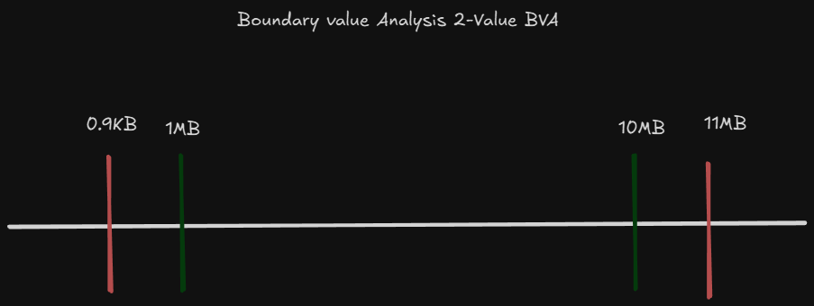
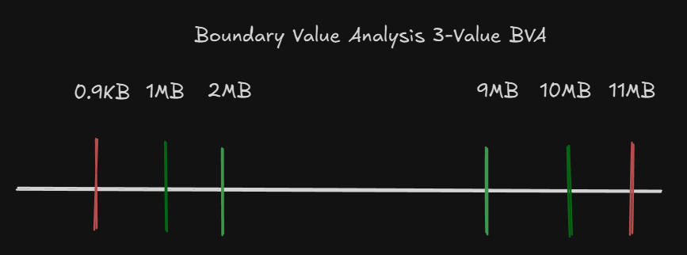

<!-- markdownlint-disable MD033 -->

# Content of Table Dynamic Functional Testing Techniques

- [Collaboration-based Test Approaches](#collaboration-based-test-approaches)
- [Experience-based Techniques](#experience-based-techniques)
- [Confirmation Testing and Regression Testing](#confirmation-testing-and-regression-testing)
- [Black-box Testing Techniques](#black-box-testing-techniques)
- [White-box Testing Techniques](#white-box-testing-techniques)

## Collaboration-based Test Approaches

**Explanation:**

Collaboration-based test approaches involve the collective participation of various stakeholders in the testing process.

<details>
  <summary>Overview:</summary>

1. **Collaborative User Story Writing:** Collaborative User Story Writing involves the team working together to create user stories clear, concise descriptions of a software feature from the end-user's perspective. These stories serve as the foundation for both development and testing, ensuring that the feature delivers real value.

    <details>
       <summary>Overview:</summary>

    - **Collaboration:** The process involves all relevant business representatives, product owner (PO), including developers, testers, and actual users. This collaborative effort ensures a shared understanding of what needs to be built and how it should work.

    - **User Stories:** A User Story is written from the perspective of a user who seeks value from the product. It focuses on the user's desired outcomes and embeds their needs within the context of the overall product.

    - **3 C Concept:**
      - **Card:** A tangible or digital representation of the user story (sticky note or an electronic board).
      - **Conversation:** The discussions both verbal and documented that detail how the software will be used and clarify expectations.
      - **Confirmation:** Clearly defined acceptance criteria that outline when the user story is complete and functioning as intended. These criteria also ensure that the story is testable.

    - **End-user Perspective:** User stories are written from the perspective of the end user, focusing on their needs and experiences.

    - **Acceptance Criteria:** Every user story should include specific acceptance criteria, which act as the boundaries of the story. If a stakeholder struggles to articulate these criteria, it may indicate that the story requires further refinement.

    - **Iteration Planning:** User stories are central to agile development methodologies and are used during iteration or sprint planning meetings to prioritize work and align the team on upcoming features.

    </details>

    <details>
       <summary>Syntax:</summary>

    A user story is typically written in the format: **"As a [type of user], I want [an action] so that [benefit/a value]"**.

    ```text
    WHO: As a [user type]
    WHAT: I want [action to perform]
    WHY: So that [the desired outcome]
    ```

    </details>

    <details>
       <summary>Examples:</summary>

    *User Story 1:*

    ```text
    User Story:

    "As a Online Shopper, I want to read reviews of a product before making the decision so that I  can reduce the uncertainty."
    ```

    *User Story 2:*

    ```text
    User Story:

    As a User,

    I want to drag and drop tasks within a list

    So that I can reorder them quicly and easily
    ```

    </details>

2. **User Acceptance Testing (UAT):** User Acceptance Testing (UAT) is the final phase in the testing process before the software is released for use. The aim of UAT is to validate the software against business requirements. It is typically conducted by the end-users or clients of the software.

    <details>
       <summary>Overview:</summary>

    - **End-user Involvement:** The testing is typically conducted by the end-users or clients, not by the developers or testers.

    - **Business Requirements:** The focus of UAT is to validate that the software meets the business requirements and not just the technical specifications.

    - **Final Phase:** UAT is usually the last phase of testing, conducted after unit, integration, and system testing.

    - **Acceptance Criteria:** Acceptance criteria for a user story are the conditions that an implementation must meet to be accepted by stakeholders. They serve as the test conditions for verifying that the functionality works as intended.

      - **Acceptance criteria are used to:**

        - Define the scope of the user story.
        - Reach consensus among stakeholders.
        - Describe positive and negative scenarios.
        - Form the basis for user story acceptance testing.
        - Facilitate accurate planning and estimation.

    </details>

    <details>
       <summary>Examples:</summary>

    - **Scenario-Oriented Example: Given/When/Then format (used in BDD):**

      1. Given some initial context (the state of the system),
      2. When an event occurs (an action is carried out),
      3. Then ensure some outcomes.

      ```text
      Acceptance Criteria:

      - Given I have a product in my shopping cart,
        When I click on 'Checkout' and complete the payment process,
        Then I should receive an order confirmation.
      ```

    - **Rule-Oriented Example: Checklist or a tabulated input-output mapping:**

      ```text
      Acceptance Criteria:

      -  Navigate from the homepage to the registration page.
      -  View a form on the registration page requesting name, email address, and password.
      ```

    </details>

3. **Alpha and Beta Testing:** Alpha and Beta Testing are stages of software testing that are conducted to ensure the quality of the product before it is released to the end-users. Alpha testing is performed internally within the organization by a specialized testing team. Beta testing, on the other hand, is performed by a limited number of end-users who are not part of the organization.
  
</details>

## Experience-based Techniques

**Explanation:**

Experience-based techniques in software testing are those that leverage the tester's knowledge, skills, and background to design and execute tests. They are less formal and structured than specification-based or structure-based techniques.

<details>
  <summary>Overview:</summary>

1. **Error Guessing:** Error guessing is an experience-based testing technique where testers use their intuition, domain knowledge, and past experiences to anticipate and uncover potential errors, defects, and failures in the application. This technique works by targeting known error-prone areas and leveraging historical defect data.

    <details>
       <summary>Overview:</summary>

    - **Error Categories:**
      - **Input Errors:** Identify issues with input validation for example, rejecting valid inputs or accepting invalid ones (wrong data types, out-of-range values).
      - **Output Errors:** Verify that outputs conform to the expected format and content, ensuring consistency and correctness.
      - **Processing Errors:** Detect flaws in internal logic and computations, such as missing cases, incorrect conditional operators, and arithmetic mistakes.
      - **Interface Errors:** Focus on problems in component interactions, like parameter mismatches, incompatible data types, or violations of interface contracts.

    - **Fault Attack:**
      - A systematic approach to error guessing, fault attacks involve mapping out all possible error conditions based on known defect patterns.
      - Testers might create or use a pre-existing list of frequent error types from historical data to specifically target expected weaknesses.

    </details>

2. **Exploratory Testing:** Is a type of software testing where test design and test execution happen simultaneously without explicitly planning the detailed test cases in advance. The tester actively controls the design of the tests as they are performed and uses information gained while testing to design new and better tests.

    <details>
       <summary>Overview:</summary>

    - **Simultaneous Design and Execution:** Testers actively explore application behavior and requirements to uncover hidden defects and gain a deeper understanding of the system.

    - **Charters:** A charter is a mission or goal for the exploratory testing session. It outlines the target of the testing, the objectives, the types of tests or ideas to be explored, the duration of the session, and the expected outcomes.

      

    - **Time-boxed Sessions:** Exploratory testing is usually performed in fixed-duration sessions (60 to 120 minutes) to ensure efficient use of time and to structure

    - **High-Level Documentation:** Even though detailed test cases aren’t pre-written, high-level documentation is maintained. Test charters and session sheets document the test ideas, the steps executed, discoveries, and any defects found.

    </details>
  
3. **Checklist-Based Testing:** Checklist-based testing is a technique in which testers design, implement, and execute tests based on a predefined list (checklist) of items. This checklist covers important features, functionalities, and critical criteria, ensuring that essential areas of the application are verified without the need for fully detailed test cases.

    <details>
       <summary>Scenarios:</summary>

    1. **General Layout:**
        - Verify that the layout adjusts correctly on on various screen sizes (mobile, tablet, desktop).
        - Check that elements are not overlapping or misaligned.

    2. **Navigation:**
        - Confirm that navigation elements (menus, links) are clearly visible and accessible.
        - Ensure that navigation menus respond appropriately on all devices (collapsible on mobile, expanded on desktop).

    3. **Images and Media:**
        - Confirm that images resize appropriately while maintaining their aspect ratio.
        - Verify that videos and other media elements are responsive and playable on all devices.

    4. **Text and Fonts:**
        - Validate that text is readable and appropriately responsive (no overflow or cutoff).
        - Verify that touch targets are adequately sized for mobile devices

    5. **Forms and Inputs:**
        - Ensure that form elements (input fields, buttons) are accessible and usable on every device.
        - Verify that touch targets are appropriately sized for mobile devices.

    6. **Performance:**
        - Validate that page load times meet acceptable thresholds on different devices.
        - Monitor for performance lags or issues when resizing the browser window.

    7. **Browser Compatibility:**
        - Confirm that the responsive design works correctly across different browsers (Chrome, Firefox, Safari, Edge).
        - Check for any browser-specific issues affecting responsiveness.

    </details>

    <details>
       <summary>Overview:</summary>

    - **Guided Testing:** The checklist acts as a guide, ensuring all necessary areas are reviewed without extensive pre-planning.

    - **Functional and Non-Functional Testing:** Checklists can support both functional and non-functional testing, ensuring aspects like usability, performance, and compatibility are verified.

    - **Efficiency and Flexibility:**
      - They allow for quick verification steps and are easily adaptable to reflect new features or discovered defects.
      - Regular updates based on defect analysis.

    - **Documentation:** Even though tests are not fully scripted, documenting results (test session logs or summary reports) is essential for tracking progress and identifying improvement areas. Findings should be included in the final Test Summary Report to inform stakeholders of outcomes and any defects addressed.

    </details>

    <details>
       <summary>Examples:</summary>

    | Description                                                                   | Status  |
    |-------------------------------------------------------------------------------|---------|
    | Verify that the layout adjusts correctly on different screen sizes.           |         |
    | Check that elements are not overlapping or misaligned.                        |         |
    | Ensure that the navigation menu functions on all screens.                     |         |
    | Verify that the hamburger menu appears and works correctly on smaller screens.|         |
    | Confirm that images resize appropriately and maintain aspect ratio.           |         |
    | Ensure that media elements are responsive and playable.                       |         |

    </details>

4. **Smoke and Sanity Testing:**

    - **Smoke Testing:** Basic set of tests run on a new software build to quickly verify that its most critical functions (such as launching the application, logging in, or basic navigation) work.

    - **Sanity Testing:** Performed after minor changes or fixes have been made in a build. It focuses on verifying that the specific changes work as expected and that the primary functionalities of the application have not been broken. This is a narrower, more focused set of tests compared to smoke testing.

</details>

## Confirmation Testing and Regression Testing

**Explanation:**

Confirmation Testing(**Retesting**) and Regression Testing are types of testing performed to ensure that changes made to the software do not introduce new defects and that previously identified defects have been fixed. These are collectively known as change-related testing.

<details>
  <summary>Overview:</summary>

1. **Confirmation Testing (Retesting):**
    - Confirmation testing is conducted to verify that a previously reported defect has been fixed.
    - The tester reruns the same test cases that initially identified the defect to confirm that the issue has been resolved.

2. **Regression Testing:**
    - Regression testing ensures that recent changes, such as defect fixes or new features, have not adversely affected the existing functionality of the software.
    - It involves re-running previously executed test cases to verify that the software still performs as expected.
    - Regression testing is applicable not only when defects are fixed but also when updates, upgrades, or migrations occur.

</details>

## Black-box Testing Techniques

**Explanation:**

Black-box testing techniques focus on the functionality of the software without considering its internal structure. The tester is unaware of the internal workings of the system and tests the software based on the input and the output.

<details>
  <summary>Overview:</summary>

1. **Equivalence Partitioning:** Equivalence Partitioning (EP) is a black-box testing technique that divides input data into distinct classes or partitions (equivalence classes) that are expected to be treated similarly by the system. The basic theory is that if one test case in an equivalence class finds a defect, any other value in the same class is likely to reveal the same issue. Therefore, testing one representative value from each partition can provide effective coverage.

    <details>
       <summary>Scenarios:</summary>

    - **Input Validation:**
        - **Scenario:** Validating user input in registration forms, login forms, or any data entry forms.
        - **Example:** Ensuring that a username is between 5 to 10 characters, a password meets complexity requirements, and an age is within a valid range.
  
    </details>

    <details>
       <summary>Overview:</summary>

    - **Partitioning:** Dividing input data into different **Equivalence Classes**. Each equivalence class represents a set of input values that are treated the same by the software, meaning that one test case can be used to test the entire class.
    - **Equivalence Classes:** Each class represents a set of inputs that are expected to be treated the same by the system.
      - **Valid Partitions:** Contain valid input values that should be accepted and processed by the system.
      - **Invalid Partitions:** Contain input values that should be rejected or generate an error because they fall outside the defined criteria.
    - **Coverage:** To achieve full coverage using EP, each identified partition (both valid and invalid) should be exercised by at least one test case. When a test object has multiple input parameters with their own partitions, the simplest criterion is Each Choice Coverage (testing one representative from each partition in every set).
    - **Application:** EP is particularly useful when detailed requirements are available. It can simplify testing by reducing the total number of test cases required while still effectively identifying defects.

    </details>

    <details>
       <summary>Examples:</summary>

    - **Implementation Steps:**

    1. **Identify Input Data Elements:** Determine which inputs, outputs, configuration items, and parameters are relevant for the test object.

    2. **Define Equivalence Classes:**
       - **Valid Equivalence Class(es):** Values that should be processed correctly.
       - **Invalid Equivalence Class(es):** Values that should be rejected or cause error handling.

    3. **Select Representative Values:** Choose one value (or a minimal set of values) from each partition to use as a test input.

    4. **Design Test Cases:** Create test cases that include these representative values. For objects with multiple parameters, consider techniques (Each Choice Coverage) to ensure every partition is tested at least once.

    **Example 1 Equivalence Class, Test Input, Expected Outcome, PASS/FAIL:**

    | Test Case ID    | Equivalence Class      | Test Input  | Expected Outcome                       | PASS/FAIL |
    |-----------------|------------------------|-------------|----------------------------------------|-----------|
    | TCID-001        | Age less than 13       | 10          | Registration rejected, error message   |           |
    | TCID-002        | Age between 13 and 100 | 30          | Registration accepted                  |           |
    | TCID-003        | Age greater than 100   | 110         | Registration rejected, error message   |           |

    **Example 2 Equivalence Class Description, Valid/Invalid, Expected Outcome, PASS/FAIL:**

    | Test Case ID    | Equivalence Class Description            | Valid/Invalid | Expected Outcome                       |PASS/FAIL  |
    |-----------------|------------------------------------------|---------------|----------------------------------------|-----------|
    | TCID-001        | String length between 5 to 10 characters | Valid         | Username accepted                      |           |
    | TCID-002        | String length less than 5 characters     | Invalid       | Username rejected, error message       |           |
    | TCID-003        | String length more than 10 characters    | Invalid       | Username rejected, error message       |           |  
    | TCID-004        | Starts with a letter                     | Valid         | Username accepted                      |           |
    | TCID-005        | Does not start with a letter             | Invalid       | Username rejected, error message       |           |
    | TCID-006        | Non-string input                         | Invalid       | Username rejected, error message       |           |

    **Example 3 Multiple Input Parameters, Equivalence Class Description, Valid/Invalid, Expected Outcome, PASS/FAIL:**

    | Test Case ID    | Username Input | Age Input | Password Input | Equivalence Class Description            | Valid/Invalid | Expected Outcome                       |PASS/FAIL  |
    |-----------------|----------------|-----------|----------------|------------------------------------------|---------------|----------------------------------------|-----------|
    | TCID-010        | user123        | 25        | Passw0rd       | Valid username, valid age, valid password| Valid         | Login successful                       |           |

    </details>

2. **Boundary Value Analysis:** is a software testing technique focused on testing the boundaries of input domains rather than values in the center. Since many defects tend to occur at the edges of input ranges, BVA is used to verify that the system handles boundary (and near-boundary) values correctly.

    <details>
       <summary>Scenarios:</summary>

    - **Input Range Validation:**

      - **Scenario:** Validating numerical input ranges in forms, configuration settings, or any system that requires numerical limits.
      - **Example:** Ensuring that an age is between 18 and 60, a temperature setting is between 15°C and 30°C, and a file upload size is between 1MB and 10MB.

    - **Date Range Validation:**

      - **Scenario:** Validating date ranges in booking systems, scheduling applications, or any system that requires date inputs.
      - **Example:** Ensuring that a booking date is within the allowed range, a subscription start and end date are valid, and a project deadline is within the acceptable timeframe.

    - **Financial Transactions:**

      - **Scenario:** Validating system that handles financial transactions.
      - **Example:** Ensuring that a transaction amount is within the allowed limits, a discount percentage is within the valid range, and a loan amount is between the minimum and maximum allowed values.

    </details>

    <details>
       <summary>Overview:</summary>

    - **Ordered Partitions:** BVA applies to inputs that have ordered values (numeric, date ranges). The minimum and maximum values of an equivalence partition form its boundaries.

    - **Valid and Invalid Partitions:** The input domain is divided into partitions of valid and invalid inputs.
      - **Valid Partition:** Inputs within the acceptable range.
      - **Invalid Partition:** Inputs outside the acceptable range.

    - **Boundary and Edge Values:**
      - **Boundary Values:** The exact limits of the input domain.
      - **Edge Values:** Values immediately inside (valid) and outside (invalid) the boundary.

    - **2-Value BVA (Two-Point Boundary Value Analysis):** In 2-value BVA, testing focuses on the exact boundary points. Each boundary is tested with two values: one at the lower boundary and one at the upper boundary. This approach provides basic coverage by verifying that the system correctly handles the minimum and maximum allowable inputs. Specifically, it tests two values on each boundary: one inside the boundary and one outside the boundary.

        

    - **3-Value BVA (Three-Point Boundary Value Analysis):** In 3-value BVA, testing extends to include values just below, exactly at, and just above each boundary. Each boundary is tested with three values, ensuring that edge cases are handled properly and off-by-one errors are caught. Specifically, it tests three values on each boundary: one inside the boundary, one on the boundary, and one outside the boundary.

        

    - **Coverage and Efficiency:** Focusing on boundaries reduces the number of test cases while ensuring critical ranges are tested.

    </details>

    <details>
       <summary>Examples:</summary>

    **Example 1 Age Validation:**

    | Test Case ID  | Boundary Type             | Value | Valid/Invalid | PASS/FAIL |
    |---------------|---------------------------|-------|---------------|-----------|
    | TC001         | Lower Boundary            | 18    | Valid         |           |
    | TC002         | Upper Boundary            | 60    | Valid         |           |
    | TC003         | Just Below Lower Boundary | 17    | Invalid       |           |
    | TC004         | Just Above Lower Boundary | 19    | Valid         |           |
    | TC005         | Just Below Upper Boundary | 59    | Valid         |           |
    | TC006         | Just Above Upper Boundary | 61    | Invalid       |           |

    </details>

3. **Decision Table Testing:** Decision Table Testing is a software testing technique used to test system behavior based on different combinations of inputs and their corresponding outputs.

    <details>
       <summary>Scenarios:</summary>

    - **Multiple criteria:**

      - **Scenario:** Validating system behavior based on various input conditions and their combinations.
      - **Example:** Ensuring that a system correctly processes user input based on different combinations of conditions such as user role, authentication status, and resource access level.

    </details>

    <details>
       <summary>Overview:</summary>

    - **Decision Table:** A tabular representation that maps conditions to actions, showing all possible combinations of inputs and their corresponding outputs.
    - **Notation:** refers to the symbols and conventions used to represent conditions and actions
      - **domain-specific notation:** refers to the use of terms and symbols that are specific to a particular domain or industry.
      - **Boolean Notation:** Boolean notation uses binary values (True/False or T/F) to represent conditions and actions. This type of notation is straightforward and commonly used in decision tables and logical expressions.
    - **Conditions:** The different input variables or conditions that affect the system's behavior.
      - **T:** True, the condition is satisfied.
      - **F:** False, the condition is not satisfied.
      - **–:** Value of the condition is irrelevant for the action outcome. This means that regardless of whether the condition is true or false, it does not affect the resulting action. This can be used to show that certain combinations of conditions are not possible or not needed during testing.
    - **N/A:**  Means that the condition or action is not relevant or cannot be applied in a specific context.
    - **Actions:** The possible outcomes or actions that result from the combinations of conditions.
      - **X:** The action should occur.
      - **Blank:** The action should not occur.

    - **Steps to Apply Decision Table Testing:**

      - **Identify Conditions and Actions:** Determine the conditions and actions based on the requirements.
      - **Create the Table:** List all possible combinations of conditions and their corresponding actions.
      - **Derive Test Cases:** Use the table to derive test cases that cover all combinations.

    | Test Case ID | Condition 1 | Condition 2 | Condition 3 | Action 1 | Action 2 |
    |--------------|-------------|-------------|-------------|----------|----------|
    | TC001        | T           | F           | T           | X        |          |
    | TC002        | F           | T           | F           |          | X        |
    | TC003        | –           | T           | F           | X        |          |
    | TC004        | T           | –           | T           |          | X        |
    | TC005        | N/A         | F           | T           |          |          |
    | TC006        | T           | T           | F           | X        |          |

    - **Benefits:**

      - **Comprehensive Coverage:** Ensures that all possible combinations of conditions are tested.
      - **Clear Documentation:** Provides a clear and concise representation of business rules and decision logic.

    - **Challenges:**

      - **Complexity:** Creating decision tables for systems with many conditions can be complex and time-consuming.
      - **Detailed Requirements:** Requires detailed and precise requirements to create accurate decision tables.

    </details>

    <details>
       <summary>Examples:</summary>

    **Example 1 Loan Approval System:**

    | Test Case ID | Credit Score | Income Level | Employment Status | Loan Amount | Expected Result |
    |--------------|--------------|--------------|-------------------|-------------|-----------------|
    | TC001        | High         | High         | Employed          | Low         | Loan Approved   |
    | TC002        | Low          | High         | Employed          | Low         | Loan Denied     |
    | TC003        | High         | Low          | Employed          | High        | Loan Denied     |
    | TC004        | High         | High         | Unemployed        | Low         | Loan Denied     |
    | TC005        | High         | High         | Employed          | High        | Loan Approved   |
    | TC006        | Low          | Low          | Unemployed        | High        | Loan Denied     |

    </details>

4. **State Transition Testing:** State Transition Testing is a software testing technique used to verify that an application behaves correctly as it moves between various states based on sequences of events.

    <details>
      <summary>Scenarios:</summary>

    - **Different input conditions in a sequence**

      - **Scenario:** Testing an online booking system that processes a series of actions (selecting departure city, destination, travel dates, flight, and finally entering passenger details).

    - **Interactive Applications:**

      - **Scenario:** Testing a role-playing game (RPG) where the player state changes with actions such as moving, attacking, or using items.
      - **Example:** A move command transitions the player from "Idle" to "Moving."

    - **Interacting with External Applications in Web Workflows:**

      - **Scenario:** Validating a project management web application that interacts with external programs.
      - **Example:** Ensuring the application transitions correctly when opening and interacting with an external document editor.

    - **Protocol and Embedded Systems:**

      - **Scenario:** Testing a client-server network protocol or a thermostat that adjusts states (from "Idle" to "Heating" or "Cooling") based on sensor inputs or user commands.

    </details>

    <details>
       <summary>Overview:</summary>

    - **State:** The system's status at a particular point. The initial state is where the system begins (Idle) and the final state is the state after a sequence of events (which could also be Idle).

        <details>
           <summary>Snippet:</summary>

        ```text

        Idle: Not actively heating or cooling.

        Heating: Actively increasing temperature.

        Cooling: Actively decreasing temperature.

        Energy-Saving: Operating with reduced intensity.

        Error: A fault condition, such as sensor failure.
        ```

        </details>

    - **Events:** Triggers that cause state transitions (user actions, sensor readings).

        <details>
           <summary>Snippet:</summary>

        ```text

        Set Heating, Set Cooling, or Set Energy-Saving

        Temperature Reached - The desired temperature is reached.

        Error Detected and Reset — to handle faults.

        ```

        </details>

      - **Actions:** Operations performed during a transition.

        <details>
           <summary>Snippet:</summary>

        ```text

        Start Heating or Start Cooling

        Enter Energy - Saving Mode

        Display Error or Clear Error

        ```

        </details>

      - **Transition:** The change from one state to another, triggered by an event ([Idle] --(Set Heating)--> [Heating]).

      - **State Diagram:** graphical shows all valid states and the transitions between them.

        - **Non-Sequential Transitions:** These are common when the system's state changes depend on various independent events. The diagram shows all possible valid transitions, regardless of order. This is typical for many real-world systems where users or external events can trigger transitions in any order.

          <details>
             <summary>Non-Sequential State Transitions Example:</summary>

          ```text
          [Idle] --(Set Heating)--> [Heating]
          [Idle] --(Set Cooling)--> [Cooling]
          [Idle] --(Set Energy-Saving)--> [Energy-Saving]

          [Heating] --(Temperature Reached)--> [Idle]
          [Heating] --(Error Detected)--> [Error]

          [Cooling] --(Temperature Reached)--> [Idle]
          [Cooling] --(Error Detected)--> [Error]

          [Energy-Saving] --(Set Heating)--> [Heating]
          [Energy-Saving] --(Set Cooling)--> [Cooling]
          [Energy-Saving] --(Error Detected)--> [Error]

          [Error] --(Reset)--> [Idle]
          ```

          </details>

        - **Sequential Transitions:** These are used when the system behavior strictly depends on a defined order of events. They are useful for processes that must follow a specific workflow or sequence

          <details>
             <summary>Sequential State Transitions Example:</summary>

          ```text
          [Idle] --(Set Heating)--> [Heating]
          [Heating] --(Temperature Reached)--> [Idle]
          [Idle] --(Set Cooling)--> [Cooling]
          [Cooling] --(Temperature Reached)--> [Idle]
          ```

          </details>

      - **State Table:** A tabular representation of the current state, events, and the expected next state plus actions.

        <details>
           <summary>Non-Sequential State Table Example:</summary>

          | Test Case ID | Current State   | Event              | Next State      | Action                  |
          |--------------|-----------------|--------------------|-----------------|-------------------------|
          | TC001        | Idle            | Set Heating        | Heating         | Start Heating           |
          | TC002        | Heating         |Temperature Reached | Idle            | Stop Heating            |
          | TC003        | Cooling         | Error Detected     | Error           | Display Error           |
          | TC04         | Error           | Reset              | Idle            | Clear Error             |

        </details>

        <details>
           <summary>Sequential State Table Example:</summary>

          | Step         | Current State   | Event              | Next State      | Action                  |
          |--------------|-----------------|--------------------|-----------------|-------------------------|
          | 1            | Idle            | Set Heating        | Heating         | Start Heating           |
          | 2            | Heating         |Temperature Reached | Idle            | Stop Heating            |
          | 3            | Idle            | Set Cooling        | Error           | Display Error           |
          | 4            | Cooling         | Temperature Reached| Idle            | Stop Cooling            |

        </details>

      - **Coverage:**
        - **All states coverage:** Every state is visited at least once.
        - **Valid transitions coverage (0-switch):** Every valid transition is exercised.
        - **All transitions coverage:** Both valid and invalid transitions (attempted transitions) are tested.
          - **Note:** Testing one invalid transition in a single test case is often sufficient to avoid fault masking.

      - **Invalid Transitions:** Testing invalid or infeasible transitions ensures that the system prevents or correctly handles unexpected changes.
          - **Example:** Transitioning directly from "Idle" to "Error" without an intermediary event should be rejected.

</details>

## White-box Testing Techniques

**Explanation:**

White box testing is a testing technique that involves testing the internal structures or workings of an application. The tester has knowledge of the internal code, architecture, and workflows.

<details>
  <summary>Overview:</summary>

1. **Structure-Based Testing:** Derives tests from the system's implementation, including code, architecture, workflows, and data flows. The main objective is to cover the underlying structure by the tests to an acceptable level. Common techniques: **Statement Testing**, **Branch Testing**, **Path Testing**.

2. **Early Defect Detection:** Allows for early identification and fixing of bugs, reducing the cost and effort of fixing defects later in the development cycle.

3. **Statement Testing:** Technique to derive the minimum number of test cases needed to cover all the statements in a fragment of code. For example imagine you’re a teacher checking a student’s homework. Statement coverage would be like ensuring the student has answered every question on the assignment.

    <details>
       <summary>Overview:</summary>

    - **Key Concepts:** Statement testing is the technique to derive the minimum number of test cases needed to cover all the statements in a fragment of code.

    - **Statement:** A statement in programming is a single line of code that performs a specific action. Statements can include variable declarations, assignments, control flow statements (if, for, while), function calls

    - **Statement Coverage:** Statement coverage is the measure of how much of the code's statements are covered by the test cases.

    **Syntax:** `Statement coverage = (Number of executed statements / Total number of statements in source code) * 100`

    - **Purpose:** The main purpose of statement testing is to ensure that every statement in the code is executed at least once, thereby identifying any statements that are not executed and potentially contain defects.

    - **Practical Application:** In practice, statement testing helps in identifying the minimum number of test cases required to achieve full coverage of the code's statements, ensuring that all parts of the code are tested.

    </details>

      <details>
       <summary>Examples:</summary>

      1. **Calculation**

      ```js
      function compareNumbers(a, b) {
        if (a > b) {
            console.log("a is bigger");
        } else {
            console.log("b is bigger");
        }
      }
      // function compareNumbers(a, b) { - Function declaration.
      // if (a > b) { - Conditional statement.
      // console.log("a is bigger"); - Statement inside the if block.
      // else { - Else statement.
      // console.log("b is bigger"); - Statement inside the else block.
      ```

    - To achieve 100% statement coverage, we need two test cases:
      1. Test Case 1: `compareNumbers(20, 10)`
      2. Test Case 2: `compareNumbers(10, 20)`
    - Total number of statements: 5
    - Number of executed statements in Test Case 1: 3
    - **Executed statements:**
      1. `function compareNumbers(a, b) {`
      2. `if (a > b) {`
      3. `console.log("a is bigger");`
    - Number of executed statements in Test Case 2: 4
      - **Executed statements:**
        1. `function compareNumbers(a, b) {`
        2. `if (a > b) {`
        3. `else {`
        4. `console.log("b is bigger");`
    - Number of unique executed statements in both test cases: 5

    - **Statement coverage:** `(5 / 5) * 100 = 100%`

    </details>

4. **Branch Testing:** Technique to ensure that each possible branch (decision) in the code is executed at least once. For example This would be like exploring all possible routes on a GPS. If you’re at an intersection, branch testing involves going straight, turning left, and turning right to ensure all paths lead to valid destinations.

    <details>
      <summary>Overview:</summary>

    - **Key Concepts:** Branch testing is the technique to derive the minimum number of test cases needed to cover all the branches (decisions) in a fragment of code.

    - **Branches**  A branch in programming is a point in the code where the execution can take different paths based on a condition. This typically occurs with control flow statements like `if`, `else`, `switch`, and loops (`for`, `while`).

    - **Purpose:** The main purpose of branch testing is to ensure that every possible branch (decision) in the code is executed at least once, thereby identifying any branches that are not executed and potentially contain defects.

    - **Branch Coverage:** Branch coverage is the measure of how much of the code's branches are covered by the test cases.

        - **Syntax:** `Branch coverage = (Number of branches exercised by the test cases / Total number of branches in the code) * 100`

    - **Practical Application:** In practice, branch testing helps in identifying the minimum number of test cases required to achieve full coverage of the code's branches, ensuring that all decision points are tested.

    - **Stronger Technique:** Branch testing is considered a stronger technique than statement testing because 100% branch coverage guarantees 100% statement coverage, but not vice versa.

    </details>

    <details>
       <summary>Examples:</summary>

    1. **Calculation**

    ```javascript
    function compareNumbers(a, b) {
        if (a > b) {
            console.log("a is bigger");
        }   else {
            console.log("b is bigger");
        }
    }
    // function compareNumbers(a, b) { - Function definition.
    // if (a > b) { - Conditional check.
    // console.log("a is bigger"); - Action for true condition.
    // else { - Alternative path.
    // console.log("b is bigger"); - Action for false condition.
    ```

    - To achieve 100% branch coverage, we need two test cases:
      1. Test Case 1: `compareNumbers(20, 10)` (True branch)
      2. Test Case 2: `compareNumbers(10, 20)` (False branch)
    - Total number of branches: 2
    - Number of executed branches in Test Case 1: 1
      - **Executed branches:**
        1. `if (a > b) {` (true branch)
    - Number of executed branches in Test Case 2: 1
      - **Executed branches:**
        1. `if (a > b) {` (false branch)
    - Number of unique executed branches in both test cases: 2
    - **Branch coverage:** `(2 / 2) * 100 = 100%`

    </details>

5. **Path Testing:** Technique to ensure that all possible paths through the code are executed. For example This would be like a postman ensuring they can deliver mail to every house on their route. They need to make sure every possible path is covered.

    <details>
       <summary>Overview:</summary>

    - **Key Concepts:** Path testing is the technique to derive the minimum number of test cases needed to cover all possible paths in a fragment of code.

    - **Path:** A path in programming is a sequence of statements or instructions that are executed from the entry point to the exit point of a program or a function. Each unique sequence of statements represents a different path. In a function with multiple conditional statements, loops, and branches, each combination of these control flow elements creates a different path. For example, in an `if-else` statement followed by a loop, there are multiple paths depending on whether the condition is true or false and how many times the loop executes.

    - **Purpose:** Path testing is to ensure that every possible path through the code is executed at least once, thereby identifying any paths that are not executed and potentially contain defects.

    - **Path Coverage:** Is the measure of how much of the code's paths are covered by the test cases.

        - **Syntax:** `Path coverage = (Number of executed paths / Total number of paths in source code) * 100`

    - **Practical Application:** Helps in identifying the minimum number of test cases required to achieve full coverage of the code's paths, ensuring that all possible execution paths are tested.

    </details>

    <details>
       <summary>Examples:</summary>

    1. **Calculation**

    ```js
    function processNumbers(a, b) {
      let result;
      if (a > b) {
          result = a - b;
          console.log("a is greater");
      }   else if (a < b) {
          result = b - a;
          console.log("b is greater");
      } else {
          result = a + b;
          console.log("a and b are equal");
      }
      return result;
    }
    // function processNumbers(a, b) { - Function definition.
    // let result; - Variable declaration.
    // if (a > b) { - Conditional check.
    // result = a - b; - Action for true condition.
    // console.log("a is greater"); - Action for true condition.
    // else if (a < b) { - Alternative conditional check.
    // result = b - a; - Action for else-if condition.
    // console.log("b is greater"); - Action for else-if condition.
    // else { - Alternative path.
    // result = a + b; - Action for else condition.
    // console.log("a and b are equal"); - Action for else condition.
    // return result; - Return statement.
    ```

    - To achieve 100% path coverage, we need three test cases:
      1. Test Case 1: `processNumbers(20, 10)` (True path for the first if)
      2. Test Case 2: `processNumbers(10, 20)` (True path for the else if)
      3. Test Case 3: `processNumbers(10, 10)` (True path for the else)
    - Total number of paths: 3
    - Number of executed paths in Test Case 1: 1
    - **Executed paths:**
        1. `if (a > b) {` (true path)
    - Number of executed paths in Test Case 2: 1
      - **Executed paths:**
        1. `else if (a < b) {` (true path)
    - Number of executed paths in Test Case 3: 1
      - **Executed paths:**
        1. `else {` (true path)
    - Number of unique executed paths in all test cases: 3
    - **Path coverage:** `(3 / 3) * 100 = 100%`

    </details>

</details>
