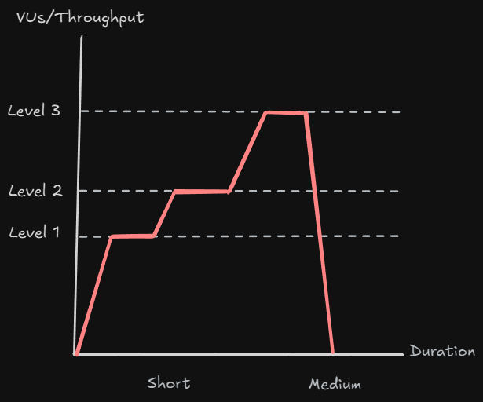

<!-- markdownlint-disable MD033 -->
# Content of Table

- [Performance Testing](#performance-testing)

## Performance Testing

**Explanation:**

Performance testing is crucial for ensuring the reliability and efficiency of a system, especially during high-stress situations like a product release. It involves various types of tests to simulate real user behavior and measure the system's performance under different conditions.

    
Overview:

1. **Load Testing:** Evaluates the system's performance under normal load conditions to ensure it meets predefined criteria.

    

    

      
Overview:

  
    - Load testing involves simulating normal traffic to the API to ensure it meets acceptable response times and success rates.

    - It helps identify how the system performs under expected user load and can be integrated into CI/CD pipelines to assess the impact of changes.

    - Success criteria are often defined in terms of response time and percentage of successful requests, 99% of requests should return successfully within 200 milliseconds.

    - Load testing provides initial indications of system performance and helps ensure stability under normal operating conditions.

    

    

      
Examples:

      1. **Online Store Launch:**

          - Imagine you are launching a new online store. You expect a certain number of customers to visit and make purchases. Load testing helps you ensure that your website can handle this expected traffic.

      2. **API Response Time Test:**

          - You can test with 10 virtual users and check that the API responses are under 200 milliseconds. This test can be run for 5 minutes to get an initial indication of how the system performs under normal conditions.
  
      

2. **Stress Testing:** Gradually increases the load to determine how the system behaves under extreme conditions.

    

    

      
Overview:

    - Stress testing involves pushing the system beyond its normal operational capacity to identify its breaking point and observe how it handles high-stress situations.

    - This type of testing helps determine the system's robustness and its ability to maintain acceptable performance levels under extreme conditions.

    - It can reveal potential bottlenecks, performance degradation, and failure points that might not be apparent under normal load conditions.

    - Stress testing is useful for understanding the limits of your system and ensuring it can handle unexpected spikes in traffic or usage.

    

    

      
Examples:

    1. **Concert Ticket Sales:**

        - Imagine you are managing a ticket sales platform for a popular concert. When tickets go on sale, there is a sudden surge in traffic. Stress testing helps you ensure that your system can handle this sudden spike in user activity without crashing.

    2. **Gradual Load Increase Test:**

        - You can gradually ramp up the number of virtual users from 100 to 500, monitoring how the system performs at each level. This helps identify at what point the system starts to degrade and ensures it can handle high-stress conditions.

    

3. **Spike Testing:** Tests the system's response to sudden, high loads over a short period.

    

    

      
Overview:

    - Spike testing involves subjecting the system to a sudden and extreme increase in load to observe how it handles the abrupt change.

    - This type of testing helps determine the system's ability to recover quickly and maintain performance during unexpected spikes in traffic.

    - It can reveal issues such as system crashes, slowdowns, or failures that occur when the load suddenly increases.

    - Spike testing is useful for applications that experience sudden bursts of traffic, such as during flash sales or viral events.

    

    

      
Examples:

    1. **Flash Sale Event**

        - Imagine you are running an e-commerce platform and announce a flash sale. Spike testing helps you ensure that your system can handle the sudden influx of users trying to make purchases at the same time.

    2. **Sudden Load Increase Test**

        - You can start with a low number of virtual users and then drastically increase the number of users over a short period. This helps you observe how the system handles the sudden spike and whether it can maintain performance.

    

4. **Soak Testing:** Runs tests over an extended period to identify issues like memory leaks and ensure stable performance.

    

    

      
Overview:

    - Soak testing involves running the system under a significant load for an extended period to identify performance issues that may not be apparent in shorter tests.

    - This type of testing helps detect problems such as memory leaks, resource exhaustion, and performance degradation over time.

    - It ensures that the system can maintain stable performance and resource usage during prolonged periods of operation.

    - Soak testing is particularly important for applications that need to run continuously without downtime, such as servers and critical services.

    

    

      
Examples:

    1. **Long-Term Application Stability**

        - Imagine you are running a financial application that needs to operate continuously. Soak testing helps you ensure that the application remains stable and performs well over several days or weeks without issues.

    2. **Extended Load Test**

        - You can run a test with a consistent load of virtual users for 24 hours or more, monitoring for issues like memory leaks and CPU usage. This helps ensure that the system can handle long-term usage without performance degradation.

    

## Security Testing

Security testing is the process of evaluating a system to detect vulnerabilities that could be exploited by malicious actors. It ensures that the system’s defenses protect against unauthorized access and data breaches. In our testing strategy, this discipline is part of a broader security approach that includes:

- **Security Verification:** Focused on identifying common vulnerabilities and verifying that security controls are working correctly. Typically performed by **QA Testers** during the testing lifecycle.
- **Penetration Testing:** Simulates real-world attacks to uncover deeper vulnerabilities from an attacker’s point of view. Usually performed by trained **Ethical Hackers** or security specialists.
- **Cybersecurity Engineering:** Involves designing and building secure systems, infrastructures, and defense mechanisms. This responsibility lies with **Security Engineers and DevSecOps**.
