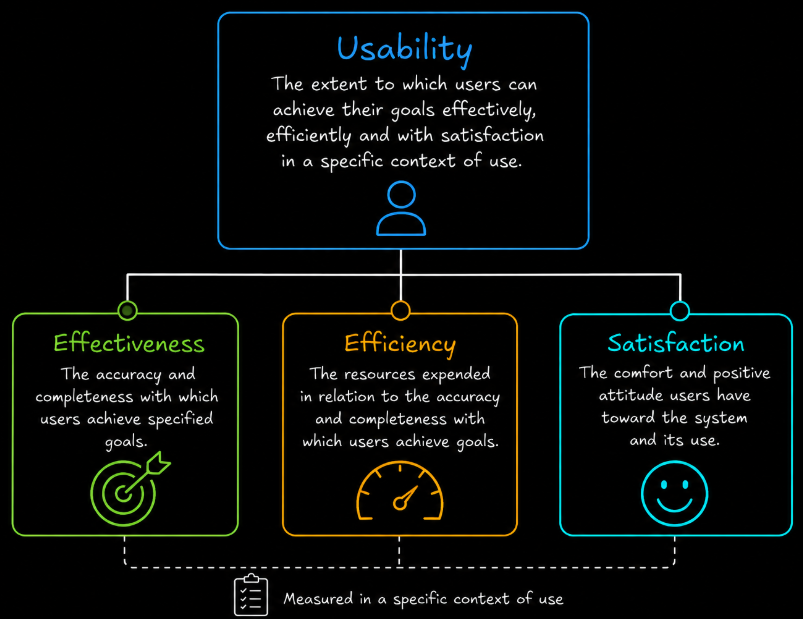

# Table of Contents: Usability Testing

- [Planning Usability Testing](#planning-usability-testing)
- [Choosing a Usability Evaluation Approach](#choosing-a-usability-evaluation-approach)
- [Learnability](#learnability)
- [Efficiency](#efficiency)
- [Error Prevention and Recovery](#error-prevention-and-recovery)
- [Satisfaction](#satisfaction)
- [Accessibility WCAG Based](#accessibility-wcag-based)
- [Nielsen's Usability Heuristics](#nielsens-usability-heuristics)
- [Performing Usability Evaluation](#performing-usability-evaluation)
- [Recording Usability Results and Metrics](#recording-usability-results-and-metrics)
- [Creating Usability Findings](#creating-usability-findings)
- [Prioritizing and Recommending Improvements](#prioritizing-and-recommending-improvements)
- [Retesting Usability](#retesting-usability)
- [When to Perform Usability Testing](#when-to-perform-usability-testing)

**Usability testing** is a type of **non-functional dynamic testing** used to evaluate how effectively, efficiently and satisfactorily intended users can interact with a system to achieve specific goals in a defined context of use.

It is important to distinguish **usability** from **usability testing**. **Usability** is a quality characteristic of a product or system. **Usability testing** is the activity of evaluating that characteristic by observing users, measuring their performance, collecting feedback or applying structured evaluation methods.

ISO 9241-11 describes usability through **effectiveness**, **efficiency** and **satisfaction** in a specified context of use. The ISO/IEC 25010 product quality model also includes usability as a software quality characteristic.

In QA, usability testing helps identify problems that may not cause a functional failure but still make the product difficult, inefficient, confusing or unpleasant to use. A registration form may submit data correctly, for example, while still having poor usability because users cannot understand its labels or repeatedly make avoidable errors.

## Planning Usability Testing

Usability testing begins by choosing the **feature or user flow** to evaluate. Throughout this lesson, **account registration** is used as the main example so that the complete usability-testing workflow can be followed consistently from planning through retesting. The same process can later be adapted to other features or user flows.

The tester then defines a clear **objective**. The objective describes the usability question that the evaluation should answer rather than giving a general instruction to test the interface.

For example, an objective for registration may be `Can a first-time user complete registration without assistance?`

The tester should also define the intended **context of use**, including the relevant users, devices, input methods and environment where practical. The scope should be clear enough that the tester knows what evidence must be collected and what is outside the evaluation.

In day-to-day QA work, usability testing is commonly supported by **experience-based testing techniques**. Instead of relying on detailed step-by-step test cases, the tester uses knowledge of common usability problems, previous defects, product risks, expected user behavior and the application itself to guide the evaluation.

One useful experience-based technique is **checklist-based testing**. A usability checklist provides a reusable set of conditions or questions without prescribing exact test steps.

| Description                                                                                        | Pass | Fail | Notes |
| -------------------------------------------------------------------------------------------------- | ---- | ---- | ----- |
| Verify that important actions and controls are easy to identify.                                   |      |      |       |
| Check that navigation is clear, predictable and consistent.                                        |      |      |       |
| Verify that labels, instructions and terminology are easy to understand.                           |      |      |       |
| Check that similar controls and actions behave consistently throughout the interface.              |      |      |       |
| Verify that common tasks can be completed without unnecessary steps or repeated input.             |      |      |       |
| Check that the system provides clear feedback after user actions.                                  |      |      |       |
| Verify that users can understand the current system state and what is happening.                   |      |      |       |
| Check that predictable user errors are prevented where practical.                                  |      |      |       |
| Verify that error messages clearly explain the problem and how to correct it.                      |      |      |       |
| Check that users can recover from mistakes without unnecessarily restarting the task.              |      |      |       |
| Verify that entered information is preserved when a recoverable error occurs.                      |      |      |       |
| Check that important information is easy to find without requiring unnecessary memorization.       |      |      |       |
| Verify that interactive elements are easy to select and use.                                       |      |      |       |
| Check that destructive or irreversible actions are clearly identified before they are performed.   |      |      |       |
| Verify that help or supporting information is available where users are likely to need it.         |      |      |       |
| Verify that important functionality can be operated without relying only on a mouse or touch.      |      |      |       |
| Check that keyboard focus is visible and follows a logical order where keyboard use is supported.  |      |      |       |
| Verify that important information is not communicated through color alone.                         |      |      |       |
| Check that text and important interface elements remain readable when content is resized or zoomed.|      |      |       |
| Verify that form controls have understandable labels and that errors can be identified clearly.    |      |      |       |

The checklist should be adapted to the feature and **context of use** being tested. It provides a practical starting point rather than a fixed checklist that must be applied unchanged to every interface.

When usability is evaluated on mobile devices, additional checks may be needed for **touch-target size and spacing**, **gesture usability**, **on-screen keyboards**, **thumb reach** and interactions that require unnecessarily precise input. A form may require more attention to labels, validation, error prevention and recovery.

The checklist also includes basic **accessibility-related checks** because accessibility barriers can directly affect whether users are able to operate and understand an interface. These checks can help identify obvious concerns during routine usability evaluation, but they do not represent a complete accessibility assessment.

Dedicated **accessibility testing** requires additional evaluation against applicable accessibility requirements, including areas such as keyboard operation, focus behavior, text alternatives, color contrast, semantic structure and compatibility with assistive technologies. These are covered later in **Accessibility (WCAG Based)**.

Once the feature, objective, context of use and relevant checks have been defined, the tester can decide how the usability evaluation will be performed.

## Choosing a Usability Evaluation Approach

After the feature, objective and context of use have been defined, the tester decides how the usability evaluation will be performed.

The main decision is whether the evaluation requires **representative users** or can be performed directly by a **tester or usability specialist**.

**User-based usability testing** should be selected when the tester needs evidence about how representative users actually interact with the interface.

Common user-based approaches include **moderated usability testing** and **unmoderated usability testing**. Moderated testing is useful when the tester needs to observe participants in real time, ask follow-up questions or investigate why users become confused. Unmoderated testing is useful when participants can complete the evaluation independently without a facilitator being present for every session.

The **Thinking Aloud Protocol** can be used during a moderated session when the tester needs to understand the participant's reasoning. The participant describes what they are looking for, what they expect and what they find confusing while completing the task.

Testing may also be **remote** or **in-person**. These terms describe where the evaluation takes place rather than separate usability methods. Remote testing is useful when participants are geographically distributed, while in-person testing may be appropriate when direct observation, physical devices or a controlled environment are important.

For the registration example, if the objective is `Can a first-time user complete registration without assistance?`, moderated usability testing with representative first-time users may be appropriate because the tester needs to observe where users hesitate, make errors or require assistance.

**Expert-based usability evaluation** should be selected when potential usability problems need to be identified without recruiting representative users.

A **Heuristic Evaluation** is useful when the interface needs to be inspected systematically against established usability principles. A **Cognitive Walkthrough** is more focused on whether a new or unfamiliar user can discover and understand the actions required to complete a particular task.

For the registration example, a Heuristic Evaluation could identify inconsistent labels, missing feedback or poor error prevention. A Cognitive Walkthrough could examine whether a first-time user can discover how to start registration, understand each required action and recognize whether registration was successful.

The two approaches can also complement each other. Expert evaluation can identify potential problems early, while user-based testing can provide direct evidence about how those problems affect intended users.

Some techniques are useful in more specific situations. **Paper prototyping and low-fidelity testing** are useful before the interface is fully implemented because sketches, wireframes or simple prototypes can be evaluated before significant development effort is spent.

**Guerrilla testing** can provide quick exploratory feedback when a formal study is not practical. Because participants are selected mainly based on availability, the results should not be treated as strong evidence about the entire target population.

The **RITE method**, Rapid Iterative Testing and Evaluation, is useful when the team wants to identify important usability problems, make changes quickly and evaluate the revised design during the same study cycle.

**Eye tracking** is a specialized technique used when the evaluation specifically requires evidence about where users direct their visual attention. It is not required for routine usability testing.

**A/B testing** is useful when two or more design variants need to be compared using a defined metric. It can show which variant performs better, but it does not necessarily explain why users experience difficulty and should not replace direct usability evaluation.

**Formative testing** describes usability evaluation performed during design and development to discover problems and improve the product. **Summative testing** evaluates usability against predefined goals or benchmarks. These terms describe the **purpose and timing** of an evaluation rather than separate execution techniques.

For example, an evaluation can be **formative, remote, moderated and use Thinking Aloud at the same time**. These terms describe different aspects of the same evaluation rather than competing methods.

Methods can also be **combined**. For example, the tester may first perform a Heuristic Evaluation to identify obvious problems and then conduct moderated sessions with representative users to determine how those problems affect actual user behavior.

Commercial tools such as **Maze**, **Lookback**, **Hotjar** and **UserTesting** can support remote studies, unmoderated sessions, recordings and behavioral analysis. Availability and pricing depend on the selected plan.

Free and open-source alternatives include **OpenReplay** and **PostHog** for session replay, **OBS Studio** for screen recording, **Jitsi Meet** for remote moderated sessions and **Penpot** for prototyping.

Heuristic evaluation, cognitive walkthrough and checklist-based testing do not require specialized usability software. A browser and an appropriate checklist or evaluation guide may be sufficient.

Once the evaluation approach has been selected, the tester determines which usability measures and user feedback are needed before performing the evaluation.

## Learnability

**Learnability** describes how easily users can understand a system and begin using it effectively, especially during their first interactions.

A learnable system helps first-time users understand its purpose, recognize important actions, navigate the interface and complete basic tasks without excessive instructions, training or external assistance. Familiar terminology, consistent layouts, clear labels and established interface patterns generally improve learnability.

When learnability is part of the objective, the tester should focus on users who are unfamiliar with the feature or interface and examine **first-attempt task success**, **completion time**, **errors**, **assistance** and observable hesitation or incorrect actions.

For example, a learnability objective may evaluate whether a first-time user can create an account within three minutes without assistance.

`Formula: (successful completions ÷ total attempts) × 100`

`Example: 4 of 5 first-time users completed registration = (4 ÷ 5) × 100 = 80%`

Typical learnability problems include unclear button purposes, unfamiliar icons without labels, inconsistent terminology, complex navigation paths and screens containing more information than users can easily process.

Learnability overlaps with accessibility and consistency, but its main focus is how quickly users become capable of using the system.

## Efficiency

**Efficiency** describes the resources users must spend to achieve their goals after they understand how the system works. In usability testing, this commonly includes the **time**, **effort** and **number of interactions** required to complete a task.

An efficient system enables users to perform common tasks without unnecessary navigation, repeated data entry, redundant confirmations or avoidable interruptions. Experienced users may also benefit from shortcuts, remembered preferences, bulk actions and other mechanisms that reduce repetitive work.

When efficiency is part of the objective, the tester can measure **task completion time**, **clicks or taps**, **screens or steps**, **repeated input** and unnecessary navigation. The expected task path can also be compared with the path participants actually take.

`Formula: total completion time ÷ number of completed tasks`

`Example: successful registration times of 52 s, 45 s, 50 s and 53 s = (52 + 45 + 50 + 53) ÷ 4 = 50 seconds`

For example, two interfaces may both allow a user to update an address successfully. If one requires four clear steps while the other requires twelve unnecessary steps, both may be functionally correct, but the second interface is less efficient.

Slow page loading and delayed responses can also reduce perceived usability. Detailed response-time and load validation normally belongs to **performance testing**, while usability testing focuses on how those delays affect the user's ability to complete a task.

## Error Prevention and Recovery

**Error prevention and recovery** evaluate how well the system helps users avoid mistakes and how easily they can recover when mistakes occur.

A usable interface should prevent predictable errors where practical. This can include disabling unavailable actions, validating input before submission, using suitable input controls, clearly distinguishing destructive actions and requesting confirmation when an action has serious consequences.

When an error occurs, the system should help the user understand what happened and how to continue. An effective error message identifies the problem, shows which field or action is affected, explains how the problem can be corrected and uses language that the intended user can understand.

Recovery is equally important. Users may need to undo an action, edit incorrect input, retry an operation, restore a previous state or return to a safe point without restarting the entire task.

For example, if a user submits a form with an invalid email address, the system should identify the email field, explain the expected format and preserve the other valid information already entered.

`Formula: number of user errors ÷ number of defined error opportunities`

`Example: 6 user errors across 30 defined registration error opportunities = 6 ÷ 30 = 20%`

The number of **error opportunities** must be defined before testing so that the denominator is measured consistently.

The tester should evaluate both **prevention** and **recovery**. Verifying only that an error message appears does not demonstrate that the user can understand the problem or successfully continue.

## Satisfaction

**Satisfaction** describes how users perceive their experience with the system, including whether interactions feel easy, comfortable and acceptable.

Because satisfaction is based on user perception, the tester should not decide that an interface is satisfying simply because users complete their tasks successfully. Structured questionnaires can be used to collect this feedback consistently.

Two commonly used questionnaires are **SEQ** and **SUS**. They answer different questions.

| Questionnaire | What it answers                               | When to use it                  |
| ------------- | --------------------------------------------- | ------------------------------- |
| SEQ           | How easy or difficult was this specific task? | After a task                    |
| SUS           | How usable did the system feel overall?       | Once after the complete session |

**SEQ**, the Single Ease Question, is used when the tester wants to know how easy or difficult a **specific task** felt to the participant.

After completing a task, the participant answers one question by selecting a value from 1 to 7. A higher score represents greater perceived ease, while a lower score represents greater perceived difficulty.

For example, after completing account registration, the participant may be asked how easy or difficult the task was. If five participants give registration ratings of 5, 6, 2, 6 and 5, the tester calculates the average rating.

`Formula: sum of 1–7 ratings ÷ number of responses`

`Example: registration SEQ ratings of 5, 6, 2, 6 and 5 = (5 + 6 + 2 + 6 + 5) ÷ 5 = 4.8`

The result means that the **registration task received an average perceived-ease rating of 4.8 out of 7**. The tester should compare this result with other evidence such as task success, completion time, errors and observations rather than treating one SEQ value as a universal pass or fail result.

If the session contains several tasks, SEQ can be collected separately after each relevant task. This allows the tester to identify which tasks users perceive as easier or more difficult.

**SUS**, the System Usability Scale, answers a different question. Instead of evaluating one task, SUS measures the participant's **overall perception of the usability of the system**.

SUS contains 10 statements. The participant rates each statement from 1 to 5 after completing the usability session. The responses are converted into a single score from 0 to 100.

For this reason, SUS is normally collected **once after all tasks are complete**, not after every task.

`Calculation: for odd items subtract 1 from the response; for even items subtract the response from 5. Sum all 10 adjusted scores and multiply by 2.5`

`Example: adjusted sum of 30 = 30 × 2.5 = SUS 75`

A SUS score of **75** does not mean that the system is 75% usable. SUS is a standardized score used to compare the perceived usability of a system with benchmarks or other evaluations. A score of about **68** is commonly used as a historical average benchmark, but it should not automatically be treated as a pass or fail threshold.

The practical distinction is therefore simple. Use **SEQ** when you need feedback about the perceived ease of a **specific task**. Use **SUS** when you need a standardized measure of the participant's perception of the **overall system or experience**.

For example, during an account registration usability evaluation, the tester may collect **SEQ immediately after registration** to understand how easy that task felt. If the same session contains several tasks, the tester may collect SEQ after each relevant task and then administer **SUS once at the end of the complete session**.

Other instruments such as **UMUX** and **UMUX-Lite** can also measure perceived usability and usefulness. **NPS**, the Net Promoter Score, measures willingness to recommend a product and may be relevant in some business contexts, but it is not a direct usability metric and should not replace usability-specific measures such as SUS or SEQ.

Satisfaction results should always be interpreted together with behavioral evidence. A participant may complete a task successfully while still finding it difficult or frustrating, while another participant may report that a task felt easy despite taking longer than expected.

## Accessibility WCAG Based

**Accessibility** evaluates whether people with disabilities can perceive, operate, understand and interact with a system. Accessibility and usability overlap, but they are not identical disciplines. Accessibility testing specifically evaluates barriers that affect users with disabilities and users of assistive technologies.

Basic accessibility concerns can be considered during routine usability evaluation using the reusable checklist introduced during planning. When accessibility is part of the defined testing scope, the tester should extend those checks with a more systematic evaluation against the applicable accessibility requirements.

For web content, the **Web Content Accessibility Guidelines** or **WCAG** provide widely used accessibility requirements. WCAG is organized around four principles commonly abbreviated as **POUR**. **Perceivable** means that information and interface components must be presented in ways users can perceive. **Operable** means that interface components and navigation must be usable through supported input methods. **Understandable** means that information and operation of the interface must be understandable, while **Robust** means that content should work reliably with user agents and assistive technologies.

WCAG defines three conformance levels. **Level A** addresses basic accessibility requirements. **Level AA** addresses additional accessibility barriers and is a common target for organizations and regulations. **Level AAA** contains more demanding success criteria and represents the highest conformance level.

The required WCAG version and conformance level depend on the product, organization, contract and applicable law or policy. The tester should therefore not assume that one conformance level is legally required for every project.

Accessibility testing may include **keyboard-only navigation**, **screen-reader compatibility**, **visible focus indicators**, **logical focus order**, **text alternatives**, **color contrast**, **text resizing**, **zoom behavior**, **form labels**, **error identification**, **reduced-motion preferences** and **semantic structure** that assistive technologies can interpret.

For **keyboard testing**, the tester should verify that important functionality can be reached and operated without requiring a mouse or touch input. Focus should remain visible, move through the interface in a logical order and not become trapped in a component without a way to continue or return.

For **screen-reader testing**, the tester should evaluate whether important content, controls, labels, states and feedback are communicated meaningfully through assistive technology.

For **text alternatives**, meaningful non-text content such as informative images should provide an appropriate textual alternative where required. Decorative content should not create unnecessary information for assistive-technology users.

For **color and visual presentation**, important information should not depend only on color. Text and important interface elements should provide sufficient contrast according to the applicable accessibility requirements.

For **resizing and zoom**, content should remain readable and usable at the required zoom or text-resizing levels without important information or functionality becoming unavailable.

For **forms**, controls should have understandable labels, instructions should be available where necessary and validation errors should identify the affected input and communicate what needs to be corrected.

For **motion and animation**, interfaces should respect applicable reduced-motion preferences and avoid interactions that unnecessarily depend on motion where this creates an accessibility barrier.

For **semantic structure**, headings, landmarks, controls and other interface elements should use appropriate structure so that assistive technologies can interpret the relationships and purpose of the content.

Automated accessibility tools can support some of these checks. **axe** can detect accessibility issues in web pages and support developer or browser-based testing. **WAVE** provides visual feedback about accessibility problems directly on a page, while **Lighthouse** includes automated accessibility audits alongside other web quality checks. These tools can identify some accessibility problems, but they do not replace manual testing.

Free screen readers such as **NVDA** on Windows and **Orca** on Linux can be used to evaluate how content and controls are presented through assistive technology.

Accessibility findings should identify the **problem**, record the **evidence or location**, describe the **effect on the user** and relate the problem to the applicable accessibility requirement when required by the project.

For the registration example, a **Create Account** control that cannot be reached using the keyboard may prevent a keyboard-only user from completing registration. The finding should identify the affected control, how the problem was reproduced and the resulting user impact.

In a typical QA workflow, accessibility checks should be performed alongside usability testing throughout development rather than being postponed as a separate late-stage activity.

## Nielsen's Usability Heuristics

A **heuristic** is a practical rule of thumb used to identify usability problems without requiring a formal user test session. **Nielsen's 10 usability heuristics** provide a widely used set of these principles that experts can apply when evaluating an interface for common usability problems.

**Visibility of system status** means that the system should keep users informed about what is happening through appropriate and timely feedback. **Match between the system and the real world** means that the interface should use concepts, language and conventions familiar to its intended users. **User control and freedom** means that users should have appropriate ways to leave unwanted states, cancel actions or recover from accidental choices.

**Consistency and standards** means that similar concepts and actions should behave consistently and follow established conventions where appropriate. **Error prevention** means that the interface should reduce opportunities for predictable user mistakes before they occur. **Recognition rather than recall** means that important options and information should remain visible or easy to retrieve so that users do not need to remember unnecessary details. **Flexibility and efficiency of use** means that the interface should support efficient interaction for both new and experienced users where appropriate.

**Aesthetic and minimalist design** means that interfaces should avoid unnecessary information that competes with important content. **Help users recognize, diagnose and recover from errors** means that error information should explain the problem clearly and help the user correct it. **Help and documentation** means that supporting information should be available when users need assistance and should be easy to search and understand.

Heuristic evaluation is an **expert review method** and is not the same as observing representative users. It is usually faster and less resource-intensive than user testing, but the two approaches can reveal different types of problems.

Usability severity reflects **user impact** rather than whether a technical failure or crash occurs. In the registration example, a **Create Account** action that is technically available but cannot be found by intended users may be a critical usability problem because it prevents completion of the registration task.

## Performing Usability Evaluation

The procedure depends on whether a **user-based** or **expert-based** evaluation method has been selected.

When a **user-based method** is selected, the tester chooses representative participants who reflect the intended users of the product. The number and type of participants depend on the objective, product, risk and evidence required.

The tester then creates realistic **goals or task scenarios**. These should describe what the participant wants to achieve without explaining which buttons, links or controls to use.

For the registration example, the participant may be asked to `Create a new account using the provided test information`.

Before testing begins, the tester defines the metrics that will be collected for each task. Depending on the objective, these may include **success**, **completion time**, **errors**, **assistance**, **clicks or steps** and **SEQ**. **SUS** is collected after the overall session rather than after each individual task.

The test setup should include the required device or browser, test environment, fake or dedicated test data, an observation sheet or spreadsheet and any selected questionnaires. A timer may be used when completion time is measured. Screen recording is optional and requires appropriate participant consent.

Before real participant sessions, a short **pilot test** should be performed where practical. The pilot verifies that the scenarios are understandable, links and test data work, recording and timing are ready and the data collection process can be followed without disrupting the session.

At the beginning of the session, the tester should explain that the **interface is being evaluated, not the participant**. If the Thinking Aloud Protocol is being used, the participant should also be asked to verbalize what they are looking for, thinking and expecting while working through the task.

For each task, the tester follows the same basic sequence.

1. Present one goal-based scenario.
2. Start the timer if completion time is being measured.
3. Allow the participant to perform the task without directing them.
4. Observe success, errors, assistance, hesitation, incorrect actions and the navigation path.
5. Stop the timer when the task finishes according to the predefined criterion.
6. Record the raw result immediately.
7. Ask SEQ after the task when SEQ is part of the test plan.
8. Continue with the next task until all planned tasks are complete.

If the participant asks for help, the tester should avoid immediately giving the correct action because doing so can hide a usability problem. Where appropriate, the tester can first ask what the participant would try on their own. Any assistance that affects the result should be recorded.

`Formula: (assistance events ÷ total tasks) × 100`

`Example: 1 assistance event across 5 registration attempts = (1 ÷ 5) × 100 = 20%`

After all tasks are complete, **SUS** may be administered when it is part of the study. The tester then repeats the same planned procedure with the remaining participants and records the raw data consistently.

Usability sessions should follow basic ethical and privacy practices. Participants should give appropriate **consent** before audio, video or screen activity is recorded. Testers should use **fake or dedicated test data** instead of unnecessary personal or sensitive information and should avoid **leading questions** that suggest the expected action or answer.

When an **expert-based method** is selected, representative participants are not required and participant measures such as SEQ and SUS are normally not collected.

For a **Heuristic Evaluation**, the evaluator systematically inspects the interface against the selected usability heuristics.

For a **Cognitive Walkthrough**, the evaluator works through the selected task step by step and considers whether a new or unfamiliar user is likely to understand the goal, discover the correct action and understand the resulting system feedback.

Identified problems and supporting evidence should be recorded for later analysis and prioritization.

## Recording Usability Results and Metrics

The way usability results are recorded depends on whether the evaluation is **user-based** or **expert-based**.

For **user-based usability testing**, raw data should be recorded consistently so that participant observations can be converted into measurable evidence. A simple task data sheet may include the participant, task, success result, completion time, number of errors, assistance events and SEQ rating.

| User | Task         | Success | Time | Errors | Help | SEQ |
|------|--------------|---------|------|--------|------|-----|
| U1   | Registration | Yes     | 52 s | 1      | 0    | 5   |
| U2   | Registration | Yes     | 45 s | 0      | 0    | 6   |
| U3   | Registration | No      | 95 s | 3      | 1    | 2   |
| U4   | Registration | Yes     | 50 s | 1      | 0    | 6   |
| U5   | Registration | Yes     | 53 s | 1      | 0    | 5   |

The task data should remain at the **raw observation level**. Each row represents one participant performing one task, which makes it possible to calculate results for individual tasks and compare results across participants.

The recorded data can then be used to calculate **task success rate**, **average completion time**, **error rate**, **assistance rate** and **average SEQ score** using the formulas introduced in the relevant sections.

SUS should be recorded separately because it represents the participant's overall perception of the system rather than the result of an individual task.

| User | SUS Score |
|------|-----------|
| U1   | 75        |
| U2   | 70        |
| U3   | 67.5      |
| U4   | 80        |
| U5   | 72.5      |

After all participant sessions are complete, the tester can aggregate the raw data to produce usability results for each task and for the overall evaluation.

When calculating **average completion time**, the team should agree before testing whether tasks that are not successfully completed will be included in the calculation. The chosen rule should be applied consistently so that results can be compared correctly.

Metrics should be interpreted together rather than in isolation. A task may have a high success rate but still have poor usability if participants require excessive time, make repeated errors or report low ease-of-use ratings.

For **expert-based usability evaluation**, participant metrics such as task success rate, SEQ and SUS are normally not collected because representative users are not performing the evaluation.

Instead, the evaluator records each identified usability problem together with the evidence needed to understand and reproduce the finding.

| Method                | Problem                                                | Evidence or Location                              | User Impact                                            |
|-----------------------|--------------------------------------------------------|---------------------------------------------------|--------------------------------------------------------|
| Heuristic Evaluation  | No feedback appears after submitting registration.     | Registration form after selecting Create Account  | A user may not know whether the action was successful. |
| Cognitive Walkthrough | The next registration action is difficult to discover. | Registration form after entering account details  | A first-time user may not understand how to continue.  |

For a **Heuristic Evaluation**, the evidence may also identify the heuristic that is violated. For a **Cognitive Walkthrough**, the evaluator may record the action being examined and why a new user may have difficulty discovering, performing or understanding it.

User-based and expert-based evaluations therefore produce different forms of evidence. **User-based testing** can produce participant observations and quantitative metrics, while **expert-based evaluation** primarily produces documented usability problems supported by inspection evidence and expected user impact.

Both forms of evidence are converted into usability findings in the next stage.

## Creating Usability Findings

Both **user-based usability testing** and **expert-based usability evaluation** should produce clear **usability findings**. The evidence used to create the finding depends on the evaluation approach.

For **user-based usability testing**, findings are based on evidence collected from representative users. The tester combines **quantitative evidence** such as success rate, completion time, errors, assistance, **SEQ** and **SUS** with **qualitative observations** such as hesitation, confusion, incorrect navigation, expectations and repeated problems.

For example, if 3 of 5 participants cannot easily find the **Create Account** action and repeatedly search other parts of the registration interface, the finding should describe the discoverability problem and support it with the observed behavior and relevant measurements.

For **expert-based usability evaluation**, findings are based on structured inspection rather than participant data. Measures such as task success rate, SEQ and SUS are therefore normally not part of the evidence.

In a **Heuristic Evaluation**, the finding should identify the relevant heuristic, the observed usability problem, the location or evidence and the expected effect on the user.

For example, if selecting **Create Account** provides no visible confirmation that registration is being processed, the evaluator may identify a problem related to **Visibility of system status** and record where it occurs and how it may affect the user.

In a **Cognitive Walkthrough**, the finding should identify the point in the task where a new or unfamiliar user may have difficulty understanding what to do, discovering the correct action or understanding the resulting system feedback.

For example, if the **Create Account** action is difficult to distinguish from secondary actions, the evaluator may record that a first-time user could have difficulty discovering how to complete registration.

Although the evidence differs, findings from both approaches should clearly identify the **usability problem**, provide **supporting evidence or observations**, describe the **effect on the user** and identify where the problem occurs.

Where measurable evidence is available, it should be included, but a usability finding does not require a quantitative metric to be valid. Expert evaluation can produce useful findings based on systematic inspection and documented evidence without participant measurements.

Where appropriate, the finding may also include a **recommended improvement** that addresses the observed problem without prescribing unnecessary implementation details.

Once findings from the selected evaluation approach have been documented, they can be prioritized according to their importance and user impact.

## Prioritizing and Recommending Improvements

After findings are documented, the tester should prioritize them according to **severity**, **frequency** and **user impact**. Problems that block important tasks, affect many users or repeatedly cause serious confusion normally receive higher priority than minor inconvenience or cosmetic inconsistency.

Technical failure is not required for a usability issue to be severe. An application may remain stable while a usability problem prevents users from completing an essential task.

Recommendations should address the observed problem. For the registration example, if the **Create Account** action is difficult to discover, the recommendation may be to improve its **visibility and discoverability** rather than prescribing a specific implementation without design evidence.

The prioritized findings are then reviewed with the appropriate product, design and development stakeholders so that changes can be selected and implemented.

## Retesting Usability

After an interface is changed, the affected usability problem should be evaluated again using an appropriate method.

Where comparable metrics were collected before the change, the tester can compare the **before** and **after** results to determine whether the user experience improved.

For the registration example, the initial evaluation may show an 80% task success rate, an average SEQ of 4.8 and an average successful completion time of 50 seconds. After the identified usability problem is improved, the tester repeats the registration evaluation and compares the new results with this baseline.

Improvement in one metric should not automatically be treated as proof that every usability problem has been solved. The tester should also review errors, observations, satisfaction and any new problems introduced by the change.

## When to Perform Usability Testing

Usability testing is most valuable when it begins early and continues at appropriate points throughout the software development life cycle.

It can be performed on sketches, wireframes, prototypes, partially implemented features and release candidates. Early testing can identify confusing workflows before they become expensive to redesign, while later testing can evaluate the implemented product in realistic environments.

Usability testing matters to QA because poor usability can increase user errors, support requests, training costs, abandonment and rework. Depending on the product, it can also affect conversion, retention, productivity, accessibility and customer satisfaction.

For a planned usability evaluation cycle, testing can stop when the defined **success criteria and exit criteria** have been evaluated and enough evidence has been collected to support the required decision. Remaining issues may be accepted or deferred when their expected user benefit does not justify the cost or risk of further changes, but that decision should be explicit and made by the appropriate stakeholders rather than assumed by the tester.

Usability should therefore be treated as a testable quality characteristic with defined users, tasks, environments, evidence and success criteria rather than only as a subjective opinion about whether an interface looks good.
