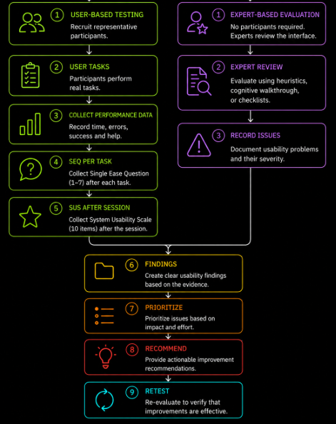
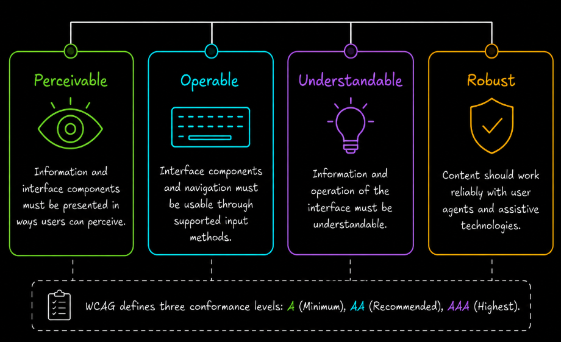
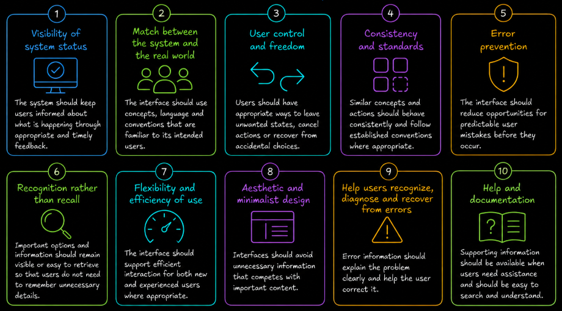

# Table of Contents: Usability Testing

- [Planning Usability Testing](#planning-usability-testing)
- [Usability Characteristics](#usability-characteristics)
- [Accessibility WCAG Based](#accessibility-wcag-based)
- [Nielsen's Usability Heuristics](#nielsens-usability-heuristics)
- [Performing Usability Evaluation](#performing-usability-evaluation)
- [Recording Usability Findings](#recording-usability-findings)
- [Prioritizing and Recommending Improvements](#prioritizing-and-recommending-improvements)
- [Retesting Usability](#retesting-usability)
- [When to Perform Usability Testing](#when-to-perform-usability-testing)

**Usability** is a quality characteristic that describes how effectively, efficiently and satisfactorily intended users can interact with a system to achieve specific goals in a defined context of use.

In QA, usability evaluation helps identify problems that may not cause a functional failure but still make a product difficult, inefficient or confusing to use. A registration form may submit data correctly, for example, while still having poor usability because important actions are difficult to discover or error messages do not help the user recover.

Usability can be evaluated in different ways. **User-based usability testing** involves representative users performing realistic tasks while their behavior and feedback are observed. This can provide direct evidence about how intended users experience the product, but planning and conducting formal participant studies is outside the practical scope of this lesson.

This lesson focuses on **expert-based usability evaluation**, which a QA tester can perform directly using checklist-based testing, **Heuristic Evaluation** and **Cognitive Walkthrough**.

## Planning Usability Testing

Usability evaluation begins by choosing the **feature or user flow** to evaluate. Throughout this lesson, **account registration** is used as the main example so that the workflow can be followed consistently from planning through retesting.

The tester then defines a clear **objective**. The objective describes the usability question that the evaluation should answer rather than giving a general instruction to test the interface.

For example, an objective for registration may be `Can a first-time user understand how to complete registration without unnecessary difficulty?`

The tester should also define the intended **context of use**, including the relevant users, devices, input methods and environment where practical.

In day-to-day QA work, usability evaluation is commonly supported by **experience-based testing techniques**. The tester uses knowledge of common usability problems, previous defects, product risks, expected user behavior and the application itself to guide the evaluation.

One useful technique is **checklist-based testing**. A usability checklist provides a reusable set of conditions or questions without prescribing exact test steps.

| Description                                                                                        | Pass | Fail | Notes |
| -------------------------------------------------------------------------------------------------- | ---- | ---- | ----- |
| Verify that important actions and controls are easy to identify.                                   |      |      |       |
| Check that navigation is clear, predictable and consistent.                                        |      |      |       |
| Verify that labels, instructions and terminology are easy to understand.                           |      |      |       |
| Check that similar controls and actions behave consistently throughout the interface.              |      |      |       |
| Verify that common tasks can be completed without unnecessary steps or repeated input.             |      |      |       |
| Check that the system provides clear feedback after user actions.                                  |      |      |       |
| Verify that users can understand the current system state and what is happening.                   |      |      |       |
| Check that predictable user errors are prevented where practical.                                  |      |      |       |
| Verify that error messages clearly explain the problem and how to correct it.                      |      |      |       |
| Check that users can recover from mistakes without unnecessarily restarting the task.              |      |      |       |
| Verify that entered information is preserved when a recoverable error occurs.                      |      |      |       |
| Check that important information is easy to find without requiring unnecessary memorization.       |      |      |       |
| Verify that interactive elements are easy to select and use.                                       |      |      |       |
| Check that destructive or irreversible actions are clearly identified before they are performed.   |      |      |       |
| Verify that help or supporting information is available where users are likely to need it.         |      |      |       |
| Verify that important functionality can be operated without relying only on a mouse or touch.      |      |      |       |
| Check that keyboard focus is visible and follows a logical order where keyboard use is supported.  |      |      |       |
| Verify that important information is not communicated through color alone.                         |      |      |       |
| Check that text and important interface elements remain readable when content is resized or zoomed.|      |      |       |
| Verify that form controls have understandable labels and that errors can be identified clearly.    |      |      |       |

The checklist should be adapted to the feature and **context of use** being tested. It is a practical starting point rather than a fixed checklist that must be applied unchanged to every interface.

When testing mobile interfaces, additional attention may be needed for **touch-target size and spacing**, **gesture usability**, **on-screen keyboards**, **thumb reach** and interactions that require unnecessarily precise input.

The checklist also contains basic accessibility checks. These can identify obvious barriers during routine usability evaluation, while a more systematic accessibility evaluation requires the additional WCAG-based checks introduced later in this lesson.

## Usability Characteristics

When evaluating an interface, the tester should understand the main usability characteristics and use them to decide what kinds of problems to look for.

**Learnability** describes how easily a new or unfamiliar user can understand the interface and determine how to perform important actions. The tester should look for unclear labels, unfamiliar icons, confusing navigation and interactions that require unnecessary explanation.

For the registration example, the tester can examine whether a first-time user would understand where registration begins, what information is required and how to continue through the flow.

**Efficiency** describes how much effort is required to complete a task once the interface is understood. The tester should look for unnecessary steps, repeated input, excessive navigation and other interactions that make common tasks harder than necessary.

For registration, repeatedly requesting the same information or requiring unnecessary screens would reduce efficiency even if registration can still be completed.

**Error prevention and recovery** describe how well the interface prevents predictable mistakes and helps users recover when mistakes occur. The tester should evaluate validation, understandable error messages, preserved input, confirmation of destructive actions and appropriate recovery options.

For example, if an invalid email address is entered, the registration form should identify the affected field, explain what needs to be corrected and preserve other valid information already entered.

**Satisfaction** concerns whether the interaction is comfortable, understandable and acceptable to users. Because satisfaction is subjective, a QA tester should avoid claiming to know what users personally prefer without user evidence. However, obvious sources of frustration such as unnecessary interruptions, confusing interactions and excessive effort can still be reported as usability concerns.

These characteristics help the tester understand what to inspect. They are not separate test procedures that must be executed independently.

## Choosing a Usability Evaluation Approach

After the feature, objective and context of use have been defined, the tester decides how the usability evaluation will be performed.

The main decision is whether the evaluation requires **representative users** or can be performed directly by a **tester or usability specialist**.

**User-based usability testing** should be selected when the tester needs evidence about how representative users actually interact with the interface.

Common user-based approaches include **moderated usability testing** and **unmoderated usability testing**. Moderated testing is useful when the tester needs to observe participants in real time, ask follow-up questions or investigate why users become confused. Unmoderated testing is useful when participants can complete the evaluation independently without a facilitator being present for every session.

The **Thinking Aloud Protocol** can be used during a moderated session when the tester needs to understand the participant's reasoning. The participant describes what they are looking for, what they expect and what they find confusing while completing the task.

Testing may also be **remote** or **in-person**. These terms describe where the evaluation takes place rather than separate usability methods. Remote testing is useful when participants are geographically distributed, while in-person testing may be appropriate when direct observation, physical devices or a controlled environment are important.

For the registration example, if the objective is `Can a first-time user complete registration without assistance?`, moderated usability testing with representative first-time users may be appropriate because the tester needs to observe where users hesitate, make errors or require assistance.

**Expert-based usability evaluation** should be selected when potential usability problems need to be identified without recruiting representative users.

A **Heuristic Evaluation** is useful when the interface needs to be inspected systematically against established usability principles. A **Cognitive Walkthrough** is more focused on whether a new or unfamiliar user can discover and understand the actions required to complete a particular task.

For the registration example, a Heuristic Evaluation could identify inconsistent labels, missing feedback or poor error prevention. A Cognitive Walkthrough could examine whether a first-time user can discover how to start registration, understand each required action and recognize whether registration was successful.

The two approaches can also complement each other. Expert evaluation can identify potential problems early, while user-based testing can provide direct evidence about how those problems affect intended users.

Some techniques are useful in more specific situations. **Paper prototyping and low-fidelity testing** are useful before the interface is fully implemented because sketches, wireframes or simple prototypes can be evaluated before significant development effort is spent.

**Guerrilla testing** can provide quick exploratory feedback when a formal study is not practical. Because participants are selected mainly based on availability, the results should not be treated as strong evidence about the entire target population.

The **RITE method**, Rapid Iterative Testing and Evaluation, is useful when the team wants to identify important usability problems, make changes quickly and evaluate the revised design during the same study cycle.

**Eye tracking** is a specialized technique used when the evaluation specifically requires evidence about where users direct their visual attention. It is not required for routine usability testing.

**A/B testing** is useful when two or more design variants need to be compared using a defined metric. It can show which variant performs better, but it does not necessarily explain why users experience difficulty and should not replace direct usability evaluation.

**Formative testing** describes usability evaluation performed during design and development to discover problems and improve the product. **Summative testing** evaluates usability against predefined goals or benchmarks. These terms describe the **purpose and timing** of an evaluation rather than separate execution techniques.

For example, an evaluation can be **formative, remote, moderated and use Thinking Aloud at the same time**. These terms describe different aspects of the same evaluation rather than competing methods.

Methods can also be **combined**. For example, the tester may first perform a Heuristic Evaluation to identify obvious problems and then conduct moderated sessions with representative users to determine how those problems affect actual user behavior.

Commercial tools such as **Maze**, **Lookback**, **Hotjar** and **UserTesting** can support remote studies, unmoderated sessions, recordings and behavioral analysis. Availability and pricing depend on the selected plan.

Free and open-source alternatives include **OpenReplay** and **PostHog** for session replay, **OBS Studio** for screen recording, **Jitsi Meet** for remote moderated sessions and **Penpot** for prototyping.

Heuristic evaluation, cognitive walkthrough and checklist-based testing do not require specialized usability software. A browser and an appropriate checklist or evaluation guide may be sufficient.

Once the evaluation approach has been selected, the tester determines which usability measures and user feedback are needed before performing the evaluation.

## Accessibility WCAG Based

**Accessibility** evaluates whether people with disabilities can perceive, operate, understand and interact with a system. Accessibility and usability overlap, but they are not identical disciplines. Accessibility testing specifically evaluates barriers that affect users with disabilities and users of assistive technologies.

Basic accessibility concerns can be considered during routine usability evaluation using the reusable checklist introduced during planning. When accessibility is part of the defined testing scope, the tester should extend those checks with a more systematic evaluation against the applicable accessibility requirements.

For web content, the **Web Content Accessibility Guidelines** or **WCAG** provide widely used accessibility requirements. WCAG is organized around four principles commonly abbreviated as **POUR**. **Perceivable** means that information and interface components must be presented in ways users can perceive. **Operable** means that interface components and navigation must be usable through supported input methods. **Understandable** means that information and operation of the interface must be understandable, while **Robust** means that content should work reliably with user agents and assistive technologies.

WCAG defines three conformance levels. **Level A** addresses basic accessibility requirements. **Level AA** addresses additional accessibility barriers and is a common target for organizations and regulations. **Level AAA** contains more demanding success criteria and represents the highest conformance level.

The required WCAG version and conformance level depend on the product, organization, contract and applicable law or policy. The tester should therefore not assume that one conformance level is legally required for every project.

Accessibility testing may include **keyboard-only navigation**, **screen-reader compatibility**, **visible focus indicators**, **logical focus order**, **text alternatives**, **color contrast**, **text resizing**, **zoom behavior**, **form labels**, **error identification**, **reduced-motion preferences** and **semantic structure** that assistive technologies can interpret.

For **keyboard testing**, the tester should verify that important functionality can be reached and operated without requiring a mouse or touch input. Focus should remain visible, move through the interface in a logical order and not become trapped in a component without a way to continue or return.

For **screen-reader testing**, the tester should evaluate whether important content, controls, labels, states and feedback are communicated meaningfully through assistive technology.

For **text alternatives**, meaningful non-text content such as informative images should provide an appropriate textual alternative where required. Decorative content should not create unnecessary information for assistive-technology users.

For **color and visual presentation**, important information should not depend only on color. Text and important interface elements should provide sufficient contrast according to the applicable accessibility requirements.

For **resizing and zoom**, content should remain readable and usable at the required zoom or text-resizing levels without important information or functionality becoming unavailable.

For **forms**, controls should have understandable labels, instructions should be available where necessary and validation errors should identify the affected input and communicate what needs to be corrected.

For **motion and animation**, interfaces should respect applicable reduced-motion preferences and avoid interactions that unnecessarily depend on motion where this creates an accessibility barrier.

For **semantic structure**, headings, landmarks, controls and other interface elements should use appropriate structure so that assistive technologies can interpret the relationships and purpose of the content.

Automated accessibility tools can support some of these checks. **axe** can detect accessibility issues in web pages and support developer or browser-based testing. **WAVE** provides visual feedback about accessibility problems directly on a page, while **Lighthouse** includes automated accessibility audits alongside other web quality checks. These tools can identify some accessibility problems, but they do not replace manual testing.

Free screen readers such as **NVDA** on Windows and **Orca** on Linux can be used to evaluate how content and controls are presented through assistive technology.

Accessibility findings should identify the **problem**, record the **evidence or location**, describe the **effect on the user** and relate the problem to the applicable accessibility requirement when required by the project.

For the registration example, a **Create Account** control that cannot be reached using the keyboard may prevent a keyboard-only user from completing registration. The finding should identify the affected control, how the problem was reproduced and the resulting user impact.

In a typical QA workflow, accessibility checks should be performed alongside usability testing throughout development rather than being postponed as a separate late-stage activity.

## Nielsen's Usability Heuristics

A **heuristic** is a practical rule of thumb used to identify usability problems without requiring a formal user test session. **Nielsen's 10 usability heuristics** provide a widely used set of these principles that experts can apply when evaluating an interface for common usability problems.

**Visibility of system status** means that the system should keep users informed about what is happening through appropriate and timely feedback. **Match between the system and the real world** means that the interface should use concepts, language and conventions familiar to its intended users. **User control and freedom** means that users should have appropriate ways to leave unwanted states, cancel actions or recover from accidental choices.

**Consistency and standards** means that similar concepts and actions should behave consistently and follow established conventions where appropriate. **Error prevention** means that the interface should reduce opportunities for predictable user mistakes before they occur. **Recognition rather than recall** means that important options and information should remain visible or easy to retrieve so that users do not need to remember unnecessary details. **Flexibility and efficiency of use** means that the interface should support efficient interaction for both new and experienced users where appropriate.

**Aesthetic and minimalist design** means that interfaces should avoid unnecessary information that competes with important content. **Help users recognize, diagnose and recover from errors** means that error information should explain the problem clearly and help the user correct it. **Help and documentation** means that supporting information should be available when users need assistance and should be easy to search and understand.

Heuristic evaluation is an **expert review method** and is not the same as observing representative users. It is usually faster and less resource-intensive than user testing, but the two approaches can reveal different types of problems.

Usability severity reflects **user impact** rather than whether a technical failure or crash occurs. In the registration example, a **Create Account** action that is technically available but cannot be found by intended users may be a critical usability problem because it prevents completion of the registration task.

## Performing Usability Evaluation

After the feature, objective, context of use and relevant checks have been defined, the tester can perform the usability evaluation.

For the practical QA scope of this lesson, two useful expert-based methods are **Heuristic Evaluation** and **Cognitive Walkthrough**. Checklist-based testing can support either method by providing reusable conditions to inspect.

In a **Heuristic Evaluation**, the tester systematically inspects the interface against recognized usability principles such as Nielsen's usability heuristics. The tester looks for violations or weaknesses and records where they occur and how they may affect the user.

For the registration example, the tester may identify that selecting **Create Account** provides no visible feedback. This can be recorded as a problem related to **Visibility of system status** because the user may not know whether registration is being processed.

In a **Cognitive Walkthrough**, the tester works through an important task from the perspective of a new or unfamiliar user. At each important action, the tester considers whether the user is likely to understand what they need to do, discover the correct action and understand the resulting feedback.

For registration, the tester can begin at the registration page and work through the complete flow while asking whether a first-time user would understand where to begin, what information to enter, how to continue and whether registration was successful.

The practical workflow is.

1. Select the feature or user flow.
2. Define the objective and context of use.
3. Select the relevant checklist checks and evaluation method.
4. Work through the interface systematically.
5. Record each usability problem and supporting evidence.
6. Describe the expected effect on the user.
7. Prioritize the findings.
8. Recommend an appropriate improvement.
9. Retest after the interface is changed.

Accessibility checks can be included in the same evaluation when they are part of the defined scope. More detailed accessibility findings should also reference the applicable accessibility requirement when required by the project.

## Recording Usability Findings

Expert-based usability evaluation does not normally produce participant measures such as task success rate, SEQ or SUS because representative users are not performing the evaluation.

Instead, the tester records each identified usability problem together with enough evidence to understand where the problem occurs and why it matters.

| Method                | Problem                                                | Evidence or Location                              | User Impact                                            |
|-----------------------|--------------------------------------------------------|---------------------------------------------------|--------------------------------------------------------|
| Heuristic Evaluation  | No feedback appears after submitting registration.     | Registration form after selecting Create Account  | A user may not know whether the action was successful. |
| Cognitive Walkthrough | The next registration action is difficult to discover. | Registration form after entering account details  | A first-time user may not understand how to continue.  |

For a **Heuristic Evaluation**, the finding may also identify the heuristic involved.

For a **Cognitive Walkthrough**, the finding may identify the action being examined and explain why a new or unfamiliar user may have difficulty discovering, performing or understanding it.

For an **accessibility finding**, the tester should record the barrier, location, user impact and applicable accessibility requirement when required.

A useful finding should clearly identify the **problem**, provide **evidence or location** and describe the **effect on the user**. A quantitative metric is not required for an expert-based usability finding to be valid.

## Prioritizing and Recommending Improvements

After usability findings are recorded, the tester should prioritize them according to their importance and expected user impact.

Problems that prevent an important task from being completed should normally receive more attention than minor inconvenience or cosmetic inconsistency. Frequency may also be considered when the same problem appears repeatedly across the interface.

Technical failure is not required for a usability issue to be serious. An application may remain stable while a usability problem makes an essential action difficult to discover or understand.

Recommendations should address the observed problem without prescribing unnecessary implementation details.

For example, if the **Create Account** action is difficult to discover, the recommendation may be to improve its **visibility and discoverability** rather than requiring a particular visual design without supporting evidence.

The findings can then be reviewed with the appropriate product, design and development stakeholders so that changes can be selected and implemented.

## Retesting Usability

After an interface is changed, the affected usability problem should be evaluated again.

The tester should repeat the relevant checklist checks, Heuristic Evaluation or Cognitive Walkthrough and verify whether the original problem has been resolved without introducing a new usability problem.

For example, if the **Create Account** action was changed because it was difficult to discover, the tester should repeat the registration walkthrough and confirm that the action is now easier to identify while the rest of the flow remains understandable.

Retesting should focus on the changed area and any related interactions that may have been affected by the improvement.

## When to Perform Usability Testing

Usability evaluation is most valuable when it begins early and continues at appropriate points throughout the software development life cycle.

It can be performed on sketches, wireframes, prototypes, partially implemented features and release candidates. Early evaluation can identify confusing workflows before they become expensive to redesign, while later evaluation can check the implemented interface in its intended context.

Usability evaluation matters to QA because poor usability can increase user errors, support requests, abandonment and rework even when the underlying functionality works correctly.

For the planned scope, the evaluation can stop when the selected feature or user flow has been inspected against the defined objective, relevant checks have been completed and identified problems have been documented with enough evidence for the team to make a decision.

The key point is that **expert-based usability evaluation gives QA testers a practical way to identify usability problems systematically without requiring a formal participant study**.
