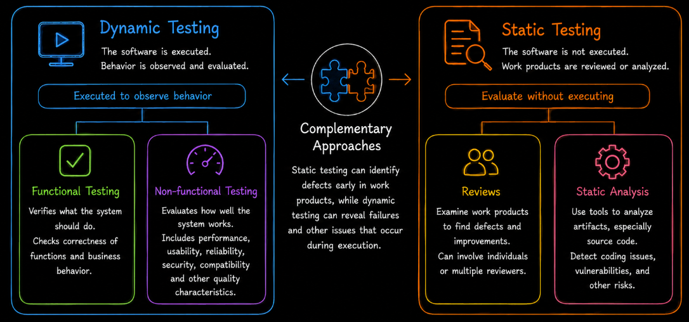

# Types of Testing Overview

Software testing can be classified in different ways depending on what aspect of testing is being considered. One important classification is based on **whether the software is executed during testing**.

From this perspective, testing is divided into two main types: **dynamic testing** and **static testing**.

**Dynamic testing** evaluates software by executing it and observing its behavior, while **static testing** evaluates software work products without executing the software.

These approaches complement each other. Static testing can identify defects in work products before execution, while dynamic testing can reveal failures and other problems that become observable when the software runs.

We begin with **dynamic testing**, where the software is executed and its behavior is evaluated against defined expectations. The tester interacts with or exercises the running system and observes the resulting behavior.

Depending on the testing objective, the evaluation may focus on **what the system does** or on **how well the system operates**. For this reason, dynamic testing is divided into two broad categories: **functional testing** and **non-functional testing**.

**Functional testing** evaluates whether the system performs the required functions correctly. It focuses on expected behavior, application rules, inputs, outputs and interactions defined by the requirements or other test basis.

In practical terms, functional testing answers the question **Does the system do what it is supposed to do?**

Examples include verifying account registration, login behavior, form submission, calculations and application rules.

While functional testing focuses on what the system does, **non-functional testing** evaluates quality characteristics that describe how well the system operates.

These characteristics can include **performance**, **usability**, **reliability**, **security**, **compatibility** and other quality characteristics relevant to the product.

In practical terms, non-functional testing examines **how well the system works under defined conditions and whether its quality characteristics meet the required expectations**.

For example, account registration may be functionally correct because users can successfully create an account, while still having poor usability if first-time users cannot easily understand how to complete the process.

Functional and non-functional testing therefore evaluate different aspects of a running system. The dedicated sections that follow examine these areas and their testing approaches in greater detail.

Not all testing, however, requires the software to be executed. This brings us to **static testing**.

**Static testing** evaluates software work products without executing the software. Instead of observing runtime behavior, the tester examines artifacts produced during software development.

These work products can include **requirements**, **user stories**, **design documents**, **source code**, **test documentation** and other development artifacts.

The purpose of static testing is to identify defects, inconsistencies, ambiguities and other quality problems directly in these work products.

For example, static testing may identify an ambiguous requirement before implementation, an inconsistency between two design documents or a coding problem before the affected code is executed.

Static testing can be performed through **reviews** and **static analysis**.

**Reviews** involve examining work products to identify defects and opportunities for improvement. Depending on the review approach, this may involve individual reviewers or multiple participants.

**Static analysis** uses tools to examine artifacts, particularly source code, without executing the software. Depending on the tool and objective, static analysis can identify coding-standard violations, suspicious code patterns, potential defects and other maintainability or security-related issues.

Because static testing does not require a running application, it can begin early in the software development lifecycle and can help prevent defects from progressing into later development and testing activities.

Together, **dynamic testing** and **static testing** provide complementary ways of evaluating software quality. The following material examines their individual testing types, approaches and techniques in greater detail.
