# Vektorinė grafika - turinys

- [Kas yra vektorinė grafika](#kas-yra-vektorinė-grafika)
- [Vektorinės ir taškinės grafikos skirtumai](#vektorinės-ir-taškinės-grafikos-skirtumai)
- [Vektorinės grafikos privalumai](#vektorinės-grafikos-privalumai)
- [Vektorinės grafikos trūkumai](#vektorinės-grafikos-trūkumai)
- [Vektoriniai failų formatai](#vektoriniai-failų-formatai)
- [Taškiniai failų formatai](#taškiniai-failų-formatai)
- [Inkscape pagrindai](#inkscape-pagrindai)
- [Objektų eksportavimas](#objektų-eksportavimas)

Vektorinė grafika yra viena svarbiausių kompiuterinės grafikos sričių, plačiai naudojama kuriant logotipus, piktogramas, iliustracijas, plakatus, schemas ir kitus grafinius objektus.

Kasdienybėje su vektorine grafika susiduriame daug dažniau, nei gali pasirodyti iš pirmo žvilgsnio. Įmonių logotipai, kelio ženklai, įvairios piktogramos interneto svetainėse ar mobiliųjų programėlių sąsajose dažniausiai yra kuriami būtent naudojant vektorinę grafiką.

Skirtingai nei nuotraukos ar kiti taškinės grafikos vaizdai, vektorinės grafikos objektai kuriami naudojant matematinius aprašymus. Dėl šios priežasties juos galima didinti ar mažinti neprarandant kokybės.

Šioje temoje nagrinėsime, kas yra vektorinė grafika, kuo ji skiriasi nuo taškinės grafikos, kokie yra jos privalumai ir trūkumai, kokie failų formatai naudojami saugant vektorinius ir taškinius vaizdus bei kaip dirbti su viena populiariausių vektorinės grafikos kūrimo programų – *Inkscape*.

Taip pat susipažinsime su grafikos objektų eksportavimu į skirtingus failų formatus ir išsiaiškinsime, kada verta naudoti vektorinę, o kada taškinę grafiką.

Pirmiausia svarbu suprasti pagrindinę sąvoką – kas yra vektorinė grafika.

## Kas yra vektorinė grafika

Vektorinė grafika yra kompiuterinės grafikos tipas, kuriame vaizdai kuriami naudojant matematinius objektų aprašymus.

Angliškai vektorinė grafika vadinama *vector graphics*.

Skirtingai nei taškinėje grafikoje, kur vaizdas sudarytas iš daugybės atskirų taškų (*pixels*), vektorinėje grafikoje vaizdai kuriami naudojant linijas, kreives, geometrines figūras ir kitus grafinius objektus.

Kiekvienas objektas aprašomas matematinėmis formulėmis, kurios nusako jo formą, dydį, spalvą ir padėtį. Dėl šios priežasties kompiuteris gali bet kuriuo metu tiksliai atkurti vaizdą nepriklausomai nuo jo dydžio.

Pavyzdžiui, apskritimas vektorinėje grafikoje nėra sudarytas iš daugybės taškų. Vietoje to saugoma informacija apie apskritimo centrą, spindulį ir kitas savybes. Keičiant vaizdo dydį šie duomenys perskaičiuojami iš naujo, todėl vaizdas išlieka ryškus.

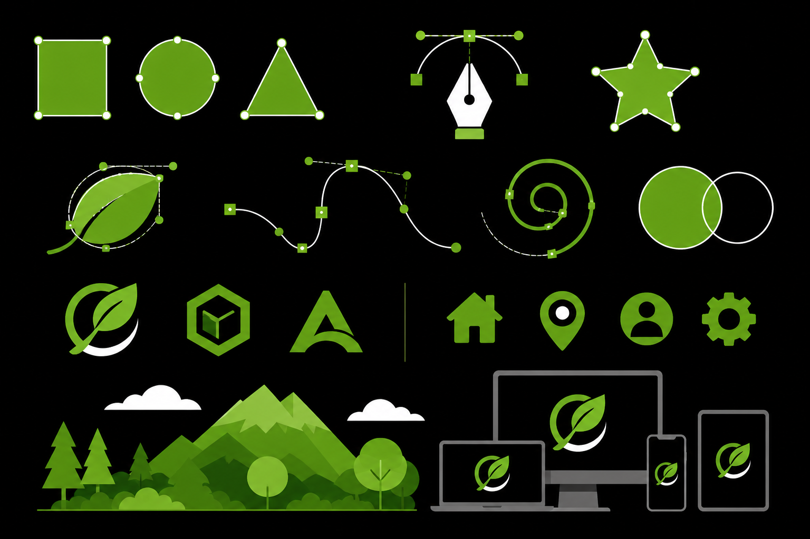

Vektorinė grafika dažniausiai naudojama kuriant logotipus, piktogramas, schemas, techninius brėžinius, plakatus, iliustracijas ir kitus grafinius objektus, kuriuos gali reikėti spausdinti arba naudoti įvairaus dydžio ekranuose.

Viena svarbiausių vektorinės grafikos savybių yra galimybė keisti vaizdo dydį neprarandant kokybės. Dėl to tas pats logotipas gali būti naudojamas tiek mažoje interneto svetainės piktogramoje, tiek dideliame reklaminiame stende.

Vektoriniai objektai taip pat yra lengvai redaguojami. Galima keisti jų spalvas, formas, dydžius ar atskiras objekto dalis neprarandant vaizdo kokybės.

Dažniausiai vektorinė grafika kuriama specialiomis programomis, tokiomis kaip *Inkscape*, *Adobe Illustrator*, *CorelDRAW* ar kitais vektorinės grafikos redaktoriais.

Svarbu suprasti, kad vektorinė grafika geriausiai tinka geometrinėms figūroms, tekstui ir iliustracijoms, tačiau nėra tinkamiausias pasirinkimas sudėtingoms nuotraukoms ar labai detaliems vaizdams.

Trumpai galima įsiminti taip **vektorinė grafika** yra grafika, kuri kuriama naudojant matematinius objektų aprašymus, todėl vaizdus galima didinti ir mažinti neprarandant kokybės.

Kai jau aišku, kas yra vektorinė grafika, galima išsiaiškinti, kuo ji skiriasi nuo taškinės grafikos ir kokiais atvejais naudojamas kiekvienas iš šių grafikos tipų.

## Vektorinės ir taškinės grafikos skirtumai

Kompiuterinė grafika dažniausiai skirstoma į du pagrindinius tipus – vektorinę grafiką ir taškinę grafiką.

Angliškai vektorinė grafika vadinama *vector graphics*, o taškinė grafika – *raster graphics* arba *bitmap graphics*.

Nors abu grafikos tipai naudojami vaizdams kurti ir saugoti, jų veikimo principas yra skirtingas.

Vektorinė grafika kuriama naudojant matematinius objektų aprašymus. Vaizdai sudaromi iš linijų, kreivių, geometrinių figūrų ir kitų objektų, kurių savybės aprašomos formulėmis.

Tuo tarpu taškinė grafika sudaryta iš daugybės mažų taškų, vadinamų pikseliais (*pixels*). Kiekvienas pikselis turi savo spalvą ir kartu su kitais pikseliais sudaro bendrą vaizdą.

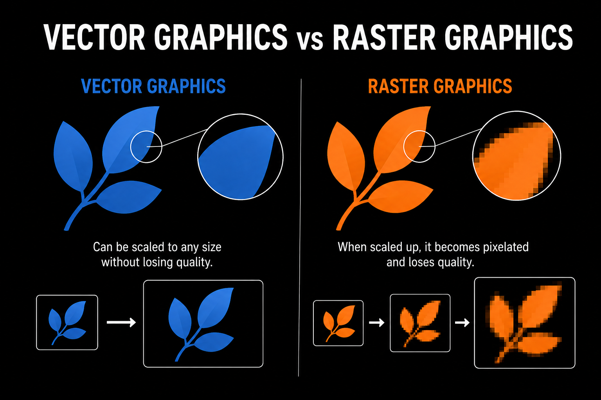

Vienas svarbiausių skirtumų yra vaizdo mastelio keitimas. Vektorinės grafikos objektus galima didinti ar mažinti neprarandant kokybės, nes kompiuteris kiekvieną kartą iš naujo apskaičiuoja objektų formas.

Taškinėje grafikoje vaizdas sudarytas iš fiksuoto skaičiaus pikselių. Todėl stipriai padidinus vaizdą pradeda matytis atskiri taškai ir vaizdas tampa neryškus.

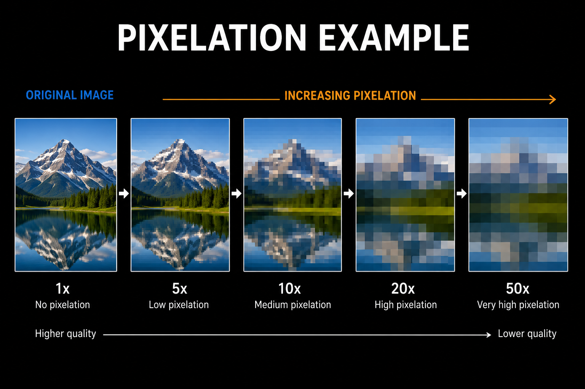

Dar vienas skirtumas yra naudojimo paskirtis. Vektorinė grafika geriausiai tinka logotipams, piktogramoms, schemoms, techniniams brėžiniams ir iliustracijoms. Taškinė grafika dažniausiai naudojama nuotraukoms ir labai detaliems vaizdams saugoti.

Pavyzdžiui, įmonės logotipas dažniausiai kuriamas vektoriniu formatu, nes jį gali reikėti naudoti tiek vizitinėje kortelėje, tiek dideliame reklaminiame stende. Tuo tarpu nuotrauka iš fotoaparato beveik visada saugoma taškinės grafikos formatu.

Skiriasi ir failų dydžiai. Paprasti vektoriniai objektai dažnai užima mažiau vietos nei aukštos raiškos taškiniai vaizdai. Tačiau sudėtingoms iliustracijoms šis skirtumas gali sumažėti.

Svarbu suprasti, kad nei vienas grafikos tipas nėra geresnis už kitą visose situacijose. Vektorinė grafika puikiai tinka objektams, kuriuos reikia keisti ar didinti, o taškinė grafika geriausiai tinka nuotraukoms ir labai detaliems vaizdams.

Trumpai galima įsiminti taip **vektorinė grafika** sudaryta iš matematinių objektų ir gali būti didinama neprarandant kokybės, o **taškinė grafika** sudaryta iš pikselių ir didinant gali prarasti kokybę.

Kai jau aišku, kuo skiriasi vektorinė ir taškinė grafika, galima susipažinti su pagrindiniais vektorinės grafikos privalumais.

## Vektorinės grafikos privalumai

Vektorinė grafika yra plačiai naudojama grafikos kūrime dėl savo lankstumo ir aukštos vaizdo kokybės. Dėl matematinio objektų aprašymo ji turi nemažai privalumų lyginant su taškine grafika.

Vienas svarbiausių vektorinės grafikos privalumų yra galimybė keisti vaizdo dydį neprarandant kokybės. Objektus galima didinti arba mažinti tiek, kiek reikia, o jų kraštai išlieka ryškūs ir tikslūs.

Pavyzdžiui, tas pats logotipas gali būti naudojamas tiek mažoje interneto svetainės piktogramoje, tiek dideliame reklaminiame stende. Abiem atvejais vaizdas išliks aiškus ir kokybiškas.

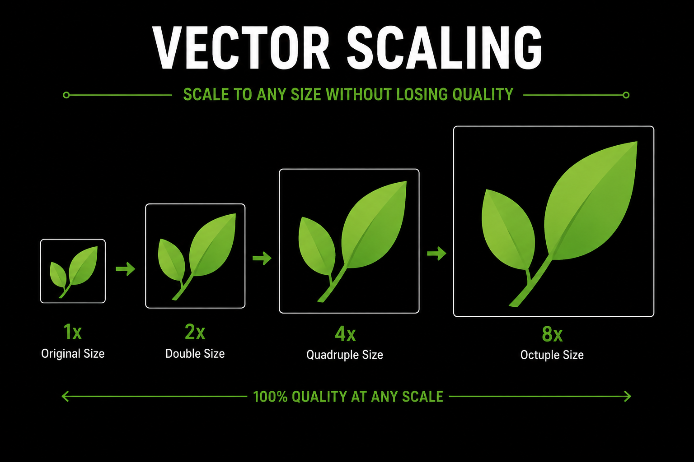

Kitas svarbus privalumas yra lengvas redagavimas. Vektorinės grafikos objektai sudaryti iš atskirų elementų, todėl galima keisti jų formas, spalvas, dydžius ar padėtį neprarandant kokybės.

Tai ypač naudinga kuriant logotipus, iliustracijas ar techninius brėžinius, kuriuos dažnai reikia koreguoti ir atnaujinti.

Vektoriniai failai taip pat dažnai užima mažiau vietos nei aukštos raiškos taškinės grafikos failai. Vietoje milijonų pikselių saugomi tik objektų matematiniai aprašymai.

Dar vienas privalumas yra tikslumas. Linijos, kreivės ir geometrinės figūros išlieka lygios ir ryškios nepriklausomai nuo vaizdo dydžio. Dėl šios priežasties vektorinė grafika dažnai naudojama techniniuose brėžiniuose, schemose ir inžineriniuose projektuose.

Vektorinė grafika taip pat puikiai tinka spausdinimui. Kadangi vaizdo kokybė nepriklauso nuo dydžio, spausdinant didelius plakatus ar reklaminius stendus išlaikomas aukštas detalumo lygis.

Dėl šių savybių vektorinė grafika yra vienas pagrindinių pasirinkimų kuriant logotipus, piktogramas, iliustracijas, plakatus, schemas ir kitus grafinius objektus.

Trumpai galima įsiminti taip **vektorinė grafika** leidžia keisti vaizdo dydį neprarandant kokybės, yra lengvai redaguojama, dažnai užima mažiau vietos ir užtikrina tikslų bei ryškų vaizdo atvaizdavimą.

Kai jau aiškūs pagrindiniai vektorinės grafikos privalumai, galima susipažinti ir su jos trūkumais bei situacijomis, kuriose geriau naudoti taškinę grafiką.

## Vektorinės grafikos trūkumai

Nors vektorinė grafika turi daug privalumų, ji nėra tinkamiausias pasirinkimas visose situacijose. Tam tikrais atvejais taškinė grafika gali būti geresnis sprendimas.

Vienas pagrindinių vektorinės grafikos trūkumų yra ribotos galimybės vaizduoti labai sudėtingus ir detalius vaizdus. Kadangi vektorinė grafika sudaryta iš matematinių objektų, ji geriausiai tinka geometrinėms figūroms, logotipams, schemoms ir iliustracijoms.

Tačiau kuriant ar redaguojant nuotraukas dažniausiai naudojama taškinė grafika. Nuotraukose gali būti milijonai skirtingų spalvų ir smulkių detalių, kurias vektoriniais objektais atkurti būtų labai sudėtinga.

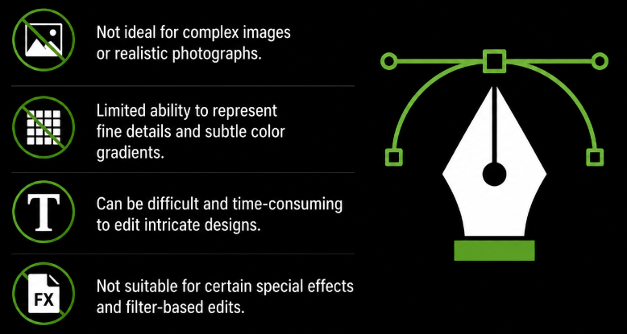

Kitas trūkumas yra tai, kad sudėtingų iliustracijų kūrimas gali užtrukti daugiau laiko. Kiekvieną objektą dažnai reikia kurti ir redaguoti atskirai, todėl kai kurie projektai tampa sudėtingesni nei dirbant su taškine grafika.

Taip pat sudėtingi vektoriniai piešiniai gali turėti labai daug objektų. Tokiais atvejais failai tampa didesni, o jų redagavimas gali pareikalauti daugiau kompiuterio resursų.

Dar vienas trūkumas yra suderinamumas. Nors dauguma šiuolaikinių programų palaiko populiarius vektorinius formatus, kai kurios sistemos ar programos gali nepalaikyti tam tikrų specializuotų failų formatų.

Dėl šių priežasčių vektorinė grafika nėra universali visiems atvejams. Ji puikiai tinka logotipams, piktogramoms, iliustracijoms ir schemoms, tačiau nuotraukoms ar itin detaliems vaizdams dažniausiai pasirenkama taškinė grafika.

Svarbu suprasti, kad grafikos tipo pasirinkimas priklauso nuo konkretaus projekto poreikių. Kiekvienas grafikos tipas turi savo stipriąsias ir silpnąsias puses.

Trumpai galima įsiminti taip **vektorinė grafika** nėra tinkama labai detalioms nuotraukoms, sudėtingų iliustracijų kūrimas gali užtrukti ilgiau, o kai kurie vektoriniai formatai gali būti nepalaikomi visose programose.

Kai jau aiškūs pagrindiniai vektorinės grafikos privalumai ir trūkumai, galima susipažinti su dažniausiai naudojamais vektoriniais failų formatais.

## Vektoriniai failų formatai

Sukūrus vektorinės grafikos objektą, jį reikia išsaugoti tam tikru failo formatu. Failo formatas nusako, kaip bus saugoma informacija apie objektų formas, spalvas, linijas ir kitus grafinius elementus.

Vektoriniai failų formatai yra skirti saugoti objektus taip, kad juos būtų galima redaguoti, keisti jų dydį ir naudoti įvairiose programose neprarandant kokybės.

Angliškai failo formatas vadinamas *file format*.

Vienas populiariausių vektorinių formatų yra **SVG** (*Scalable Vector Graphics*). Šis formatas plačiai naudojamas interneto svetainėse, nes leidžia kurti kokybiškus grafinius objektus, kurių dydį galima keisti neprarandant kokybės.

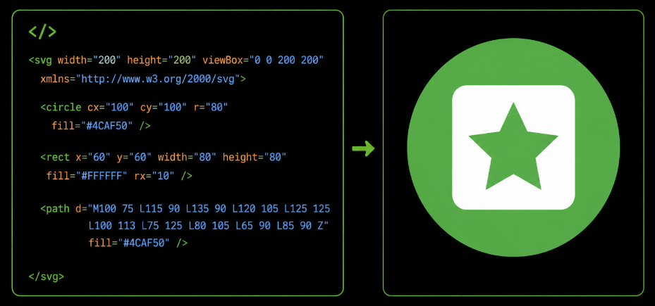

Kitas dažnai naudojamas formatas yra **AI** (*Adobe Illustrator Artwork*). Tai pagrindinis programos *Adobe Illustrator* failų formatas, skirtas saugoti ir redaguoti vektorinius objektus.

Profesionalioje leidyboje ir spaudos darbuose dažnai naudojamas **EPS** (*Encapsulated PostScript*) formatas. Jis leidžia išsaugoti aukštos kokybės vektorinius objektus ir yra suderinamas su daugeliu grafikos programų.

Dar vienas plačiai naudojamas formatas yra **PDF** (*Portable Document Format*). Nors dažniausiai jis siejamas su dokumentais, PDF taip pat gali saugoti vektorinę grafiką ir išlaikyti jos kokybę įvairiuose įrenginiuose.

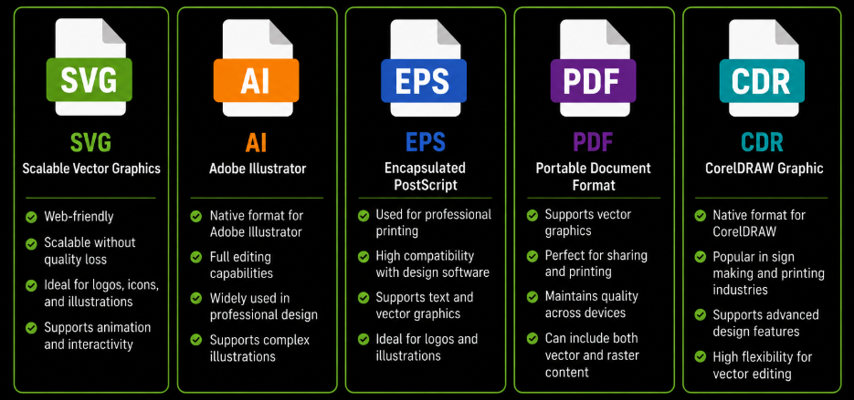

Svarbu suprasti, kad visi šie formatai saugo objektų matematinius aprašymus, todėl vaizdus galima didinti arba mažinti neprarandant kokybės.

Skirtingi formatai naudojami skirtingais tikslais. SVG dažniausiai naudojamas interneto svetainėse, AI skirtas darbui su *Adobe Illustrator*, EPS dažnai naudojamas spaudoje, o PDF tinka dokumentų ir grafikos dalijimuisi tarp skirtingų sistemų.

Renkantis failo formatą svarbu atsižvelgti į tai, kur ir kaip grafika bus naudojama ateityje.

Trumpai galima įsiminti taip **SVG**, **AI**, **EPS** ir **PDF** yra dažniausiai naudojami vektoriniai failų formatai, kurie leidžia saugoti ir redaguoti grafinius objektus neprarandant kokybės.

Kai jau aišku, kokie failų formatai naudojami vektorinei grafikai saugoti, galima susipažinti su pagrindiniais taškinės grafikos failų formatais.

## Taškiniai failų formatai

Taškinė grafika saugoma specialiais failų formatais, kurie vaizdą aprašo kaip daugybę atskirų taškų, vadinamų pikseliais (*pixels*).

Kiekvienas pikselis turi savo spalvą ir kartu su kitais pikseliais sudaro bendrą vaizdą. Kuo daugiau pikselių turi vaizdas, tuo jis gali būti detalesnis ir kokybiškesnis.

Angliškai taškinė grafika vadinama *raster graphics* arba *bitmap graphics*.

Vienas dažniausiai naudojamų taškinės grafikos formatų yra **PNG** (*Portable Network Graphics*). Šis formatas pasižymi gera vaizdo kokybe ir palaiko skaidrų foną (*transparent background*), todėl dažnai naudojamas interneto svetainėse, logotipuose ir įvairiuose grafiniuose elementuose.

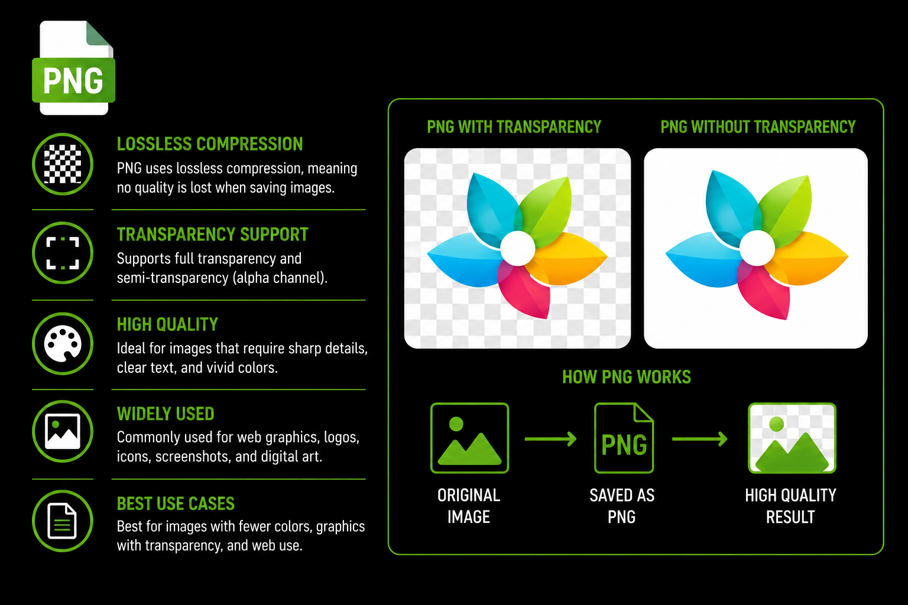

Kitas labai populiarus formatas yra **JPEG** arba **JPG** (*Joint Photographic Experts Group*). Šis formatas dažniausiai naudojamas nuotraukoms saugoti, nes leidžia sumažinti failo dydį išlaikant pakankamai gerą vaizdo kokybę.

Tačiau suspaudžiant vaizdą dalis informacijos yra prarandama, todėl dažnai redaguojant ir pakartotinai išsaugant JPEG failus kokybė gali mažėti.

**GIF** (*Graphics Interchange Format*) yra formatas, kuris palaiko paprastas animacijas. Dėl šios priežasties jis dažnai naudojamas trumpoms animacijoms ir interneto svetainėse naudojamiems judantiems paveikslėliams.

Dar vienas taškinės grafikos formatas yra **BMP** (*Bitmap*). Tai vienas seniausių grafikos formatų, kuris saugo vaizdus beveik nesuspaustus. Dėl to BMP failai dažnai užima daugiau vietos nei kiti taškinės grafikos formatai.

Šiuolaikinėse sistemose vis dažniau naudojamas ir **WebP** formatas. Jis leidžia išlaikyti gerą vaizdo kokybę bei mažesnį failo dydį, todėl dažnai naudojamas interneto svetainėse.

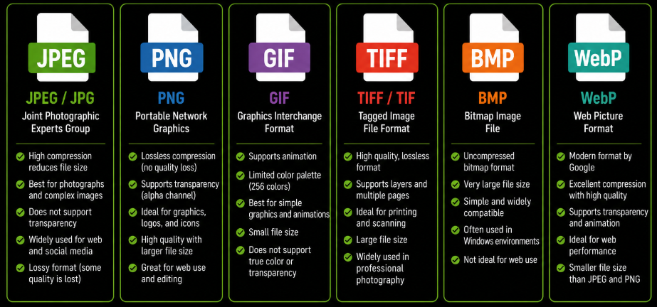

Svarbu suprasti, kad visi taškinės grafikos formatai saugo informaciją apie kiekvieną vaizdo pikselį. Dėl šios priežasties stipriai padidinus vaizdą gali pradėti matytis atskiri taškai, o vaizdo kokybė sumažėja.

Skirtingi formatai naudojami skirtingiems tikslams. PNG dažnai naudojamas grafiniams elementams ir skaidriems fonams, JPEG dažniausiai skirtas nuotraukoms, GIF naudojamas animacijoms, BMP paprastiems nesuspaustiems vaizdams, o WebP leidžia sumažinti failų dydį išlaikant gerą kokybę.

Trumpai galima įsiminti taip **PNG**, **JPEG**, **GIF**, **BMP** ir **WebP** yra dažniausiai naudojami taškinės grafikos failų formatai, kurie vaizdą saugo kaip pikselių rinkinį.

Kai jau aišku, kokie failų formatai naudojami taškinei grafikai saugoti, galima susipažinti su viena populiariausių vektorinės grafikos kūrimo programų – *Inkscape*.

## Inkscape pagrindai

Norint kurti ir redaguoti vektorinę grafiką, naudojamos specialios programos, vadinamos vektorinės grafikos redaktoriais.

Viena populiariausių ir plačiausiai naudojamų tokių programų yra **Inkscape**.

*Inkscape* yra nemokama atvirojo kodo (*open source*) vektorinės grafikos kūrimo programa, leidžianti kurti logotipus, piktogramas, iliustracijas, schemas, plakatus ir kitus grafinius objektus.

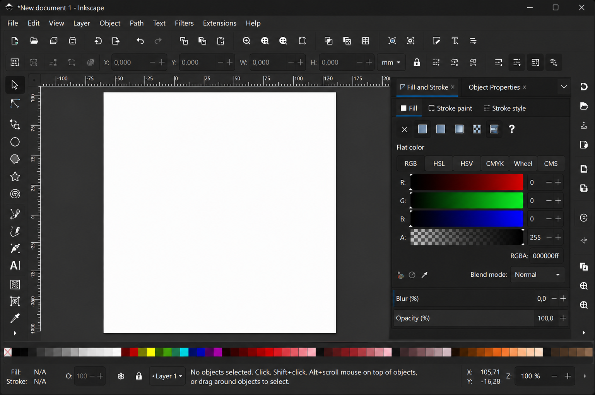

Pagrindinis Inkscape privalumas yra tai, kad programa naudoja **SVG** (*Scalable Vector Graphics*) formatą, kuris yra vienas populiariausių vektorinės grafikos formatų.

Dirbant su Inkscape grafika kuriama naudojant įvairius objektus. Programoje galima kurti stačiakampius, apskritimus, daugiakampius, linijas, kreives ir tekstinius elementus.

Kiekvienas objektas gali būti redaguojamas atskirai. Galima keisti jo dydį, spalvą, kontūrą, padėtį ar formą neprarandant vaizdo kokybės.

Vienas svarbiausių Inkscape įrankių yra **Selection Tool** (*pasirinkimo įrankis*), kuris naudojamas objektams pažymėti, perkelti, pasukti ar keisti jų dydį.

Taip pat dažnai naudojamas **Node Tool** (*mazgų įrankis*), leidžiantis redaguoti objektų kontūrus ir kreives.

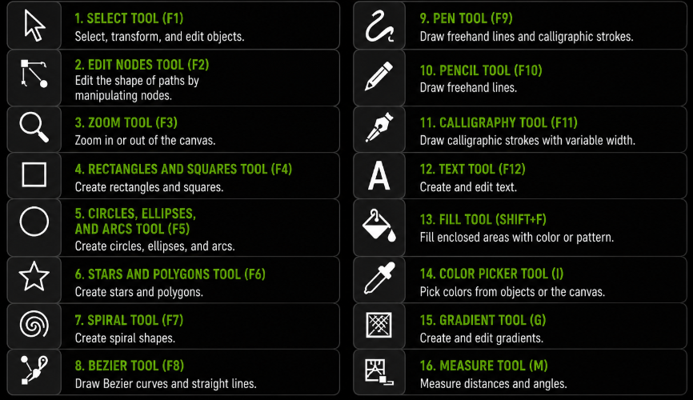

Programoje galima dirbti su sluoksniais (*layers*). Sluoksniai leidžia atskirti skirtingas piešinio dalis ir patogiau organizuoti sudėtingesnius projektus.

Inkscape taip pat suteikia galimybę grupuoti objektus (*grouping*), kopijuoti juos, lygiuoti, keisti jų išdėstymą ir taikyti įvairius grafinius efektus.

Kuriant vektorinę grafiką dažnai naudojami užpildo (*fill*) ir kontūro (*stroke*) nustatymai. Užpildas nusako objekto vidinę spalvą, o kontūras apibrėžia objekto kraštines.

Dėl savo funkcionalumo ir nemokamo naudojimo Inkscape yra dažnai naudojama mokyklose, universitetuose, įvairiuose projektuose bei profesionalioje grafikos kūrimo veikloje.

Svarbu suprasti, kad Inkscape yra tik viena iš daugelio vektorinės grafikos programų, tačiau jos veikimo principai yra panašūs ir kitose programose, tokiose kaip *Adobe Illustrator* ar *CorelDRAW*.

Trumpai galima įsiminti taip **Inkscape** yra nemokama vektorinės grafikos kūrimo programa, leidžianti kurti ir redaguoti grafinius objektus, dirbti su sluoksniais, naudoti įvairius piešimo įrankius ir išsaugoti darbus **SVG** formatu.

Kai jau aišku, kaip kuriami ir redaguojami vektoriniai objektai naudojant Inkscape, galima susipažinti su jų eksportavimu į skirtingus failų formatus.

## Objektų eksportavimas

Sukūrus vektorinės grafikos objektą dažnai reikia jį išsaugoti arba paruošti naudojimui kitose programose, interneto svetainėse, dokumentuose ar spaudos darbuose. Tam naudojamas objektų eksportavimas.

Angliškai eksportavimas vadinamas *export*.

Eksportavimo metu sukurtas objektas arba visas projektas išsaugomas pasirinktu failo formatu. Nuo pasirinkto formato priklauso, kaip grafika bus naudojama ateityje ir ar ją bus galima toliau redaguoti.

Jeigu planuojama grafiką redaguoti ateityje, dažniausiai pasirenkamas vektorinis formatas, pavyzdžiui **SVG**, **AI**, **EPS** arba **PDF**. Tokiu atveju išsaugomi visi objektai ir jų savybės, todėl grafiką galima keisti neprarandant kokybės.

Tačiau ne visos programos ar sistemos palaiko vektorinius formatus. Dėl šios priežasties dažnai tenka eksportuoti objektus į taškinės grafikos formatus, tokius kaip **PNG**, **JPEG** ar **WebP**.

Eksportuojant į taškinę grafiką svarbi tampa **raiška** (*resolution*). Raiška nusako, kiek taškų arba pikselių sudaro vaizdą.

Kuo didesnė raiška, tuo daugiau detalių gali būti matoma vaizde. Tačiau didesnė raiška dažniausiai reiškia ir didesnį failo dydį.

Pavyzdžiui, interneto svetainėms dažniausiai naudojami mažesnės raiškos paveikslėliai, kad jie greičiau būtų įkeliami. Tuo tarpu spaudos darbams dažnai reikalinga didesnė raiška, kad atspausdintas vaizdas išliktų kokybiškas.

Eksportuojant į **PNG** formatą galima išsaugoti skaidrų foną (*transparent background*). Tai ypač naudinga kuriant logotipus, piktogramas ar kitus grafinius elementus, kurie bus naudojami skirtingų spalvų fonuose.

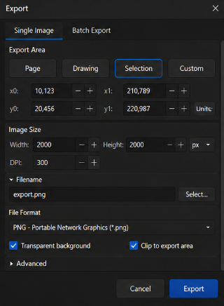

Prieš eksportuojant svarbu įvertinti, kur grafika bus naudojama. Jei reikalingas tolesnis redagavimas, verta rinktis vektorinį formatą. Jei grafika bus naudojama interneto svetainėje, dokumente ar pristatyme, dažnai pasirenkamas taškinis formatas.

Tinkamai pasirinktas eksportavimo formatas leidžia išlaikyti gerą vaizdo kokybę ir užtikrina, kad grafika bus tinkama numatytam naudojimo tikslui.

Trumpai galima įsiminti taip **eksportavimas** leidžia išsaugoti sukurtą grafiką pasirinktu formatu, **vektoriniai formatai** tinka tolesniam redagavimui, o **taškiniai formatai** dažniausiai naudojami grafikos pateikimui interneto svetainėse, dokumentuose ir kituose skaitmeniniuose produktuose.
