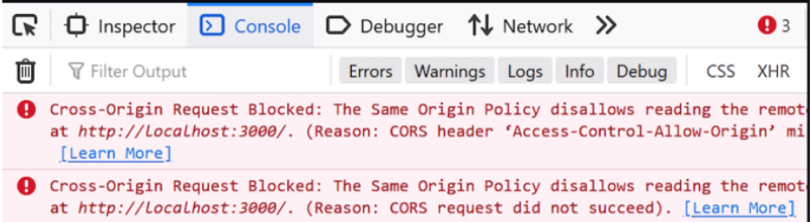
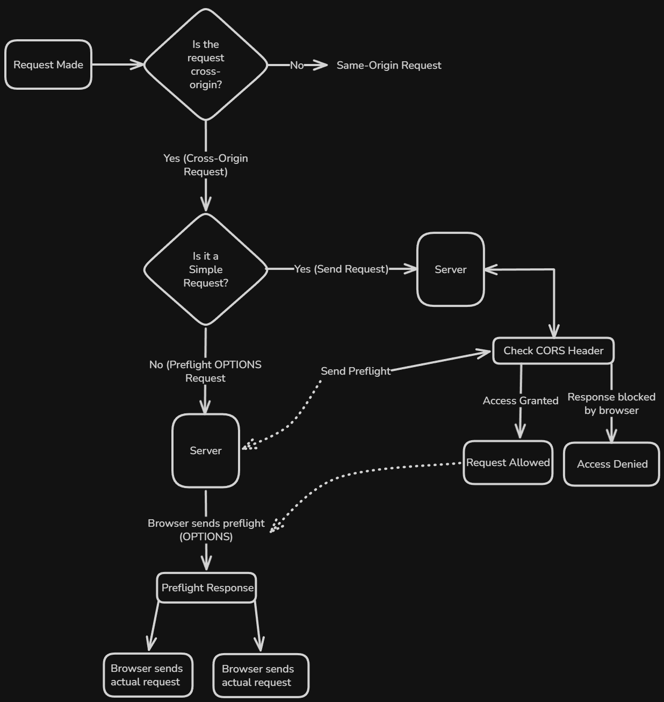
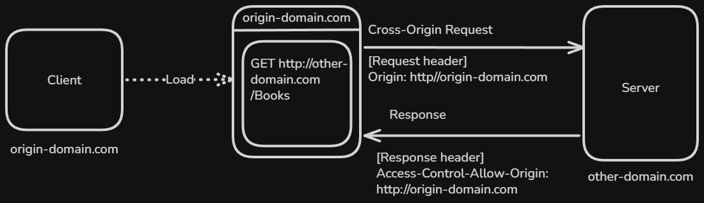
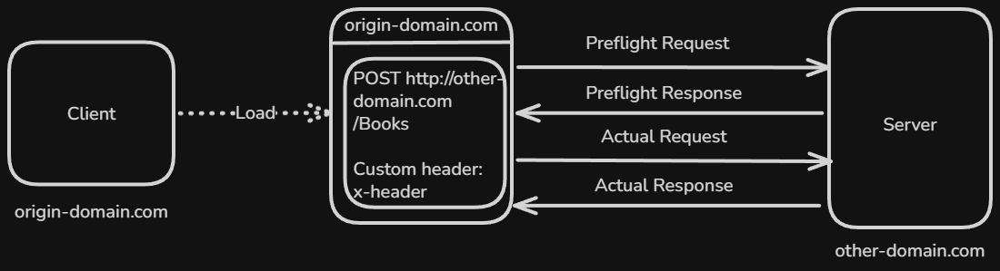

# Content of CORS

- [What is CORS and why it exists](#what-is-cors-and-why-it-exists)
- [What defines an origin](#what-defines-an-origin)
- [How the browser checks CORS](#how-the-browser-checks-cors)
- [Simple requests (no preflight)](#simple-requests-no-preflight)
- [Preflight requests](#preflight-requests)

Web applications rarely operate in isolation. A frontend application often needs to communicate with APIs that are hosted on different domains, ports, or protocols.

At this point, it is important to understand that browsers do not allow all such requests by default. Instead, they enforce a security model that restricts how resources can be shared across different origins.

To work with cross-origin requests, we need to understand a mechanism that browsers use to control access between different origins.

You can think of this mechanism like a security check.

The browser acts like a visitor trying to access a resource, while the server acts like a protected building.

The visitor can reach the building, but access is not granted automatically.

The building decides whether the visitor is allowed to enter.

If access is allowed, the visitor can proceed.

If not, the visitor is stopped, even though they reached the destination.

This mechanism is called CORS.

## What is CORS and why it exists

**CORS (Cross-Origin Resource Sharing)** is a browser mechanism that controls whether a web application running in one origin is allowed to access resources from another origin.

Browsers do not allow web applications to freely access resources from other origins by default. This restriction exists to protect users from malicious websites.

Without this protection, any website could send requests using the users browser and potentially access sensitive data, such as authenticated API responses.

For example, a malicious site could attempt to read data from another application where the user is already logged in. Since browsers automatically include credentials like cookies, this would create serious security risks.

To prevent this, browsers block most cross-origin requests.

CORS provides a controlled way to allow these requests when it is safe. Instead of allowing everything, the browser requires the server to explicitly declare which origins are allowed to access its resources.

It does not change how HTTP works and is not a feature of any specific backend framework. Instead, it relies on HTTP headers and is enforced by the browser.

CORS acts as a **control layer between the browser and the server**, deciding whether a response can be accessed by frontend code.

This decision depends on how the browser defines an origin.

## What defines an origin

An **origin** represents the identity of where a web resource comes from.

It is defined by three components. These are **protocol**, **domain** and **port**.

For two URLs to have the same origin, all three components must match exactly.

If any one of these components is different, the origins are considered different.

The protocol defines how the resource is accessed. Common examples include **http** and **https**.

The domain identifies the host. This includes the main domain and any subdomains.

The port specifies the communication endpoint. If no port is explicitly defined, the browser uses the default port for the protocol.

The following examples show how differences in each component affect the origin

- Different **protocol** `http://example.com`, `https://example.com`
- Different **domain** `http://example.com`, `http://api.example.com`
- Different **port** `http://example.com`, `http://example.com:3000`

Even small differences between these components make the origins different.

This definition is used by the browser to determine whether a request is **same-origin or cross-origin**.

## How the browser checks CORS

When a request is made, the browser first determines whether it is a **same-origin** or **cross-origin** request.

If the request is **same-origin**, it is sent normally without applying CORS rules.

If the request is **cross-origin**, the browser follows a decision process.

First, it checks whether the request is a **simple request**.

If it is simple, the browser sends the request directly to the server.

After receiving the response, the browser checks the **CORS headers** to determine whether access is allowed.

If the request is not simple, the browser sends a **preflight request (OPTIONS)** before the actual request.

The server responds to the preflight request indicating whether the actual request is permitted.

If the preflight response allows it, the browser proceeds to send the actual request.

After the actual request, the browser again checks the **CORS headers** in the response.

In both cases, the final decision is made by the browser.

If the response satisfies the required CORS conditions, access is granted.

If not, the response is blocked, even though the server may have returned a valid response.

During this process, the browser determines how the request should be handled.

Some requests can be sent directly, while others require a preflight check.

We start with requests that can be sent without this additional step.

## Simple requests (no preflight)

Some cross-origin requests are considered **simple** and are sent directly without a preflight step.

You can think of simple requests like entering a public place.

The browser is like a visitor, and the server is like a building with basic access rules.

For common and low-risk actions, such as reading information, the visitor is allowed to enter without asking for special permission.

The visitor still needs to follow the rules, but no additional approval is required before entering.

In the same way, simple requests are considered safe enough to be sent directly.

A request is treated as simple only if all of the following conditions are met.

Uses one of the following HTTP methods `GET`, `POST` or `HEAD`.

Does not include custom headers (only safe headers such as `Accept`, `Accept-Language`, `Content-Language`).

If a `Content-Type` header is present, it must be one of `text/plain`, `application/x-www-form-urlencoded`, `multipart/form-data`.

If these conditions are satisfied, the browser sends the request directly to the server without performing a preflight request.

Even though the request is sent immediately, CORS rules are still enforced.

The server must include appropriate **CORS response headers** to allow access.

- `Access-Control-Allow-Origin` (**required**) specifies which origin is allowed
- `Access-Control-Allow-Credentials` (optional) indicates whether credentials are allowed
- `Access-Control-Expose-Headers` (optional) defines which headers can be accessed by the client

After receiving the response, the browser checks these headers.

If the response allows the origin, the application can access the data.

If not, the browser blocks access to the response.

Not all requests can be sent directly under these conditions.

When a request does not meet the requirements of a simple request, the browser performs an additional verification step before sending it.

## Preflight requests

If a request does not meet the conditions of a **simple request**, the browser performs a **preflight request**.

You can think of this like requesting special access to a restricted area.

The browser is like a visitor, and the server is like a secure building.

For actions that are more sensitive, the visitor cannot enter directly. Instead, they must first ask for permission.

The visitor sends a request describing what they want to do. The building then decides whether to allow or deny that request.

Only if permission is granted can the visitor proceed.

In the same way, preflight requests are used when the operation is considered more complex or potentially unsafe.

A preflight request is an `OPTIONS` request sent before the actual request. It is used to check whether the real request is allowed.

The browser detects that the request is not simple. This usually happens when the request uses methods such as `PUT`, `DELETE` or when it includes custom headers.

Before sending the real request, the browser sends a preflight request to the server. This request contains information about the intended operation, including the origin, the HTTP method, and any custom headers.

The server responds with CORS headers that define what is allowed. These headers indicate which origins, methods and headers are permitted.

If the server allows the request, the browser proceeds with sending the actual request.

If the server does not allow it, the browser blocks the request and the actual request is never sent.

The server response typically includes `Access-Control-Allow-Origin`. It may also include `Access-Control-Allow-Methods` and `Access-Control-Allow-Headers` when needed.

A preflight request acts as a permission check. The browser waits for approval before sending the actual request.
